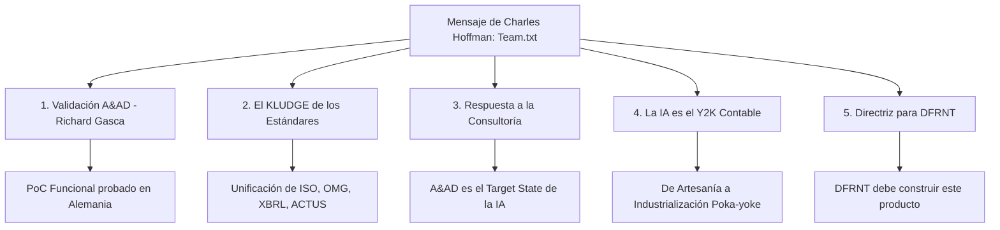

# Disección del Mensaje "Team.txt" de Charles Hoffman (2026-07-27)

**Ubicación original:** [Team.txt](file:///c:/Users/IPHIX/Documents/Projects/DFRNT/Documentacion/Charles%20Hoffman/Mail/2026-07-27/DFRNT/Team.txt)  
**Remitente:** Charles Hoffman (Charlie)  
**Destinatarios:** Equipo directivo de DFRNT (Dean, Richard Gasca, equipo)  
**Fecha de Análisis:** 2026-07-27  

---

## 1. Resumen Ejecutivo

En este memorando interno enviado al equipo de DFRNT, **Charles Hoffman** ofrece un respaldo firme e incondicional al **Accounting & Audit by Design (A&AD) Framework** desarrollado por **Richard Gasca**. 

Charles argumenta que A&AD resuelve la "fragmentación semántica y física" que ha paralizado a la contabilidad empresarial tradicional durante décadas. Además, establece que A&AD define la respuesta técnica e industrial concreta a lo que las firmas consultoras (como la alianza PwC / Anthropic) promocionan genéricamente como *"Transformación Digital e Inteligencia Artificial"*.

---

## 2. Disección por Pilares Clave

### Pilar 1: Validación Total del Framework A&AD (Richard Gasca)
- Charles expresa un **aprecio creciente e integral** por el trabajo de Richard Gasca con el marco A&AD.
- Destaca que A&AD ha logrado lo que ningún estándar individual logró en aislamiento: integrar de manera efectiva un **pipeline semántico contable y de auditoría** donde la información fluye determinísticamente desde la transacción hasta el dictamen final.
- Reconoce que el **Proof of Concept (PoC) funcional** desarrollado por Richard demuestra que la teoría es ejecutable y verificable (incluso con conceptos avanzados como el *"zero-shot audit"*).

### Pilar 2: El "KLUDGE" de los Estándares y la Oportunidad de Negocio
- **El Diagnóstico**: Estándares como UBL, ISO REA, ACTUS, XBRL GL, SBRM, OIM, SBVR y BPMN fueron creados aisladamente por comités desconectados debido a "guerras de territorio" o desconocimiento mutuo. Esto generó un **remendo masivo (KLUDGE)** en la arquitectura empresarial actual.
- **La Oportunidad Comercial**: Superar este remiendo mediante la **orquestación e interconexión funcional de estándares** constituye la principal **oportunidad de negocio para DFRNT**.

### Pilar 3: La Respuesta a la Consultoría ("Transformación ¿Hacia Qué?")
- Charles critica las iniciativas de consultoría tipo "Land-and-Expand" (ej. PwC / Anthropic) que venden "Transformaciones con IA" sin definir un estado objetivo claro.
- Plantea la pregunta crítica: *Si una empresa emprende una transformación de IA contable, ¿transformación hacia qué?*
- **La Respuesta de Charles**: **El A&AD Framework de Richard Gasca ES la respuesta a esa pregunta.** Ese es el estado final deseado (*Target Architecture*) hacia el cual toda empresa debe transformarse.

### Pilar 4: La IA es el "Y2K" de Nuestra Era (Paso de Artesanía a Industrialización)
- **Paralelo Histórico**: Así como las Big 4 generaron enormes ingresos preparando a las empresas para el pánico del año 2000 (Y2K), hoy la IA se vende como un "Armagedón" tecnológico. No habrá tal Armagedón, pero las empresas enfrentarán serios problemas al intentar usar IA sobre datos contables fragmentados e inconsistentes.
- **Refactorización Paradigmática**:
  - *Paradigma Tradicional*: Asume incoherencia de datos y requiere legiones de contadores como "limpiadores de datos" (*data janitors*) o "cazadores de transacciones", remediando errores a posteriori (regla Lean 1-10-100 / uso del *"plug"*).
  - *Paradigma A&AD*: Cambia la contabilidad de una **artesanía manual** a un **proceso industrializado** (estandarizado, repetible, escalable, gobernado por reglas interpretables por máquina con comprobación de errores *Poka-Yoke*). Los contadores se convierten en curadores del sistema de reglas.

### Pilar 5: Directriz de Producto y Estrategia para DFRNT
- Charles insta directamente al equipo: **"Esto es exactamente lo que DFRNT debería estar construyendo."**
- **Inapelabilidad de la Propuesta de Valor**: Ningún contador, auditor o analista puede objetar el valor conceptual y operativo que ofrece A&AD. Las únicas objeciones potenciales serían sobre usabilidad o rendimiento de software, no sobre el modelo de negocio.
- **Recomendaciones de Acción Inmediata**:
  1. Compartir este marco conceptual con **John Clements** (con quien Charles ya conversó positivamente).
  2. Utilizar la **Conferencia Internacional de Auditoría e IA en Alemania (Sept. 2026)** como la vitrina de validación global.
  3. Enfocar el desarrollo de productos de DFRNT en la orquestación del marco abierto A&AD.

---

## 3. Matriz de Integración del Pipeline Semántico Empresarial

| Capa del Pipeline | Estándar / Marco | Función en el Stack | Rol en A&AD |
| :--- | :--- | :--- | :--- |
| **Gobernanza / Reglas** | SBVR (OMG) / BPMN | Vocabulario de negocio, reglas y flujos de trabajo. | Curaduría de reglas de frontera (*fenced boundary*). |
| **Transacción Operativa** | UBL (ISO/IEC) | Facturas, órdenes de compra y documentos comerciales. | Captura de hechos comerciales en origen. |
| **Contrato Financiero** | ACTUS (ISO/IEC) / REA | Algoritmos de contratos y eventos económicos futuros. | Modelado determinista de flujos de caja y eventos. |
| **Diario de Auditoría** | XBRL GL (XBRL Int.) | Libro diario, transacciones y pista de auditoría. | Trazabilidad y proveniencia ininterrumpida. |
| **Reportes y Taxonomía** | SBRM (OMG) / GAAP / IFRS | Estructura de reporte, hipercubos y patrones CAP. | Presentación y estados financieros agregados. |
| **Orquestador Determinista** | **A&AD Framework** | **Integración determinista de toda la pila.** | **Validación agéntica por diseño / Cero alucinación IA.** |

---

## 4. Enlaces a Artículos de Blog Referenciados por Charles

- [Standards for Interconnecting the Enterprise Stack](https://digitalfinancialreporting.blogspot.com/2026/07/standards-for-interconnecting.html)
- [Coming Transformation of Accounting Information Systems](https://seattlemethod.blogspot.com/2026/07/coming-transformation-of-accounting.html)
- [Coming Transformation of Accounting Information Systems (Alternative)](https://seattlemethod.blogspot.com/2026/07/coming-transformation-of-accounting_0858910251.html)
