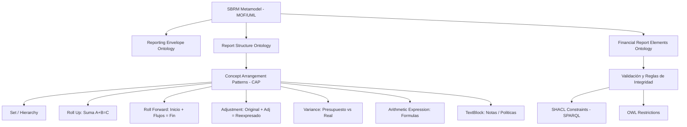

# Análisis de Correspondencia de Charles Hoffman y Especificación OMG SBRM (Beta 1)

**Ubicación de archivos originales:**
- **Correo**: [SBRM.txt](file:///c:/Users/IPHIX/Documents/Projects/DFRNT/Documentacion/Charles%20Hoffman/Mail/2026-07-27/SBRM/SBRM.txt)
- **Documento OMG**: [dtc-25-04-01.pdf](file:///c:/Users/IPHIX/Documents/Projects/DFRNT/Documentacion/Charles%20Hoffman/Mail/2026-07-27/SBRM/dtc-25-04-01.pdf)
- **Imagen recortes**: [recorte.png](file:///c:/Users/IPHIX/Documents/Projects/DFRNT/Documentacion/Charles%20Hoffman/Mail/2026-07-27/SBRM/recorte.png)
- **Fecha de análisis**: 2026-07-27

---

## 1. Síntesis de la Correspondencia de Charles Hoffman

En su mensaje del 27 de julio de 2026, Charles Hoffman realiza tres observaciones fundamentales de alto impacto estratégico:

1. **La Paradoja SBRM vs. SBVR**:
   - La especificación del **Standard Business Report Model (SBRM, estándar OMG)** en su versión Beta 1 ([dtc-25-04-01.pdf](file:///c:/Users/IPHIX/Documents/Projects/DFRNT/Documentacion/Charles%20Hoffman/Mail/2026-07-27/SBRM/dtc-25-04-01.pdf)) **no hace una sola mención o referencia** al estándar **SBVR** (*Semantics of Business Vocabulary and Business Rules*, también de la OMG).
   - Tampoco lo hace el *Open Information Model* (OIM) de XBRL International.
   - *Reflexión de Charles*: Dado que el objetivo declarado de SBVR es ayudar a los profesionales de negocios a describir conceptos y reglas sin ambigüedad en sus propios términos, esta omisión evidencia una desconexión metodológica entre los silos institucionales de estandarización.

2. **Reconciliación de la "Pila Empresarial" (The Enterprise Stack)**:
   - Entre OASIS, ISO/IEC, OMG, XBRL International, ACTUS, FASB e IFRS Foundation, **ya existe prácticamente todo el arsenal normativo necesario** para representar transacciones operativas hasta reportes financieros de cumplimiento.
   - El problema crítico es la **fragmentación en silos**: los comités no dialogan entre sí.
   - Charles publicó en su blog (*"Standards for Interconnecting the Enterprise Stack"*) una reconciliación contable de cómo se interconectan estos estándares en una sola **Cadena de Suministro Semántica**:
     - **Capa Conceptual y Reglas de Negocio**: SBVR + BPMN.
     - **Capa Operativa y Documental**: UBL (documentos comerciales/hechos) + ACTUS (contratos financieros/flujos futuros).
     - **Capa Contable, Agregación y Reporte**: XBRL GL (auditoría interna/diarios) $\rightarrow$ Taxonomías US GAAP/IFRS $\rightarrow$ SBRM / OIM / Seattle Method (estructura del reporte).

3. **Reconocimiento Directo al Framework A&AD (Accounting & Audit by Design)**:
   - Charles resalta que el **Accounting & Audit by Design (A&AD) Framework** (el marco desarrollado en el proyecto) ha logrado integrar de manera efectiva todas estas piezas en un **Proof of Concept (PoC) funcional**.
   - Destaca que este PoC funcional será presentado en la **Conferencia Internacional sobre Auditoría e Inteligencia Artificial (Septiembre de 2026, Alemania)**.

---

## 2. Análisis Técnico de la Norma OMG SBRM (`dtc-25-04-01.pdf`)

El documento [dtc-25-04-01.pdf](file:///c:/Users/IPHIX/Documents/Projects/DFRNT/Documentacion/Charles%20Hoffman/Mail/2026-07-27/SBRM/dtc-25-04-01.pdf) (Fecha: Abril 2025, 83 páginas) establece el estándar formal del Object Management Group para SBRM V1.0 Beta 1.

### Propósito y Arquitectura
SBRM actúa como un **Platform Independent Model (PIM)** para documentos de reporte y estructuras de datos, abstraído de sintaxis específicas (como XML/XBRL), integrando metamodelos MOF, diagramas de clases UML, ontologías OWL y validación determinista SHACL/SPARQL.

### Pilares Fundamentales de SBRM:
1. **Reporting Envelope (Metamodelo y Ontología `sbrm-rev`)**:
   - Abstrae el contenedor del envío: `Submission`, `Report`, `PartyRole` (`isSubmittedBy`, `isReportedTo`), `Publication`.
2. **Enfoques de Diseño (Simple vs. Financiero)**:
   - *Simple*: Basado en Hechos atómicos (`Fact`), Valores (`FactValue`: numérico, monetario, no numérico) y enlace a vocabulario externo mediante `MVFEntry` (*Multiple Vocabulary Facility*).
   - *Financiero*: Trata los conceptos contables como **Metaclases** (`rdf:type`), incorporando explícitamente Naturaleza (Débito/Crédito) y Periodo (Instante/Duración).
3. **Patrones de Arreglo de Conceptos (Concept Arrangement Patterns - CAP)**:
   - SBRM formaliza matemáticamente las estructuras clásicas de estados financieros:
     - **Set**: Jerarquía estática no aritmética.
     - **Roll Up**: Acumulación $\sum (\text{entradas}) = \text{total}$.
     - **Roll Forward**: Reconciliación temporal ($\text{Stock Inicial} + \text{Flujos} = \text{Stock Final}$).
     - **Adjustment**: Reconciliación de reexpresiones ($\text{Saldo Original} + \text{Ajustes} = \text{Saldo Reexpresado}$).
     - **Variance**: Comparación entre escenarios (Presupuestado vs. Real).
     - **Arithmetic Expression**: Fórmulas arbitrarias compuestas ($\text{Utilidad} = \text{Ingresos} - \text{Gastos}$).
     - **TextBlock**: Prosa narrativa estructurada por niveles (Nivel 1 Nota, Nivel 2 Política, Nivel 3 Revelación).
4. **Validación Determinista**:
   - Integra **SHACL** (*Shapes Constraint Language*) sobre SPARQL y restricciones OWL 2 para garantizar la integridad aritmética y de tipos sin requerir lógica dura en código monolítico.

---

## 3. Diagnóstico Estratégico e Implicaciones para DFRNT / A&AD

### ¿Por qué SBRM omitió SBVR?
SBRM fue desarrollado por comités con enfoque en la **Web Semántica W3C (OWL/RDF/SHACL)** y metamodelos UML/MOF orientados al reporte multidimensional (hipercubos). SBVR se enfoca en vocabulario y reglas sintácticas expresadas en lenguaje natural estructurado. Al concentrarse SBRM en motores de reglas SHACL/SPARQL, obvió la capa de autoría y gobernanza en lenguaje natural que SBVR promueve.

### El Aporte Diferenciador de A&AD
Como expone Charles Hoffman en su artículo dedicado a A&AD (*"Accounting & Audit by Design Framework"*):
1. **Fin del "Transaction Chasing" (Janitor vs. Curator)**: Mientras la contabilidad tradicional gasta entre el 50% y 75% del tiempo en perseguir transacciones y ajustar errores a posteriori, A&AD establece una **frontera cercada (fenced boundary)** donde los errores son prevenidos en origen (*Poka-yoke mistake proofing*).
2. **Cierre de la Brecha Semántica**: A&AD actúa como el motor determinista que conecta la transacción comercial (UBL), el evento contable/contrato (REA/ACTUS), el diario transaccional (XBRL GL), la estructura de reporte (SBRM/OIM) y el dictamen de auditoría en un pipeline unificado.
3. **Fundación Inquebrantable para IA Agéntica**: La IA no puede operar eficazmente en entornos "hairball" con ambigüedad o fragmentación semántica. A&AD le proporciona a los agentes de IA un entorno de veracidad inherente y reglas interpretables por máquina.

---

## 4. Hoja de Ruta Sugerida

1. **Alinear Ontologías A&AD con SBRM**:
   - Asegurar la compatibilidad sintáctica y semántica de los *Concept Arrangement Patterns (CAP)* de SBRM con los grafos JSON-LD y ontologías de A&AD.
2. **Posicionar a A&AD como el Complemento SBVR de SBRM**:
   - Demostrar cómo A&AD aporta la capa de reglas y gobernanza de negocio en lenguaje natural (la visión de SBVR) que SBRM omitió.
3. **Preparación de la Ponencia Internacional (Sept. 2026, Alemania)**:
   - Estructurar el paper y la presentación destacando a A&AD como el **Proof of Concept de referencia mundial** que resuelve la integración de la pila de estándares empresariales.
