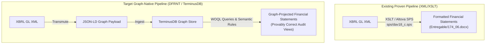

# Analysis of Charles Hoffman's Feedback & Strategic Response Plan

> **Date**: 2026-07-29  
> **Source File**: [Respuesta Charles.txt](file:///c:/Users/IPHIX/Documents/Projects/DFRNT/Documentacion/Charles%20Hoffman/Mail/2026-07-29/Respuesta%20Charles.txt)  
> **Topic**: Evaluation of the XBRL GL Semantic Bridge & Path to Provably Correct Financial Statements  

---

## 1. Executive Diagnosis

Charles Hoffman’s response is **highly constructive, challenging, and visionary**. He does not reject the XBRL GL $\rightarrow$ JSON-LD graph architecture; instead, he elevates the benchmark of success for digital audit pipelines.

### Core Critique
1. **Incompleteness of PoC**: A trial balance / GL mapping alone does not prove accounting correctness until it can generate a **complete, provably correct set of primary financial statements** (Balance Sheet, Income Statement, Cash Flow Statement, Statement of Changes in Equity).
2. **Scope of Audit**: "An audit is of a set of financial statements." Therefore, financial statement derivation must be in scope.
3. **Business Event Discovery**: Manual tagging by accountants is an interim workaround. The frontier (Data Centric Accounting - Dave McComb) requires discovering the nature of business events directly from transaction telemetry.

---

## 2. Technical Context & Existing Pipeline Capabilities

It is critical to note that **financial statement generation from XBRL GL is already a proven working capability in our XML pipeline**:
- **Existing XML/XSLT Pipeline**: Using the XBRL GL instance XML and custom XSLT stylesheets (e.g., [dav18_c.sps](file:///c:/Users/IPHIX/Documents/Projects/DFRNT/Taller1_EventsLedger/Ejemplo%20XBRLGL/sps/dav18_c.sps)), we already transform raw XBRL GL XML into formatted, complete financial statement reports (such as [174_06.docx](file:///c:/Users/IPHIX/Documents/Projects/DFRNT/Taller1_EventsLedger/Ejemplo%20XBRLGL/Entregable/174_06.docx) in the `Entregable` directory).
- **Target Goal with TerminusDB / DFRNT**: The goal of transmuting XBRL GL into JSON-LD and ingesting it into TerminusDB is to **re-project that exact same target financial report structure natively out of the Knowledge Graph** using graph queries (WOQL/SPARQL), SHACL constraints, and semantic rules, replacing static file-based XSLT stylesheets with dynamic, queryable graph views.



---

## 3. Strategic Response Options for Richard

To reply to Charles effectively, we should:

1. **Fully Agree with his Thesis**: Validate that financial statement derivation is indeed the ultimate goal and the core definition of an audit.
2. **Highlight the Existing XML/XSLT Financial Statement Pipeline**: Clarify that we already generate formatted financial reports from XBRL GL using XSLT stylesheets (`sps` folder $\rightarrow$ `Entregable` report).
3. **Mention the Updated `.zip` Package**: Point out that the shared `.zip` has been updated to include the XSLT stylesheet used and the target financial statement report achieved.
4. **Define the TerminusDB / DFRNT Target Objective**: Explain that our goal with JSON-LD in TerminusDB is to project that exact same target financial report structure natively out of the graph (Data-Centric Accounting - Dave McComb), replacing static XSLT transforms with graph reasoning.
5. **Invite Technical Alignment**: Ask Charles if he would be open to sharing his rule definitions / financial report logic schemas to test against the DFRNT graph engine.

---

## 4. Draft Reply to Charles Hoffman

**Subject**: Re: Proof of Concept: XBRL GL as a Semantic Bridge to DFRNT / TerminusDB Knowledge Graphs

```text
Hi Charlie,

Thank you for this sharp and spot-on observation. 

I completely agree with your thesis: an audit is ultimately an audit of the financial statements, and a GL ingestion pipeline is only truly proven when it can generate a provably correct set of primary financial statements (Balance Sheet, Income Statement, Cash Flow, and Equity Changes) according to a target financial reporting framework.

To clarify our current capabilities and target direction:

1. Existing Working Pipeline (XML / XSLT): 
   With our current XBRL GL XML instance and custom XSLT stylesheets (in our `sps` directory), we ALREADY generate complete, formatted financial statement reports (such as the delivered balance sheet and income statement reports in our `Entregable` folder).

2. Target Objective with TerminusDB / DFRNT:
   The core purpose of transmuting XBRL GL into JSON-LD and ingesting it into TerminusDB is to project that exact same target financial report structure natively out of the Knowledge Graph—using WOQL graph queries, SHACL constraints, and semantic rules—rather than relying on static file-based XSLT stylesheets.

(Note: We have updated the shared .zip archive to include the XSLT stylesheet currently used and the target financial statement result achieved with it, so you can inspect both the intermediate XSLT pipeline and the rendered output.)

Your reference to Dave McComb's Data-Centric Accounting and the work of Joey French and Dudley Gould is spot-on. We strongly believe that the graph database layer—rather than proprietary ERP code or legacy XSLT scripts—is where business event discovery and provable financial statement projection should take place.

Would you be open to sharing some of the financial statement verification rules or event discovery criteria you’ve developed? We would love to test them as part of our TerminusDB/DFRNT graph projection validation to demonstrate provably correct financial statements directly out of the graph.

Cheers,

Richard
```
