# Analysis of Charles Hoffman's Methodology ("Getting the Entries Right")

> **Date**: 2026-07-29  
> **Source File**: [MetodologiaCharlie.txt](file:///c:/Users/IPHIX/Documents/Projects/DFRNT/Documentacion/Charles%20Hoffman/Mail/2026-07-29/MetodologiaCharlie.txt)  
> **Reference Model**: [XBRL Site Mini Model Structure](https://xbrlsite.azurewebsites.net/2026/reporting-framework/mini/base-taxonomy/mini_ModelStructure.html)  

---

## 1. Executive Summary: What is Charlie's Core Philosophy?

In his message, Charles Hoffman makes a fundamental distinction that separates traditional GL reporting from **Audit by Design**:

> *"Also, you are perhaps not realizing that this information is used to create the journal entries CORRECTLY. It is not just about generating things from the general journal and general ledger; it is about GETTING THE ENTRIES RIGHT."*

### Key Takeaway
- **Bottom-Up Accounting (Traditional)**: Trust whatever rows the ERP exports $\rightarrow$ Map to GL $\rightarrow$ Try to generate financial statements. (Risk: Garbage in, garbage out).
- **Charlie's Top-Down Rules Approach (Model Structure)**: Use a formal **Logical Model Structure** (e.g., SBR / MINi Taxonomy Model) that defines valid financial patterns. Journal entries must satisfy these logical constraints to be considered **valid, correct business events**.

---

## 2. Deep Dive: Comparing the Two Approaches

```mermaid
graph TD
    subgraph BottomUp ["Bottom-Up Approach (Traditional ERP)"]
        CSV["Raw ERP CSV / Ledger"] -->|As-Is Ingestion| GL1["XBRL GL / Raw Entries"]
        GL1 -->|Try to Aggregate| FS1["Financial Statement<br/>(Risk of unvalidated errors)"]
    end

    subgraph CharlieApproach ["Charlie's Top-Down Model Structure"]
        RULES["Logical Model Structure<br/>(mini_ModelStructure.html / Rules)"]
        RULES -->|Enforce Validity| GL2["Valid Business Event Entries<br/>('Getting the Entries Right')"]
        GL2 -->|Prove Correctness| FS2["Provably Correct Financial Statements"]
    end

    subgraph GraphSynergy ["The Unified Graph Engine Solution (TerminusDB / DFRNT)"]
        SHACL["SHACL / WOQL Rules Engine<br/>(Executes Charlie's Model Structure)"]
        TDB[("TerminusDB Knowledge Graph")]
        SHACL --> TDB
        TDB -->|Real-Time Validation| RES["1. Valid Entries -> Approved<br/>2. Invalid Entries -> Flagged Finding"]
    end
```

---

## 3. How TerminusDB / DFRNT Executes Charlie's Vision

Charlie assumes that graph databases only store raw entries. In reality, **TerminusDB is the ideal execution engine for Charlie's Model Structure rules**:

### 1. SHACL Schema Constraints (Rule Enforcement)
In TerminusDB, we define **SHACL shapes** that embody Charlie's `mini_ModelStructure.html` rules. 
- Example: If a journal entry records an Asset Depreciation event, SHACL enforces that:
  - Debit MUST be an Expense Account (`Depreciation Expense`).
  - Credit MUST be an Accumulated Depreciation Account.
  - Dimension `ClassesOfPPEAxis` MUST be present.
  - If any condition fails, TerminusDB rejects the entry or marks it as an **Audit Finding**.

### 2. Business Event Discovery (Data-Centric Accounting - Dave McComb)
Instead of forcing accountants to manually pick tags, the graph evaluates the transaction pattern against Charlie's Model Structure:
$$\text{Transaction Pattern} \xrightarrow{\text{SHACL Rule Match}} \text{Inferred Business Event Type (e.g., Payroll Liquidation)}$$

---

## 4. Strategic Position for Response

When communicating with Charlie, our response should be:

> *"Charlie, you hit the exact core of the issue. Our goal with TerminusDB is not just to ingest raw GL entries, but to use SHACL constraints and WOQL logical rules as the enforcement engine for your Model Structure—ensuring that entries are created and validated CORRECTLY by design before or during graph ingestion."*
