# Análisis Estratégico: Nueva Propuesta de Charles Hoffman (PropuestaCharlie2.txt)

**Fecha**: 2026-07-29  
**De**: Charles Hoffman (XBRL / Método Seattle)  
**Para**: Richard & Equipo DFRNT / TerminusDB  
**Tema**: Estrategia de Prototipos Duales (Sistema Real vs. Sistema Ideal) y Hoja de Ruta de 3 hitos.

---

## 1. Resumen Ejecutivo de la Propuesta de Charlie

En este correo, Charles Hoffman propone estructurar la colaboración y validación en **dos prototipos complementarios**:

1. **PROTOTIPO 1 ("Messy Reality" / Realidad Desordenada)**:
   - Es el prototipo que **nosotros (Richard y el equipo DFRNT)** estamos construyendo.
   - Refleja la realidad heterogénea de las empresas (datos legados, CSVs dispares, mapeos desde ERPs como Microsoft Dynamics, UBL, XBRL GL).
   - Valida la capacidad de ingesta, normalización y transformación de la estructura real hacia el Knowledge Graph.

2. **PROTOTIPO 2 ("Ideal System" / Sistema Ideal bajo el Método Seattle)**:
   - Un sistema de referencia controlado al 100% desde cero.
   - Diseñado bajo la arquitectura **Data-Centric Accounting / Seattle Method**:
     - **Empresa Sintética**: "Lemonade Stand" (o similar).
     - **Eventos de Negocio Sintéticos**: Operaciones comerciales desde su origen.
     - **Documentos Fuente / Databooks**: Archivos duales en 1 solo documento (Texto legible por humanos + Grafo legible por máquina/JSON-LD).
     - **Event Journal**: Diario de eventos de negocio.
     - **General Journal (Proyección)**: Proyección contable (Partida Doble / Asientos).
     - **Chart of Accounts (COA) & Lead Schedule**: Mapeo del plan de cuentas hacia los rubros estandarizados del Reporting Framework (ej. IFRS / US-GAAP / Mini-Reporting Framework).
     - **Digital Financial Statements**: Generación automatizada y comprobable de Estados Financieros (Balance General, Estado de Resultados, Flujo de Efectivo, Cambios en el Patrimonio), auditables vía Pacioli / Luca.

---

## 2. Hoja de Ruta Propuesta en 3 Hitos (Milestones)

Charlie propone validar el **Prototipo 2 (Sistema Ideal)** en 3 etapas incrementales:

| Hito | Descripción | Propósito / Alcance |
| :--- | :--- | :--- |
| **Hito 1** | **1 Evento de Negocio Sintético** | Tracer vertical de punta a punta: Documento Fuente (Databook) $\rightarrow$ Evento $\rightarrow$ Asiento de Diario $\rightarrow$ Balance de Comprobación $\rightarrow$ Lead Schedule $\rightarrow$ Estado Financiero. |
| **Hito 2** | **15 Eventos de Negocio Sintéticos** | Ciclo contable completo para la empresa sintética ("Lemonade Stand"). |
| **Hito 3** | **~3,000 Transacciones Reales (Microsoft Dynamics - "The World Online")** | Set de datos reales del ERP de demostración de Microsoft Dynamics, enriquecido con metadatos sintéticos de eventos de negocio. |

> **Nota Clave**: Charlie se ofrece a redactar/crear los documentos fuente para el Hito 1 y el Hito 3 *bajo la supervisión de Richard* para asegurar que sean impecables.

---

## 3. Valor Estratégico para DFRNT & TerminusDB

1. **Reconocimiento y Validación**: Charlie reconoce que nuestro prototipo ("Messy Reality") es esencial y no un desperdicio. Lo sitúa como una de las dos columnas del proyecto.
2. **Estándar de Oro Imparcial**: Nos otorga un dataset de prueba indiscutible (creado por el padre de XBRL) para demostrar que **TerminusDB / DFRNT es el motor ideal de Graph Database** para ejecutar el Método Seattle.
3. **Grafo Nativo vs. Archivos Estáticos**: 
   - En el repositorio actual de Charlie, los Databooks y Eventos son archivos Markdown sueltos (`source-0001.md`, `event-0001.md`).
   - Con **TerminusDB + DFRNT**, demostraremos que todo ese flujo (Databook $\rightarrow$ Evento $\rightarrow$ Asiento $\rightarrow$ Lead Schedule $\rightarrow$ EEFF) vive como nodos y aristas en un Knowledge Graph de W3C, donde las reglas de proyección contable se ejecutan mediante **consultas WOQL nativas** y las validaciones de balance vía **reglas SHACL/Pacioli**.
4. **Trazabilidad de 1 Clic**: El usuario o auditor podrá hacer clic en una línea del Estado Financiero en DFRNT Console y navegar al instante hasta el Asiento Contable, el Evento de Negocio y el Documento Fuente (Databook).

---

## 4. Estructura de Clases en DFRNT para el Prototipo Ideal (Método Seattle)

Para implementar el Prototipo Ideal en TerminusDB / DFRNT, definimos la siguiente ontología limpia:

```mermaid
graph LR
    DB["SourceDocument / Databook<br/>(Graph + Document)"] -->|triggers| EV["BusinessEvent"]
    EV -->|projects| JE["GeneralJournalEntry"]
    JE -->|contains| JL["JournalLine (Debit/Credit)"]
    JL -->|usesAccount| COA["Account (Chart of Accounts)"]
    COA -->|mapsVia| LS["LeadSchedule"]
    LS -->|projectsTo| FSLI["ReportingFrameworkLineItem"]
    FSLI -->|aggregatesIn| FS["FinancialStatement<br/>(Balance Sheet / P&L)"]
```

---

## 5. Propuesta de Respuesta a Charlie

Aceptaremos la propuesta con entusiasmo, proponiendo arrancar inmediatamente con el **Hito 1 (1 evento de negocio sintético)** como prueba de concepto demostrativa en TerminusDB.
