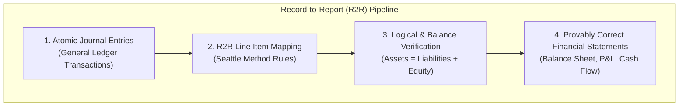

# Analysis of Charles Hoffman's Email 2: The Seattle Method & RoboSystems (Record-to-Report)

> **Date**: 2026-07-29  
> **Source File**: [MetodologiaCharlie1.txt](file:///C:/Users/IPHIX/Documents/Projects/DFRNT/Documentacion/Charles%20Hoffman/Mail/2026-07-29/MetodologiaCharlie1.txt)  
> **References**:
> - Joey French / RoboSystems: [seattle-method-case-1.md](https://github.com/RoboFinSystems/robosystems/blob/main/examples/seattle_method_demo/sample_output/seattle-method-case-1.md)
> - Seattle Method R2R Prototypes: [record-to-report](https://github.com/seattlemethod/prototypes/tree/main/record-to-report)

---

## 1. Executive Summary: What is Charlie Sharing?

In this follow-up email, Charles Hoffman introduces **Joey French’s implementation of the "Seattle Method"**:

1. **The Seattle Method**: A standardized framework created by Joey French, Dudley Gould, and Charles Hoffman for **Record-to-Report (R2R)** financial automation.
2. **RoboSystems**: Joey French's Python implementation that takes general journal entries and compiles them into provably correct financial statements.
3. **Record-to-Report (R2R) Prototypes**: Open-source repositories demonstrating the mathematical and logical rollup from journal entries to final balance sheet and income statement outputs.

---

## 2. Deep Dive: What is the Seattle Method?

The **Seattle Method** solves the exact problem Charlie highlighted in his previous email:

### Key Principles of the Seattle Method:
- **Formalized R2R Logic**: Every general ledger account is explicitly mapped to a standardized financial statement line item.
- **Mathematical Integrity**: Automatic verification of trial balance equilibrium and retained earnings roll-forward.
- **Reproducibility**: The financial report is an automated, deterministic projection from the journal entries.

---

## 3. Comparing Joey French's Implementation vs. Our TerminusDB / DFRNT Architecture

| Dimension | Joey French (RoboSystems / Seattle Method) | Our Architecture (TerminusDB / DFRNT) |
| :--- | :--- | :--- |
| **Data Model** | Flat Markdown / Python DataFrames / JSON | W3C Knowledge Graph (JSON-LD / RDF Triples) |
| **Execution Engine** | Python Scripts (`seattle-method-demo`) | TerminusDB Graph Database Engine (WOQL + SHACL) |
| **Queryability** | Static file output | Live, interactive graph queries with instant drill-down |
| **Audit Traceability** | File-based lookup | 1-click graph traversal from Financial Statement Line Item $\rightarrow$ Atomic Entry |

---

## 4. How We Can Leverage the Seattle Method in TerminusDB

The **Seattle Method** is not a competitor to TerminusDB; **it is the exact rule set we can execute inside TerminusDB**:

1. **Incorporate Seattle Method R2R Mappings in WOQL**:
   We can take the line item mapping rules from the Seattle Method prototypes (`record-to-report`) and encode them as **WOQL projection rules** in TerminusDB.

2. **Demonstrate the Seattle Method directly on Knowledge Graphs**:
   We can show Charlie and Joey French that TerminusDB can run the **Seattle Method Case 1** natively on a Knowledge Graph—providing the exact same financial statements as RoboSystems, but with **live graph visualizer and instant drill-down**!

---

## 5. Strategic Response to Charlie

When replying to Charlie, we should acknowledge the value of Joey French's work:

> *"Charlie, thank you for sharing Joey French’s RoboSystems implementation of the Seattle Method. This is extremely clear and helpful.*  
>  
> *The Seattle Method’s Record-to-Report (R2R) mapping rules provide the exact logical framework we need. By encoding these R2R rules into WOQL queries and SHACL constraints inside TerminusDB, we can run the Seattle Method natively on a Knowledge Graph—generating the same provably correct financial statements while enabling instant visual drill-down down to the individual journal entry."*
