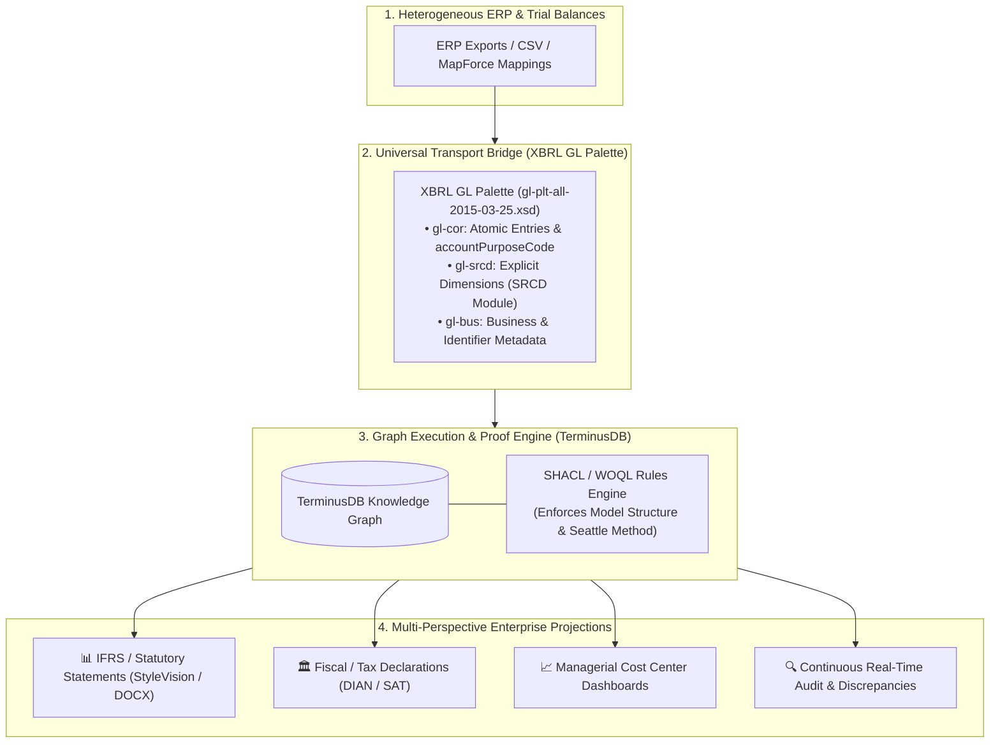

# Keynote & Conference Positioning Paper: XBRL GL + SRCD + PurposeCode in Knowledge Graphs

> **Conference Target**: International Digital Audit & Financial Reporting Conference (Germany)  
> **Author**: DFRNT Accounting & Audit Project Team  
> **Topic**: Why XBRL GL, SRCD, and PurposeCode Form the Ultimate Semantic Bridge for Real-Time Knowledge Graph Auditing  

---

## 1. Executive Keynote Summary

When presenting digital audit architectures, software engineers and accountants often clash:
- **Engineers** build custom Python scripts and ad-hoc JSON models (e.g. Joey French's RoboSystems) that flatten accounting data into proprietary schemas.
- **Traditional Accountants** rely on rigid, period-end XML files and manual XSLT spreadsheets.

This keynote presents a **groundbreaking hybrid paradigm**:
Using **XBRL GL 2015-03-25 Palette (`gl-plt-all-2015-03-25.xsd`)**, its **SRCD module (`gl-srcd`)**, and **`AccountingPurposeCode` (`gl-cor`)** as a lossless, international-standard transport bridge (ISO 21378) to hydrate W3C Knowledge Graphs in **TerminusDB / DFRNT**.

---

## 2. The 5 Core Pillars of the Germany Conference Presentation

### Pillar 1: International Interoperability (ISO 21378 & W3C Compliance)
- **Core Argument**: Proprietary JSON/Python schemas create vendor lock-in and break global audit interoperability.
- **Solution**: Standardizing on **XBRL GL** complies natively with **ISO 21378 (Audit Data Collection Standard)**. Any central bank, tax authority, superintendency, or graph database worldwide can ingest and process this payload without custom data translation code.

---

### Pillar 2: High-Fidelity Dimensionality via the SRCD Module (`gl-srcd`)
- **Core Argument**: Traditional CSV exports flatten multidimensional accounting hypercubes, destroying structural lineage.
- **Solution**: The **SRCD (Summary Reporting Concept Definition)** module (`gl-srcd:summaryScenarioExplicitDimensionElement`) preserves **explicit dimensional axes** (e.g. `ClassesOfPPEAxis`, `ConsolidationItemsAxis`, `GeographicAxis`, `DepartmentAxis`).
- **Graph Reification**: In TerminusDB, `gl-srcd` elements become **reified RDF graph relationship edges**, enabling instant multi-axis WOQL slicing and dicing.

---

### Pillar 3: Multi-Framework Accounting via `AccountingPurposeCode`
- **Core Argument**: ERPs force companies to maintain 3 parallel ledgers or duplicate data to handle Statutory IFRS, Fiscal Tax, and Management Accounting.
- **Solution**: A single atomic transaction carries `<gl-cor:accountPurposeCode>` (`primary`, `tax`, `management`, `budget`, `consolidated`).
- **Semantic Switch**: The graph engine uses `accountPurposeCode` as a **semantic switch**: a single WOQL query projects IFRS Balance Sheets, Tax Declarations, or Cost Center Dashboards from a **Single Source of Truth** without duplicating a single record.

---

### Pillar 4: Real-Time Virtual Close & Continuous Auditing
- **Core Argument**: The traditional month-end batch "accounting close" is slow, opaque, and error-prone.
- **Solution**:
  1. **Virtual Close**: WOQL temporal queries (`WHERE postingDate <= '2025-12-31'`) project real-time trial balances at any millisecond without zeroing out P&L accounts.
  2. **Statutory Closing Entries**: Period-end fiscal closing entries are tagged with `gl-cor:entriesType = "closing"`, fulfilling legal dividend/tax filing requirements while preserving historical P&L queryability.
  3. **Continuous Audit**: Discrepancies generate `entriesType = "adjusting"` entries, keeping the graph updated in real time.

---

### Pillar 5: Dual-World Interoperability (Traditional XSLT + Modern Graph DB)
- **Core Argument**: Moving to Knowledge Graphs should not force organizations to throw away existing report template investments.
- **Solution**: Standardizing on the XBRL GL Palette (`gl-plt-all-2015-03-25.xsd`) supports dual-mode output:
  1. **Legacy / Corporate Output**: Feeds Altova StyleVision (`.sps` / XSLT) to generate formal Word/PDF deliverables ([174_06.docx](file:///c:/Users/IPHIX/Documents/Projects/DFRNT/Taller1_EventsLedger/Ejemplo%20XBRLGL/Entregable/174_06.docx)).
  2. **Modern Graph DB Output**: Hydrates TerminusDB / DFRNT for real-time visual graph auditing and WOQL analytics.
  3. **Regulatory Output**: Generates valid XBRL Financial Reporting Instance XML for regulatory portals.

---

## 3. Comparative Positioning Table (Keynote Slide Material)

| Aspect / Dimension | Ad-Hoc Python Pipeline (Joey French / Flat JSON) | Traditional XML / XSLT Pipeline | Your XBRL GL + SRCD + PurposeCode Graph Architecture |
| :--- | :--- | :--- | :--- |
| **Data Standard** | Proprietary Python/JSON Schema | XML Instance Files | W3C RDF & ISO 21378 XBRL GL International Standard |
| **Dimensionality** | Flattened string fields | Complex XML hypercubes | Reified RDF Graph Edges (`gl-srcd`) |
| **Multi-Taxation** | Duplicate files / ledgers | Separate XSLT stylesheets | Single Ledger with `accountPurposeCode` Selector |
| **Audit Traceability** | Static file output | Manual XML DOM lookup | 1-Click interactive bi-directional graph drill-down |
| **Legacy Compatibility**| None (Custom scripts only) | Altova / StyleVision only | Dual-mode: Native StyleVision + TerminusDB Graph |

---

## 4. Keynote Talking Points & Responses to Critics

> **When asked about Joey French's Seattle Method**:  
> *"The Seattle Method provides the exact Record-to-Report (R2R) logical rules we need. However, instead of executing it via flat Python files, we execute the Seattle Method natively on a W3C Knowledge Graph in TerminusDB—achieving provably correct financial statements with live visual drill-down down to atomic XBRL GL entries."*

> **When asked about Charles Hoffman's Model Structure (`mini_ModelStructure.html`)**:  
> *"We completely agree with Charles that an audit must produce provably correct financial statements ('Getting the Entries Right'). In TerminusDB, we enforce Charles' Model Structure using SHACL constraint shapes, ensuring that any journal entry violating business event rules is flagged immediately as an Audit Finding."*
