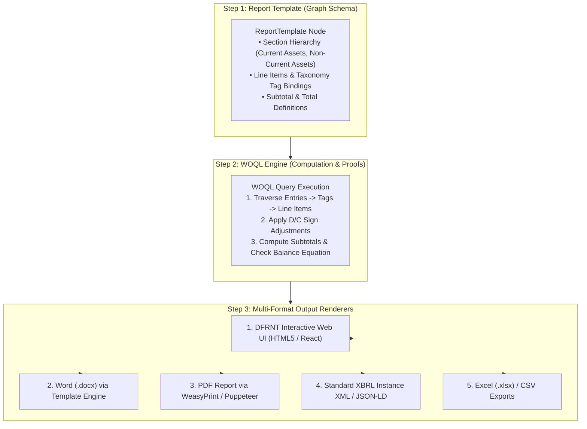

# Financial Report Design & Output Formats Guide in DFRNT / TerminusDB

> **Architecture & Implementation Guide**  
> **Topic**: How to design financial report templates using WOQL / Graph Schemas and export them into multiple formats (DOCX, PDF, HTML5, XBRL XML, Excel).  

---

## 1. How to Design a Report (The 3-Step Design Workflow)

Designing a financial report in a graph-centric architecture separates **Structure (Template)**, **Computation (WOQL Engine)**, and **Presentation (Output Formats)**.



---

## 2. Step 1: Designing the Report Template Node

In TerminusDB, you don't write report lines in code. You define a **`ReportTemplate`** object directly in the graph. This template specifies line item order, display labels, and target taxonomy tags:

```json
{
  "@id": "dfrnt:BalanceSheet_IFRS_Template",
  "@type": "ReportTemplate",
  "title": "Estado de Situación Financiera",
  "framework": "IFRS-FULL",
  "sections": [
    {
      "sectionCode": "SEC_ACTIVO_CORRIENTE",
      "sectionTitle": "ACTIVO CORRIENTE",
      "sortOrder": 1,
      "lineItems": [
        {
          "lineCode": "L_101",
          "lineTitle": "Efectivo y Equivalentes de Efectivo",
          "boundTaxonomyTag": "dfrnt:tag_EfectivoYEquivalentesDeEfectivo"
        },
        {
          "lineCode": "L_102",
          "lineTitle": "Deudores Comerciales y Otras Cuentas por Cobrar",
          "boundTaxonomyTag": "dfrnt:tag_CuentasPorCobrar"
        }
      ],
      "hasSubtotal": true,
      "subtotalTitle": "TOTAL ACTIVO CORRIENTE"
    }
  ]
}
```

---

## 3. Step 2: The WOQL Engine (Execution & Calculations)

The WOQL query reads the `ReportTemplate` definition and calculates the figures for each line item and section subtotal:

```javascript
// WOQL Execution Pattern for Report Rendering
const WOQL = require("@terminusdb/terminusdb-client").WOQL;

const reportQuery = WOQL.select(
    "SectionTitle", 
    "LineTitle", 
    "CalculatedAmount", 
    "SortOrder"
)
.where(
    // 1. Fetch Template Definition
    WOQL.triple("dfrnt:BalanceSheet_IFRS_Template", "dfrnt:sections", "v:Section"),
    WOQL.triple("v:Section", "dfrnt:sectionTitle", "v:SectionTitle"),
    WOQL.triple("v:Section", "dfrnt:lineItems", "v:LineItem"),
    WOQL.triple("v:LineItem", "dfrnt:lineTitle", "v:LineTitle"),
    WOQL.triple("v:LineItem", "dfrnt:boundTaxonomyTag", "v:Tag"),
    WOQL.triple("v:Section", "dfrnt:sortOrder", "v:SortOrder"),
    
    // 2. Fetch Journal Entries linked to Tag
    WOQL.triple("v:Entry", "dfrnt:classifiedUnder", "v:Tag"),
    WOQL.triple("v:Entry", "gl-cor:amount", "v:Amount"),
    WOQL.triple("v:Entry", "gl-cor:debitCreditCode", "v:Direction"),
    
    // 3. Compute Net Value
    WOQL.eval(
        WOQL.ifelse(WOQL.eq("v:Direction", "D"), "v:Amount", WOQL.minus(0, "v:Amount")),
        "v:SignedAmount"
    )
)
.group_by(
    ["v:SectionTitle", "v:LineTitle", "v:SortOrder"],
    WOQL.sum("v:SignedAmount", "v:CalculatedAmount")
);
```

---

## 4. Step 3: Supported Output Formats & How They Are Generated

The output of the WOQL query is a clean, structured JSON tree. This tree can be converted into any required format:

### 1. Interactive Web Interface (DFRNT React / HTML5 Canvas)
- **Mechanism**: The WOQL JSON result is rendered natively in the DFRNT web application.
- **Key Feature**: Full interactive **drill-down**. Clicking any line item expands the graph to show the individual `AccountingEntry` nodes and accounts.

---

### 2. Microsoft Word (.docx) Deliverable
- **Mechanism**: A Python runner reads the WOQL JSON result and fills a `.docx` template using `python-docx` or passes it to Altova StyleVision.
- **Result**: Generates the exact deliverable format needed for formal filing (matching [174_06.docx](file:///c:/Users/IPHIX/Documents/Projects/DFRNT/Taller1_EventsLedger/Ejemplo%20XBRLGL/Entregable/174_06.docx)).

---

### 3. PDF Portable Audit Report
- **Mechanism**: The WOQL JSON result is injected into an HTML5 template (using Jinja2 / HTML5 Glassmorphism styles) and converted to PDF via `WeasyPrint` or `Puppeteer`.
- **Result**: Self-contained, non-editable, publication-ready PDF report.

---

### 4. Regulatory XBRL Instance XML / JSON-LD
- **Mechanism**: The WOQL JSON result is serialized back into a standardized XBRL Financial Reporting XML or JSON-LD document mapped to Superintendencia / Central Bank taxonomies.
- **Result**: Regulatory compliance file ready for submission to regulatory portals.

---

### 5. Excel (.xlsx) / CSV Spreadsheets
- **Mechanism**: The WOQL JSON result is exported to Excel using `pandas` or `openpyxl`.
- **Result**: Multi-tab spreadsheet with summary balance sheet, line item detail, and raw transaction log for traditional spreadsheet auditors.

---

## 5. Summary Matrix of Output Formats

| Output Format | Generation Tool / Engine | Primary Recipient | Key Advantage |
| :--- | :--- | :--- | :--- |
| **Interactive DFRNT UI** | React + Canvas Graph Component | Senior Auditor / Management | Real-time graph drill-down to atomic entries |
| **Word (.docx)** | Python `python-docx` / Altova SPS | Executive Board / Clients | Formal, editable corporate deliverable |
| **PDF** | HTML5 + `WeasyPrint` / `Puppeteer` | External Auditors / Public | Immutable, publication-ready document |
| **XBRL Instance XML** | Python XBRL Generator | Regulators (DIAN, SAT, SEC) | Automated regulatory submission |
| **Excel (.xlsx)** | Python `pandas` / `openpyxl` | Financial Analysts | Spreadsheet compatibility |
