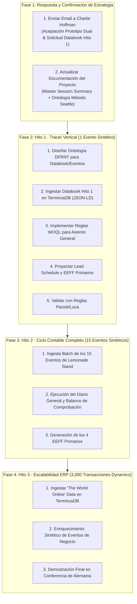

# Hoja de Ruta de Actividades Incrementales: Respuesta a Charlie Hoffman (Propuesta 2)

**Fecha**: 2026-07-29  
**Proyecto**: DFRNT Accounting & Audit by Design  
**Objetivo**: Establecer las actividades incrementales para responder a Charles Hoffman y lograr la meta de prototipado del **Método Seattle / Data-Centric Accounting en TerminusDB**.

---

## 📌 Contexto y Meta Global

Charles Hoffman propone estructurar el desarrollo en **Dos Prototipos**:
- **Prototipo 1 ("Messy Reality")**: Ingesta de datos heterogéneos reales (ERP, CSV, UBL) a través del Semantic Bridge XBRL GL a TerminusDB *(Desarrollado por Richard/DFRNT)*.
- **Prototipo 2 ("Ideal System")**: Sistema de referencia bajo el Método Seattle con 100% de control de la cadena de procedencia contable (*Databook $\rightarrow$ Evento $\rightarrow$ Asiento $\rightarrow$ Lead Schedule $\rightarrow$ Estados Financieros*) en una empresa sintética (*Lemonade Stand*).

---

## 🗺️ Hitos e Actividades Incrementales (Roadmap de Ejecución)

---

## 📅 Actividades Incrementales Detalladas

### 🎯 Hito 0: Formalización y Envío de Respuesta (Inmediato)
- [x] **Analizar propuesta de Charlie**: Documentado en `Analysis_Charlie_Propuesta2.md`.
- [x] **Redactar borrador de correo**: Documentado en `Email_Reply_Charlie_Propuesta2.md`.
- [ ] **Enviar respuesta formal por correo a Charlie Hoffman**: Para confirmar el acuerdo de los 2 prototipos y solicitar los datos/databook del Hito 1.

---

### 🎯 Hito 1: Prototipo de 1 Evento de Negocio (Tracer Vertical en TerminusDB)
**Meta**: Probar la trazabilidad de punta a punta desde el Documento Fuente (*Databook*) hasta los Estados Financieros con **1 solo evento sintético**.

1. **Recepción/Construcción del Databook Hito 1**:
   - Recibir el archivo `source-0001.md` / `event-0001.md` de Charlie o construir su representación JSON-LD.
2. **Modelado en TerminusDB**:
   - Registrar las clases `SourceDocument`, `BusinessEvent`, `GeneralJournalEntry`, `JournalLine`, `Account`, `LeadScheduleMapping`, `ReportingFrameworkLineItem`.
3. **Proyección WOQL**:
   - Escribir la consulta WOQL que transforma el `BusinessEvent` en `GeneralJournalEntry` (Partida Doble).
   - Escribir la consulta WOQL que proyecta el `GeneralJournalEntry` hacia el `LeadSchedule` y genera los rubros del Balance y Estado de Resultados.
4. **Verificación de Auditoría en 1 Clic**:
   - Demostrar que al seleccionar una cifra en DFRNT Console, el grafo despliega las aristas hacia el evento y el documento fuente.

---

### 🎯 Hito 2: Ciclo Contable de 15 Eventos ("Lemonade Stand")
**Meta**: Demostrar un periodo contable completo con la empresa sintética *Lemonade Stand*.

1. **Ingesta masiva de 15 eventos sintéticos** (Inyección de capital, compra de suministros, ventas de limonada, pago de salario, etc.).
2. **Generación automática del Balance de Comprobación y Retained Earnings Roll-Forward**.
3. **Validación de la ecuación fundamental contable** ($\text{Activos} = \text{Pasivos} + \text{Patrimonio}$) mediante restricciones SHACL en TerminusDB y motor Pacioli.

---

### 🎯 Hito 3: Escalabilidad con ERP Real (~3,000 Transacciones de Microsoft Dynamics)
**Meta**: Probar la capacidad de escala del Grafo de Conocimiento con el dataset "The World Online" de Microsoft Dynamics.

1. **Ingesta del dataset `the-world-online-demo-data`** a TerminusDB mediante la ontología XBRL GL / DFRNT.
2. **Enriquecimiento sintético de la naturaleza de los eventos de negocio** (Data-Centric Accounting / Dave McComb).
3. **Generación automatizada de los 4 Estados Financieros Primarios**:
   - Balance Sheet
   - Income Statement
   - Cash Flow Statement
   - Statement of Changes in Equity

---

## 📑 Documentos Asociados en la Carpeta de Trabajo

- **[Analysis_Charlie_Propuesta2.md](file:///c:/Users/IPHIX/Documents/Projects/DFRNT/Documentacion/Charles%20Hoffman/Mail/2026-07-29_argumentacion_ALEMANIA/Analysis_Charlie_Propuesta2.md)**
- **[Email_Reply_Charlie_Propuesta2.md](file:///c:/Users/IPHIX/Documents/Projects/DFRNT/Documentacion/Charles%20Hoffman/Mail/2026-07-29_argumentacion_ALEMANIA/Email_Reply_Charlie_Propuesta2.md)**
- **[Master_Session_Summary_2026-07-29.md](file:///c:/Users/IPHIX/Documents/Projects/DFRNT/Documentacion/Charles%20Hoffman/Mail/2026-07-29_argumentacion_ALEMANIA/Master_Session_Summary_2026-07-29.md)**
