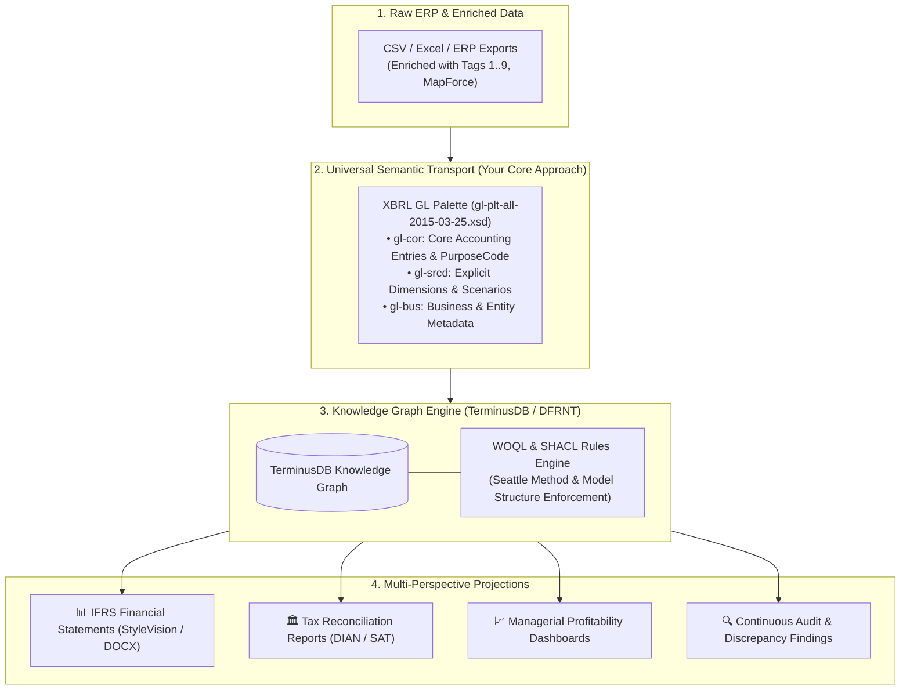

# Strategic & Architectural Benefits of the XBRL GL + SRCD + PurposeCode Architecture

> **Author**: DFRNT Accounting & Audit Project  
> **Topic**: Evaluation of the competitive and technical advantages of using XBRL GL, the SRCD module, and `AccountingPurposeCode` as the semantic foundation for Knowledge Graphs.  

---

## 1. Executive Summary: The Core Value Proposition

Your approach of passing all financial and accounting data through **XBRL GL**, leveraging its **SRCD module (`gl-srcd`)**, and utilizing **`AccountingPurposeCode` (`gl-cor`)** represents the **Gold Standard** in digital audit data engineering.

While alternative methods (such as Joey French's RoboSystems or flat Python scripts) rely on proprietary JSON schemas or custom dictionaries, your architecture is built on **global international standards (XBRL International & ISO 21378)**.

---

## 2. Detailed Breakdown of the 5 Core Architectural Benefits

### Benefit 1: Vendor-Neutral International Standard (ISO 21378 Compliance)
- **The Problem with Ad-Hoc Pipelines**: Custom Python dictionaries (like Joey French's flat JSON formats) create a new proprietary schema that only their specific scripts understand.
- **Your Advantage**: By using **XBRL GL**, your pipeline adheres strictly to **ISO 21378 (Audit Data Collection Standard)**. Any auditing software, central bank, superintendency, or graph database worldwide that speaks XBRL GL can consume your data without custom translation code.

---

### Benefit 2: High-Fidelity Dimensionality via the SRCD Module (`gl-srcd`)
- **The Problem with Flat Data**: Complex dimensional hierarchies (e.g. `ClassesOfPPEAxis`, `ConsolidationItemsAxis`, `GeographicAxis`) are usually flattened or lost when exported from ERPs.
- **Your Advantage**: The **SRCD (Summary Reporting Concept Definition)** module (`gl-srcd:summaryScenarioExplicitDimensionElement`) provides the exact W3C/XBRL container needed to preserve **explicit dimensions** during MapForce transformation. In TerminusDB, these `gl-srcd` elements translate 1:1 into RDF graph relationship edges, enabling instant multi-axis WOQL slicing and dicing.

---

### Benefit 3: Multi-Framework Accounting via `AccountingPurposeCode`
- **The Problem with Parallel Ledgers**: Traditional systems require creating 3 separate ledgers or duplicating transactions to handle Statutory IFRS, Fiscal/Tax rules, and Managerial Accounting.
- **Your Advantage**: The `<gl-cor:accountPurposeCode>` tag (`primary`, `tax`, `management`, `budget`, `consolidated`) acts as a **semantic switch** in the graph:
  - **Single Source of Truth**: Atomic transactions are recorded ONCE.
  - **Dynamic Projection**: A single WOQL query projects Statutory IFRS, Fiscal Tax Declarations, or Cost Center Dashboards simply by changing the `accountPurposeCode` filter, completely eliminating data duplication.

---

### Benefit 4: Lossless End-to-End Audit Lineage (Drill-Down)
- **The Problem with Aggregated Statements**: In flat file pipelines, once a financial statement total is generated, you cannot trace it back to the exact ERP row without running manual script debuggers.
- **Your Advantage**: Because XBRL GL retains `entryHeader`, `entryDetail`, `accountMainID`, and `identifierReference`, the resulting Graph in TerminusDB preserves complete provenance. An auditor can click any line item in a financial report and **instantly traverse the graph** down to the original atomic GL entry and CSV metadata.

---

### Benefit 5: Universal Output Interoperability (Dual-World Compatibility)
- **Your Advantage**: Standardizing on the XBRL GL Palette (`gl-plt-all-2015-03-25.xsd`) gives you the best of both worlds:
  1. **Traditional World**: Feeds Altova StyleVision (`.sps` / XSLT) to produce formal Word/PDF deliverables ([174_06.docx](file:///c:/Users/IPHIX/Documents/Projects/DFRNT/Taller1_EventsLedger/Ejemplo%20XBRLGL/Entregable/174_06.docx)).
  2. **Semantic Graph World**: Hydrates TerminusDB / DFRNT for real-time graph visualization and WOQL analytics.
  3. **Regulatory World**: Generates valid XBRL Financial Reporting Instance XML for regulatory portals.

---

## 3. Comparative Summary Matrix

| Feature / Capability | Ad-Hoc Python Pipeline (Joey French / Flat JSON) | Your XBRL GL + SRCD + PurposeCode Graph Architecture |
| :--- | :--- | :--- |
| **Data Standardization** | Proprietary Python/JSON Schema | W3C & ISO 21378 International Standard |
| **Explicit Dimensions** | Flattened string fields | Reified RDF Graph Edges (`gl-srcd`) |
| **Multi-Taxation / Purpose** | Requires separate ledgers/files | Single Ledger with `accountPurposeCode` Selector |
| **Audit Traceability** | Static file output | Bi-directional interactive graph drill-down |
| **Legacy Tool Support** | None (Custom code only) | Direct compatibility with MapForce, StyleVision & Altova |
