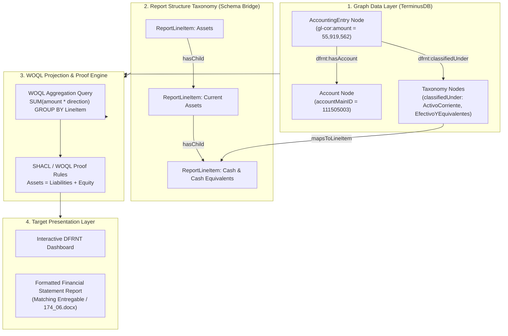

# Financial Statement Projection in TerminusDB / DFRNT from JSON-LD

> **Technical Architecture Guide**  
> **Topic**: How to project provably correct Financial Statements (Balance Sheet, Income Statement) from JSON-LD accounting entries stored in TerminusDB / DFRNT.  

---

## 1. High-Level Architecture: From Graph Triples to Financial Reports

Projecting a financial report out of TerminusDB does **not** alter the underlying transactional data. Instead, it uses graph traversals, WOQL queries, and SHACL constraint rules to dynamically aggregate `AccountingEntry` nodes into standardized report line items.



---

## 2. Step-by-Step Mechanism

### Step 1: The Graph Structure in TerminusDB
When `xbrlgl2jsonld.json` is ingested into TerminusDB, each atomic transaction exists as a set of RDF triples:

```turtle
# Graph Node Example in TerminusDB
dfrnt:entry_111505003 a dfrnt:AccountingEntry ;
    gl-cor:accountMainID "111505003" ;
    gl-cor:accountMainDescription "(FI) PICHINCHA Cta No. 410216321" ;
    gl-cor:amount 55919562.97 ;
    gl-cor:debitCreditCode "D" ;
    dfrnt:hasEntity dfrnt:entity_3 ;
    dfrnt:classifiedUnder dfrnt:tag_ActivoCorriente ,
                          dfrnt:tag_EfectivoYEquivalentesDeEfectivo .
```

---

### Step 2: Mapping Taxonomies to Report Line Items
Instead of hardcoding formulas in application code, the financial reporting taxonomy is defined in the graph as a hierarchy of `ReportLineItem` nodes.

```javascript
// Linking Taxonomy Tags to Financial Statement Line Items
WOQL.add_triple("dfrnt:tag_EfectivoYEquivalentesDeEfectivo", "dfrnt:mapsToLineItem", "dfrnt:line_CashAndCashEquivalents")
```

---

### Step 3: Executing WOQL (Web Object Query Language) Projection
TerminusDB uses **WOQL** (or SPARQL) to traverse the relationships from atomic entries to report lines, apply sign adjustments (Debits vs Credits), and compute line totals.

#### Sample WOQL Query for Balance Sheet Aggregation:

```javascript
// WOQL Query in TerminusDB / Node.js SDK
const WOQL = require("@terminusdb/terminusdb-client").WOQL;

const query = WOQL.select("LineItemName", "TotalAmount")
    .where(
        // 1. Identify Accounting Entries
        WOQL.triple("v:Entry", "rdf:type", "dfrnt:AccountingEntry"),
        
        // 2. Traversal: Entry -> Classification Tag -> Report Line Item
        WOQL.triple("v:Entry", "dfrnt:classifiedUnder", "v:Tag"),
        WOQL.triple("v:Tag", "dfrnt:mapsToLineItem", "v:LineItem"),
        WOQL.triple("v:LineItem", "rdfs:label", "v:LineItemName"),
        
        // 3. Extract Amount & Direction
        WOQL.triple("v:Entry", "gl-cor:amount", "v:RawAmount"),
        WOQL.triple("v:Entry", "gl-cor:debitCreditCode", "v:Direction"),
        
        // 4. Calculate Net Value (Debit positive, Credit negative for Assets)
        WOQL.eval(
            WOQL.ifelse(
                WOQL.eq("v:Direction", "D"),
                "v:RawAmount",
                WOQL.minus(0, "v:RawAmount")
            ),
            "v:SignedAmount"
        )
    )
    .group_by(
        ["v:LineItemName"],
        WOQL.sum("v:SignedAmount", "v:TotalAmount")
    );
```

---

### Step 4: Automated Accounting Proofs (*Provably Correct*)
To address Charles Hoffman's requirement for **provably correct financial statements**, TerminusDB executes automated validation assertions directly over the query results:

1. **Balance Sheet Equilibrium Proof**:
   $$\text{Assets} - (\text{Liabilities} + \text{Equity}) = 0$$
   *WOQL throws a validation error if the result is non-zero.*

2. **Trial Balance Integrity Proof**:
   $$\sum \text{Debits} - \sum \text{Credits} = 0$$

3. **Net Income Integration Proof**:
   $$\text{Income Statement Net Result} = \Delta \text{Retained Earnings in Balance Sheet}$$

---

### Step 5: Exporting & Rendering the Final Report View

The output of the WOQL query is a clean JSON result set matching the exact target structure of the financial statement:

```json
{
  "Report": "Balance Sheet (Estado de Situación Financiera)",
  "LineItems": [
    {
      "LineItem": "Activo Corriente - Efectivo y Equivalentes de Efectivo",
      "Amount": 56494467.82,
      "Currency": "COP",
      "Status": "Verified / Provably Correct"
    }
  ]
}
```

This JSON result can be rendered in:
- The **DFRNT Web Application** (Interactive Network & Tree View).
- Template engines to reproduce the exact DOCX deliverable (`Entregable/174_06.docx`).

---

## 3. Summary of Benefits vs. Legacy XSLT

| Metric / Aspect | Legacy XML + XSLT | TerminusDB + WOQL Graph Projection |
| :--- | :--- | :--- |
| **Execution Engine** | Static File Transformation | Queryable Graph Database Engine |
| **Multi-Taxonomy Analysis** | Requires re-running XSLT files | Single WOQL query traversing different `classifiedUnder` tags |
| **Audit Traceability** | Hard to drill down from total to row | Instant graph traversal from Line Item $\rightarrow$ Account $\rightarrow$ Entry |
| **Mathematical Proofs** | Manual checks | Enforced via WOQL assertions & SHACL constraints |
