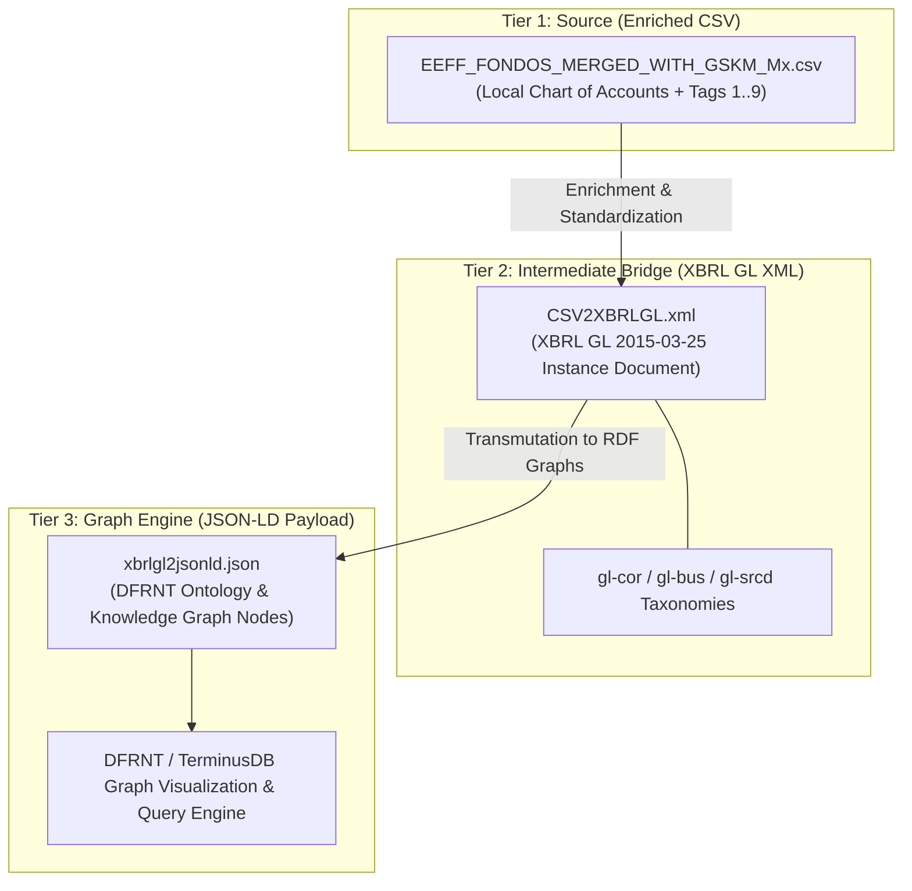

# XBRL GL as a Semantic Bridge: Demonstrating the Path from Raw GL Data to DFRNT Knowledge Graphs

> **Prepared for**: Charles Hoffman, CPA (Pioneer of XBRL)  
> **Subject**: Demonstrating XBRL Global Ledger (XBRL GL) as a Lossless Intermediate Transport Layer for Financial Knowledge Graphs  
> **Repository Context**: DFRNT Accounting & Audit by Design  

---

## 1. Executive Summary

This demonstration showcases how **XBRL Global Ledger (XBRL GL)** serves as the critical, vendor-neutral semantic bridge between raw, semi-structured accounting data (CSV) and Graph Databases (JSON-LD / RDF payloads in **DFRNT**).

By utilizing XBRL GL as an intermediate standardization layer:
- We decouple ERP-specific CSV formats from downstream knowledge graph architectures.
- We preserve complete transactional lineage and audit metadata (`gl-cor`, `gl-bus`, `gl-srcd`).
- We enable instant multi-taxonomical graph reasoning (e.g., mapping local chart of accounts to IFRS / US GAAP / ISO 21378 ADCS modules).

---

## 2. The 3-Tier Pipeline Architecture



---

## 3. Data Transformation & Provenance Walkthrough

To demonstrate lossless semantic progression, we trace a single transactional record across all three layers of the pipeline.

### Step 1: Raw Enriched Source Data (`Source/`)
**File**: [EEFF_FONDOS_MERGED_WITH_GSKM_Mx.csv](file:///c:/Users/IPHIX/Documents/Projects/DFRNT/Documentacion/Charles%20Hoffman/Mail/2026-07-29/Source/EEFF_FONDOS_MERGED_WITH_GSKM_Mx.csv)

The raw source export contains transactional balances enriched with local organizational tags:

| Field Name | Sample Value | Semantic Role |
| :--- | :--- | :--- |
| **Compañia** | `3` | Entity Identifier |
| **Desc. compañia** | `FONDO DE INVERSION COLETIVA INTERES` | Entity Legal Name |
| **Auxiliar** | `111505003` | General Ledger Account Main ID |
| **Desc. auxiliar** | `(FI) PICHINCHA Cta No. 410216321` | Account Description |
| **Saldo inicial** | `55919562.97` | Opening Balance Amount |
| **Saldo final** | `56494467.82` | Closing Balance Amount |
| **SCOA6DIG** | `111505` | Standardized Sub-account Code |
| **Tag 1** | `Activo` | Main Balance Sheet Class |
| **Tag 3** | `Activo Corriente` | Asset Liquidity Classification |
| **Tag 4** | `Efectivo y equivales de efectivo` | IFRS Line Item |
| **Tag 5** | `Bancos nacionales` | Granular Category |

---

### Step 2: XBRL GL Standardized Instance (`Intermediate/`)
**File**: [CSV2XBRLGL.xml](file:///c:/Users/IPHIX/Documents/Projects/DFRNT/Documentacion/Charles%20Hoffman/Mail/2026-07-29/Intermedio/CSV2XBRLGL.xml)

The CSV rows are transformed into a standardized **XBRL GL 2015-03-25** instance document (`<gl-cor:accountingEntries>`). This guarantees 1:1 complex type parity with global digital auditing standards (ISO 21378 ADCS):

```xml
<gl-cor:entryHeader>
    <gl-cor:entryDetail>
        <!-- Account Information -->
        <gl-cor:account>
            <gl-cor:accountMainID contextRef="ctx1">111505003</gl-cor:accountMainID>
            <gl-cor:accountMainDescription contextRef="ctx1">(FI) PICHINCHA Cta No. 410216321</gl-cor:accountMainDescription>
        </gl-cor:account>
        
        <!-- Transactional Amount & Direction -->
        <gl-cor:amount contextRef="ctx1" unitRef="COP" decimals="2">55919562.97</gl-cor:amount>
        <gl-cor:debitCreditCode contextRef="ctx1">D</gl-cor:debitCreditCode>
        
        <!-- Entity Identification -->
        <gl-bus:identifierReference>
            <gl-bus:identifierCode contextRef="ctx1">3</gl-bus:identifierCode>
            <gl-bus:identifierDescription contextRef="ctx1">FONDO DE INVERSION COLETIVA INTERES</gl-bus:identifierDescription>
        </gl-bus:identifierReference>
    </gl-cor:entryDetail>
</gl-cor:entryHeader>
```

---

### Step 3: JSON-LD Graph Payload (`Output/`)
**File**: [xbrlgl2jsonld.json](file:///c:/Users/IPHIX/Documents/Projects/DFRNT/Documentacion/Charles%20Hoffman/Mail/2026-07-29/Output/xbrlgl2jsonld.json)

The XBRL GL document is transmuted into a **JSON-LD graph payload**. In this form, every account, entity, and taxonomy tag becomes an interconnected node in the DFRNT Knowledge Graph:

```json
{
  "@context": {
    "gl-cor": "http://www.xbrl.org/int/gl/cor/2015-03-25/",
    "gl-bus": "http://www.xbrl.org/int/gl/bus/2015-03-25/",
    "dfrnt": "http://dfrnt.com/schema/audit#",
    "AccountingEntry": "dfrnt:AccountingEntry",
    "Account": "dfrnt:Account",
    "Entity": "dfrnt:Entity",
    "classifiedUnder": {
      "@id": "dfrnt:classifiedUnder",
      "@type": "@id",
      "@container": "@set"
    }
  },
  "@graph": [
    {
      "@id": "dfrnt:entry_111505003",
      "@type": "AccountingEntry",
      "gl-cor:accountMainID": "111505003",
      "gl-cor:accountMainDescription": "(FI) PICHINCHA Cta No. 410216321",
      "gl-cor:amount": 55919562.97,
      "gl-cor:debitCreditCode": "D",
      "hasEntity": {
        "@id": "dfrnt:entity_3",
        "rdfs:label": "FONDO DE INVERSION COLETIVA INTERES"
      },
      "classifiedUnder": [
        "dfrnt:tag_Activo",
        "dfrnt:tag_ActivoCorriente",
        "dfrnt:tag_EfectivoYEquivalentesDeEfectivo",
        "dfrnt:tag_BancosNacionales"
      ]
    }
  ]
}
```

---

## 4. Key Takeaways & Benefits for Charles Hoffman's Vision

> [!TIP]
> **1. Decoupling ERP Diversity from Graph Ingestion**  
> Direct CSV-to-Graph scripts require custom logic for every ERP layout. Using XBRL GL as a universal intermediate model ensures that only *one* transformation engine (XBRL GL $\rightarrow$ JSON-LD) is required, regardless of source ERP complexity.

> [!NOTE]
> **2. High-Fidelity Accounting Semantics**  
> XBRL GL inherently understands core accounting constructs (Debit/Credit logic, Entry Headers, Documents, Source Journals, Identifier References) that flat JSON or generic key-value stores omit.

> [!IMPORTANT]
> **3. Multi-Hierarchy Taxonomy Mapping in Graphs**  
> By projecting XBRL GL entries into DFRNT graph nodes via `dfrnt:classifiedUnder`, auditors can instantly query transactions across multiple reporting frameworks (e.g. Local Statutory vs IFRS vs Management Reports) without altering underlying atomic transactions.

> [!SUCCESS]
> **4. Alignment with ISO/IEC 15944-4 & ISO 21378**  
> This implementation completes the standard hierarchy: **ISO 15944-4** (Economic Ontology) $\rightarrow$ **ISO 21378** (ADCS Audit Modules) $\rightarrow$ **XBRL GL** (Technical Container) $\rightarrow$ **DFRNT** (Graph Execution Engine).

---

## 5. Next Steps for Demonstration

1. **DFRNT Workspace Upload**: Ingest `xbrlgl2jsonld.json` into DFRNT to visualize the interactive network graph of entities, accounts, and financial tags.
2. **SPARQL / GraphQL Query Showcase**: Execute sample queries demonstrating cross-taxonomy auditing (e.g., retrieving all cash-equivalent transactions across funds).
3. **Automated Pipeline Package**: Bundle the CSV-to-XBRL-GL-to-JSONLD Python runner into a reusable CLI script.
