# Disección Estratégica: Interacción 3 de Charlie Hoffman (interaction3.txt)

**Fecha**: 3 de agosto de 2026  
**Remitente**: Charles Hoffman (Charlie)  
**Destinatario**: Richard Gasca  
**Archivo Analizado**: `interaction3.txt`  
**Tema Central**: Paradigma Document-First (Heredado) vs. Graph-First (Nuevo) y la Estrategia de Prototipado Paralelo para Demostrar la Brecha ("The Gap").

---

## 1. Transcripción y Traducción Directa

### Texto Original (`interaction3.txt`)
> *Richard;*
> 
> *I am trying to explain these two paradigms and the difference between them. Give me a couple of days and I will have something for you. What I would encourage you to do is to “prototype” both the legacy approach and the new approach. This allows three things: (1) an understanding of the legacy approach, (2) an understanding of the new approach, (3) the ability to explain the “gap” between the two.*
> 
> *It seems to me that two different “source” documents or document formats are possible. The first is the traditional “document” or PDF structured for presentation (i.e. not meaning). The second is a “graph” structured for meaning for which a presentation (i.e. document) can be generated from the graph.*
> 
> *How well do you think people “get” what we are trying to communicate? This seems so obvious to me.*
> 
> *Cheers,*

---

### Traducción al Español
> *Richard:*
> 
> *Estoy intentando explicar estos dos paradigmas y la diferencia entre ellos. Dame un par de días y tendré algo listo para ti. Lo que te animaría a hacer es **prototipar** tanto el enfoque heredado (*legacy*) como el nuevo enfoque. Esto permite tres cosas: (1) comprender el enfoque heredado, (2) comprender el nuevo enfoque, y (3) tener la capacidad de explicar la "brecha" (*the gap*) entre ambos.*
> 
> *Me parece que son posibles dos "documentos fuente" o formatos de documento diferentes. El primero es el "documento" tradicional o PDF estructurado para la **presentación** (es decir, no para el significado). El segundo es un **"grafo"** estructurado para el **significado**, a partir del cual se puede **generar** una presentación (es decir, un documento) desde el grafo.*
> 
> *¿Qué tan bien crees que la gente "entiende" lo que estamos tratando de comunicar? Esto me parece tan obvio.*
> 
> *Saludos,*

---

## 2. Disección Anatómica del Mensaje

Charlie sintetiza con absoluta claridad el núcleo del cambio de paradigma en la contabilidad e información empresarial.

```mermaid
graph TD
    subgraph Legacy ["Paradigma Heredado (Document-First)"]
        L1["Documento / PDF / Excel"] -->|"Diseñado para"| L2["Presentación Visual (Píxeles/Texto)"]
        L2 -->|"Carece de"| L3["Semántica Computable"]
        L3 -->|"Resultado"| L4["Reconciliación Manual ex-post ('Data Janitor')"]
    end

    subgraph NewApproach ["Nuevo Paradigma AAbD / DFRNT (Graph-First)"]
        N1["Grafo de Conocimiento (RDF/JSON-LD)"] -->|"Diseñado para"| N2["Significado y Reglas (ISO 15944-4 / Valueflows)"]
        N2 -->|"Genera Automáticamente"| N3["Vistas / PDFs / Dashboards / XForms"]
        N3 -->|"Resultado"| N4["Verdad Única Computable y Auditable ('Shift Left')"]
    end
```



### Eje 1: La Dicotomía Fundacional (Document-First vs. Graph-First)
* **Document-First (Legacy)**: La "fuente de verdad" es un artefacto de presentación (PDF, factura en papel, hoja de cálculo visual). El significado está atrapado en la disposición visual. Para que una computadora lo entienda, hay que "raspar" el texto, usar OCR o reingresarlo manualmente.
* **Graph-First (New Approach / AAbD)**: La "fuente de verdad" es un **Grafo de Conocimiento de Transacciones Económicas** (basado en ISO 15944-4, XBRL GL y Valueflows). El documento o PDF deja de ser la fuente de verdad primaria; pasa a ser simplemente una **vista generada (*rendered view*)** proyectada a partir del Grafo.

### Eje 2: La Estratagema del "Prototipado Dual"
Charlie propone una táctica pedagógica e industrial infalible: **no solo explicar el nuevo sistema, sino construir ambos prototipos en paralelo**.
1. **Entender el Legacy**: Exponer las costuras del modelo actual (fragmentación, falta de significado, duplicación).
2. **Entender el New Approach**: Demostrar la elegancia de la captura semántica upstream.
3. **Evidenciar "The Gap"**: La brecha entre ambos no es incremental; es una **disrupción de orden de magnitud** en costo, tiempo de auditoría y riesgo operacional.

### Eje 3: El Dilema Paradigmático ("Why don't people get it?")
Charlie expresa la sorpresa clásica descrita por Thomas Kuhn en *La estructura de las revoluciones científicas*: cuando un nuevo marco mental es superior y evidente para quien opera dentro de él, resulta perplejo ver la resistencia de la industria dominada por el paradigma anterior (el culto al PDF y a la conciliación en Excel).

---

## 3. Matriz de la Brecha ("The Gap Matrix")

| Dimensión de Análisis | Paradigma Heredado (*Document-First*) | Nuevo Paradigma (*Graph-First / AAbD*) | La Brecha (*The Gap*) |
| :--- | :--- | :--- | :--- |
| **Fuente de Verdad** | Documento estático (PDF, TIFF, Word, Excel). | Grafo semántico (JSON-LD, TerminusDB, BaseX). | Del **artefacto visual estático** al **modelo ontológico dinámico**. |
| **Prioridad de Diseño** | Presentación e impresión visual. | Significado, contratos y lógica de negocio. | De la **forma estandarizada** a la **semántica estandarizada**. |
| **Generación de Vistas** | La vista ES el dato. Se edita directamente el layout. | Las vistas (PDF, HTML, XForms) se **generan al vuelo** desde el Grafo. | De **múltiples silos de presentación** a **proyecciones ilimitadas de un solo Grafo**. |
| **Validación de Datos** | Reconciliación *ex-post* (después de que el error ocurrió). | Validación *ex-ante* mediante SHACL / ISO 15944-4 ("Shift Left"). | De **apagar incendios** a **imposibilidad computacional de cometer errores**. |
| **Interoperabilidad IA** | La IA adivina el texto mediante OCR/LLM frágil. | La IA consume la proveniencia exacta del Grafo con contexto estricto. | De **alucinaciones contables** a **auditoría determinista en milisegundos**. |

---

## 4. Plan de Acción Inmediato para Richard

Para responder a la sugerencia de Charlie de prototipar ambos enfoques, podemos estructurar una demostración comparativa directa con nuestras herramientas existentes (**BaseX, StyleVision, TerminusDB, ISO 15944-4/Valueflows**):

### Escenario de Prototipado Paralelo: "El Contrato de Comercialización"

1. **Prototipo A (Legacy Approach - Document-First)**:
   * **Entrada**: Un PDF estático o documento de texto de un contrato comercial.
   * **Problema**: Si el precio cambia o el impuesto se recalcula, hay que modificar el documento visual y reconciliar manualmente los asientos en el ERP. No hay garantía de que el contrato en PDF coincida con el registro contable.

2. **Prototipo B (New Approach - Graph-First / AAbD)**:
   * **Entrada**: Un Grafo ISO 15944-4 / Valueflows en JSON-LD (ej. `EconomicContract`, `Commitment`, `EconomicResource`).
   * **Ejecución**:
     1. El Grafo valida las reglas de negocio (Shift Left).
     2. Mediante Altova StyleVision / XSL-FO o BaseX XQuery, se **genera automáticamente** el PDF oficial impecable del contrato.
     3. Si el grafo cambia, el PDF generado se actualiza instantáneamente y el estado contable se sincroniza sin intermediarios.

---

## 5. Propuesta de Respuesta para Charlie (en Inglés)

Puedes enviar esta respuesta a Charlie para confirmar alineación total con su visión y proponer los siguientes pasos del prototipado:

```text
Hi Charlie,

You hit the nail on the head. This exact distinction—Document-first (presentation without meaning) vs. Graph-first (meaning from which presentation is generated)—is the fundamental divide between legacy accounting systems and Accounting by Design (AAbD).

Regarding your suggestion to prototype both approaches, we are fully aligned and ready to execute. Here is how we can map and demonstrate the "gap":

1. Legacy Prototype (Document-First):
   - Source: Traditional static PDF/Document.
   - Mechanism: Data is trapped in presentation layouts. Any validation or reconciliation must happen ex-post via manual entry or OCR/fragile parsing.
   - Result: High reconciliation friction, zero semantic provenance.

2. New Approach Prototype (Graph-First):
   - Source: An ISO 15944-4 / Valueflows economic transaction Graph stored in our graph architecture (JSON-LD / TerminusDB / BaseX).
   - Mechanism: Meaning and business rules are encoded upfront ("Shift Left"). Presentation layers (PDF contracts, dashboards, XForms) are generated ON DEMAND as views of the underlying graph.
   - Result: Single source of truth, automated compliance, zero ex-post reconciliation.

Why don't people "get" it yet? Because the industry has spent 40 years treating PDFs and Excel sheets as the "truth" rather than just temporary projections of business facts. Showing both prototypes side by side will make the gap so stark that it becomes undeniable.

Looking forward to what you prepare over the next couple of days!

Best regards,
Richard
```

---

## 6. Siguiente Paso Recomendado en la Workspace
Podemos vincular este análisis con el trabajo de la plantilla Altova StyleVision e ISO 15944-4 que diseñamos previamente, demostrando exactamente la generación automática de documentos a partir del Grafo de Conocimiento.
