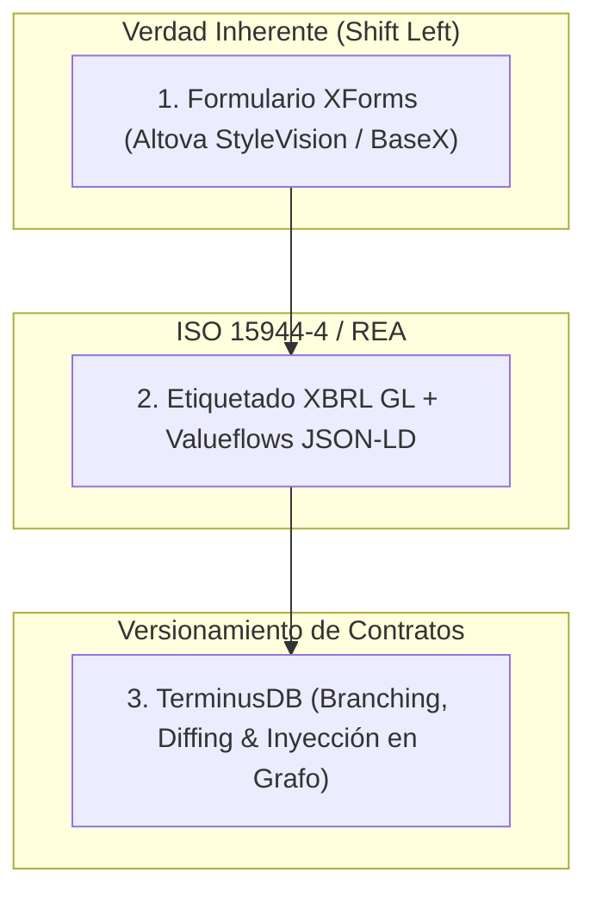

# Resumen de Interacción 2: Charlie Hoffman (3 de Agosto de 2026)

**Remitente**: Charles Hoffman (Charlie)  
**Receptor**: Richard Gasca  
**Carpeta**: `c:\Users\IPHIX\Documents\Projects\DFRNT\Documentacion\Charles Hoffman\Mail\2026-08-03\`  
**Archivos Relacionados**: `interaction2.txt` | `imagen2.png` | Blog: *Coming Transformation of Accounting Information Systems* | Video: `https://youtu.be/ks8ZUNu7bjs`

---

## 1. Contenido del Mensaje de Charlie (`interaction2.txt`)

> *"Richard;*  
> *So what I am almost able to do is say that there is an alternative to today’s legacy 'normal science'. What this video:*  
> *https://youtu.be/ks8ZUNu7bjs*  
> *Now, read this blog post:*  
> *https://seattlemethod.blogspot.com/2026/07/coming-transformation-of-accounting_0858910251.html*  
> *imagen2.png*  
> *The ONLY REASON anyone could argue what the LEGACY APPROACH should be persisted is because they can point to no other viable approach. Well, we are getting closer and closer to an alternative viable approach.*  
> *Cheers,*  
> *Charlie"*

---

## 2. Disección de la Imagen (`imagen2.png`)

La imagen presenta la **dicotomía fundamental** entre dos paradigmas contables:

```
───────────────────────────────────────────────────────────────────────────
   PARADIGMA HEREDADO (Legacy)        vs       NUEVO PARADIGMA (AAbD)
───────────────────────────────────────────────────────────────────────────
 • Sistemas "tontos" y fragmentados      • Información consistente por diseño
 • Datos inconsistentes y desfasados     • Datos sincronizados y conectados
 • Reconciliación manual ex-post         • Prevención de errores en la fuente
 • Contador como "limpiador de datos"    • Contador como "curador de la verdad"
───────────────────────────────────────────────────────────────────────────
```

> **Principio Fundamental**: *"La información quiere estar libre de imperfecciones. No queremos información que nos sorprenda con inconsistencias, contradicciones o múltiples versiones de la verdad."*

---

## 3. Síntesis del Artículo de Referencia de Charlie

En el artículo *"Coming Transformation of Accounting Information Systems"*, Charlie argumenta que el marco **Accounting & Audit by Design (AAbD)** transforma el trabajo contable mediante 10 pilares clave:

1. **Sustrato Computable**: Doble entrada basada en grafos.
2. **Quality Management**: Principios Lean / Six Sigma para eliminar desperdicios de reconciliación.
3. **Reglas Declarativas**: Gestionadas por contadores/expertos de dominio, no por programadores TI.
4. **Web Semántica**: JSON-LD, RDF, OWL (Valueflows / ISO 15944-4).
5. **Versionamiento Estilo Git**: Aplicar ramas (*branching*), `diffs` y `commits` a la información contractual y contable.
6. **Modularidad Lego**: Ensamblar sistemas duraderos a partir de componentes estándar.
7. **IA con Restricciones Semánticas**: Darle a la IA el contexto, conocimiento y restricciones adecuadas en el momento preciso.
8. **Registros Distribuidos Inmutables**: Proveniencia inalterable desde la fuente.
9. **Diseño Atómico**: Interfases abordables (XForms) para expertos de dominio.
10. **Soberanía Semántica**: El dominio del significado pertenece a la empresa.

---

## 4. Conexión Estratégica con el Proceso de Ideación de Richard

El proceso de ideación de Richard responde exactamente a la **"alternativa viable"** que anuncia Charlie:



1. **Shift Left Total**: Se capturan los términos del contrato en XForms **antes de su celebración** (evitando la fragmentación física).
2. **Eliminación de Fragmentación Semántica**: El remapeo a **JSON-LD Valueflows (`vf:Agreement`, `vf:Commitment`)** aplica el estándar **ISO/IEC 15944-4**.
3. **Versionamiento Git para Contratos**: La edición iterativa del abogado en XForms se gestiona mediante ramas (*branching*) y `diffs` en **TerminusDB**, permitiendo personalizar cláusulas antes del congelamiento definitivo (*Merge to Main*).
