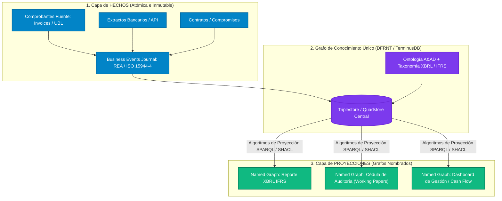

# Disección Técnica y Filosófica: Charles Hoffman (Interaction #1)
## *"Hechos vs. Proyecciones: De Informes Estáticos a Grafos Nombrados en Accounting & Audit by Design (A&AD)"*

**Fecha**: 4 de agosto de 2026  
**Autor de Análisis**: Richard Gasca / DFRNT Team  
**Origen de la Interacción**: [`interaction1.txt`](file:///c:/Users/IPHIX/Documents/Projects/DFRNT/Documentacion/Charles%20Hoffman/Mail/2026-08-04/interaction1.txt)  
**Tema**: Ontología Contable, Grafos Nombrados (*Named Graphs*), Eventos de Negocio (REA), Hechos vs. Proyecciones y Algoritmos Globales de Proyección.  

---

## 1. La Tesis y Dilema Central de Charles Hoffman

En esta interacción, Charles Hoffman toca la frontera conceptual de la contabilidad moderna basada en grafos de conocimiento (*Graph-Based Accounting*). Su dilema principal se resume en:

> *"What I am struggling with is understanding what is a set of FACTS and what is a PROJECTION. It seems that a 'report' is really what Dave McComb calls a 'named graph'... It seems that all this 'stuff' would be in one database. Every source, every event, the reporting framework and then by creating the named graphs you want everything is 'projected'."*

Hoffman intuye una transición de fase fundamental:
1. **La contabilidad tradicional trata al informe contable como un artefacto físico/digital aislado** (un PDF, un XML XBRL o una hoja Excel).
2. **La arquitectura semántica avanzada entiende que NO existen los "informes aislados"**, sino un **único Grafo de Conocimiento global** que contiene eventos, documentos fuente, reglas y marcos normativos. Lo que llamamos "informe" o "reporte" es simplemente una **vista proyectada (Grafo Nombrado / *Named Graph*)** obtenida mediante algoritmos deterministas.

---

## 2. Desglose de los Conceptos Clave

### A. Hechos (*Facts*) vs. Proyecciones (*Projections*)

* **HECHOS (*Facts*) [El Nivel Atómico / Momento 0]**:
  * **Definición**: Eventos económicos inmutables que realmente ocurrieron en el mundo real.
  * **Componentes**: 
    * Comprobantes fuente (*Sources*: facturas de proveedores, extractos bancarios, contratos UBL/JSON-LD).
    * Registro de Eventos de Negocio (*Business Event Journal* / Ontología REA - ISO/IEC 15944-4: Intercambios entre Agentes, Recurso Afectado, Evento de Ingesta).
  * **Propiedad**: Son **independientes del marco contable** (NIIF, US GAAP, Estatutario local). Un pago de $1,000 USD a un proveedor es un hecho físico/económico indiscutible.

* **PROYECCIONES (*Projections*) [El Nivel Semántico / Vistas]**:
  * **Definición**: Interpretaciones o agregaciones de los Hechos estructuradas bajo un marco regulatorio o de gestión específico.
  * **Componentes**:
    * Estados Financieros (Balance General, Estado de Resultados).
    * Cédulas de Auditoría (*Working Papers / Accounting Schedules*).
    * Reportes regulatorios XBRL (US GAAP, IFRS).
  * **Propiedad**: Son **vistas computadas**. Si cambia el marco normativo (p. ej., amortización de arrendamientos bajo IFRS 16 vs. contabilidad de caja), la proyección cambia, pero los **Hechos primarios permanecen intactos**.

### B. Grafos Nombrados (*Named Graphs* - Dave McComb)

En el modelo semántico RDF (Resource Description Framework), las triples tienen la forma `(Sujeto, Predicado, Objeto)`. Al añadir un cuarto elemento, `(Sujeto, Predicado, Objeto, Grafo)`, obtenemos un **Quadstore**. 

Dave McComb (*Semantic Arts*) y Charles Hoffman reconocen que un **Grafo Nombrado (`GRAPH <http://dfrnt.org/reports/2026-Q2-IFRS>`)** permite empaquetar un conjunto de bloques de información (hechos seleccionados, relaciones taxonómicas y metadatos de presentación) bajo una URI única sin duplicar la información del repositorio central.

---

## 3. Alineación con la Arquitectura A&AD / DFRNT

Esta reflexión de Hoffman confirma exactamente la visión de **Accounting & Audit by Design (A&AD)** desarrollada en DFRNT:

---

## 4. Matriz Comparativa: Paradigma Tradicional vs. Visión Hoffman vs. Solución DFRNT/A&AD

| Dimensión | Paradigma Tradicional (Silos/Documentos) | Visión de Charles Hoffman (Interacción #1) | Implementación Completa en DFRNT / A&AD |
| :--- | :--- | :--- | :--- |
| **Unidad de Información** | Archivos aislados (Excel, PDF, XBRL XML). | Grafos Nombrados (*Named Graphs*) dentro de una base de datos. | **Quads RDF en TerminusDB** con proveniencia inmutable y versionamiento tipo Git. |
| **Origen / Fuentes** | Separado en ERPs, CRMs y archivos adjuntos. | Falta integrarlo (*"This does not show SOURCES or EVENTS JOURNAL"*). | **Integración REA (ISO 15944-4)**: Eventos y Comprobantes UBL vinculados formalmente en el grafo. |
| **Naturaleza del Reporte** | Salida estática pre-calculada. | Proyección calculada sobre hechos centralizados. | **Proyección semántica en tiempo real** mediante consultas SPARQL / XQuery y SHACL. |
| **Cédulas de Auditoría** | Papeles de trabajo externos manuales. | Pendientes por incluir (*"I don't have accounting working papers yet"*). | **Grafos Nombrados de Auditoría**: Trazabilidad completa desde el rubro balanceado hasta la factura atómica. |
| **Algoritmos de Proyección** | Reglas de negocio propietarias en código ERP. | *"Global standard projection algorithms would be a good thing."* | **Constructores Estándar SHACL/SPARQL/GraphQL-LD** para mapeos ontológicos reproducibles. |

---

## 5. Implicaciones Estratégicas y Próximos Pasos

1. **Estandarización de los Algoritmos de Proyección (*Projection Algorithms*):**  
   Charles acierta al pedir "algoritmos globales estándar de proyección". En el ecosistema DFRNT, esto se traduce en consultas `CONSTRUCT` SPARQL / SHACL que transforman la ontología de eventos REA en estructuras XBRL (Presentation, Calculation, Definition Linkbases).

2. **Completar la Cadena de Proveniencia en el Grafo (Shift Left):**  
   Para cerrar la brecha descrita por Charlie (falta del *Business Events Journal* y los *Sources*), debemos consolidar el modelo de ingesta atómica donde cada entrada de diario contenga la referencia al URI del documento fuente (UBL Invoice) y al Evento Económico (REA Trade/Transfer).

3. **Cédulas de Auditoría (*Working Papers*) como Vistas Semánticas:**  
   Las cédulas de auditoría no deben ser hojas de cálculo externas. Deben ser **Grafos Nombrados de Verificación** que agregan los hechos, aplican las SHACL Shapes de validación y registran el resultado de las pruebas de auditoría.

---

## 6. Propuesta de Respuesta para Charles Hoffman

Para responder a Charlie en el hilo de correo, la respuesta ejecutiva estructurada debe abordar directamente su dilema ontológico:

> **Estimado Charlie:**
> 
> Has dado en el clavo ontológico de la contabilidad moderna. La distinción entre **HECHOS** y **PROYECCIONES** es precisamente el pilar que diferencia la contabilidad tradicional basada en documentos estáticos de la contabilidad basada en grafos de conocimiento.
> 
> 1. **Los HECHOS (*Facts*)**: Son los eventos económicos inmutables (el *Business Event Journal* bajo ontología REA / ISO 15944-4) y sus evidencias de origen (*Sources* como facturas UBL o extractos). Ocurren en el mundo real y son independientes de las normas contables.
> 2. **Las PROYECCIONES (*Projections*)**: Es exactamente lo que mencionas apoyándote en Dave McComb. Un "Reporte" o una "Cédula de Auditoría" no es más que un **Grafo Nombrado (*Named Graph*)** generado mediante un **Algoritmo de Proyección Estándar** (SPARQL CONSTRUCT / SHACL) que proyecta los Hechos centrales según las reglas de una taxonomía (US GAAP, IFRS, etc.).
> 
> En **DFRNT / A&AD**, estructuramos precisamente este *Single Graph Database* donde todo reside en un mismo quadstore inmutable: desde la factura primaria hasta el estado financiero proyectado.
> 
> Un abrazo,  
> **Richard**
