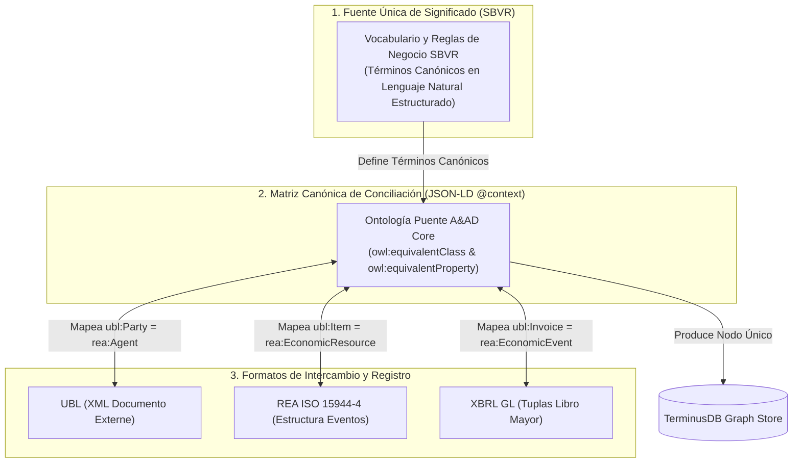

# Propuesta de Conciliación Semántica: SBVR, UBL y REA (ISO 15944-4) en A&AD

## *Eliminación de Redundancias mediante una Ontología Canónica Puente y Contexto JSON-LD*

---

## 1. El Diagnóstico: El Riesgo de la Duplicación Semántica

En los sistemas tradicionales que intentan unir múltiples estándares, surge un problema de redundancia:

* **UBL (OASIS)** define conceptos de negocio en XML (ej. `Party`, `Item`, `InvoiceLine`, `Price`).
* **REA (ISO 15944-4)** define los mismos conceptos en clave ontológica (ej. `Agent`, `Resource`, `EconomicEvent`, `Commitment`).
* **SBVR (OMG)** define vocabularios y hechos de negocio en lenguaje humano formal (ej. *"Supplier is a Party that provides a Resource"*).

Si no se realiza una **conciliación en la fuente (Shift-Left)**, el sistema termina creando tres representaciones paralelas para el mismo objeto del mundo real, inflando el grafo de conocimiento en TerminusDB con tripletas duplicadas y aumentando la complejidad de las consultas WOQL/SPARQL.

---

## 2. La Arquitectura de Conciliación A&AD: SBVR como la Fuente Única de Significado

Para resolver la duplicación, el framework **A&AD** establece un principio de jerarquía de capas:

$$\begin{matrix}
\text{\textbf{SBVR (OMG Standard)}} & \xrightarrow{\hspace{1cm}} & \text{\textbf{Matriz Canónica A&AD}} & \xrightarrow{\hspace{1cm}} & \text{\textbf{Grafo TerminusDB}} \\
\text{\small (Única Fuente de Significado)} & & \text{\small (owl:equivalentClass / JSON-LD)} & & \text{\small (Nodo Único Canónico)}
\end{matrix}$$



---

## 3. Matriz de Equivalencias y Conciliación

Mediante una capa de alineación OWL (`owl:equivalentClass` y `owl:equivalentProperty`) en el `@context` JSON-LD de A&AD, se reconcilian las entidades clave:

| Entidad de Negocio Canónica (SBVR) | Concepto en REA (ISO 15944-4) | Elemento en UBL 2.1 | Asiento en XBRL GL | Nodo Único en TerminusDB |
| :--- | :--- | :--- | :--- | :--- |
| **Sujeto / Agente de Negocio** | `rea:Agent` | `ubl:Party` / `ubl:AccountingSupplierParty` | `xbrlgl:identifier` | `urn:dfrnt:agent:{id}` |
| **Recurso / Bien o Servicio** | `rea:EconomicResource` | `ubl:Item` / `ubl:CommodityClassification` | `xbrlgl:account` / `resource` | `urn:dfrnt:resource:{id}` |
| **Hecho Económico / Transacción** | `rea:EconomicEvent` | `ubl:Invoice` / `ubl:DespatchAdvice` | `xbrlgl:entryHeader` | `urn:dfrnt:event:{id}` |
| **Compromiso / Contrato** | `rea:Commitment` / `ACTUS` | `ubl:Order` / `ubl:Contract` | `xbrlgl:entryDetail` (Condicional) | `urn:dfrnt:contract:{id}` |
| **Valoración / Moneda** | `rea:ResourceMeasure` | `ubl:PayableAmount` `@currencyID` | `xbrlgl:amount` | `urn:dfrnt:measure:{id}` |

---

## 4. Beneficios Tácticos para A&AD

1. **Eliminación de Tripletas Redundantes:** Al ingresar un documento UBL a DFRNT, el motor de ingesta no crea un objeto `UBL_Party` separado de un `REA_Agent`. Inyecta directamente el nodo unificado `urn:dfrnt:agent:{id}`.
2. **Reglas SBVR Directas sobre el Grafo:** Las reglas de negocio redactadas en SBVR (*"It is obligatory that every Agent has a valid TaxIdentifier"*) aplican de forma universal a UBL y REA por igual.
3. **Optimización de Consultas WOQL/SPARQL:** Las consultas de auditoría se simplifican enormemente al no tener que buscar alternativamente en tres vocabularios distintos.

---

## 5. Implementación en el Repositorio (`Shift Left/`)

En la estructura del repositorio GitHub (`AAxD / Shift Left`), la conciliación se materializa agregando el archivo de mapeo JSON-LD en la carpeta `SBVR/`:

```
Shift Left /
├── ISO 15944 /
├── SBVR /
│   ├── sbvr_business_vocabulary.sbvr       <-- Vocabulario Canónico
│   ├── sbvr_business_rules.sbvr            <-- Reglas en Lenguaje Estructurado
│   └── sbvr_ubl_rea_reconciliation.jsonld  <-- MATRIZ DE CONCILIACIÓN SEMÁNTICA
├── Ricordanze Plane /
└── ISO15944.sps
```
