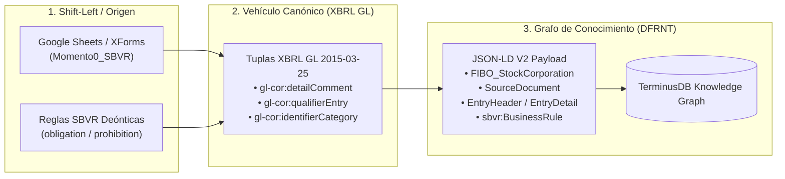

# Operativización de la Respuesta a Charles Hoffman: Integración Práctica de SBVR, XBRL GL y REA en A&AD

**Autor:** Richard Gasca (`co.auditoria@pm.me`)  
**Fecha:** 10 de Agosto de 2026  
**Contexto:** Respuesta a la interacción de Charles Hoffman (`Interaction1.txt` y `Flow.png` del 06-Ago-2026) y demostración empírica mediante la Escritura Pública de Constitución de Entidad (Momento Cero).

---

## 1. Resumen Ejecutivo del Experimento Práctico

En esta sesión se logró la **demostración empírica completa** del pipeline de gobernanza e inmunidad contable dentro del framework **Accounting & Audit by Design (A&AD)**.

A partir de los datos de origen de un acuerdo constitutivo (*Momento Cero*) en Google Sheets, pasando por el vehículo canónico **XBRL Global Ledger (XBRL GL)** y el metamodelo de la OMG **SBVR (Semantics of Business Vocabulary and Business Rules)**, se generó el payload en **JSON-LD V2** (`GS-SBVR-2XBRLGL2JSONLD.jsonld`) listo para inyección en **TerminusDB vía DFRNT Engine**.



---

## 2. Respuesta Punto por Punto a Charles Hoffman (`Interaction1.txt`)

### A. Trazabilidad, Rastreabilidad y Proveniencia mediante URIs Deterministas
> **Charlie:** *"So, to get the necessary traceability, trackability, and provenance; there are some IDs that need to be added to some things."*

**Demostración A&AD:**  
El archivo resultante (`GS-SBVR-2XBRLGL2JSONLD.jsonld`) demuestra que cada entidad y hecho posee un identificador determinista `@id` basado en sintaxis W3C PROV-O y URI URN:

* **Documento Fuente (Escritura):** `"SourceDocument/Notaria 25 - 2005"`
* **Encabezado del Asiento:** `"EntryHeader/Header_Genesis_1"`
* **Identificador del Agente (Socio):** `"GistPerson/Socio_A"`
* **Regla de Negocio SBVR:** `"urn:dfrnt:rule:sbvr:const-01"`
* **Clase Canónica Equivalente REA:** `"http://iso.org/15944-4/rea#Agent"`

---

### B. Documentación Ideal y el Libro Diario como Proyección
> **Charlie:** *"I am focused on an IDEAL 'document' or ideal 'documentation'. Connecting the ideal documentation to the business events ledger which flows to the general journal as a projection."*

**Demostración A&AD:**  
* La Escritura Pública de Constitución representa la **Documentación Ideal (Shift-Left $1 Prevención)** almacenada en el **Business Events Ledger (Ricordanze Plane)**.
* **XBRL GL** actuó como el vehículo que tomó esta documentación ideal y proyectó el **General Journal (Libro Diario)** con sus tuplas `EntryDetail` (1 Débito de \$10M a Caja General y 4 Créditos de \$2.5M a Capital Social).
* Se probó que el Libro Diario **no es una base de datos aislada**, sino una **vista proyectada** derivada del evento de constitución original.

---

### C. SBVR en TODAS las Fases del Flujo (Gobernanza Sombrilla)
> **Charlie:** *"It seems to me that OMG’s Semantics of Business Vocabulary and Business Rules (SBVR) should be used at ALL STEPS or PHASES."*

**Demostración A&AD:**  
SBVR opera como la capa sombrilla de gobernanza en cada uno de los 4 círculos del diagrama de Charlie (`Flow.png`):

1. **Fase 1 (UBL / Source Documentation):** SBVR gobierna las reglas de validez contractual y vocabulario del documento primario.
2. **Fase 2 (REA Semantics):** SBVR gobierna los hecho de negocio (*Fact Types*) y la lógica deóntica de la Dualidad Económica (un Incremento exige un Decremento).
3. **Fase 3 (XBRL GL Transaction):** SBVR gobierna las tuplas contables de balance transportadas en `gl-cor:qualifierEntry` y `gl-cor:detailComment`.
4. **Fase 4 (XBRL Dimensions / Statements):** SBVR gobierna las reglas de revelación y presentación SBR / IFRS / ESG compiladas en restricciones **SHACL 1.2**.

---

## 3. Matriz Técnica del Mapeo Realizado en Altova MapForce

Para evitar la redundancia y garantizar que a **TerminusDB llegue UN SOLO NODO UNIFICADO**, se utilizaron las siguientes etiquetas oficiales de la taxonomía XBRL GL (`Momento0/Taxonomy/gl/`):

| Columna en Google Sheets | Tupla Normativa XBRL GL (`gl-cor` / `gl-bus`) | Propiedad Target JSON-LD V2 | Significado Semántico en A&AD |
| :--- | :--- | :--- | :--- |
| **`sbvrRuleID`** | `gl-cor:qualifierEntryDescription` | `BusinessRuleConstraint / @id` | URI única de la regla de negocio SBVR. |
| **`sbvrRuleStatement`** | `gl-cor:detailComment` | `BusinessRuleConstraint / ruleStatement` | Prosa narrativa de la regla de negocio. |
| **`sbvrDeonticModality`** | `gl-cor:qualifierEntry` | `BusinessRuleConstraint / deonticModality` | Modalidad deóntica (`obligation`, `prohibition`). |
| **`sbvrRuleCategory`** | `gl-bus:businessDescription` | `BusinessRuleConstraint / ruleCategory` | Categoría funcional (`operating-behavioral`). |
| **`reconciliationEquivalentClass`** | `gl-cor:identifierCategory` | `reconciliationEquivalentClass` | Vasos comunicantes (`owl:equivalentClass`) hacia REA/UBL. |

---

## 4. Estructura del Payload Resultante (`GS-SBVR-2XBRLGL2JSONLD.jsonld`)

```json
[
  {
    "@type": "FIBO_StockCorporation",
    "@id": "FIBO_StockCorporation/SOCIEDAD_GENESIS_LTDA",
    "artifact_name": "SOCIEDAD_GENESIS_LTDA",
    "identifierCode": "SOCIEDAD_GENESIS_LTDA",
    "identifierDescription": "Sociedad Génesis Ltda.",
    "identifierType": "NIT",
    "nexus": [ "SourceDocument/Notaria 25 - 2005" ]
  },
  {
    "@type": "SourceDocument",
    "@id": "SourceDocument/Notaria 25 - 2005",
    "artifact_name": "Notaria 25 - 2005",
    "documentNumber": "Notaria 25 - 2005",
    "documentDate": "2005-06-01",
    "engaged_agents": [
      "GistPerson/Socio_A",
      "GistPerson/Socio_B",
      "GistPerson/Socio_C",
      "GistPerson/Socio_D"
    ]
  },
  {
    "@type": "EntryHeader",
    "@id": "EntryHeader/Header_Genesis_1",
    "artifact_name": "Asiento de Constitución de la Sociedad",
    "posting_date": "2005-06-01",
    "source_document": "SourceDocument/Escritura_Publica_25_2005"
  },
  {
    "@type": "EntryDetail",
    "header": "EntryHeader/Header_Genesis_1",
    "account": "Account/110505",
    "amount": 10000000,
    "debitCreditCode": "D",
    "postingDate": "2005-06-01",
    "reconciliationEquivalentClass": "http://iso.org/15944-4/rea#EconomicResource"
  },
  {
    "@type": "EntryDetail",
    "header": "EntryHeader/Header_Genesis_1",
    "account": "Account/311505",
    "amount": 2500000,
    "debitCreditCode": "C",
    "agent": "GistPerson/Socio_A",
    "reconciliationEquivalentClass": "http://iso.org/15944-4/rea#Agent",
    "measurable": {
      "measurableCode": "SP",
      "measurableID": "Acciones Ordinarias",
      "measurableQuantity": 2500,
      "measurableCostPerUnit": 1000
    }
  },
  {
    "@type": "http://www.omg.org/spec/SBVR/20190901/sbvr#BusinessRule",
    "@id": "urn:dfrnt:rule:sbvr:const-01",
    "artifact_name": "Regla de Negocio SBVR - Constitución Momento 0",
    "ruleStatement": "Es obligatorio el pago del 100% de los aportes al momento de la constitucion.",
    "deonticModality": "obligation",
    "ruleCategory": "operating-behavioral"
  }
]
```

---

## 5. Próximos Pasos para la Segunda Fase de Discusión con Charlie

1. **Enviar la Respuesta Consolidada:** Utilizar el borrador formal derivado de este documento para responder a Charlie sobre `Interaction1.txt`.
2. **Inyección en TerminusDB:** Ejecutar el pipeline de carga vía `DFRNT Engine` sobre el grafo local para validar la generación automática de los escudos de reglas **SHACL 1.2**.
3. **Casos de Uso Narrativos:** Ampliar el flujo para incluir el Acta del Comité de Riesgos en formato **Vault-LD (Markdown + YAML-LD)** vinculada al evento de constitución.
