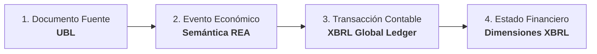

# Propuesta de Respuesta a Charles Hoffman ("Charlie"): Teoría de la Documentación, UBL, XBRL GL y SBVR

## *Respuesta Arquitectónica del Framework A&AD (Richard Gasca & DFRNT)*

**Contexto:** Respuesta al correo de Charlie del 6 de agosto de 2026 sobre la interacción de **UBL**, **REA**, **XBRL GL**, **XBRL Dimensions** y el rol universal de **SBVR**.

---

## 1. El Diagrama de Flujo de Charlie (`Flow.png`)



---

## 2. Los 4 Puntos Clave planteados por Charlie y la Respuesta A&AD

### Punto 1: Identificadores Deterministas para Trazabilidad, Rastreabilidad y Proveniencia (PROV-O)

> **Planteamiento de Charlie:** *"To get the necessary traceability, trackability, and provenance; there are some IDs that need to be added to some things. Connecting the ideal documentation to the business events ledger which flows to the general journal as a projection."*

**Respuesta de A&AD:**
* **Coincidencia Total:** En A&AD, el Libro Diario General (*General Journal*) no es una base de datos física primaria; es una **proyección (vista)** derivada del *Business Events Ledger* (**Ricordanze Plane**).
* **Cadena de URIs Deterministas (`@id`):** Para garantizar la proveniencia **W3C PROV-O** a lo largo del flujo sin romper la idempotencia en TerminusDB, asignamos identificadores unívocos deterministas (basados en hashes del hecho económico):
  $$\text{URI}_{\text{UBL Document}} \xrightarrow{\text{prov:wasDerivedFrom}} \text{URI}_{\text{REA Event}} \xrightarrow{\text{prov:wasDerivedFrom}} \text{URI}_{\text{XBRL GL Entry}} \xrightarrow{\text{prov:wasDerivedFrom}} \text{URI}_{\text{XBRL Statement}}$$

---

### Punto 2: Caracterización y Roles de UBL vs. XBRL Global Ledger

> **Planteamiento de Charlie:** *"So how would you characterize how UBL and how XBRL Global Ledger are used?"*

**Respuesta de A&AD:**
* **UBL (Universal Business Language) — La Evidencia Probatoria Externa ($1 Prevención / Shift-Left):**
  * Representa el acuerdo comercial entre dos Agentes de Negocio independientes (B2B / B2G).
  * Es la **Primera Capa Semántica** (factura, orden de compra, despacho). Contiene la evidencia legal, la estructura y los términos del contrato de origen.
* **XBRL GL (Global Ledger) — La Normalización y Transporte Contable Interno:**
  * Representa la traducción del hecho económico al lenguaje del libro mayor y auxiliares contables.
  * Captura las tuplas contables (`entryHeader`, `entryDetail`, `account`, `amount`, `identifier`) vinculando las cuentas del plan contable (PUC / IFRS) con los agentes y recursos.
* **Mapeo A&AD:** Usamos **Altova MapForce** para transmutar la estructura UBL hacia **XBRL GL en formato JSON-LD**, inyectando el resultado al grafo de **TerminusDB vía DFRNT**.

---

### Punto 3: SBVR (OMG Standard) en TODAS las Fases del Flujo

> **Planteamiento de Charlie:** *"It seems to me that OMG’s Semantics of Business Vocabulary and Business Rules (SBVR) should be used at ALL STEPS or PHASES. Seems like workflow is a separate system."*

**Respuesta de A&AD:**
* **Validación Total:** SBVR **debe estar presente en las 4 fases**, actuando como el **vocabulario ontológico unificado y diccionario de reglas de negocio**:
  1. **Fase UBL (Documento):** SBVR define los términos de negocio y restricciones del contrato primario.
  2. **Fase REA (Evento):** SBVR define los axiomas de la Dualidad Económica (*"Todo incremento de Recurso exige un decremento equivalente"*).
  3. **Fase XBRL GL (Transacción):** SBVR define las reglas de balance y partida doble/múltiple.
  4. **Fase XBRL Dimensions (Reporte):** SBVR define las reglas de revelación y presentación regulatoria (SBR / IFRS / ESG).
* **El Workflow como Sistema Separado:** Charlie acierta al separar el *Workflow* (flujo de trabajo operativo / BPMN) del *Sistema de Reglas* (SBVR). El Workflow gestiona la ejecución y el estado operacional; **SBVR gestiona el significado y las invariantes lógicas**.

---

## 3. Borrador de Correo Electrónico para Enviar a Charlie

```text
Subject: Re: Theory of Documentation & Flow Analysis

Hi Charlie,

Thank you for this essential feedback. Your diagram perfectly captures the semantic pipeline, and I fully agree with your observations:

1. Provenance & Deterministic IDs:
You are spot on: the General Journal is indeed a projection derived from the Business Events Ledger (Ricordanze Plane). In our A&AD architecture, we implement deterministic URIs (@id) at each stage—from the source UBL document to the REA Event, the XBRL GL entry, and the final XBRL Dimension report—using W3C PROV-O to ensure end-to-end auditability.

2. UBL vs. XBRL GL Characterization:
- UBL serves as the External Probative Evidence (the $1 Shift-Left prevention layer), capturing the legal and commercial agreement between independent agents.
- XBRL GL serves as the Internal Accounting Normalization vehicle, mapping those economic events directly into structured ledger entries (entryHeader, entryDetail, accounts, amounts).
Altova MapForce handles the lossless transmutation from UBL to XBRL GL JSON-LD payloads for TerminusDB injection via DFRNT.

3. SBVR Across ALL Phases:
I completely agree that OMG's SBVR must govern ALL four phases. SBVR provides the business vocabulary and logical invariants—from UBL document rules and REA duality axioms to XBRL GL balance constraints and XBRL Dimension reporting rules. Separating workflow (execution state) from SBVR (business semantics and rules) is architecturally critical.

We have integrated SBVR into our Shift-Left repository to ensure business rules remain human-readable by accountants while compiling directly into SHACL 1.2 validation rules for TerminusDB.

Best regards,

Richard Gasca
A&AD Framework / DFRNT
```
