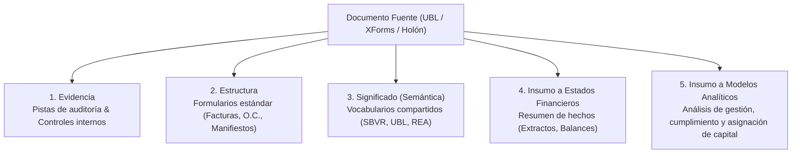
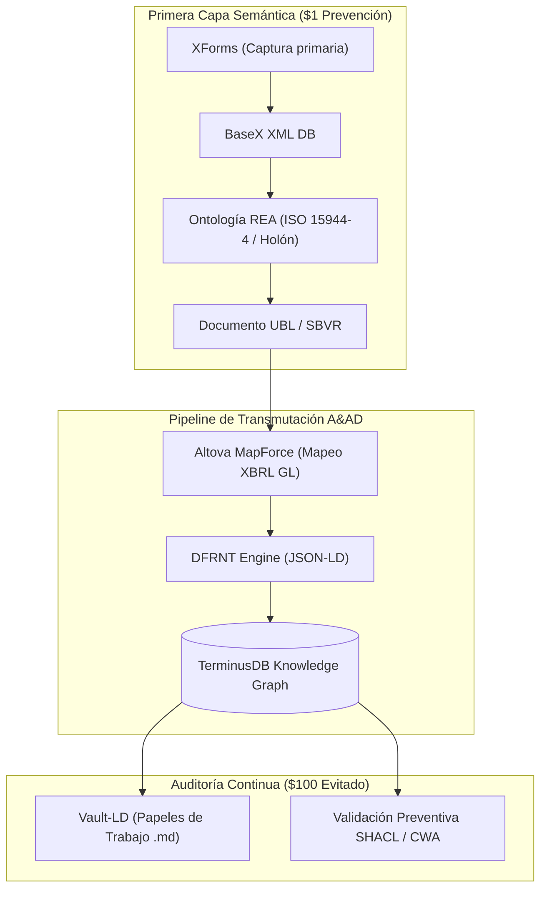

# Análisis Estratégico: "Theory of Documentation" & la Regla 1-10-100
## *Respuesta de Charles Hoffman ("Charlie") al primer eslabón semántico en la cadena de reporte contable*

**Fuente:** Correo Electrónico de Charles Hoffman (06 de Agosto de 2026)  
**Destinatarios:** Grupo Internacional de Estándares Semánticos (Peter Rivett, Cory Casanave, Dave McComb, Alan Morrison, Richard Gasca, Jonathan Schmidt, Philippe Höij, etc.)  
**Documento PDF:** [Teory of Documentation.pdf](file:///C:/Users/IPHIX/Documents/Projects/DFRNT/Documentacion/Charles%20Hoffman/Mail/2026-08-06/Teory%20of%20Documentation.pdf)  
**Blog de Charlie:** `https://digitalfinancialreporting.blogspot.com/2026/08/theory-of-documentation.html`  
**Video de YouTube Referenciado:** `https://youtu.be/ks8ZUNu7bjs` (La Regla 1-10-100 de Calidad de Datos)

---

## 1. La Tesis Central de Charlie

Charlie establece una máxima fundamental sobre la arquitectura de información empresarial:

> *"Los documentos y la documentación que contienen son el puente entre la realidad económica y la representación del sistema contable. La auditoría consiste en asegurar que la interpretación del sistema contable sea consistente con las especificaciones regulatorias.*  
> **Los documentos son la PRIMERA CAPA SEMÁNTICA en la cadena que finalmente produce los estados financieros, analíticas y reportes de cumplimiento.**  
> *Si esta primera capa es subóptima, habrá un impacto negativo en todo lo demás aguas abajo (downstream). Resulta evidente que querrás hacer bien esa primera capa desde el principio."*

---

## 2. Las 5 Funciones del Documento en la "Teoría de la Documentación"

Charlie plantea una pregunta crítica: **¿Realmente queremos tener dos versiones de los documentos fuente cuando eso puede ser evitado?** (Refiriéndose a la duplicidad entre el documento físico/PDF y la transcripción manual en el ERP).

Un documento estructurado semánticamente proporciona 5 funciones inseparables:

1. **Evidencia (*Evidence*):** Soporte inalterable para pistas de auditoría (*audit trails*) y controles internos.
2. **Estructura (*Structure*):** Formularios estandarizados (facturas UBL, órdenes de compra, conocimientos de embarque) que organizan la información comercial de forma consistente.
3. **Significado (*Meaning*):** Semántica estándar basada en **SBVR** (*Semantics of Business Vocabulary and Business Rules*) y **UBL** que definen vocabularios interoperables.
4. **Insumo para Estados Financieros (*Input to Financial Statements*):** Documentos que resumen el estado de hechos económicos.
5. **Insumo para Modelos Analíticos (*Input to Financial Analysis Models*):** Capacidad final de auditar, analizar y tomar decisiones de capital en tiempo real.

---

## 3. La Regla 1-10-100 aplicada a la Contabilidad y Auditoría (Shift-Left)

Charlie conecta la Teoría de la Documentación con la famosa **Regla 1-10-100 de la Calidad de Datos (Roland Thomas & Yu June Park, 1992)**:

$$\begin{matrix}
\mathbf{\$1} & \xrightarrow{\hspace{1cm}} & \mathbf{\$10} & \xrightarrow{\hspace{1cm}} & \mathbf{\$100} \\
\text{\textbf{Costo de Prevención}} & & \text{\textbf{Costo de Remediación}} & & \text{\textbf{Costo de Falla Total}} \\
\text{(Validación en el Origen/Documento)} & & \text{(Asientos de Ajuste / Conciliaciones)} & & \text{(Fraudes, Multas, Juicios, Re-emisión)}
\end{matrix}$$

* **$1 — Costo de Prevención (Shift-Left / A&AD):** Validar la semántica y las reglas de negocio **en el documento primario** (en el *Momento Cero* de la transacción). Si el documento nace matemáticamente y semánticamente correcto, el costo de garantizar calidad es \$1.
* **$10 — Costo de Remediación (Contabilidad Tradicional):** Corregir errores cuando ya ingresaron a la base de datos relacional del ERP. Requiere conciliaciones bancarias exhaustivas, asientos de ajuste al final del mes y discusiones interminables entre departamentos.
* **$100 — Costo de Falla (El Colapso / Auditoría Forense):** Sufrir el error cuando ya fue publicado en los estados financieros o reportes fiscales. Incluye sanciones de entes reguladores (DIAN, SEC, IRS), pérdida de reputación, disputas legales y auditorías forenses costosas.

---

## 4. Acople Perfecto con el Framework A&AD (Accounting & Audit by Design)

La tesis de Charlie en este correo confirma y valida la arquitectura de **A&AD**:

### 1. El Documento como "Holón" de Información Única
A&AD elimina la necesidad de tener "dos versiones del documento". La captura en **XForms/BaseX** tratada como un **Holón** según **ISO 15944-4 (REA)** encapsula la evidencia, estructura y significado en un solo objeto semántico.

### 2. Eliminación del Costo de $10 y $100 mediante SHACL y SHIFT-LEFT
Al ejecutar las reglas **SHACL 1.2** e **ISO 21378** en la ingesta previa a **TerminusDB vía DFRNT**, A&AD aplica la regla de **$1 de prevención**. La máquina rechaza cualquier documento que no cumpla con la validez semántica en la primera capa, haciendo que los errores de $10 y $100 sean **imposibles por diseño**.

### 3. Del Documento Fuente (UBL/SBVR) a los Papeles de Trabajo (Vault-LD)
La primera capa semántica (el documento fuente) se inyecta en el grafo en TerminusDB, y los hallazgos de los auditores o Agentes IA se anclan mediante **Vault-LD (Tony Seale)**. Se logra así la trazabilidad continua (*end-to-end audit trail*) que Charlie exige para conectar la realidad económica con el reporte final.
