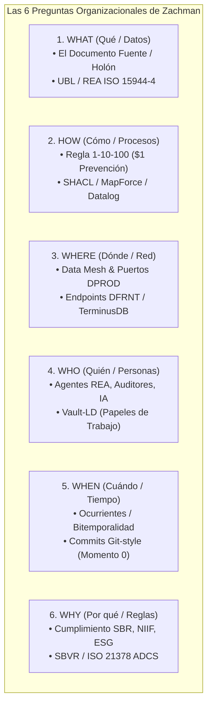

# Mapeo de la Teoría de la Documentación en la Arquitectura de Zachman de A&AD

## *Integración del Marco de Zachman, la Pila Semántica TBL y la Regla 1-10-100 de Charles Hoffman*

---

## 1. Contexto Arquitectónico

El framework **A&AD (Accounting & Audit by Design)** fundamenta su gobernanza en el **Atlas de Referencia A&AD** (*A&AD Reference Atlas*), el cual realiza la fusión semántica entre:
1. **El Marco de Arquitectura Empresarial de Zachman** (6 Interrogativas / Columnas y 6 Niveles de Abstracción / Filas).
2. **La Pila de la Web Semántica de Tim Berners-Lee** (RDF, OWL, SHACL, Pruebas Criptográficas, Capa de Confianza).
3. **La Teoría de la Documentación de Charles Hoffman** (Correo del 6-Ago-2026 y la Regla 1-10-100 de Calidad de Datos).

---

## 2. Las 6 Columnas de Zachman mapeadas a la Teoría de la Documentación



| Columna Zachman | Teoría de la Documentación (Charlie) | Implementación en A&AD / DFRNT |
| :--- | :--- | :--- |
| **1. WHAT (Qué / Datos)** | **El Documento Fuente como Holón:** La primera capa semántica que captura el hecho económico de forma indivisible. | Módulos `ISO 21378` (ADCS), vocabularios `UBL` y nodos `JSON-LD` mapeados a la ontología REA. |
| **2. HOW (Cómo / Función)** | **Prevención de $1 (Shift-Left):** La ejecución de reglas de calidad en el momento del origen para evitar el error de $10 y $100. | Transmutación en Altova MapForce, validación estricta **SHACL 1.2** y reglas Datalog (`shrl`). |
| **3. WHERE (Dónde / Red)** | **La Malla de Datos (Data Mesh):** La eliminación de silos y carpetas aisladas de datos y documentos. | Contenedores `dprod:DataProduct` expuestos vía los puertos de lectura/escritura del **Engine DFRNT**. |
| **4. WHO (Quién / Personas)** | **Evidencia y Papeles de Trabajo Vivos:** La articulación entre el análisis humano/IA y el dato frío. | Documentos `.md` con **YAML-LD (Vault-LD)** y proveniencia **W3C PROV-O** inyectados a TerminusDB. |
| **5. WHEN (Cuándo / Tiempo)** | **Pistas de Auditoría Inmutables:** El registro bitemporal del momento exacto del hecho económico. | Congelamiento del *Momento 0* y control de versiones tipo Git en el grafo de **TerminusDB**. |
| **6. WHY (Por qué / Reglas)** | **Significado y Reglas de Negocio (SBVR):** La alineación estricta del documento con el marco regulatorio. | Taxonomías SBR / XBRL GL SRCD, normas NIIF/IFRS y estándares ESG (ESRS/GRI). |

---

## 3. Las 6 Filas de Zachman y la Regla 1-10-100 (Shift-Left)

El marco de Zachman organiza los niveles de abstracción de arriba a abajo. La **Regla 1-10-100** de Charlie demuestra que la calidad se determina en las filas superiores (Fila 1 a 3), evitando el colapso operativo en la Fila 6:

```
FILA ZACHMAN                                 TEORÍA DE LA DOCUMENTACIÓN Y REGLA 1-10-100
───────────────────────────────────────────────────────────────────────────────────────────────────
Fila 1: Visión Contextual (Planificador)  ──> Definición de Objetivos y Doble Materialidad (Financiera + ESG).
Fila 2: Modelo de Negocio (Dueño)         ──> Vocabulario de Negocio (SBVR) & Ontología REA (ISO 15944-4).
Fila 3: Modelo del Sistema (Diseñador)     ──> $1 PREVENCIÓN: Formulario Estándar (UBL / ISO 21378 ADCS).
Fila 4: Modelo Tecnológico (Constructor) ──> $10 REMEDIACIÓN EVITADA: Esquemas XSD, MapForce, TerminusDB.
Fila 5: Modelo de Componentes (Subcontrat)──> Instancias JSON-LD, Tripletas RDF y Papeles Vault-LD (.md).
Fila 6: Sistema Operativo (Usuario)        ──> $100 FALLA TOTAL ELIMINADA: Auditoría Continua 24/7.
```

### A. $1 — Costo de Prevención (Filas 2 y 3 - Capa de Diseño Semántico)
Si la regla de negocio (SBVR/REA) y el modelo de documento (UBL/ISO 21378) están bien diseñados en las Filas 2 y 3 de Zachman, la máquina valida la transacción **antes de escribirla en el libro mayor**. El costo de calidad es de **$1**.

### B. $10 — Costo de Remediación (Fila 4 - Capa de Base de Datos / ERP)
Si el documento fuente se captura mal, la Fila 4 (el ERP relacional) almacena datos basura. Corregir esto requiere conciliaciones, hojas de Excel y asientos de ajuste contable. El costo sube a **$10**.

### C. $100 — Costo de Falla Total (Fila 6 - Capa Operativa y Regulatoria)
Si los datos erróneos llegan a la Fila 6 (el informe financiero o fiscal publicado), la organización sufre auditorías forenses, sanciones reguladoras y pérdidas de reputación. El costo escala a **$100**.

---

## 4. Conclusión para la Arquitectura A&AD

El acople entre la **Teoría de la Documentación de Charlie** y la **Arquitectura de Zachman** demuestra que **A&AD** no es un conjunto de tecnologías dispersas:

> *"A&AD es la implementación de la matriz de Zachman donde cada columna (Qué, Cómo, Dónde, Quién, Cuándo, Por qué) está gobernada por la Web Semántica, asegurando que la primera capa semántica (el documento fuente en $1) sea matemáticamente incorruptible desde el origen."*
