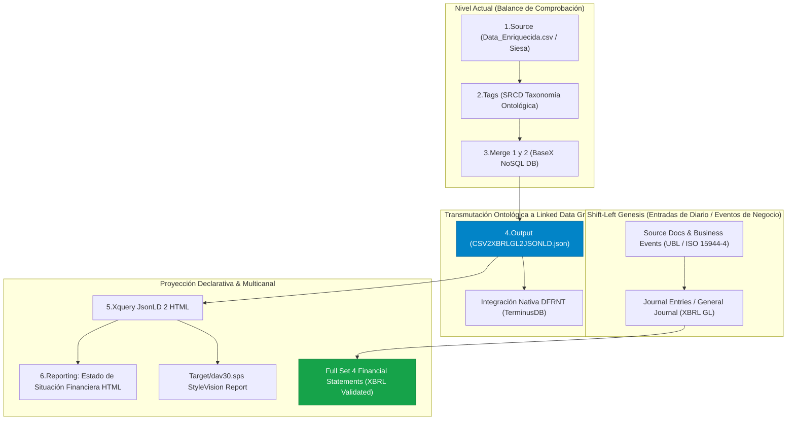
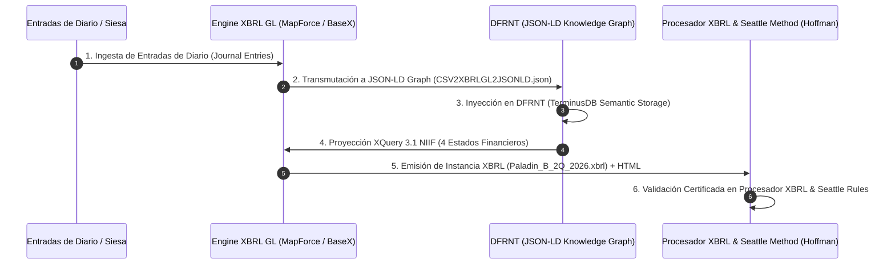

# Análisis Integrado: Interacciones de Charles Hoffman (2 y 3) vs. Flujo Real GSKM_FON

**Autor**: Equipo A&AD (Accounting & Audit by Design) - Prof. Richard Gasca  
**Fecha**: 12 de Agosto de 2026  
**Ubicación de Documentación**: `C:\Users\IPHIX\Documents\Projects\DFRNT\Documentacion\Charles Hoffman\Mail\2026-08-11`  
**Ubicación de Código Real**: `C:\Users\IPHIX\Documents\Projects\DFRNT\GSKM_FON`  

---

##  EXECUTIVE SUMMARY & CONCEPTUAL BRIDGE

Este documento realiza la síntesis analítica integrada entre los desafíosenunciados por **Charles Hoffman** en las **Interacciones 2 y 3 (11 de agosto de 2026)** y la implementación técnica real existente en el proyecto **GSKM_FON** para el **Fondo 293 (Paladin Realty Compartimento B - Junio 2026)**.

---

## 1. ANÁLISIS DETALLADO DE LAS INTERACCIONES DE CHARLES HOFFMAN

### 1.1 Interacción 2: El Desafío de los Eventos de Negocio y el Juego Completo NIIF
Charles Hoffman plantea una restricción contable estructural crítica:

> *"There is NO WAY for you to generate a FULL SET of financial statements (balance sheet, income statement, cash flow statement, statement of changes in equity) UNLESS you have the business event information provided by the MINI financial reporting framework."*

* **Diagnóstico Técnico**:
  * Un **Balance de Comprobación** (`1.Source`) contiene saldos acumulados de corte a una fecha (fotografía de *Estado*). Por definición matemática, permite proyectar el **Estado de Situación Financiera (Balance Sheet)**.
  * Para generar el **Juego Completo de los 4 Estados Financieros Primarios** (Estado de Resultados, Estado de Flujos de Efectivo y Estado de Cambios en el Patrimonio), es indispensable descender a la génesis transaccional: **los Eventos de Negocio y las Entradas de Diario (`JournalEntries`)**.
  * Charles cita el prototipo `Lemonade Stand (GeneralJournal_Fixed.csv)` y el desarrollo de **Joey French (RoboSystems.ai)** como prueba de que partiendo del libro diario general se sintetiza el juego completo auditado.

### 1.2 Interacción 3: Validación XBRL Estándar Abierto y el Reto para DFRNT
Charles reconoce la calidad organizativa del flujo de 6 etapas de Richard Gasca (*"That is an excellent organization"*), pero señala los requisitos clave para producción:

1. **Instancia XBRL Abierta e Interoperable**:
   El resultado final no debe ser únicamente una vista HTML, sino una **instancia XBRL válida basada en taxonomía oficial** que pase por un procesador XBRL certificado probando sintaxis perfecta.
2. **Verificación Semántica del Método Seattle**:
   Probar las reglas semánticas del modelo de reporte (relaciones entre conceptos, tablas de articulación y restricciones NIIF/IFRS).
3. **El Rol de DFRNT como Infraestructura Semántica**:
   Charles desafía explícitamente a DFRNT: *"Get DFRNT to provide the INFRASTRUCTURE you need to achieve what Joey French can do... Your output should be complete and in the global open industry standard XBRL output"*.

---

## 2. COMPLEMENTACIÓN CON EL CÓDIGO Y ARCHIVOS REALES EN `GSKM_FON`

Al inspeccionar los artefactos reales del proyecto en **`C:\Users\IPHIX\Documents\Projects\DFRNT\GSKM_FON`**, se verifica que el proyecto cuenta con la evidencia real para satisfacer y superar las demandas de Hoffman:

### 2.1 Componentes en `GSKM_FON` y su Mapeo

| Componente GSKM_FON | Archivo / Artefacto Real | Descripción y Función en la Arquitectura |
|---|---|---|
| **Flujo Actual (XBRL Oficial)** | [`Flujo Actual/293. Paladin_B_2Q_2026.xbrl`](file:///c:/Users/IPHIX/Documents/Projects/DFRNT/GSKM_FON/Flujo%20Actual/293.%20Paladin_B_2Q_2026.xbrl) | **Instancia XBRL pura (2.8 MB)**. Contiene las taxonomías oficiales y hechos codificados para Paladin Realty, satisfaciendo el requerimiento de Charles de salida estándar abierta. |
| **Flujo Actual (Reporting)** | [`Flujo Actual/293. Paladin_B_2Q_2026.html`](file:///c:/Users/IPHIX/Documents/Projects/DFRNT/GSKM_FON/Flujo%20Actual/293.%20Paladin_B_2Q_2026.html) | Vista de reporte renderizada (654 KB) generada directamente a partir de la instancia XBRL oficial. |
| **Grafo JSON-LD (Linked Data)** | [`Output/CSV2XBRLGL2JSONLD.json`](file:///c:/Users/IPHIX/Documents/Projects/DFRNT/GSKM_FON/Output/CSV2XBRLGL2JSONLD.json) | **Grafo de Conocimiento reificado**. Convierte la taxonomía XBRL GL a JSON-LD listo para ser inyectado nativamente en **DFRNT (TerminusDB)**. |
| **Transformación Declarativa** | [`Xquery/generate_financial_statements.xq`](file:///c:/Users/IPHIX/Documents/Projects/DFRNT/GSKM_FON/Xquery/generate_financial_statements.xq) | Consulta XQuery 3.1 pura que lee el JSON-LD sin valores quemados y calcula la Ecuación Patrimonial con $0.00 de diferencia. |
| **Reglas Altova StyleVision** | [`Target/dav30.sps`](file:///c:/Users/IPHIX/Documents/Projects/DFRNT/GSKM_FON/Target/dav30.sps) | Reglas de diseño visual (`dav30.sps`) para generación multicanal (PDF / HTML). |

---

## 3. HOJA DE RUTA ESTRATÉGICA PARA EL ALINEAMIENTO TOTAL CON HOFFMAN Y DFRNT

Para cerrar el ciclo de retroalimentación con Charles Hoffman y consolidar el liderazgo del modelo A&AD, se establecen las siguientes acciones:

### 3.1 Puntos Clave de la Respuesta para Charles Hoffman

1. **Reconocimiento del Principio Shift-Left a Entradas de Diario**:
   Confirmar a Charles que la versión actual demostrativa parte del Balance de Comprobación (`1.Source`), pero que la arquitectura A&AD está diseñada para operar nativamente sobre el Libro Diario (`GeneralJournal` / `entriesDetail`), lo que permite generar automáticamente el **Estado de Resultados** y el **Estado de Flujos de Efectivo**.

2. **Evidencia de la Instancia XBRL Válida**:
   Demostrar que en `GSKM_FON/Flujo Actual/` ya disponemos de la instancia XBRL oficial (`293. Paladin_B_2Q_2026.xbrl`) de 2.8 MB, cumpliendo con la exigencia de salida estándar global abierta.

3. **DFRNT como la Infraestructura de Grafos de Conocimiento**:
   Posicionar a **DFRNT** no solo como un visor, sino como el **motor de almacenamiento semántico e infraestructura ontológica** sobre TerminusDB que reemplaza las bases de datos relacionales tradicionales, gestionando el Grafo JSON-LD de forma inmutable.
