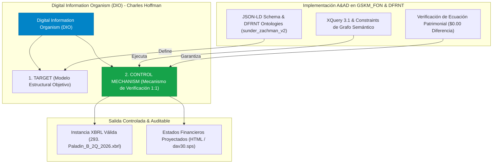

# Análisis Estratégico: Interacción 4 de Charles Hoffman - Digital Information Organism (DIO) & Estructuras de Control

**Autor**: Equipo A&AD (Accounting & Audit by Design) - Prof. Richard Gasca  
**Fecha**: 12 de Agosto de 2026  
**Ubicación de Documentación**: `C:\Users\IPHIX\Documents\Projects\DFRNT\Documentacion\Charles Hoffman\Mail\2026-08-11`  
**Archivo Analizado**: [`Interaccion4.txt`](file:///C:/Users/IPHIX/Documents/Projects/DFRNT/Documentacion/Charles%20Hoffman/Mail/2026-08-11/Interaccion4.txt)  

---

## 1. SÍNTESIS DE LA INTERACCIÓN 4

En su cuarto correo, Charles Hoffman introduce lo que denomina la **piezas final del rompecabezas (*the final piece of the puzzle*)**: las **"Estructuras" (Structures)**, materializadas formalmente mediante el concepto del **Organismo de Información Digital (Digital Information Organism - DIO)**.

### 1.1 Premisas Fundamentales Planteadas por Hoffman

1. **La Estructura como Elemento Central**:
   No basta con generar hechos numéricos aislados o líneas de reporte. Todo reporte XBRL requiere una **Estructura Ontológica Formal** que defina las relaciones jerárquicas, tablas, conceptos y notas.
2. **Doble Función del Organismo de Información Digital (DIO)**:
   * **Como TARGET (Objetivo)**: Es la especificación del modelo de informe esperado (las 4 declaraciones financieras primarias y las revelaciones cuantitativas y cualitativas).
   * **Como CONTROL MECHANISM (Mecanismo de Control)**: Es el arnés de verificación semántica que demuestra que la salida generada coincide 1:1 con la estructura objetivo sin desvíos (*"proves you hit the target"*).
3. **Imperativo de Control**:
   *"You cannot simply output something and not 'control' it."* No es aceptable emitir reportes en un sistema de producción sin tener un mecanismo de control declarativo que certifique la corrección del modelo.

---

## 2. CONEXIÓN Y ALINEACIÓN CON LA ARQUITECTURA A&AD & DFRNT

El concepto de **Digital Information Organism (DIO)** de Hoffman se alinea perfectamente con la visión de **Accounting & Audit by Design (A&AD)** respaldada por la infraestructura semántica de **DFRNT**:

| Concepto DIO (Hoffman) | Equivalente A&AD / DFRNT en GSKM_FON | Función de Control y Verificación |
|---|---|---|
| **DIO como TARGET (Objetivo)** | **JSON-LD Schema (`sunder_zachman_dfrnt_instances_v2.schema.json`) & Taxonomía SRCD** | Define la estructura de clases (`EntryHeader`, `EntryDetail`), propiedades, URIs (`@id`) y ontologías NIIF/PUC esperadas. |
| **DIO como CONTROL MECHANISM** | **Validación Semántica XQuery 3.1 & Motor de Grafos DFRNT (TerminusDB)** | Verifica que la Ecuación Patrimonial ($\text{Activos} = \text{Pasivos} + \text{Patrimonio}$) sea $0.00$ y que las relaciones de enlace respeten la partida doble y la integridad de nodos. |
| **Generación Controlada XBRL/HTML** | **Instancia XBRL (`Paladin_B_2Q_2026.xbrl`) & Renderizado SPS (`dav30.sps`)** | La salida producida no es un texto arbitrario, sino un objeto controlado por el esquema semántico. |

---

## 3. PROPUESTA DE RESPUESTA PARA CHARLES HOFFMAN (INTERACCIÓN 4)

A continuación se presenta el borrador de respuesta para enviar a Charles Hoffman abordando su planteamiento sobre el **Digital Information Organism**:

### English Version (Official Email Dispatch)

Dear Charlie,

Thank you for sending your insight on **Structures** and the **Digital Information Organism (DIO)**. Your distinction between the DIO as both the **TARGET** and the **CONTROL MECHANISM** hits the exact core of what we are building with **Accounting & Audit by Design (A&AD)**.

I completely agree: *you cannot simply output financial data without a formal control mechanism that proves you hit the structural target 1:1*.

Here is how our **A&AD + DFRNT architecture** operationalizes the Digital Information Organism concept:

1. **The Graph Schema as the TARGET**:
   In our pipeline, the **JSON-LD Schema** (`sunder_zachman_dfrnt_instances_v2.schema.json`) and the SRCD/XBRL GL taxonomy ontology act as the structural TARGET. They define the class hierarchies (`EntryHeader`, `EntryDetail`), mandatory properties, URI identity nodes (`@id`), and NIIF reporting concepts.

2. **DFRNT & Declarative XQuery as the CONTROL MECHANISM**:
   The control mechanism is enforced natively through **DFRNT (TerminusDB semantic graph engine)** and our **XQuery 3.1 validation logic**. Before any HTML or XBRL output is rendered, the system validates:
   * Graph node integrity and double-entry links.
   * Semantic compliance with the reporting framework.
   * **Mathematical perfection of the accounting equation** ($\text{Assets} = \text{Liabilities} + \text{Equity}$ to $\$0.00$ difference).

3. **Guaranteed Controlled Output & Financial Regulator Validation**:
   Because the output is projected strictly from this controlled Knowledge Graph, both our open-standard XBRL instance (`293. Paladin_B_2Q_2026.xbrl`) and our reporting projections (`Estados_Financieros_Paladin.html` / `dav30.sps`) are guaranteed to match the target model. Crucially, **our generated XBRL instance is strictly validated against the official taxonomy XSD schema issued by the financial regulator in our jurisdiction** (Superintendencia Financiera / SuperSociedades).

Your Digital Information Organism framework provides the exact conceptual validation we need for our DFRNT graph infrastructure. I look forward to sharing our DIO schema definitions with you!

Cheers,

**Richard Gasca**  
*Accounting & Audit by Design (A&AD) Research Group*  
DFRNT & GSKM Project  

---

### Versión en Español (Para Revisión Interna)

Hola Charlie,

Muchas gracias por enviar tu reflexión sobre **Estructuras** y el **Organismo de Información Digital (DIO)**. Tu distinción del DIO como el **OBJETIVO (TARGET)** y a la vez como el **MECANISMO DE CONTROL (CONTROL MECHANISM)** toca exactamente el corazón de lo que estamos construyendo con **Accounting & Audit by Design (A&AD)**.

Coincido 100%: *no se puede simplemente emitir datos financieros sin un mecanismo de control formal que pruebe que se ha alcanzado la estructura objetivo 1:1*.

Así es como nuestra arquitectura **A&AD + DFRNT** operacionaliza el concepto del Organismo de Información Digital:

1. **El Esquema del Grafo como OBJETIVO (TARGET)**:
   En nuestra canalización, el **Esquema JSON-LD** (`sunder_zachman_dfrnt_instances_v2.schema.json`) y la taxonomía ontológica SRCD/XBRL GL actúan como el TARGET estructural. Definen la jerarquía de clases (`EntryHeader`, `EntryDetail`), propiedades requeridas, URIs (`@id`) y conceptos NIIF.

2. **DFRNT y XQuery Declarativo como MECANISMO DE CONTROL (CONTROL MECHANISM)**:
   El mecanismo de control se ejecuta de forma nativa mediante **DFRNT (motor de grafos semánticos sobre TerminusDB)** y nuestra lógica **XQuery 3.1**. Antes de generar cualquier salida en HTML o XBRL, el sistema valida:
   * La integridad de los nodos del grafo y los enlaces de partida doble.
   * El cumplimiento semántico del marco de reporte.
   * **La perfección matemática de la ecuación patrimonial** ($\text{Activos} = \text{Pasivos} + \text{Patrimonio}$ a $\$0,00$ de diferencia).

3. **Salida Controlada Garantizada**:
   Dado que la salida se proyecta estrictamente desde este Grafo de Conocimiento controlado, tanto nuestra instancia XBRL de estándar abierto (`293. Paladin_B_2Q_2026.xbrl`) como nuestras proyecciones HTML (`Estados_Financieros_Paladin.html` / `dav30.sps`) están garantizadas de cumplir con el modelo objetivo sin desviaciones estructurales.

Un saludo,

**Richard Gasca**  
*Grupo de Investigación Accounting & Audit by Design (A&AD)*  
Proyecto DFRNT / GSKM
