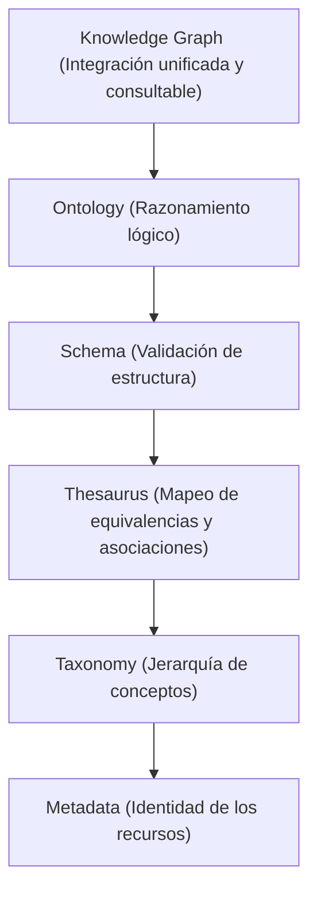

# Análisis Detallado: Post de Charles Hoffman sobre el Rol de los Estándares (16-Ago-2026)

**Fecha de publicación:** 16 de Agosto de 2026  
**Autor:** Charles Hoffman  
**Fuentes analizadas:**  
- [Post.txt](file:///c:/Users/IPHIX/Documents/Projects/DFRNT/Documentacion/Charles%20Hoffman/Mail/Lkdn%202026-08-15/Post.txt) (LinkedIn)
- Blog Post: [*Often Underappreciated Role of Standards*](https://digitalfinancialreporting.blogspot.com/2026/08/often-underappreciated-role-of-standards.html)

---

## 1. Contenido Original del Post de LinkedIn

```text
Two things. First, standards tend to be underappreciated. Second, while perhaps not perfect, standards do provide leverage; consider using them when possible.

Jessica Talisman is right; this is a pipeline. Roy Roebuck is right; enterprises are not as unique as you might think (e.g. lots of leverageable patterns). Kurt Cagle is right; holons are quite useful models. Tony Seale is right; knowledge graphs are important and need to be done right. Nicolas Figay is right; interoperability is harder than you might believe. Dave McComb (DCA) is right; software wasteland describes the status quo well. William McCarthy (REA) is right; business events is a thing. Willi Brammertz (ACTUS) is right; algorithms can be used to project business events into the future.

The past 45 years have been quite the journey. But things are coming together nicely. Slowly...but nicely.

https://digitalfinancialreporting.blogspot.com/2026/08/often-underappreciated-role-of-standards.html
```

---

## 2. Contexto y Tesis Central

Charles Hoffman (pionero del estándar XBRL y creador del *Seattle Method* y *Accounting & Audit by Design - A&AD*) propone dos premisas fundamentales:

1. **Los estándares suelen ser subestimados:** A menudo se perciben erróneamente como burocracia o costos de cumplimiento.
2. **Los estándares crean mercados y aportan apalancamiento (*leverage*):** Proporcionan especificaciones abiertas que eliminan los monopolios propietarios, bajan los costos de integración e impulsan ecosistemas globales altamente competitivos.

El diagnóstico de Hoffman sobre el estado actual de la tecnología corporativa coincide con el concepto de **"Software Wasteland"** (Dave McComb): un ecosistema fragmentado en silos de aplicaciones propietarias que duplican datos e incomunican a las organizaciones.

---

## 3. Evolución Histórica de los Estándares (1971 – 2026)

Hoffman traza una línea de tiempo tecnológica de 45 años para fundamentar su argumento:

### A. Era de Hardware y Redes (1971 – 1995)
* **1971–1980:** Fragmentación total de la computación personal; hardware propietario e incapaz de comunicarse.
* **1981–1984 (La lección crítica del BIOS de IBM):** IBM introdujo el PC con componentes estándar pero retuvo el **BIOS** de forma propietaria. COMPAQ, Phoenix Technologies y AMI utilizaron ingeniería inversa legal (*"clean room technique"*) para liberar el BIOS, creando la industria global de clones PC interoperables y catalizando un crecimiento exponencial del mercado.
* **1984–1995:** Modelo OSI de ISO (1984), Ethernet IEEE (1985) y la Web abierta mediante TCP/IP, HTTP y HTML (1995).

### B. Era de la Estructuración y Semántica de Datos (1993 – 2025)
* **UBL / OASIS (1993, ISO/IEC 2015):** Estandarización de documentos comerciales (facturación, órdenes de compra).
* **Semantic Web Stack (W3C, 1998–2025):** RDF, RDFS, OWL, SHACL y SPARQL alcanzan la madurez para el uso empresarial (*enterprise-ready*).
* **BPMN (OMG 2004, ISO/IEC 2013):** Estandarización de modelos de procesos de negocio.

### C. Era de la Ontología Contable y Reporte Financiero (1982 – 2026)
* **REA Ontology (McCarthy, 1982 / ISO/IEC 15944-4:2015):** Recursos, Eventos y Agentes como ontología contable y económica.
* **XBRL GL (2007):** Estandarización de transacciones a nivel de libro mayor.
* **ACTUS (Brammertz, 2008):** Modelado algorítmico de contratos financieros para proyectar eventos y flujos de caja futuros.
* **OIM (XBRL Int., 2023) y SBRM 1.0 (OMG, 2025):** Conceptualización lógica estándar del reporte de negocios.
* **Seattle Method (2021) y Accounting & Audit by Design - A&AD (2025):** Síntesis de Hoffman que integra todos estos estándares para contabilidad, reporte financiero y auditoría a escala empresarial.
* **Raíces Históricas (1211 / 1494):** Invención de la partida doble por banqueros italianos (1211) y su formalización por Luca Pacioli en el *Método Veneciano* (1494).

---

## 4. Desglose de Referencias y Expertos Citados

Hoffman reúne a 8 líderes de pensamiento para construir su visión holística:

| Experto Citado | Concepto Clave | Significado Arquitectónico |
| :--- | :--- | :--- |
| **Jessica Talisman** | *"This is a pipeline"* | Tratamiento del flujo de información como una **tubería semántica continua** (*Data $\rightarrow$ Information $\rightarrow$ Knowledge $\rightarrow$ Reasoning*). |
| **Roy Roebuck** | *"Enterprises are not as unique as you might think"* | Desmitificación de la "unicidad empresarial". El 90% de los patrones financieros e informativos son repetibles y apalancables mediante estándares. |
| **Kurt Cagle** | *"Holons are quite useful models"* | Los estados financieros son **hólones** (estructuras semánticas compuestas por sub-grafos de conocimiento autónomos y coherentes). |
| **Tony Seale** | *"Knowledge graphs need to be done right"* | El Grafo de Conocimiento es la capa de integración viva; requiere rigor ontológico para evitar duplicar el caos de los datos. |
| **Nicolas Figay** | *"Interoperability is harder than you might believe"* | La interoperabilidad semántica entre dominios diversos exige modelado formal y estándares ISO. |
| **Dave McComb (DCA)** | *"Software wasteland describes the status quo"* | Crítica a las aplicaciones propietarias en silos (*Software Wasteland*) y defensa de la arquitectura *Data-Centric*. |
| **William McCarthy (REA)** | *"Business events is a thing"* | Fundamento contable basado en eventos económicos reales (Recursos, Eventos, Agentes - ISO 15944-4). |
| **Willi Brammertz (ACTUS)** | *"Algorithms can project business events"* | Uso de algoritmos contractuales matemáticos para proyectar el futuro financiero y no solo registrar el pasado. |

---

## 5. La Pirámide Semántica del Conocimiento

Una de las citas más destacadas del artículo de Hoffman establece la jerarquía formal de la gestión semántica:

> *"**Metadata** establishes identity, **taxonomy** imposes hierarchy, the **thesaurus** maps equivalence and association, the **schema** enforces structural validity, the **ontology** enables reasoning, and the **knowledge graph integrates** them into a unified, queryable whole."*



---

## 6. Implicaciones y Conclusiones para Proyectos de Auditoría Digital (DFRNT / BaseX / XBRL)

1. **Convergencia del Ecosistema:** La sincronía entre SBRM, OIM, W3C Semantic Stack, REA (ISO 15944-4) y A&AD confirma que la industria de la auditoría y reporte digital ha alcanzado la madurez necesaria para adoptar arquitecturas orientadas a grafos.
2. **Validación Metodológica:** Reafirma que el diseño de sistemas de auditoría no debe construir silos propietarias, sino implementar grafos de conocimiento basados en estándares abiertos para habilitar verificación automática, detección de discrepancias y razonamiento mediante IA.
