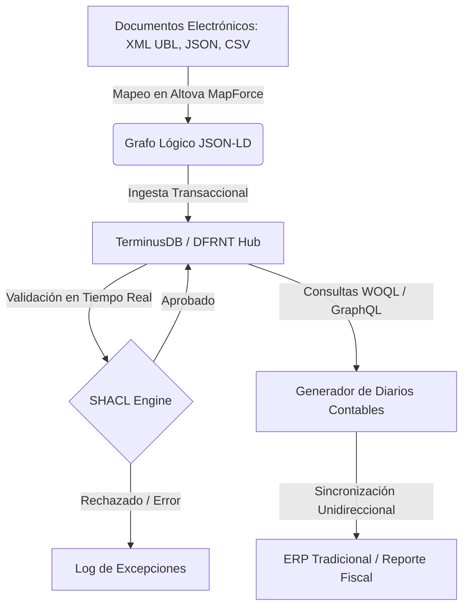

# Especificación Técnica del Framework: Accounting & Audit by Design (A&AD)

Esta especificación describe la arquitectura técnica, las lógicas de ingesta y los guardrails semánticos del framework de **Contabilidad y Auditoría por Diseño (A&AD)**, validado en la prueba de concepto del "Momento 0".

---

## 1. La Arquitectura del Pipeline Semántico

El flujo de información en el framework A&AD está estructurado bajo principios de portabilidad de formatos y desacoplamiento de capas, asegurando la consistencia transaccional antes del almacenamiento.



### Ingesta Flexible y Desacoplada
El framework está diseñado bajo la filosofía **MOSA (Modular Open Systems Approach)**:
*   **Independencia de Formato:** El núcleo semántico del sistema es inmune a las variaciones sintácticas o normativas de cada jurisdicción. Si un país exige facturación en JSON, XML propietario o UBL 2.1, únicamente se ajusta el componente de traducción visual en **Altova MapForce**.
*   **Trazabilidad Nativa (PROV-O):** Cada nodo financiero en el grafo registra su linaje mediante la ontología de procedencia W3C PROV-O (`prov:wasDerivedFrom`), apuntando al identificador único o CID (Content Identifier) en el almacenamiento inmutable descentralizado (IPFS) del documento de origen.

### El Repositorio Pasivo de Cumplimiento (Downstream ERP)
Para evitar fricciones operativas con las infraestructuras de IT heredadas, A&AD establece una clara jerarquía:
1.  **SSOT (Single Source of Truth):** El grafo semántico en TerminusDB es el único libro de contabilidad real, vivo y auditado.
2.  **Cuerpo de Cumplimiento Pasivo:** Los sistemas ERP relacionales tradicionales (SAP, Oracle, NetSuite) funcionan únicamente como destinos receptores de reportes. El motor de A&AD extrae mediante consultas GraphQL/WOQL los diarios contables aplanados (CSV/JSON) y los carga de forma automática en los ERPs heredados para cumplir con las exigencias legales locales, sin permitir que las limitaciones de las bases de datos relacionales tradicionales contaminen la riqueza semántica de origen.

---

## 2. Alineación Ontológica Multiestándar

A&AD unifica por primera vez cinco niveles conceptuales de la industria para modelar a la firma bajo la teoría contable de **Shyam Sunder** (la empresa concebida como un "nexo de contratos"):

1.  **ISO/IEC 21838-2 (BFO):** Define las superclases raíz. Los agentes y recursos heredan de `BFO_Continuant` (entidades continuas en el tiempo), mientras que los registros de diario y transacciones heredan de `BFO_Occurrent` (procesos y eventos concurrentes).
2.  **REA (Resource-Event-Agent):** Modela la lógica de negocio subyacente superando la partida doble relacional. Los hechos financieros se estructuran en base a intercambios económicos reales entre recursos (activos, capital) y agentes (accionistas, proveedores) mediadores.
3.  **Semantic Arts Gist (14.1.0):** Actúa como el puente lógico del framework. Redefine a la cuenta contable (`gist:Account`) como un *acuerdo de negocio que acumula saldo*, y no como un simple código numérico plano de plan de cuentas.
4.  **FIBO (Financial Industry Business Ontology):** Modela de manera formal las relaciones jurídicas y de propiedad del "Momento 0" (ej: `FIBO_IncorporationAgreement` para la escritura de constitución, y `FIBO_StockCorporation` para la personería jurídica de la firma).
5.  **ACTUS (Unified Financial Standards):** Integra contratos financieros algorítmicos (`ACTUS_Contract`) que calculan de manera predictiva y determinista los flujos de efectivo futuros del libro mayor semántico.

---

## 3. Guardrails de Auditoría Directa (Restricciones SHACL)

El framework A&AD utiliza **SHACL (Shapes Constraint Language)** para implementar la **Auditoría por Diseño** directamente en el motor de la base de datos de grafos de TerminusDB. Esto previene que datos incoherentes o sin linaje sean persistidos.

### Restricción de Partida Doble (Ejemplo Lógico)
Cada evento contable debe verificar que la suma neta de sus débitos y créditos en la moneda predeterminada sea exactamente cero:
```turtle
ex:DoubleEntryBalanceShape a sh:NodeShape ;
    sh:targetClass gl-cor:entryHeader ;
    sh:property [
        sh:path gl-cor:entryDetail ;
        sh:node ex:EntryDetailBalanceShape ;
    ] .

ex:EntryDetailBalanceShape a sh:NodeShape ;
    sh:property [
        sh:path gl-cor:debitCreditCode ;
        sh:datatype xsd:string ;
        sh:in ( "D" "C" ) ;
    ] ;
    sh:property [
        sh:path gl-cor:amount ;
        sh:datatype xsd:decimal ;
        sh:minCount 1 ;
    ] .
```

---

## 4. El Plan Estratégico de Implementación (Serie de 7 Capítulos)

La adopción y despliegue del framework de Contabilidad y Auditoría por Diseño se estructura en una serie técnica de siete episodios:

### Capítulo 1: La Crisis de la Auditoría en la Era de la IA
*   **Problema:** La partida doble tradicional (Pacioli, 1494) es plana y retrospectiva, ciega ante transacciones tomadas por agentes autónomos de IA.
*   **Solución:** Estructurar el **Gemelo Digital Semántico** de la firma en base de datos de grafos TerminusDB con visualización contextual en DFRNT.

### Capítulo 2: Trazabilidad Completa en el Grafo
*   **Acción:** Desbloqueo físico del modelo REA sobre triples JSON-LD.
*   **Resultado:** Cada transacción financiera mantiene un hilo lógico inquebrantable hacia su evento económico y operativo de origen.

### Capítulo 3: Procedencia: El Anclaje Legal Definitivo
*   **Acción:** Integración de anclajes criptográficos en Blockchain (inmutabilidad societaria de actas y constitución) junto a la ontología de procedencia W3C PROV-O.
*   **Resultado:** Verificabilidad legal e inmutabilidad absoluta de los estados financieros del Momento Cero.

### Capítulo 4: La Ontología Transaccional Global
*   **Acción:** Traducción sistemática de la taxonomía XBRL GL (Global Ledger) a un esquema JSON-LD nativo bajo TerminusDB.
*   **Resultado:** Estandarización de la semántica interna empresarial bajo directrices internacionales ISO 21378 e ISO 15944.

### Capítulo 5: El Pipeline de Ingesta del "Momento 0"
*   **Acción:** Configuración del mapeador Altova MapForce para capturar documentos de facturación (XML UBL) y aportes societarios para inyectarlos en el nodo "Génesis" del grafo.
*   **Resultado:** Extracción y carga con cero alucinaciones y total fidelidad de origen.

### Capítulo 6: Erradicación del Greenwashing (Fusión ESG y Finanzas)
*   **Acción:** Integración de los flujos contables operacionales de gastos con taxonomías internacionales de sostenibilidad (GRI, ISSB, VSME).
*   **Resultado:** Verificación directa de declaraciones corporativas de sostenibilidad cruzándolas en el grafo con los registros financieros de compras correspondientes.

### Capítulo 7: La Presentación del Grid de Consistencia Contable
*   **Acción:** Integración total del grid de fusión A&AD (Matriz de Completitud) alineado a Zachman y la teoría contable del nexo de contratos.
*   **Resultado:** El modelo definitivo de arquitectura empresarial semántica preparado para la auditoría continua en la era de la inteligencia artificial.
