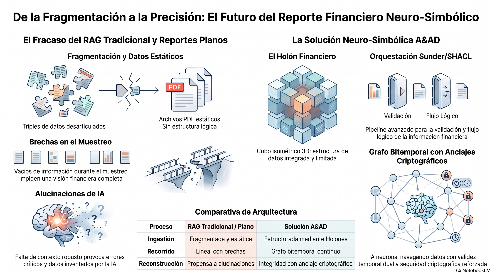

# Infografía Arquitectónica A&AD: Neuro-Symbolic Evolution

Esta sección aloja y explica la arquitectura visual del framework **Contabilidad y Auditoría por Diseño (A&AD)** en sus versiones en español e inglés.

---

## 🇪🇸 Versión en Español

### Resumen de Componentes (Español)
1. **El Fracaso del RAG Tradicional y Reportes Planos:**
   - **Fragmentación y Datos Estáticos:** Triples de datos desarticulados y archivos PDF estáticos sin estructura lógica.
   - **Brechas en el Muestreo:** Vacíos de información durante el muestreo impiden una visión financiera completa.
   - **Alucinaciones de IA:** La falta de contexto robusto provoca errores críticos y datos inventados por los modelos de IA.
2. **La Solución Neuro-Simbólica A&AD:**
   - **El Holón Financiero:** Estructura de datos 3D isométrica, integrada y limitada para entidades financieras.
   - **Orquestación Sunder/SHACL:** Pipeline avanzado para la validación y flujo lógico estricto antes del procesamiento.
   - **Grafo Bitemporal con Anclajes Criptográficos:** IA neuronal navegando datos con validez temporal dual (Tiempo Válido vs. Tiempo de Transacción) e inmutabilidad criptográfica.

---

## 🇬🇧 English Version

### Component Summary (English)
1. **The Failure of Traditional Financial Reporting & Flat RAG:**
   - **Fragmented Data Triples:** Disconnected data points lacking connective tissue for financial reasoning.
   - **Static PDF Bottlenecks:** Information trapped in non-interactive PDFs creating data silos.
   - **Sampling Gaps & AI Hallucinations:** Discontinuous data sampling causing LLM fabrications and financial errors.
2. **The A&AD Neuro-Symbolic Solution:**
   - **The Financial Holon:** 3D isometric bounded cube providing a structured, multi-dimensional view.
   - **Sunder/SHACL Orchestration Pipeline:** Rigorous validation pipeline enforcing predefined shapes and logic constraints.
   - **Bitemporal Knowledge Graph:** Sophisticated graph navigating Valid Time vs. Transaction Time secured by cryptographic anchors.

---

### Links Directos a Imágenes
- [Ver Imagen (Español)](infografia_es.png)
- [Ver Imagen (English)](infografia_en.png)
