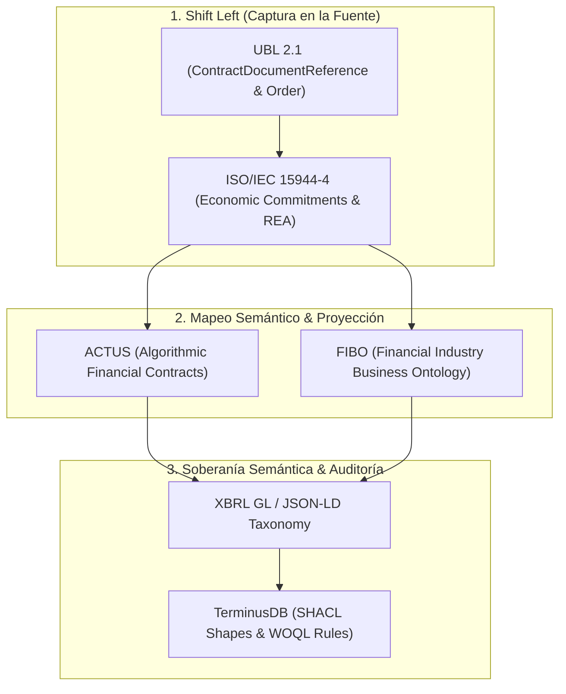

# Análisis: Estandarización Internacional de Contratos (ISO/IEC 15944-4:2015 & ONU/UN-CEFACT)

**Fecha**: 3 de agosto de 2026  
**Proyecto**: DFRNT / Accounting & Audit by Design (AAbD)  
**Ubicación**: `C:\Users\IPHIX\Documents\Projects\DFRNT\Documentacion\ISO 15944\analisis_iso_15944_4_estandarizacion_contratos.md`  

---

## 1. Introducción y Contexto

En la evolución de la arquitectura de contabilidad y auditoría por diseño (**AAbD / DFRNT**), la captura de proveniencia (*Provenance*) y la semántica desde el origen (*Shift Left*) exige estandarizar los datos no desde la factura ni el asiento contable, sino desde el **contrato mismo** y la **orden de compra**.

Este documento consolida la investigación de estándares internacionales promovidos por las **Naciones Unidas (UN/CEFACT, UNCITRAL)** y la **ISO (ISO/IEC 15944-4:2015)**, y demuestra su integración con **UBL 2.1**, **ACTUS**, **FIBO**, **XBRL GL** y grafos de conocimiento (**TerminusDB**).

---

## 2. Norma Oficial: ISO/IEC 15944-4:2015

* **Referencia Oficial**: [ISO/IEC 15944-4:2015 (Edición 2)](https://www.iso.org/obp/ui/es/#iso:std:iso-iec:15944:-4:ed-2:v1:en)
* **Título**: *Information technology — Business Operational Aspects — Part 4: Business transaction scenarios — Accounting and economic ontology*.
* **Comité Técnico**: ISO/IEC JTC 1/SC 32 en estrecha coordinación con **UN/CEFACT**.

### Conceptos Fundamentales (Marco REA)

1. **Open-edi Business Transaction Ontology (OeBTO)**:
   Proporciona la especificación formal basada en reglas para representar escenarios de transacciones comerciales independientes de plataformas o proveedores propietarios.
2. **Economic Commitments (Compromisos Económicos)**:
   Formaliza el contrato como un conjunto de compromisos de incremento (*Increment Commitment*) y decremento (*Decrement Commitment*). El contrato se define como la promesa de futuros eventos económicos antes de su ejecución.
3. **Reciprocity (Reciprocidad)**:
   Asociación ontológica que vincula jurídicamente y económicamente el compromiso de entrega de bienes/servicios con la obligación de pago.
4. **Fulfillment & Provenance (Cumplimiento y Proveniencia)**:
   Conecta explícitamente el evento económico real (factura, despacho, pago) con el compromiso contractual que lo originó, garantizando trazabilidad e inalterabilidad de origen.

---

## 3. Iniciativas de las Naciones Unidas (ONU) para la Estandarización de Contratos

### A. UN/CEFACT (Comercio Electrónico y Facilitación del Comercio)
* **Buy-Ship-Pay Reference Data Model (BSP RDM)**: Estandariza las tres fases del ciclo comercial: Comprar (*Buy*: Contrato y Orden de Compra), Enviar (*Ship*: Despacho y Logística) y Pagar (*Pay*: Factura y Pago).
* **UN/CEFACT CCTS (Core Component Technical Specification)**: Proporciona la semántica de datos reutilizable sobre la que se basa el estándar **UBL 2.1**.

### B. UNCITRAL / CNUDMI (Derecho Mercantil Internacional)
* **CISG (Convenio de Viena 1980)**: Tratado internacional que regula la formación y ejecución de contratos de compraventa internacional de mercaderías.
* **MLETR (Model Law on Electronic Transferable Records - 2017)**: Marco legal para contratos, títulos valores y documentos transferibles electrónicos (*Smart Contracts* y registros digitales).

---

## 4. Arquitectura de Integración en DFRNT (Shift Left Pipeline)

---

## 5. Mensaje Técnico Traducido para Charlie Hoffman

### Contexto
Respuesta al intercambio con Charles Hoffman sobre **Soberanía Semántica** (*Semantic Sovereignty*), la **Esencia del Modelado** (*Essence of Modeling*) y el despliegue hacia la izquierda (*Shift Left*) en UBL 2.1.

### Mensaje en Inglés (Listo para envío)

> **Hi Charlie,**
> 
> As I review the literature, I find increasingly deeper value in the need to standardize data right from the contract stage itself. I have been exploring the **UBL 2.1** structure to go beyond invoice data by directly incorporating Purchase Orders and Contracts for full **Provenance** tracking, and I've found significant semantic bridges in this investigation.
> 
> I am currently working on **prototyping a 'Shift Left' deployment of semantic tagging within UBL**, allowing us to seamlessly connect both financial and non-financial contracts with **ACTUS** and the **FIBO (Financial Industry Business Ontology)** model.
> 
> I'll keep you posted on my progress with this initiative!
> 
> Best regards,

---

## 6. Conclusiones y Próximos Pasos

1. La norma **ISO/IEC 15944-4:2015** proporciona la justificación ontológica formal para mover el etiquetado semántico hacia la izquierda (*Shift Left*), demostrando paridad con estándares ISO y ONU.
2. El uso de **UBL 2.1** permite capturar sintácticamente los contratos y órdenes de compra de acuerdo con el modelo **Buy-Ship-Pay** de UN/CEFACT.
3. La integración con **ACTUS** permite proyectar flujos de efectivo basados en los compromisos económicos (*Economic Commitments*), mientras que **FIBO** provee la clasificación de entidades institucionales.
4. Toda la validación se ejecuta mediante reglas declarativas **SHACL** en **TerminusDB**, garantizando **Soberanía Semántica** y auditoría a prueba de cualquier inspección.
