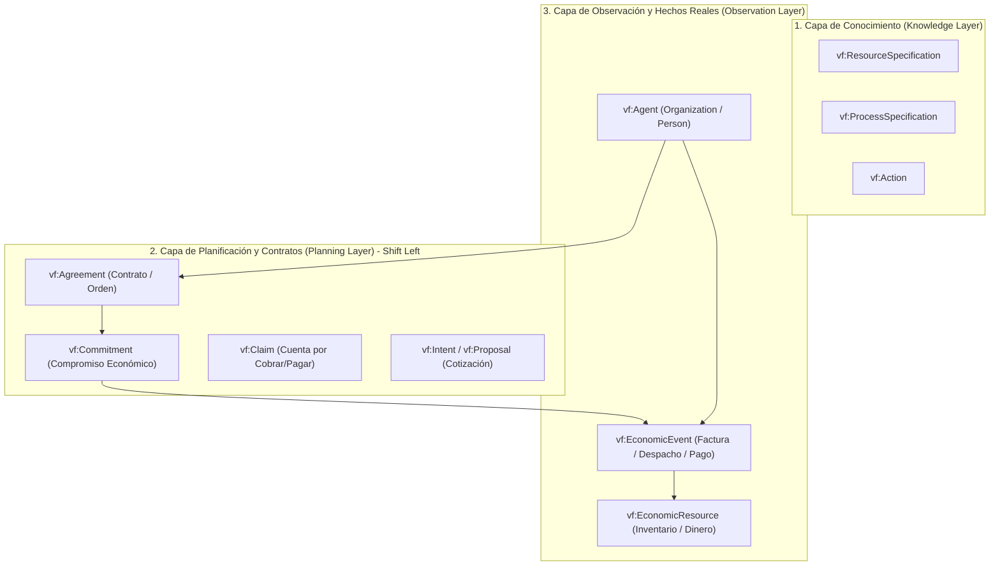

# Análisis de la Ontología Valueflows (`valueflows_all_vf.ttl`)

**Fecha**: 3 de agosto de 2026  
**Proyecto**: DFRNT / Accounting & Audit by Design (AAbD)  
**Ubicación de Guardado**: `C:\Users\IPHIX\Documents\Projects\DFRNT\Documentacion\ISO 15944\analisis_ontologia_valueflows_all_vf.md`  
**Archivo Ontológico Analizado**: `C:\Users\IPHIX\Documents\Projects\DFRNT\Documentacion\ISO 15944\ontologias\valueflows_all_vf.ttl`  

---

## 1. Introducción y Definición

El archivo **`valueflows_all_vf.ttl`** es la implementación formal en sintaxis Turtle (`.ttl`) de la **Ontología Valueflows**. Representa la especificación nativa para la Web Semántica (W3C / RDF / OWL) del marco **REA (Resource-Event-Agent)** y el estándar **ISO/IEC 15944-4 (Open-edi Business Transaction Ontology - OeBTO)**.

Esta ontología proporciona las clases y propiedades estandarizadas para modelar redes económicas, contratos, compromisos y trazabilidad de proveniencia (*Provenance*) en grafos de conocimiento.

---

## 2. Capas Operativas de la Ontología

Valueflows organiza la estructura económica y contractual en tres capas ontológicas diferenciadas:

### A. Capa de Planificación y Contratos (*Planning Layer*) — *(Enfoque Shift Left)*
* **`vf:Agreement`**: Nodo raíz del **Contrato** o **Acuerdo Comercial** (agrupa las cláusulas y la reciprocidad entre agentes).
* **`vf:Commitment`**: El **Compromiso Económico**. Representa la promesa programada de un flujo económico (entrega de bienes o pago) antes de que el hecho ocurra.
* **`vf:Claim`**: Derecho o reclamación derivado de un evento económico ya ocurrido.
* **`vf:Intent` / `vf:Proposal`**: Propuesta comercial o cotización inicial.

### B. Capa de Observación (*Observation Layer*)
* **`vf:EconomicEvent`**: El **Hecho Económico Real** observado (despacho, pago, emisión de factura).
* **`vf:EconomicResource`**: El **Recurso Económico** involucrado (mercancía, dinero, servicio).
* **`vf:Agent` (`Organization` / `Person`)**: Las entidades con capacidad de agencia que firman o ejecutan.

### C. Capa de Conocimiento (*Knowledge Layer*)
* **`vf:ResourceSpecification`**: Clasificación del tipo de recurso.
* **`vf:ProcessSpecification`**: Especificación del proceso.
* **`vf:Action`**: Verbos de acción semántica (*use*, *consume*, *transfer*, *pay*, *work*).

---

## 3. Propiedades Clave para Proveniencia y Reciprocidad

| Propiedad | Dominio | Rango | Descripción Semántica |
| :--- | :--- | :--- | :--- |
| **`vf:clauseOf`** | `vf:Commitment` | `vf:Agreement` | Enlaza un compromiso específico con el contrato del cual forma parte. |
| **`vf:fulfills`** | `vf:EconomicEvent` | `vf:Commitment` | **Propiedad de Proveniencia Pura**: Conecta la factura/despacho real con el compromiso de la orden original. |
| **`vf:reciprocalWith`** | `vf:Commitment` | `vf:Commitment` | Establece que el compromiso de entrega exige como contraprestación un compromiso de pago. |
| **`vf:provider`** | `vf:EconomicEvent` / `vf:Commitment` | `vf:Agent` | Agente proveedor del recurso. |
| **`vf:receiver`** | `vf:EconomicEvent` / `vf:Commitment` | `vf:Agent` | Agente receptor del recurso. |

---

## 4. Aplicación Práctica en el Proyecto DFRNT / Shift Left

1. **Mapeo de UBL 2.1 a Grafo Valueflows**:
   * Una `UBL:Order` o `UBL:ContractDocumentReference` se mapea directamente a un nodo **`vf:Agreement`**.
   * Cada línea de orden (`UBL:OrderLine`) se instancia como un nodo **`vf:Commitment`**.
2. **Conexión con ACTUS**:
   * Los compromisos contractuales de pago futuro (**`vf:Commitment`**) alimentan los motores **ACTUS** para proyectar flujos de efectivo en el tiempo.
3. **Validación SHACL en TerminusDB**:
   * Mediante **`robosystems_shapes.ttl`**, se exige que todo evento contable o factura (`vf:EconomicEvent`) contenga la relación **`vf:fulfills`** apuntando a su compromiso contractual de origen, garantizando auditoría por diseño y **Soberanía Semántica**.
