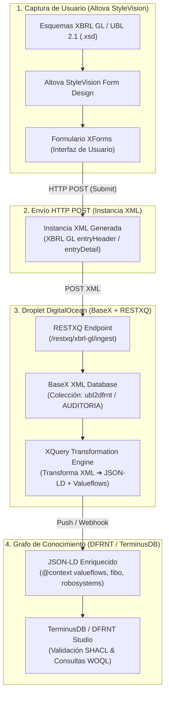

# Arquitectura de Captura y Canalización: Altova StyleVision (XForms) ➔ BaseX (DigitalOcean) ➔ DFRNT / Grafo de Conocimiento

**Fecha**: 3 de agosto de 2026  
**Proyecto**: DFRNT / Accounting & Audit by Design (AAbD)  
**Ubicación**: `C:\Users\IPHIX\Documents\Projects\DFRNT\Documentacion\ISO 15944\arquitectura_altova_stylevision_xforms_basex_dfrnt.md`  

---

## 1. Visión General de la Canalización (*Pipeline*)

Esta arquitectura permite que un profesional contable o experto de dominio capture contratos, órdenes de compra y asientos mediante formularios amigables sin necesidad de codificar en XML o JSON-LD manualmente.



---

## 2. Componentes de la Solución

### Componente 1: Altova StyleVision & XForms (Captura en la Fuente - *Shift Left*)
1. **Diseño en StyleVision**: Se carga el esquema **XBRL GL (`.xsd`)** o **UBL 2.1 (`.xsd`)** en Altova StyleVision.
2. **Generación de Formulario XForms**: StyleVision compila la plantilla gráfica a un formulario interactivo **XForms**.
3. **Acción de Envío (*Submission Action*)**:
   El botón de guardar del XForms está configurado con la siguiente acción HTTP:
   ```xml
   <xforms:submission id="save-xbrl-gl"
                      action="https://165.245.137.44/restxq/xbrl-gl/ingest"
                      method="post"
                      mediatype="application/xml"
                      replace="none"/>
   ```

---

### Componente 2: Droplet en DigitalOcean (BaseX + RESTXQ)
En el droplet (`165.245.137.44`):
1. **Endpoint RESTXQ en BaseX**: Un script XQuery en BaseX escucha las peticiones del formulario:
   ```xquery
   module namespace api = 'http://dfrnt.org/api/xbrl-gl';

   declare 
     %rest:path('/xbrl-gl/ingest')
     %rest:POST("{$body}")
   function api:ingest-xbrl-gl($body as node()) {
     let $db-name := "ubl2dfrnt"
     let $doc-id := concat("doc_", string(current-dateTime()), ".xml")
     return (
       db:add($db-name, $body, $doc-id),
       api:transform-to-jsonld($body)
     )
   };
   ```
2. **Transformación XQuery a JSON-LD**: BaseX ejecuta la transformación que asigna los `@type` de **Valueflows (`vf:EconomicEvent`, `vf:Commitment`, `vf:Agreement`)** a los elementos XML de XBRL GL.

---

### Componente 3: Grafo de Conocimiento (DFRNT / TerminusDB)
1. **Ingesta de JSON-LD**: BaseX envía la estructura JSON-LD generada a TerminusDB / DFRNT.
2. **Validación SHACL**: Se verifica la proveniencia mediante `robosystems_shapes.ttl` y `valueflows_all_vf.ttl`.

---

## 3. Ventajas Estratégicas

1. **UX Asequible para Contadores**: El usuario trabaja en una interfaz XForms limpia diseñada en StyleVision, sin lidiar con corchetes ni sintaxis compleja.
2. **Respaldo de Estándares de la ONU e ISO**: Los datos nacen en esquemas XSD oficiales y viajan enriquecidos con la ontología **Valueflows (ISO 15944-4 / REA)**.
3. **Pipeline Totalmente Desacoplado**:
   * **Capa 1**: Formulario XForms (Altova StyleVision).
   * **Capa 2**: Base de Datos XML y API RESTXQ (BaseX en DigitalOcean).
   * **Capa 3**: Grafo de Conocimiento y Soberanía Semántica (TerminusDB / DFRNT).
