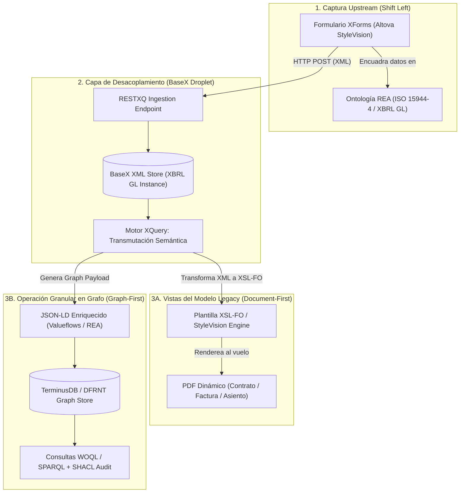

# Diseño Operativo y Arquitectura: Prototipo Dual ISO 15944-4 (REA) con XForms, BaseX, XBRL GL, JSON-LD y Rendereo PDF

**Fecha**: 3 de agosto de 2026  
**Autor**: Richard Gasca / DFRNT Team  
**Proyecto**: Accounting & Audit by Design (AAbD)  
**Ubicación**: `C:\Users\IPHIX\Documents\Projects\DFRNT\Documentacion\ISO 15944\diseño_operativo_prototipo_dual_rea_xforms_basex_pdf_grafo.md`  
**Referencia de Origen**: Interacción 3 de Charlie Hoffman (`interaction3.txt` / `interaccion3_charlie.md`)

---

## 1. Visión General del Prototipo Dual

El objetivo de este diseño es responder a la recomendación directa de Charlie Hoffman en la **Interacción 3**: construir una arquitectura capaz de operar bajo el **Nuevo Paradigma (Graph-First)** mientras atiende sin fricción los requerimientos del **Paradigma Heredado (Document-First)**.



---

## 2. Los Cuatro Pilares del Desacoplamiento

### Pilar 1: La Interfaz Capturadora (XForms + ISO 15944-4 REA)
* El usuario interactúa con un formulario **XForms** amigable (compilado vía Altova StyleVision).
* El formulario captura la estructura tríadica **REA**:
  1. **Recursos Económicos (*Economic Resources*)**: Bienes, servicios, dinero o derechos involucrados.
  2. **Eventos Económicos (*Economic Events*)**: Transferencias, entregas, compromisos de pago.
  3. **Agentes Económicos (*Economic Agents*)**: Comprador, Vendedor, Custodio, Auditor.

### Pilar 2: El Almacén y Motor Desacoplador (BaseX + XBRL GL)
* **BaseX** recibe la instancia XML basada en **XBRL GL** (`entryHeader`, `entryDetail`).
* El formato XBRL GL actúa como la capa de abstracción sintáctica intermedia: aísla la fuente de captura de los motores de consumo final.

### Pilar 3: Operación Granular en Grafo (El Nuevo Modelo)
* Mediante XQuery, BaseX convierte la instancia XBRL GL en **JSON-LD enriquecido** ligado a las ontologías **Valueflows (`valueflows_all_vf.ttl`)** e **ISO 15944-4**.
* Los datos se persisten en **TerminusDB / DFRNT**, permitiendo:
  * **Branching estilo Git**: Control de versiones de contratos y hechos económicos.
  * **Validación SHACL**: Reglas de negocio ejecutadas en tiempo real.
  * **Interoperabilidad con IA**: La IA consulta la red semántica directamente con proveniencia garantizada.

### Pilar 4: Generación al Vuelo de PDFs (El Modelo Legacy)
* Para stakeholders tradicionales, auditores externos o reguladores que exigen un "documento visual" o PDF:
  * El sistema **NO almacena PDFs como fuente de verdad**.
  * El PDF se **proyecta y genera al vuelo** a partir de la información granular del Grafo/BaseX usando **XSL-FO** o **StyleVision Rendering Engine**.
  * Si el Grafo cambia o evoluciona, el PDF generado refleja automáticamente la última verdad computable.

---

## 3. Mapeo Semántico Tripartito: REA ➔ XBRL GL ➔ Valueflows (JSON-LD)

| Concepto REA (ISO 15944-4) | Componente XBRL GL (XML) | Ontología Valueflows (JSON-LD) | Función en el Grafo Granular |
| :--- | :--- | :--- | :--- |
| **Economic Resource** | `gl:account` / `gl:amount` | `vf:EconomicResource` / `vf:resourceQuantity` | Cuantifica y clasifica el bien, servicio o divisa. |
| **Economic Event** | `gl:entryDetail` | `vf:EconomicEvent` | Registra la ejecución real de la transacción (hecho contable). |
| **Economic Commitment**| `gl:entryHeader` | `vf:Commitment` / `vf:Agreement` | Registra el contrato u orden de compra (*Shift Left*). |
| **Economic Agent** | `gl:identifierReference` | `vf:Agent` (`vf:Organization` / `vf:Person`) | Identifica a las partes contractuales y sus roles. |
| **Dualidad REA** | `gl:entryHeaderGroup` | `vf:fulfillment` / `vf:clause` | Vincula el evento de entrega con el evento de contraprestación (pago). |

---

## 4. Implementación Ejecutable en BaseX (RESTXQ + Rendereo Dual)

A continuación se presenta la lógica XQuery central para colocar en el servidor BaseX (`165.245.137.44`):

```xquery
module namespace rea = 'http://dfrnt.org/api/rea-dual';

declare namespace xbrl = 'http://www.xbrl.org/int/gl/cor/2015-03-25';
declare namespace xslfo = 'http://www.w3.org/1999/XSL/Transform';

(: 1. Endpoint RESTXQ de Ingesta desde XForms :)
declare 
  %rest:path('/rea/ingest')
  %rest:POST("{$body}")
function rea:ingest-transaction($body as node()) {
  let $db := "ubl2dfrnt"
  let $tx-id := concat("tx_", format-dateTime(current-dateTime(), "[Y0001][M01][D01]_[H01][m01][s01]"))
  
  (: Guardar XML de XBRL GL en BaseX :)
  let $stored := db:add($db, $body, concat($tx-id, ".xml"))
  
  (: Proyecciones Duales :)
  let $json-ld := rea:transform-to-jsonld($body, $tx-id)
  let $pdf-fo  := rea:transform-to-xslfo($body, $tx-id)
  
  return
    <response status="success">
      <transaction-id>{$tx-id}</transaction-id>
      <graph-nodes>{count($json-ld)}</graph-nodes>
      <legacy-pdf-ready>true</legacy-pdf-ready>
    </response>
};

(: 2. Generación del Grafo JSON-LD Granular (Nuevo Modelo) :)
declare function rea:transform-to-jsonld($xml as node(), $id as xs:string) as item() {
  let $agent-provider := $xml//xbrl:entryHeader/xbrl:enteredBy/text()
  let $amount         := xs:decimal($xml//xbrl:entryDetail[1]/xbrl:amount)
  
  return map {
    "@context": "https://w3id.org/valueflows/v1",
    "@id": concat("urn:dfrnt:event:", $id),
    "@type": "vf:EconomicEvent",
    "vf:action": "vf:transfer",
    "vf:provider": map {
      "@id": concat("urn:dfrnt:agent:", $agent-provider),
      "@type": "vf:Organization"
    },
    "vf:resourceQuantity": map {
      "vf:numericalValue": $amount,
      "vf:unit": "USD"
    }
  }
};

(: 3. Generación del Documento XSL-FO para Renderizado PDF (Modelo Legacy) :)
declare function rea:transform-to-xslfo($xml as node(), $id as xs:string) as element() {
  <fo:root xmlns:fo="http://www.w3.org/1999/XSL/Format">
    <fo:layout-master-set>
      <fo:simple-page-master master-name="A4" page-height="29.7cm" page-width="21cm" margin="2cm">
        <fo:region-body/>
      </fo:simple-page-master>
    </fo:layout-master-set>
    <fo:page-sequence master-reference="A4">
      <fo:flow flow-name="xsl-region-body">
        <fo:block font-size="18pt" font-weight="bold" color="#1e3a8a">
          CONTRATO / COMPROBANTE DE TRANSACCIÓN ECONÓMICA (ISO 15944-4)
        </fo:block>
        <fo:block font-size="10pt" color="#64748b" margin-bottom="15pt">
          ID de Transacción en Grafo: {$id}
        </fo:block>
        <fo:block font-size="12pt">
          Monto Registrado: USD {$xml//xbrl:entryDetail[1]/xbrl:amount/text()}
        </fo:block>
        <fo:block font-size="9pt" font-style="italic" margin-top="20pt">
          * Este documento ha sido generado automáticamente a partir del Grafo de Conocimiento de DFRNT.
        </fo:block>
      </fo:flow>
    </fo:page-sequence>
  </fo:root>
};
```

---

## 5. La Demostración Práctica de "La Brecha" (*The Gap*)

Con este prototipo operativo, puedes demostrarle a Charlie Hoffman (y a la comunidad contable) las diferencias insalvables entre ambos mundos:

| Prueba de Usabilidad / Auditoría | Demostración en Modelo Legacy (PDF) | Demostración en Nuevo Modelo (Grafo Granular) |
| :--- | :--- | :--- |
| **¿Qué ocurre si cambia el IVA o la tarifa?** | Hay que re-emitir, corregir manualmente el PDF y volver a auditar el texto. | El Grafo recalcula las relaciones ontológicas al instante y re-genera el PDF actualizado. |
| **¿Cómo audita una Inteligencia Artificial?** | Aplica OCR/LLM con riesgo de alucinación y pérdida de formato. | Consulta nodos JSON-LD con tipos fuertes (`vf:EconomicEvent`, `vf:fulfillment`) y validez SHACL determinista. |
| **¿Dónde reside la Verdad?** | En el archivo PDF estático almacenado en una carpeta de red. | En la red viva de conocimiento en TerminusDB con proveniencia inmutable. |

---

## 6. Plan de Trabajo para Hoy

1. **Paso 1**: Confirmar el mapeo del archivo `interaccion3_charlie.md` en la carpeta de correspondencia con Charlie.
2. **Paso 2**: Desplegar/actualizar el módulo XQuery `rea-dual.xqm` en BaseX (`165.245.137.44`).
3. **Paso 3**: Verificar la plantilla Altova StyleVision para que el botón de envío XForms apunte a `/rea/ingest`.
4. **Paso 4**: Probar la emisión del PDF al vuelo mientras se constata la creación del nodo JSON-LD en DFRNT/TerminusDB.
