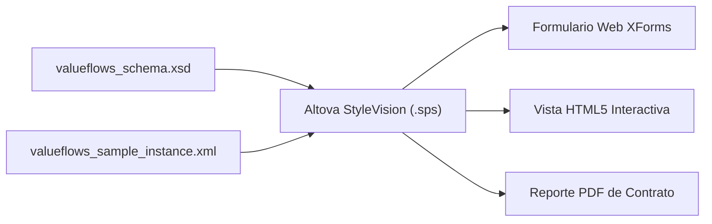

# Guía de Construcción: Formulario Altova StyleVision para ISO/IEC 15944-4 (REA Ontology)

**Fecha**: 3 de agosto de 2026  
**Ubicación de Archivos de Esquema**: `C:\Users\IPHIX\Documents\Projects\DFRNT\Documentacion\ISO 15944\ontologias\`  
**Esquema XSD Principal**: [`valueflows_schema.xsd`](file:///c:/Users/IPHIX/Documents/Projects/DFRNT/Documentacion/ISO%2015944/ontologias/valueflows_schema.xsd)  
**Instancia XML de Muestra**: [`valueflows_sample_instance.xml`](file:///c:/Users/IPHIX/Documents/Projects/DFRNT/Documentacion/ISO%2015944/ontologias/valueflows_sample_instance.xml)

---

## 1. Visión General del Diseño en StyleVision

El objetivo de este diseño en **Altova StyleVision** es permitir a usuarios no técnicos o contadores capturar contratos, órdenes de compra y acuerdos comerciales alineados con la norma **ISO/IEC 15944-4** (Ontología REA: *Resource-Event-Agent* y *Valueflows*), generando automáticamente instancias XML válidas y compilando formularios **XForms** para su canalización a BaseX y grafos de conocimiento DFRNT.



---

## 2. Estructura del Esquema XSD (`valueflows_schema.xsd`)

El esquema define el elemento raíz `vf:BusinessTransaction` compuesto por los siguientes bloques de la ontología REA:

1. **`vf:agreement`**: Identificador de contrato, fecha de emisión, jurisdicción (ej. UNCITRAL / CISG), comprador y vendedor.
2. **`vf:agents`**: Lista de Agentes Económicos (`vf:Agent`) con tipo (`Person`, `Organization`, `SoftwareAgent`).
3. **`vf:resourceSpecifications`**: Catálogo de tipos de recursos (`vf:ResourceSpecification`).
4. **`vf:commitments`**: Compromisos Económicos de la capa de planificación (*Shift Left*):
   - **Verbos de Acción (`vf:action`)**: `deliver-service`, `pay`, `transfer`, `produce`, `consume`, etc.
   - **Cantidades con Unidad de Medida (`vf:resourceQuantity`)**: Monto numérico y símbolo de unidad.
   - **Reciprocidad (`vf:reciprocalWith`)**: Enlace entre entrega y obligación de pago.
5. **`vf:reciprocities`**: Enlaces explícitos de dualidad REA (incremento vs. decremento).
6. **`vf:economicEvents`**: Observación de hechos reales (`vf:EconomicEvent`) y su propiedad de proveniencia `vf:fulfills`.

---

## 3. Instrucciones Paso a Paso para Cargar en Altova StyleVision

### Paso 1: Crear un Nuevo Diseño desde Esquema XSD
1. Abra **Altova StyleVision** (Enterprise o Professional).
2. Seleccione **File ➔ New ➔ New from XML Schema / DTD / XML**.
3. Seleccione el archivo de esquema:  
   `C:\Users\IPHIX\Documents\Projects\DFRNT\Documentacion\ISO 15944\ontologias\valueflows_schema.xsd`
4. Cuando StyleVision solicite el archivo XML de trabajo (*Working XML*), seleccione:  
   `C:\Users\IPHIX\Documents\Projects\DFRNT\Documentacion\ISO 15944\ontologias\valueflows_sample_instance.xml`
5. Elija como elemento raíz: **`BusinessTransaction`**.

### Paso 2: Configurar las Secciones Visuales del Formulario
En el lienzo de diseño de StyleVision (`.sps`):

1. **Encabezado del Contrato**:
   - Arrastre `transactionId`, `issueDate` y `governingJurisdiction` como campos de entrada de texto e insertores de fecha (*DatePicker*).
2. **Sección de Agentes (Comprador vs Vendedor)**:
   - Dentro del bloque `agreement`, inserte un grupo para `buyer` y `seller`.
   - Utilice un *Combo Box* vinculado al tipo de agente (`Person` / `Organization`).
3. **Tabla Dinámica de Compromisos (Shift Left Commitments)**:
   - Haga clic derecho sobre `commitments/commitment` y elija **Insert Table ➔ Dynamic Table**.
   - Colores sugeridos: Encabezado en azul marino (`#1E3A8A`), filas alternadas en gris claro.
   - Configure el campo `action` como un **Combo Box** estandarizado con la lista de verbos (`deliver-service`, `pay`, `transfer`, etc.).
   - Configure `due` con un control de fecha.
4. **Resumen de Reciprocidad REA**:
   - Insertar un bloque dinámico para `reciprocities/reciprocity` que muestre visualmente cómo la entrega (`incrementCommitmentRef`) exige la contraprestación de pago (`decrementCommitmentRef`).

---

## 4. Configurar la Acción de Envío XForms (Submit Action)

Para que el formulario interactivo envíe los datos capturados directamente al servidor local de BaseX en tu escritorio:

1. En StyleVision, vaya a la pestaña de diseño **XForms**.
2. En las propiedades de envío (*Submission Properties*), configure:
   * **ID**: `submit-iso15944-contract`
   * **Action (Entorno Escritorio Local)**: `http://localhost:8984/iso15944/ingest`
   * *(Nota: En producción remota se cambia a `http://165.245.137.44:8984/iso15944/ingest`)*
   * **Method**: `post`
   * **Mediatype**: `application/xml`
   * **Replace**: `none` (o `all` para mostrar acuse de recibo)
3. Vincule el botón de guardar en la interfaz con este objeto de envío `submit-iso15944-contract`.

---

## 5. Compilación y Exportación

Desde Altova StyleVision puede generar simultáneamente:
* **XForms Web Application**: Archivo `.xhtml` / `.xml` para navegadores con motores XForms o XSLT.
* **HTML5 Interactivo**: Para visualización nativa en portales de auditoría DFRNT.
* **PDF / Authentic**: Documento legal impreso firmado del contrato.

---

## 6. Verificación de Validación XSD

Puede validar que cualquier instancia XML cumple con el esquema `valueflows_schema.xsd` ejecutando:

```powershell
xmllint --schema "c:\Users\IPHIX\Documents\Projects\DFRNT\Documentacion\ISO 15944\ontologias\valueflows_schema.xsd" "c:\Users\IPHIX\Documents\Projects\DFRNT\Documentacion\ISO 15944\ontologias\valueflows_sample_instance.xml" --noout
```
