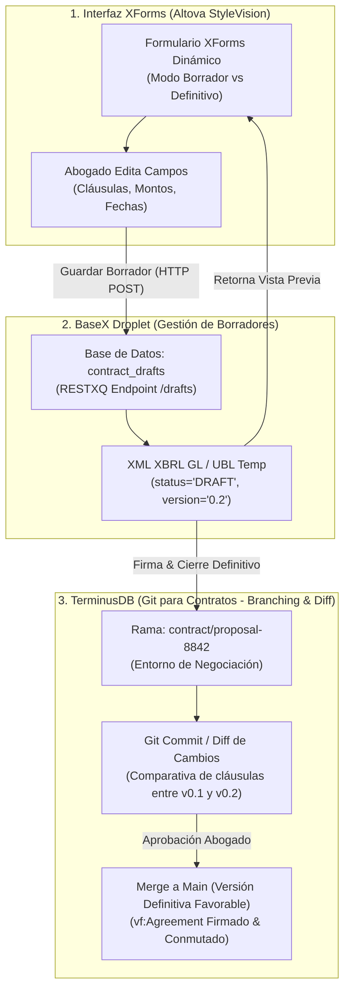

# Patrón de Arquitectura: Personalización Iterativa y Versionamiento de Contratos (XForms ➔ BaseX ➔ TerminusDB Branching)

**Fecha**: 3 de agosto de 2026  
**Proyecto**: DFRNT / Accounting & Audit by Design (AAbD)  
**Ubicación**: `C:\Users\IPHIX\Documents\Projects\DFRNT\Documentacion\ISO 15944\patron_personalizacion_versionamiento_contratos_xforms_terminusdb.md`  

---

## 1. El Requerimiento del Abogado: Personalización Dinámica antes del Contrato Definitivo

En la negociación de un contrato real, un abogado **nunca emite un contrato definitivo en el primer intento**. Necesita:
1. **Iterar y Modificar Campos**: Cambiar fechas, montos, cláusulas específicas, condiciones suspensivas o penalidades.
2. **Previsualizar Borradores**: Ver cómo va quedando el contrato en borrador (*Draft*).
3. **Control de Versiones y Aprobación**: Mantener el historial de cambios entre versiones (*v0.1, v0.2, v1.0 Final*) antes de congelar y firmar el documento.

---

## 2. Flujo de Solución Tecnológica: XForms + BaseX + TerminusDB Git-Like Branching



---

## 3. Implementación Paso a Paso

### Paso 1: Configuración del Formulario XForms (StyleVision)
En **StyleVision**, el formulario XForms contiene dos acciones de envío (*Submissions*):

```xml
<!-- 1. Guardar Borrador (Permite seguir editando) -->
<xforms:submission id="save-draft"
                   action="https://165.245.137.44/restxq/contracts/draft"
                   method="post"
                   replace="instance"/>

<!-- 2. Finalizar y Congelar Contrato (Versión Definitiva) -->
<xforms:submission id="finalize-contract"
                   action="https://165.245.137.44/restxq/contracts/finalize"
                   method="post"
                   replace="all"/>
```

* **Campos Dinámicos XForms**: Uso de `<xforms:repeat>` para agregar/eliminar cláusulas personalizadas y `<xforms:bind>` para habilitar/deshabilitar campos según el tipo de contrato.

---

### Paso 2: Manejo de Estados en BaseX (RESTXQ)
BaseX administra el ciclo de vida del borrador en la colección `contract_drafts`:

* **Estado BORRADOR (`vf:Intent` / `vf:Proposal`)**:
  * El XML almacena los cambios con atributo `status="DRAFT"` y la versión incremental `version="0.2"`.
  * No genera aún compromisos financieros definitivos en el grafo principal.
* **Estado DEFINITIVO (`vf:Agreement`)**:
  * Cuando el abogado hace clic en "Finalizar Contrato", el estado cambia a `status="FINAL_SIGNED"`.
  * Se dispara la transformación XQuery a **JSON-LD Valueflows** para inyectar los nodos definitivos `vf:Agreement` y `vf:Commitment`.

---

### Paso 3: TerminusDB como "Git de los Contratos" (*Branching & Diffs*)
TerminusDB tiene la capacidad nativa única de **funcionar como Git pero para grafos de datos**:

1. **Ramas de Negociación (*Contract Branches*)**:
   Cada borrador de contrato se crea en su propia rama (`branch: contract/empresa-x-2026`).
2. **Comparativa de Cambios (*Diffing*)**:
   El abogado o el auditor pueden ejecutar un `diff` semántico para ver exactamente qué cláusula o monto cambió entre la versión que propuso el cliente y la versión modificada por el abogado.
3. **Fusión e Inmutabilidad (*Merge to Main*)**:
   Una vez que el abogado aprueba la versión definitiva, se realiza un `merge` hacia la rama principal (`main`), congelando los nodos **`vf:Agreement`** y **`vf:Commitment`** como la fuente inalterable de proveniencia (*Provenance*).

---

## 4. Beneficios para el Abogado y la Auditoría

1. **Flexibilidad Total para el Abogado**: Puede agregar, quitar o personalizar cláusulas en XForms tantas veces como requiera antes de firmar.
2. **Trazabilidad de la Negociación**: Se conserva el historial exacto de qué se cambió, cuándo y por quién mediante los commits del grafo en TerminusDB.
3. **Transición Transparente de Propuesta a Obligación**:
   * Borrador = `vf:Proposal` / `vf:Intent`
   * Contrato Definitivo = `vf:Agreement` / `vf:Commitment`
