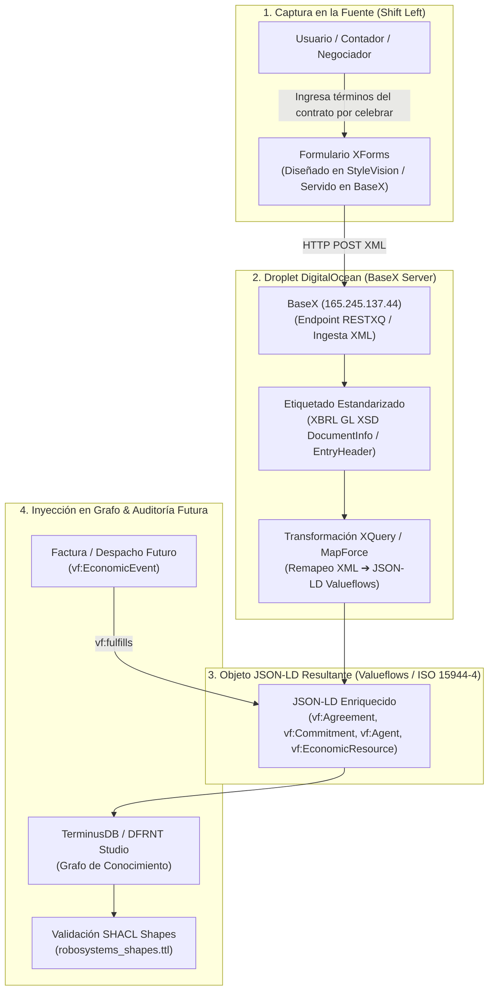

# Proceso de Ideación y Arquitectura: Captura de Contratos por Celebrar (Shift Left ➔ XBRL GL ➔ Valueflows JSON-LD ➔ TerminusDB)

**Fecha**: 3 de agosto de 2026  
**Proyecto**: DFRNT / Accounting & Audit by Design (AAbD)  
**Ubicación**: `C:\Users\IPHIX\Documents\Projects\DFRNT\Documentacion\ISO 15944\proceso_ideacion_contrato_xforms_xbrlgl_valueflows_terminusdb.md`  

---

## 1. Declaración de la Visión (Proceso de Ideación del Usuario)

> *"Capturo en un formulario Xforms con BaseX (droplet de Digital Ocean) los elementos del contrato que estoy por celebrar ➔ Etiqueto estos elementos a XBRL GL y remapeo a JSON-LD con el schema Valueflows ➔ Inyecto a TerminusDB."*

Esta ideación representa la encarnación perfecta del principio **Shift Left** (desplazamiento hacia la izquierda) y de la **Soberanía Semántica (*Semantic Sovereignty*)** en la contabilidad y auditoría moderna.

---

## 2. Flujo de Trabajo Detallado de la Canalización

---

## 3. Desglose de cada Fase del Proceso

### Fase 1: Captura en la Fuente (*Before the Transaction*)
* **Situación**: Un contrato está **por celebrarse**. No existe aún factura ni movimiento bancario.
* **Mecanismo**: El usuario abre la interfaz **XForms** servida por **BaseX** en DigitalOcean.
* **Datos Capturados**:
  * Partes contratantes (Proveedor, Comprador).
  * Compromisos de entrega (Bienes, Servicios, Recursos).
  * Compromisos de pago (Montos, Fechas, Monedas, Cláusulas).

---

### Fase 2: Etiquetado XBRL GL y Remapeo a JSON-LD Valueflows
* **Etiquetado XBRL GL**:
  * El XForms valida que la estructura cumpla con el estándar internacional **XBRL GL (`gl-cor-2015-03-25.xsd`)**.
  * Se asigna el contrato a `gl:documentInfo` y las cláusulas/promesas a `gl:entryHeader` de compromiso.
* **Remapeo a Valueflows JSON-LD**:
  * Mediante la lógica diseñada en **MapForce** y ejecutada en **BaseX (XQuery)**, la estructura XML se remapea al esquema `valueflows_schema.xsd` / `valueflows_schema.json`.
  * Se genera la instancia **JSON-LD** vinculada al `@context` de **Valueflows (`vf:`)**, la ontología nativa de la ISO 15944-4 y el marco REA.

---

### Fase 3: Inyección en TerminusDB y Auditoría por Diseño
* **Creación del Nodo Contrato**: El JSON-LD ingresa a **TerminusDB**, creando los nodos ontológicos:
  * **`vf:Agreement`** (El contrato).
  * **`vf:Commitment`** (Los compromisos estipulados).
* **Conexión Futura (Proveniencia)**:
  * Cuando meses después el proveedor emita la factura en UBL 2.1 o se registre el pago, el sistema registrará un **`vf:EconomicEvent`**.
  * La ontología forzará la relación **`vf:fulfills`** señalando al **`vf:Commitment`** original creado en el paso 1.

---

## 4. Beneficios Estratégicos e Implicaciones

1. **Eliminación de la Ceguera Contable**: La contabilidad tradicional solo se entera cuando llega la factura. Tu proceso captura la intención y el riesgo económico **desde la firma del contrato**.
2. **Soberanía Semántica (Semantic Sovereignty)**: Las reglas del contrato no están escondidas en el código de un ERP, sino expuestas como un grafo semántico abierto e inalterable.
3. **Auditoría Automatizada**: El auditor no necesita hacer "arqueología de datos"; la relación de proveniencia (*Provenance*) entre la factura y el contrato original es explícita y computable mediante SHACL en TerminusDB.
