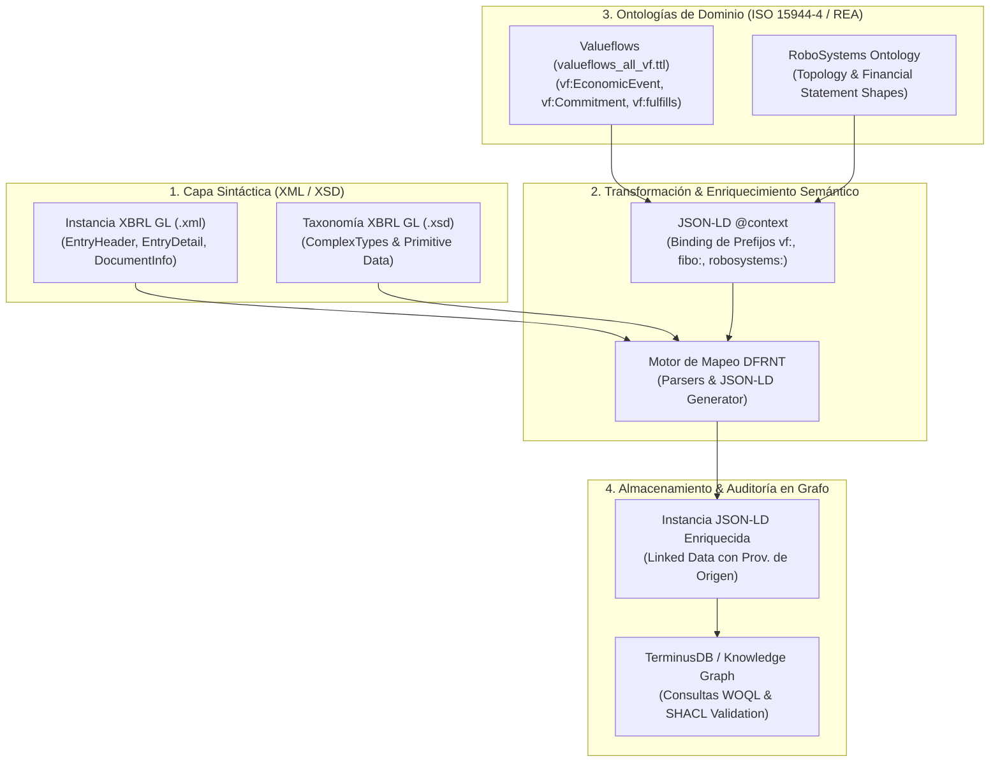

# Patrón de Arquitectura: Transformación de Instancias XBRL GL (XSD) a JSON-LD Enriquecido con Valueflows (ISO 15944-4)

**Fecha**: 3 de agosto de 2026  
**Proyecto**: DFRNT / Accounting & Audit by Design (AAbD)  
**Ubicación**: `C:\Users\IPHIX\Documents\Projects\DFRNT\Documentacion\ISO 15944\transformacion_xbrl_gl_jsonld_valueflows.md`  

---

## 1. El Reto Tecnológico: El Silo XML vs. La Web Semántica

* **XBRL GL (Global Ledger)**: La taxonomía nativa está expresada en esquemas XML Schema (`.xsd`) rígidos. Aunque posee una riqueza transaccional enorme (`DocumentInfo`, `EntryHeader`, `EntryDetail`, `Account`, `Amount`), la instancia XML tradicional permanece aislada en silos de datos imperativos.
* **La Solución DFRNT**: Transformar la **instancia XML de XBRL GL a JSON-LD (Linked Data)**, inyectando un `@context` semántico que mapea las estructuras relacionales del XSD con ontologías nativas de la web como **Valueflows (`valueflows_all_vf.ttl`)**, **FIBO** y **RoboSystems**.

---

## 2. Diagrama de la Canalización de Transformación (*Pipeline*)



---

## 3. Mapeo Semántico: De Componentes XBRL GL a Clases Valueflows

| Estructura XBRL GL (XSD) | Objeto Ontológico Valueflows (`vf:`) | Concepto ISO 15944-4 (REA) | Propósito en el Grafo JSON-LD |
| :--- | :--- | :--- | :--- |
| **`documentInfo` / `contractReference`** | `vf:Agreement` | **Agreement / Contract** | Identifica el contrato u orden de compra de origen (*Provenance*). |
| **`entryHeader` (Compromiso/Orden)** | `vf:Commitment` | **Economic Commitment** | Registra la promesa o compromiso económico programado (*Shift Left*). |
| **`entryDetail` (Asiento/Factura)** | `vf:EconomicEvent` | **Economic Event** | Registra el hecho contable o evento económico realmente ejecutado. |
| **`account` / `amount`** | `vf:EconomicResource` | **Economic Resource** | El valor, recurso o moneda afectada por el evento. |
| **`identifierReference`** | `vf:Agent` (`Organization`/`Person`) | **Economic Agent** | Identifica a los terceros, clientes, proveedores o entidades involucradas. |
| *(Relación implícita en la transacción)* | **`vf:fulfills`** | **Fulfillment** | Enlace que demuestra que el `entryDetail` cumple el `entryHeader`/contrato original. |

---

## 4. Ejemplo de Representación en JSON-LD Enriquecido

```json
{
  "@context": {
    "vf": "https://w3id.org/valueflows/ont/vf#",
    "gl": "http://www.xbrl.org/int/gl/cor/2015-03-25#",
    "xsd": "http://www.w3.org/2001/XMLSchema#",
    "EntryHeader": "gl:entryHeader",
    "EntryDetail": "gl:entryDetail",
    "Account": "gl:accountNumber",
    "Amount": "gl:amount"
  },
  "@id": "urn:dfrnt:entry:2026-08-03:001",
  "@type": ["gl:entryHeader", "vf:EconomicEvent"],
  "vf:action": "vf:transfer",
  "vf:provider": {
    "@id": "urn:dfrnt:agent:supplier:900123456",
    "@type": ["vf:Organization"]
  },
  "vf:receiver": {
    "@id": "urn:dfrnt:agent:customer:800987654",
    "@type": ["vf:Organization"]
  },
  "vf:fulfills": {
    "@id": "urn:dfrnt:contract:ubl:2026:PO-8842",
    "@type": ["vf:Commitment", "vf:Agreement"]
  },
  "gl:entryDetail": [
    {
      "@type": "gl:entryDetail",
      "gl:accountNumber": "510506",
      "gl:amount": 1500.00,
      "vf:resourceQuantity": {
        "vf:numericalValue": 1500.00,
        "vf:unit": "USD"
      }
    }
  ]
}
```

---

## 5. Beneficios de esta Arquitectura

1. **Paridad de Alta Fidelidad**: Mantiene la precisión 1:1 con las definiciones del estándar **XBRL GL XSD**.
2. **Soberanía Semántica (Semantic Sovereignty)**: Al enriquecerlo con `valueflows_all_vf.ttl`, las reglas de negocio dejan de estar atrapadas en sistemas ERP cerrados y se convierten en artefactos declarativos abiertos.
3. **Auditoría e Inspección Transparente**: Los auditores o agentes de IA pueden verificar mediante consultas WOQL/SPARQL toda la cadena de proveniencia desde el contrato inicial en UBL 2.1 hasta la línea del estado financiero.
