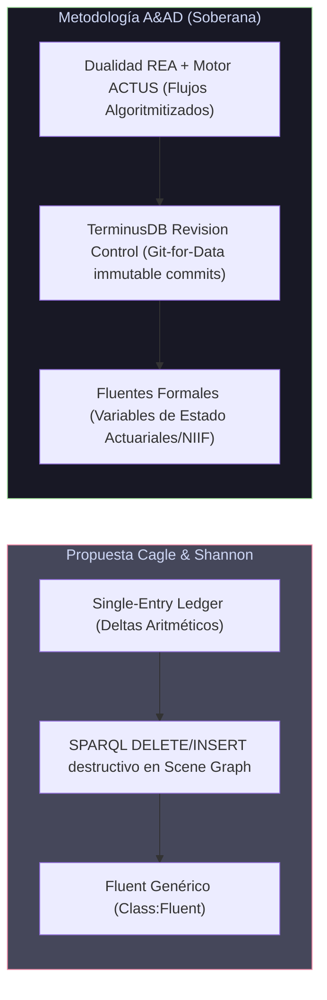
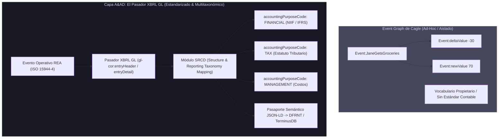

# Análisis Estratégico y Comparativo: "The Holon's Accountant" (Kurt Cagle & Chloe Shannon) vs. la Metodología A&AD

**Publicación:** *The Inference Engineer* (Substack / LinkedIn)  
**Autores:** Kurt Cagle & Chloe Shannon  
**Fecha de Publicación:** 13 - 14 de Agosto de 2026  
**Documento Fuente:** [`Holons accountant.pdf`](file:///C:/Users/IPHIX/Documents/Projects/DFRNT/Documentacion/Kurt%20Cagle/Lkdn%202026-08-14/Holons%20accountant.pdf)  
**Analizado por:** Framework de Auditoría y Contabilidad Semántica por Diseño (**A&AD - Accounting & Audit by Design**)

---

## 1. Resumen Ejecutivo y Tesis Central de Cagle & Shannon

En *"The Holon's Accountant: Ledgers, reification, fluents, and why a holon needs four graphs, not one"*, Kurt Cagle y Chloe Shannon abordan uno de los dilemas estructurales más profundos en la intersección entre los Grafos de Conocimiento (Knowledge Graphs) y la Ciencia Contable: **¿Cómo representar el cambio, el tiempo, el estado y el historial en un entorno de datos enlazados sin destruir la integridad del conocimiento ni caer en contradicciones lógicas?**

### El Diagnóstico de Cagle
1. **El Colapso del Grafo Estático:** En los Grafos de Conocimiento tradicionales, el reflejo es declarar estados mediante tripletas directas como `Account:123 Account:hasValue "70.00"^^xsd:decimal`. Esta aproximación es un *snapshot* estático que:
   - No responde a la pregunta de *por qué* o *cuándo* el saldo llegó a 70.
   - Genera una pila de hechos contradictorios a medida que el saldo cambia con el tiempo (por ejemplo, si se afirman simultáneamente saldos de 100, 70 y 50 sin mecanismo de estado actual vs. pasado).
2. **La Compresión de las Hojas de Cálculo vs. la Exigencia Semántica:** Las hojas de cálculo comprimen la realidad porque solo responden a "¿cuál es el saldo ahora mismo?". Un Grafo de Conocimiento exige justificar el origen, evento, bitemporalidad y trazabilidad de cada cambio.
3. **La Solución Propuesta (La Arquitectura de 4 Grafos por Holón):** Cagle y Shannon proponen descomponer cada entidad financiera/contable (**Holón**) en cuatro grafos con patrones de escritura y ciclos de vida independientes:
   - **Schema Graph (Ontología):** Clases y propiedades generales (`Class:Account`, `Class:Fluent`, `holon:isPartOf`).
   - **Knowledge Graph (`{holon}/knowledge`):** Declaraciones e identidad estática ("lo que es la cosa": tipo de cuenta, moneda, propietario, jerarquía `isPartOf`, apuntamiento al fluente). Se escribe una vez y rara vez se modifica.
   - **Event Graph (`{holon}/events`):** Registro de transacciones **Append-Only** (`Class:TransactionEvent`). Almacena deltas (`deltaValue`), estados previos (`previousValue`), estados nuevos (`newValue`), bitemporalidad (`transactionDate`, `recordedDate`) y enlaces a eventos anteriores (`previousEvent`).
   - **Scene Graph / Now Graph (`{holon}/scene` o `Graph:NowGraph`):** Estado actual del sistema ("el ahora"). Se reescribe atómicamente en cada transacción via SPARQL `DELETE/INSERT`, manteniendo únicamente el valor vigente del **Fluente**.

---

## 2. Confluencia Epistemológica: Coincidencias Clave entre Cagle y A&AD

La propuesta de Cagle & Shannon valida y converge directamente con varios de los pilares fundamentales que la metodología **A&AD (Accounting & Audit by Design)** ha venido fundamentando:

```mermaid
graph TD
    subgraph HOLON ["HOLÓN CONTABLE / CONTRACTUAL"]
        SG["Schema Graph<br/>(Ontología SHACL 1.2 / UFO Core)"]
        KG["Knowledge Graph<br/>({holon}/knowledge)<br/>Declaraciones e Identidad (Escribe 1 vez)"]
        EG["Event Graph<br/>({holon}/events)<br/>Semantic Ricordance Plane (Append-Only / PROV-O)"]
        SCG["Scene Graph<br/>({holon}/scene)<br/>State Projection Plane (Now Graph / Going Concern)"]
    end

    SG -->|Gobierna| KG
    KG -->|Point hasValue to identity| SCG
    EG -->|Update Atómico (SPARQL / TerminusDB)| SCG

    style HOLON fill:#1e1e2e,stroke:#89b4fa,color:#cdd6f4
    style SG fill:#313244,stroke:#f5e0dc,color:#cdd6f4
    style KG fill:#313244,stroke:#a6e3a1,color:#cdd6f4
    style EG fill:#313244,stroke:#fab387,color:#cdd6f4
    style SCG fill:#313244,stroke:#cba6f7,color:#cdd6f4
```

### A. El Holón (Arthur Koestler / W3C) como Unidad Atómica Financiera
Tanto Cagle como A&AD adoptan el concepto de **Holón** (una entidad que es simultáneamente un todo autónomo y una parte de un sistema mayor). En A&AD, un contrato financiero (CDT, Leasing, Contrato Laboral) o una cuenta no es un registro plano de ERP, sino un Holón con comportamiento y reglas de juego autónomas.

### B. Separación Tríadica de Ciclos de Vida (Write-Patterns)
Cagle acierta al señalar que mezclar declaraciones estáticas, registros de eventos y saldos actuales en un solo grafo plano arruina el rendimiento y dificulta la validación SHACL. A&AD coincide plenamente:
- **Declaraciones (Knowledge Graph) = Capa de Identidad y Contrato:** Atributos estáticos (moneda, jurisdicción, partes firmantes).
- **Eventos (Event Graph) = Semantic Ricordance Plane:** Trazabilidad inmutable basada en **PROV-O** y **XBRL GL**. Es puramente aditivo (Append-only). Resucita el *Ricordanze* de Luca Pacioli.
- **Escena Actual (Scene Graph) = State Projection Plane:** Estado del Negocio en Marcha (*Going Concern*).

### C. Bitemporalidad Indispensable para Auditoría
Cagle diferencia `transactionDate` (cuándo ocurrió el hecho en el mundo real) de `recordedDate` (cuándo se registró en el grafo). En A&AD, esta bitemporalidad es un axioma no negociable (*Valid Time* vs. *Transaction/System Time*) bajo la ontología **PROV-O** (`prov:generatedAtTime`) e **ISO 21378 / XBRL GL**, permitiendo auditar la historia retroactiva y evitar el fraude por alteración de fechas.

### D. Herencia Estructural por Contención (`holon:isPartOf`)
Cagle muestra cómo un Holón padre (ej. un Banco o Entidad) declara su jurisdicción y moneda en su propio `Knowledge Graph`, y los Holones hijos (Cuentas) heredan estos hechos mediante traversales `isPartOf` sin duplicar tripletas. En A&AD esto se implementa mediante **Relatores UFO** y **reglas Datalog SHACL 1.2 (`shrl`)**, evitando la hiper-redundancia de datos.

---

## 3. Brechas Ontológicas: Dónde la Metodología A&AD Enriquece y Supera la Propuesta de Cagle

Aunque la arquitectura de 4 grafos de Cagle es semánticamente elegante, desde la perspectiva de la **Contabilidad Algoritmitizada y la Auditoría Forense (A&AD)**, presenta limitaciones críticas que A&AD resuelve de forma superior:



### 1. De "Deltas Aritméticos Simples" a "Dualidad REA y Contratos ACTUS"
* **Limitación de Cagle:** El artículo de Cagle ejemplifica las transacciones con deltas genéricos (`BIND(?previousValue + ?delta AS ?newValue)`). Esto asume que los deltas son números crudos que "alguien ingresa".
* **Solución A&AD:** En la contabilidad real de doble/triple entrada, los deltas no son arbitrarios. A&AD fundamenta la generación de deltas en dos motores deterministas:
  - **Motor Operativo REA (Resource-Event-Agent / ISO 15944-4):** Cada evento de transferencia exige una **Dualidad Económica** (intercambio de un Recurso Económico entre Agentes con Compromisos mutuos). No hay saldo que cambie sin una contrapartida y una justificación de derechos/obligaciones.
  - **Motor Financiero ACTUS (Willi Brammertz):** En contratos financieros (CDTs, créditos, derivados), los deltas futuros y saldos son proyectados algorítmicamente desde el Momento 0 mediante variables de estado ($ST, L, PR, AI$). El paso del tiempo no "inventa" deltas; ejecuta las ecuaciones diferenciales del contrato.

### 2. De `DELETE/INSERT` en Scene Graph a "TerminusDB Revision Control (Git-for-Data)"
* **Limitación de Cagle:** Cagle propone actualizar el `Scene Graph` mediante ejecuciones SPARQL `DELETE { GRAPH :NowGraph { ... } } INSERT { GRAPH :NowGraph { ... } }`. Aunque esto mantiene el Scene Graph ligero, **el acto de hacer `DELETE` físico en un Named Graph tradicional destruye el histórico del Scene Graph** a menos que se mantenga una infraestructura externa de logs.
* **Solución A&AD:** A&AD utiliza **TerminusDB / DFRNT** (arquitectura *Git-for-Data* basada en grafos de documentos delta-encoded). En A&AD:
  - El `Scene Graph` no necesita un `DELETE` destructivo de base de datos; es una **rama/proyección de estado**.
  - Cada actualización es un **Commit inmutable con hash criptográfico**.
  - Se puede consultar el `Scene Graph` en el estado t=0, t=15 o t=N sin reconstruirlo manualmente desde el `Event Graph`, manteniendo la velocidad de lectura del "Now Graph" con la reversibilidad total de un control de versiones tipo Git.

### 3. De `Class:Fluent` Genérico a Variables de Estado Contables y Actuariales
* **Limitación de Cagle:** Cagle define el fluente como un nodo abstracto (`Fluent:JaneDoeBankAccount_Value a Class:Fluent`).
* **Solución A&AD:** A&AD tipifica rigurosamente los fluentes según los estándares internacionales de información financiera (NIIF / IFRS) y actuariales:
  - Fluente de **Activo por Derecho de Uso (NIIF 16)**.
  - Fluente de **Pasivo Actuarial por Beneficios a Empleados (IAS 19 / Colombia PUC 5105)**.
  - Fluente de **Valor Presente Neto / Costo Amortizado (IFRS 9 / ACTUS Nominal Principal)**.
  Cada fluente en A&AD posee un conjunto de restricciones SHACL 1.2 que dictan qué tipos de eventos REA o ACTUS tienen la autoridad de alterar su valor.

### 4. Triple Entrada Cripto-Semántica (Ian Grigg / Yuji Ijiri)
* **Limitación de Cagle:** Cagle analiza la cuenta dentro de un Holón individual (ej. el holón de Jane Doe o el holón del Banco).
* **Solución A&AD:** A&AD aplica la **Triple Entrada Semántica**. El `Event Graph` de una transacción comercial (ej. compra de víveres a FoodCo) no vive solo en el grafo de Jane o de FoodCo; se registra como una **afirmación reificada compartida y firmada criptográficamente** entre ambos holones, eliminando la necesidad de conciliaciones bancarias o de proveedores tradicionales.

---

## 4. La Pieza Clave Ausente en Cagle: "El Pasador de XBRL GL"



> [!IMPORTANT]
> **Cagle llega hasta el contenedor semántico, pero no se asoma al pasador de XBRL GL.** Esta es la diferencia definitoria entre un modelo ontológico abstracto y un framework industrializado de auditoría semántica como A&AD.

### ¿Por qué "El Pasador de XBRL GL" es la Pieza Clave?

1. **El Peligro de los Vocabularios Ad-Hoc en el `Event Graph`:**
   En el ejemplo de Cagle, el `Event Graph` registra las transacciones utilizando predicados inventados sobre la marcha: `Event:previousValue`, `Event:deltaValue`, `Event:newValue`, `TransactionEvent:recipient`.
   - Si cada ontologista o empresa crea su propio vocabulario RDF para registrar deltas, **la interoperabilidad financiera internacional colapsa**.
   - Ninguna firma de auditoría (Big Four) ni ente regulador (DIAN, SEC, IRS) puede auditar un grafo basado en términos propietarios informales.

2. **XBRL GL como el Pasador Estandarizado (Micro-Ledger Standardized Pin):**
   En A&AD, el `Event Graph` (Semantic Ricordance Plane) no se construye con tripletas ad-hoc, sino utilizando el estándar global **XBRL GL (Global Ledger)**. XBRL GL es "el pasador" estandarizado por el consorcio internacional XBRL que define formalmente la micro-contabilidad bitemporal:
   - `gl-cor:entryHeader` (Encabezado de la transacción, timestamp, lote).
   - `gl-cor:entryDetail` (Detalle de línea, montos, débitos/créditos).
   - `gl-cor:account` (Estructura de plan de cuentas y subcuentas).
   - `gl-bus:documentInfo` (Documentos fuente soportes, facturas, contratos).

3. **El Módulo SRCD (*Structure and Reporting Taxonomy Mapping*) y `accountingPurposeCode`:**
   Cagle asume que una cuenta tiene un solo saldo escalar (`"70.00"^^xsd:decimal`). Pero en la realidad corporativa multinacional, **un mismo hecho económico genera verdades contables distintas en múltiples dimensiones simultáneamente**:
   - **Capa NIIF / IFRS (`accountingPurposeCode: FINANCIAL`):** Valora activos por derecho de uso o costo amortizado.
   - **Capa Fiscal (`accountingPurposeCode: TAX`):** Valora deducciones según el estatuto tributario local.
   - **Capa Gerencial (`accountingPurposeCode: MANAGEMENT`):** Asigna costos analíticos.
   
   Gracias al **pasador de XBRL GL enriquecido con el módulo SRCD**, A&AD vincula la línea operativa del `Event Graph` con elementos exactos de taxonomías financieras finales (IFRS Taxonomy, US GAAP, DIAN) sin duplicar datos ni inventar reglas ad-hoc.

4. **Transmutación End-to-End (De la Captura al Grafo Inmutable):**
   XBRL GL opera como el pasador puente que permite convertir:
   $$\text{Captura Operativa (REA / ISO 15944-4)} \xrightarrow{\text{Pasador XBRL GL + SRCD}} \text{Pasaporte JSON-LD (Named Graph)} \xrightarrow{\text{DFRNT}} \text{TerminusDB}$$

---

## 4. Matriz Comparativa Sintética

| Dimensión de Diseño | Propuesta Kurt Cagle & Chloe Shannon | Metodología A&AD (Accounting & Audit by Design) | Evaluación & Valor Agregado de A&AD |
| :--- | :--- | :--- | :--- |
| **Paradigma de Grafos** | 4 Grafos por Holón (Schema, Knowledge, Event, Scene). | Bóveda Semántica Triádica (Ontología UFO/SHACL, Semantic Ricordance Plane, State Projection Plane). | **Confluencia Total** en la separación de responsabilidades y patrones de escritura. |
| **Representación del Cambio** | Variables **Fluentes** (`Class:Fluent`) + Reificación Turtle 1.2 (`~`). | **PROV-O + Bitemporalidad XBRL GL + Variables de Estado ACTUS**. | A&AD dota al Fluente de semántica financiera y actuarial rigurosa. |
| **Mecanismo de Mutación** | SPARQL 1.2 `DELETE/INSERT` atómico sobre `Graph:NowGraph`. | **TerminusDB Commit Graph (Git-for-Data)** + Delta Encodings via DFRNT. | A&AD evita la pérdida de estados pasados en el Scene Graph mediante versionamiento inmutable. |
| **Generación de Deltas** | Cálculo numérico SPARQL genérico (`?previousValue + ?delta`). | **Motor REA (ISO 15944-4)** para eventos operativos y **Motor ACTUS** para eventos financieros. | A&AD garantiza que los deltas obedezcan leyes económicas y matemáticas, no entradas manuales. |
| **Auditoría y Trazabilidad** | Bitemporalidad implícita (`transactionDate` vs `recordedDate`). | **Auditoría Zero-Shot bitemporal** guiada por PROV-O, ISO 21378 e instrucciones SHACL 1.2 (`sh:agentInstruction`). | A&AD permite a agentes de IA auditar de forma autónoma la simetría de la ecuación contable. |
| **Herencia de Contexto** | Traversales `holon:isPartOf` unionando grafos ancestros. | **Relatores UFO + Reglas SHACL 1.2 Datalog (`shrl`)** sobre Grafos Nombrados. | A&AD formaliza la herencia dentro de la semántica de Mundo Cerrado (CWA). |

---

## 5. Recomendaciones de Integración para el Stack A&AD / DFRNT

Para robustecer la arquitectura **DFRNT / TerminusDB / BaseX** inspirándonos en el trabajo de Cagle & Shannon:

1. **Adoptar la Sintaxis de Reificación Turtle 1.2 (`~`) en las Ingestas JSON-LD / DFRNT:**
   Utilizar reificadores nativos para vincular cada afirmación de saldo en el Scene Graph directamente con el URI del evento en el Event Graph:
   ```turtle
   GRAPH <http://dfrnt.org/holon/account_123/scene> {
     Fluent:Acc_123_Balance Fluent:currentValue "70.00"^^xsd:decimal ~ Event:Tx_98765 .
   }
   ```
2. **Estandarizar la Nomenclatura URI por Holón en DFRNT:**
   Adoptar la convención de URIs derivada sugerida por Cagle para cada Holón Contable:
   - `{holon_iri}/knowledge` (Grafo de Identidad / Atributos NIIF)
   - `{holon_iri}/events` (Grafo de Eventos Ricordanze / PROV-O / XBRL GL)
   - `{holon_iri}/scene` (Grafo de Estado Presente / Going Concern)
3. **Validación SHACL 1.2 Aislada por Grafo:**
   Asegurar que las formas SHACL 1.2 del sistema validen exclusivamente el grafo `{holon_iri}/knowledge` para la conformidad del contrato, evitando que la acumulación masiva de deltas en `{holon_iri}/events` degrade el tiempo de validación de la ontología base.

---

## 6. Conclusión

El artículo *"The Holon's Accountant"* de Kurt Cagle y Chloe Shannon es una **pieza brillante de arquitectura semántica** que aporta claridad técnica a la comunidad de Knowledge Graphs sobre cómo estructurar libros contables en RDF 1.2. 

Para el proyecto **A&AD**, este artículo representa un respaldo internacional de primer nivel: demuestra que los líderes de la W3C (como Cagle, Chair del W3C Holon Community Group) están llegando independientemente a las mismas conclusiones arquitectónicas que sostienen a A&AD (la necesidad del Holón, la separación entre eventos e identidad, la bitemporalidad y el uso de fluentes). 

Al integrar la elegancia del modelo de 4 grafos de Cagle con el rigor de los **motores REA/ACTUS, el versionamiento TerminusDB y las ontologías ISO/UFO de A&AD**, consolidamos un framework imbatible para la contabilidad y auditoría algorítmica de próxima generación.
