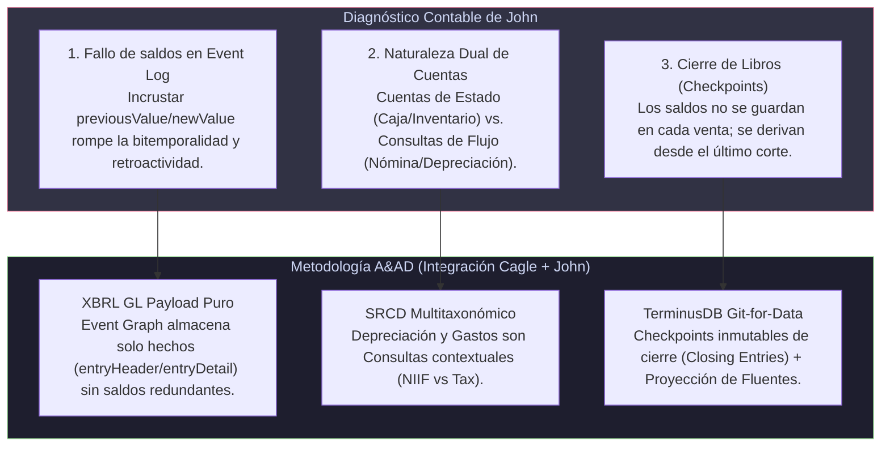

# Análisis Crítico: Interacción de John en el Substack de Kurt Cagle ("The Holon's Accountant") y su Convergencia con la Metodología A&AD

**Fecha:** 14 de Agosto de 2026  
**Fuente de la Interacción:** Comentario de John en la publicación *"The Holon's Accountant: Ledgers, reification, fluents, and why a holon needs four graphs, not one"* (Kurt Cagle & Chloe Shannon, Substack).  
**Archivo de Origen:** [`InteraccionJhon.txt`](file:///C:/Users/IPHIX/Documents/Projects/DFRNT/Documentacion/Kurt%20Cagle/Lkdn%202026-08-14/InteraccionJhon.txt)  
**Framework de Evaluación:** Metodología **A&AD (Accounting & Audit by Design)**  

---

## 1. Transcripción de la Interacción de John

> **John (John's Substack):**
>
> *"Thanks Kurt. I do enjoy a good accounting example."*
>
> *"The immutable, write-forward ledger traces back to the original double-entry bookkeeping method. Contemporaneous documentation is a foundation of maintaining truth, even when it makes correcting errors challenging."*
>
> *"Maintaining historical values of accounts, based on posted dates, is foundational to accounting and periodic reporting. A company is still reporting and refining revenue for last month, while continuing to record more revenue this month. Imbedding historical account balances in the event log does not seem like the right model, and often would not even give the right answer to a relevant question. In this example, revenue to-date as of June 30th never shows up as a value in the event graph."*
>
> *"It also raises the question as to how often do you even need a current balance? You need to know the current bank balance, how many widgets you have in supply and the amount you owe supplier ABC. But many accounts balances you need only know when you report them. Employee costs last month is a query and never shows up as a current account value. Depreciation expense is a query that is dependent on the reporting purpose (book or tax.)"*
>
> *"An alternative approach may be to periodically "close the books" and record an historical value of a fluent at a point in time, and then calculate the current value of a fluent based on a query of the event log and the last posted value. You could close the books monthly, or even daily, but you would not need to save the current and prior revenue account balance every time you made a sale."*
>
> *"Thanks again. Testing the holon architecture against these real-life accounting problems is sure be insightful."*

---

## 2. Diagnóstico Técnico de los Argumentos de John

El comentario de John constituye una **crítica contable de primer orden** a la implementación concreta planteada por Kurt Cagle en su artículo. Mientras Cagle aporta una abstracción estructural elegante (la separación en 4 grafos: *Schema, Knowledge, Event, Scene*), John pone el dedo en las llagas operativas de la ciencia contable real:



### A. Punto 1: Inmutabilidad y Registro Contemporáneo (*Ricordanze*)
* **Observación de John:** El libro mayor inmutable y de escritura hacia adelante (*write-forward*) se remonta a la partida doble original (Luca Pacioli). La documentación contemporánea es la base de la verdad contable.
* **Coincidencia A&AD:** Esto reafirma la premisa del **Semantic Ricordance Plane** en A&AD: las transacciones no se editan ni se borran; los errores se corrigen mediante eventos de ajuste posteriores contemporáneos (`gl-cor:postingDate`).

### B. Punto 2: La Invalidez de Guardar Saldos Históricos (`previousValue` / `newValue`) dentro del Event Log
* **Crítica a Cagle:** En el modelo de Cagle, cada `TransactionEvent` en `{holon}/events` intenta almacenar `previousValue`, `deltaValue` y `newValue`.
* **Argumento Contable de John:** 
  1. En el mundo real, los libros permanecen abiertos para ajustes del periodo anterior mientras se siguen registrando transacciones del periodo actual (ej. refinación de ingresos de junio durante el mes de julio).
  2. Si incrustamos `previousValue: 100` y `newValue: 70` de manera estática dentro de las tripletas de un evento, un ajuste retroactivo en mayo destruye y falsea encadenadamente todos los `previousValue` y `newValue` registrados en junio y julio.
  3. Los ingresos acumulados al 30 de junio nunca aparecen como un valor fijo estático en el registro de deltas de ventas individuales.
* **Solución A&AD:** Los eventos en el `Event Graph` deben ser **hechos atómicos puros de XBRL GL** (`gl-cor:entryDetail` con `gl-cor:amount` y `gl-cor:debitCreditCode`), **completamente desprovistos de saldos pre-calculados frágiles**. El saldo no es un dato guardado en el evento; es una función/consulta evaluada sobre un intervalo de tiempo bitemporal.

### C. Punto 3: Dicotomía entre Cuentas de Estado (Fluentes Continuos) y Consultas de Período (Flow Queries)
* **Argumento Contable de John:**
  - **Cuentas de Estado Continuo:** Banco (Caja), Inventarios (*widgets*), Cuentas por Pagar a Proveedores. Requieren monitoreo de saldo en tiempo real (`Scene Graph` / *Now Graph*).
  - **Cuentas Nominativas de Flujo / Consultas:** Gastos de empleados del mes pasado, Gastos de depreciación acumulada. **No son saldos de cuenta en tiempo real que requieran un Fluente activo actualizando una escena.** Son **consultas acotadas a un periodo y a un propósito regulatorio** (ej. Depreciación según NIIF/Libro vs. Depreciación Fiscal).
* **Solución A&AD:** A&AD soluciona esta distinción mediante el **Módulo SRCD (Structure & Reporting Taxonomy Mapping)**. Los eventos en XBRL GL se etiquetan semánticamente, pero el informe final (NIIF vs. Fiscal) es una **proyección de consulta (*Query View*)** utilizando `accountingPurposeCode`, no una tripleta rígida de saldo actual en el grafo de escena.

### D. Punto 4: La Arquitectura de Cierre de Libros ("Closing the Books") mediante Checkpoints
* **Propuesta de John:** En lugar de reescribir y guardar saldos en cada venta micro-operativa:
  1. Se "cierran los libros" periódicamente (diaria, mensual o anualmente) registrando un valor histórico del fluente en un punto de corte $t_k$.
  2. El saldo actual a un tiempo $t > t_k$ se calcula dinámicamente mediante una consulta al `Event Graph`:
     $$\text{Saldo}(t) = \text{Saldo}(t_k) + \sum_{i \in (t_k, t]} \Delta_i$$
* **Solución A&AD:** Esta propuesta de John coincide exactamente con la arquitectura de **TerminusDB / DFRNT (Git-for-Data)** en A&AD:
  - Un "Cierre de Libros" genera un **Commit Snapshot / Branch inmutable** con asientos de cierre (`gl-cor:closingEntry`).
  - La consulta de fluentes no escanea millones de eventos desde el origen de los tiempos ($t=0$), sino que inicia desde la **foto de corte (Checkpoint $t_k$)** y aplica la delta-encoding de la rama actual.

---

## 3. Matriz de Síntesis Triádica: Cagle vs. John vs. A&AD

| Dimensión | Modelo Kurt Cagle & Chloe Shannon | Comentario / Objeción de John | Respuesta & Solución Metodología A&AD |
| :--- | :--- | :--- | :--- |
| **Contenido del Event Graph** | Incrusta deltas (`deltaValue`), saldos anteriores (`previousValue`) y saldos nuevos (`newValue`). | **Rechazo:** Fragilidad total. Un ajuste retroactivo destruye el historial de saldos en los eventos. | **XBRL GL Payload Puro:** El `Event Graph` contiene únicamente hechos monetarios atómicos (`entryDetail`), sin saldos redundantes. |
| **Monitoreo de Saldos** | Asume que todas las cuentas requieren un Fluente continuo en el `Scene Graph`. | **Diferenciación:** Solo cuentas reales (Caja, CXP, Inventario) lo necesitan. Cuentas de resultado son **Consultas de Periodo**. | **Clasificación NIIF + SRCD:** Separa fluentes de estado (Caja/Inventario) de proyecciones dinámicas multitaxonómicas (IFRS vs TAX). |
| **Derivación de Saldos** | SPARQL `DELETE/INSERT` en cada transacción individual. | **Propuesta:** Cierre de libros periódico (Checkpoints) + Consulta sobre deltas recientes. | **TerminusDB Git-for-Data Checkpoints:** Commits de cierre de periodo inmutables + Consultas Datalog/SPARQL delta-encoded. |
| **Bitemporalidad** | Atributos `transactionDate` vs `recordedDate`. | Enfatiza que la contabilización del periodo anterior se refina mientras corre el periodo actual. | **Bitemporalidad Triádica:** Separa `postingDate` (fecha contable de corte), `documentDate` (hecho real) y `prov:generatedAtTime` (sistema). |

---

## 4. Opciones de Respuesta Sugeridas para Substack / LinkedIn

Para posicionar la Metodología **A&AD** como la síntesis unificadora entre la arquitectura estructural de Kurt Cagle y el rigor operativo expuesto por John:

### Opción 1: Respuesta Integradora en Substack (Recomendada)

```text
Spot on, John! Your commentary touches on the exact boundary where graph architecture meets real-world accounting mechanics.

Incrusting 'previousValue' and 'newValue' inside individual transaction events indeed breaks the moment you face retroactive adjustments, late-period posting, or multi-taxonomic reporting (e.g., Book vs. Tax depreciation). An event log should store immutable economic deltas (like XBRL GL entryDetail lines), not fragile running balance snapshots.

This is precisely why a checkpointed approach—periodically "closing the books" to create an authoritative point-in-time snapshot, and deriving current fluents via event queries since the last cutoff—is so powerful.

When combining Kurt’s 4-graph holon architecture with immutable commit graphs (like TerminusDB) and standardized micro-ledgers (XBRL GL), you get both: lightweight Scene Graph queries starting from period checkpoints, and pure, unpolluted Event Graphs. Great discussion!
```

### Opción 2: Respuesta Corta para LinkedIn

```text
Excellent points by John on Kurt Cagle’s recent piece! 

Storing static 'previousValue' / 'newValue' in transaction events creates nightmare dependencies during period-end adjustments. Transaction events must remain pure atomic facts (XBRL GL payload), while balances are derived from period checkpoints ("closed books") + query deltas.

This distinction between continuous state accounts (Cash, AP) and period queries (Depreciation, Revenue under IFRS vs Tax) is fundamental for enterprise Knowledge Graphs.
```

---

## 5. Conclusión y Siguientes Pasos

La intervención de John valida de manera independiente el diseño de la **Metodología A&AD**:
1. Confirma que la simplificación de Cagle (incrustar `previousValue`/`newValue` en los eventos) no resiste la práctica contable real.
2. Refuerza el uso de **XBRL GL** como el estándar indivisible de los eventos contables.
3. Resalta el valor de **DFRNT y TerminusDB** para gestionar el "Cierre de Libros" como **puntos de control inmutables (Checkpoints / Branching)**.

**Siguientes Pasos:**
1. Incorporar el análisis de John dentro de la documentación comparativa de W3C Holon CG.
2. Publicar la respuesta en Substack para dinamizar el debate entre Kurt Cagle y John.
