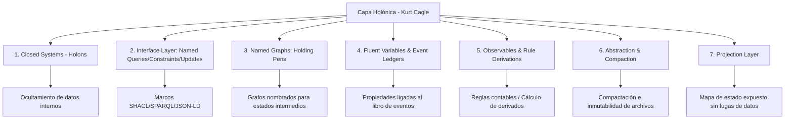
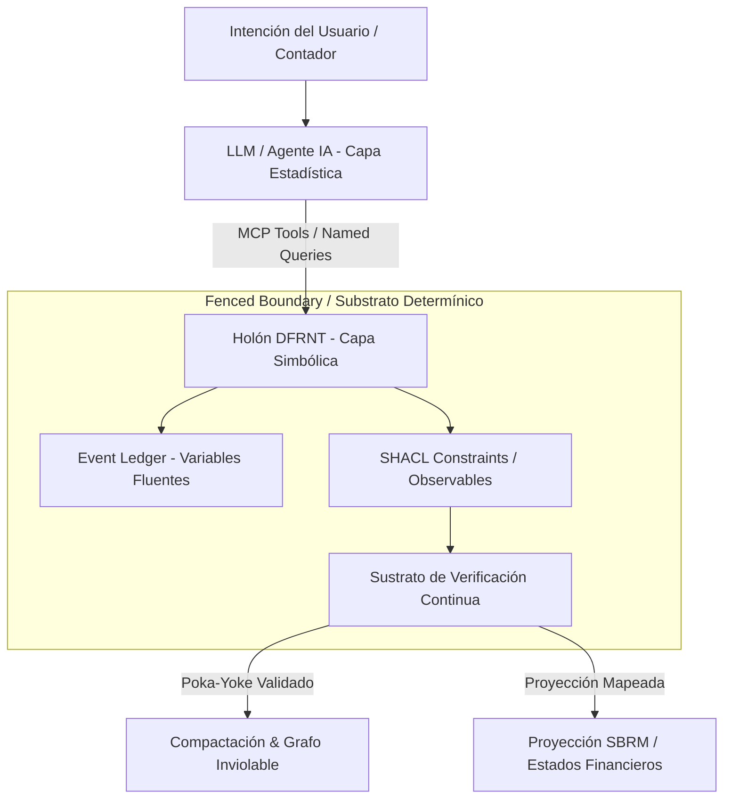

# Disección Metodológica: Neuro-Symbolic AI, Holones y Contabilidad Determinista (Kurt Cagle & Subramaniyam Pooni)

**Ubicación original:** [Lkdn_2026-07-28](file:///c:/Users/IPHIX/Documents/Projects/DFRNT/Documentacion/Kurt%20Cagle/Lkdn_2026-07-28)  
**Archivos analizados:**
- [Post.txt](file:///c:/Users/IPHIX/Documents/Projects/DFRNT/Documentacion/Kurt%20Cagle/Lkdn_2026-07-28/Post.txt) (Kurt Cagle - Publicación en LinkedIn)
- [Neuro-Symbolic AI May Finally Deliver the Promise of Autonomous Networking](file:///c:/Users/IPHIX/Documents/Projects/DFRNT/Documentacion/Kurt%20Cagle/Lkdn_2026-07-28/Neuro-Symbolic%20AI%20May%20Finally%20Deliver%20the%20Promise%20of%20Autonomous%20Networking%20_%20LinkedIn.pdf) (Subramaniyam Pooni - Artículo de fondo)
**Fecha de Análisis:** 2026-07-28  

---

## 1. Resumen Ejecutivo

Este análisis disecciona las publicaciones de **Kurt Cagle** y **Subramaniyam Pooni**, extrayendo los componentes arquitectónicos clave que validan, refuerzan y potencian el **stack tecnológico de DFRNT / A&AD (Accounting & Audit by Design)**.

La tesis central es que el futuro de la IA empresarial no reside en los LLMs aislados ni en los grafos de conocimiento puros, sino en una **Arquitectura Neuro-Simbólica** donde los grafos deterministas y las reglas operan como la **capa de fundamentación y verificación continua (Grounding & Verification Substrate)** sobre la cual razonan las IAs agénticas mediante **MCP (Model Context Protocol)**.

---

## 2. La Receta de 7 Elementos de Kurt Cagle para la Capa Semántica

Kurt Cagle señala que *"no es tanto la ontología por sí sola, sino la capa alrededor de ella lo que dará forma a la próxima ola de innovación"*. Cagle define 7 componentes estructurales:

1. **Sistemas Cerrados Semipermeables (#closed_systems / Holones)**:
   - Los datos internos están ocultos; el acceso se gestiona estrictamente a través de métodos de entrada y salida (Holones contables/contractuales).
2. **Capa de Interfaz Formalized (#named_queries, #named_constraints, #named_updates)**:
   - Consultas, restricciones y actualizaciones nombradas que encapsulan el grafo subyacente.
3. **Grafos Nombrados (#named_graphs)**:
   - Contenedores o "chiqueros de retención" (*holding pens*) para productos o estados intermedios de procesamiento.
4. **Variables Fluentes (#fluent_variables)**:
   - Propiedades de una entidad cuyos valores cambian en el tiempo al estar **ligadas a un libro de eventos** (*Event Ledger*).
5. **Observables (#observables)**:
   - Componentes que calculan derivadas a partir de variables constantes y fluentes, y que pueden poblar libros fluentes directamente (reglas de imputación/SHACL).
6. **Abstracción y Compactación (#abstraction, #compaction)**:
   - Transformación de holones activos en **holones inviolables y sellados** que persisten como contenido de archivo inmutable (cierre contable / auditoría).
7. **Capa de Proyección (#projection_layer)**:
   - Describen el estado (*mapa del holón*) para que otros holones lo consulten sin exponer el registro de transacciones crudo interno.

---

## 3. Principios de IA Neuro-Simbólica y Verificación Continua (S. Pooni)

El artículo de Subramaniyam Pooni aporta el marco complementario para sistemas agénticos:

### A. Complementariedad Neuro-Simbólica
- **IA Estadística (LLMs)**: Excelente para capturar intención humana, interpretar lenguaje natural, resumir evidencia y proponer hipótesis/configuraciones.
- **IA Simbólica (Grafos/Ontologías/SHACL)**: Excelente para representar hechos, mantener relaciones, imponer restricciones, preservar la proveniencia y realizar verificaciones deterministas.

### B. El "Intent Gap" (La Brecha de Intención)
Existe una brecha crítica entre lo que el usuario pide y lo que el sistema ejecuta:
$$\text{Intención Humana} \xrightarrow{\text{LLM}} \text{Interpretación} \xrightarrow{\text{Simbólico}} \text{Simulación} \xrightarrow{\text{Verificación}} \text{Ejecución Contable}$$
Para evitar fallos catastróficos, el sistema requiere un **Sustrato de Verificación Continua** (*Continuous Verification Substrate*) que valide cada acción antes y después de su ejecución.

### C. Dimensiones del Modelo del Mundo (World Model)
1. **Topología**: Qué está conectado con qué (Grafo de Entidades/Cuentas).
2. **Estado**: Qué está ocurriendo ahora (Saldos/Eventos actuales).
3. **Política**: Qué está permitido o requerido (Normas NIIF/US GAAP/Reglas del Negocio).
4. **Comportamiento**: Qué se espera que ocurra cuando algo cambia (Razonamiento Contrafáctico y Temporal).

---

## 4. Mapeo Directo y Contribución al Stack de DFRNT / A&AD

A continuación se muestra cómo estos conceptos se integran de manera directa en la arquitectura de **DFRNT**:

| Concepto Cagle / Pooni | Mapeo en el Stack DFRNT / A&AD | Impacto y Valor Agregado |
| :--- | :--- | :--- |
| **Holón Semipermeable** | **El Contrato / Entidad como Holón** (`el_contrato_como_holon.md`) | Encapsulamiento de datos financieros en límites cerrados (*fenced boundary*). |
| **Variables Fluentes & Event Ledger** | **XBRL GL + Economic Event Journal** (UBL $\rightarrow$ REA) | Registro de hechos económicos vinculados a propiedades variables en el tiempo. |
| **Observables & Named Constraints** | **Reglas SHACL + Reglas de Imputación** (Accounting Manifold) | Cálculo determinista de derivados ($Activo = Pasivo + Patrimonio$) sin alucinación. |
| **Abstracción & Compactación** | **Cierre Contable e Histórico Inviolable** | Conversión de transacciones activas en bloques inmutables de auditoría (*fail loudly*). |
| **Capa de Proyección** | **SBRM Concept Arrangement Patterns (CAP)** | Exposición de estados financieros proyectados sin revelar diarios transaccionales crudos. |
| **Integración MCP (Model Context Protocol)** | **DFRNT MCP Agentic Bridge** | Conexión directa entre LLMs (captura de intención) y el Grafo Simbólico/SHACL. |
| **Sustrato de Verificación Continua** | **Motor de Auditoría en Tiempo Real** (PoC Alemania) | Verificación de invariantes antes de autorizar cualquier asiento o cambio contable. |

---

## 5. Arquitectura del Stack DFRNT Neuro-Simbólico

---

## 6. Conclusiones y Próximos Pasos para DFRNT

1. **Formalizar la Capa MCP en DFRNT**: Utilizar el protocolo MCP (*Model Context Protocol*) como el habilitador estándar para que los LLMs interactúen con los Holones y Named Queries del grafo contable de DFRNT.
2. **Implementar el Modelo de Variables Fluentes**: Asegurar que cada propiedad del grafo esté explícitamente amarrada a eventos del *Economic Event Journal* (UBL / XBRL GL).
3. **Consolidar el Sustrato de Verificación Continua**: Presentar en la conferencia de Alemania (Sept. 2026) a A&AD no solo como un modelo de datos, sino como el **Sustrato Neuro-Simbólico de Verificación Continua** para la auditoría autónoma de empresas.
