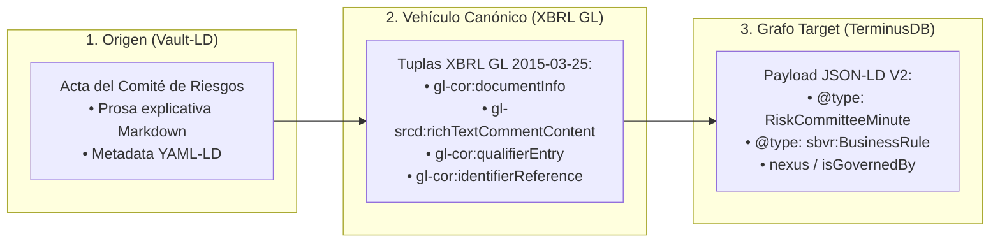

# Pipeline del Acta del Comité de Riesgos: De Vault-LD a XBRL GL y Transmutación a JSON-LD V2

**Autor:** Richard Gasca (`co.auditoria@pm.me`)  
**Estándar de Transporte:** XBRL Global Ledger (XBRL GL 2015-03-25 / `gl-cor`, `gl-srcd`, `gl-bus`)  
**Target:** Payload JSON-LD V2 para TerminusDB vía DFRNT Engine  
**Ubicación:** `Documentacion/Libro/acta_comite_riesgos_xbrlgl_jsonld.md`

---

## 1. El Principio Arquitectónico

En el framework **Accounting & Audit by Design (A&AD)**, toda evidencia cualitativa (como las conclusiones del **Acta del Comité de Riesgos**) debe cumplir con la regla de oro del pipeline: **pasar obligatoriamente por el vehículo canónico XBRL GL** para garantizar la paridad transaccional y la trazabilidad deóntica antes de inyectarse al Grafo de Conocimiento.



---

## 2. Mapeo de las Tuplas de XBRL GL para el Acta del Comité de Riesgos

Para transportar el Acta en XBRL GL sin perder su riqueza narrativa, se utilizan las tuplas estandarizadas del núcleo `gl-cor`, `gl-srcd` y `gl-bus`:

| Elemento en el Acta del Comité | Tupla Normativa XBRL GL (`gl-cor` / `gl-srcd`) | Propiedad Target JSON-LD V2 | Significado Semántico |
| :--- | :--- | :--- | :--- |
| **Identificador del Acta** | `gl-cor:documentNumber` | `RiskCommitteeMinute / documentNumber` | Número oficial del Acta. |
| **Fecha de la Sesión** | `gl-cor:documentDate` | `RiskCommitteeMinute / documentDate` | Fecha de ejecución del Comité. |
| **Tipo de Documento** | `gl-cor:documentType` (`"risk_minute"`) | `@type: RiskCommitteeMinute` | Clasificación ontológica del tipo de documento. |
| **Prosa Narrativa / Conclusiones** | `gl-srcd:richTextCommentContent` *(o `gl-cor:detailComment`)* | `RiskCommitteeMinute / minuteContent` | El texto explicativo completo del Acta (Vault-LD). |
| **Miembros del Comité** | `gl-cor:identifierReference` / `gl-cor:identifierCode` | `RiskCommitteeMinute / engaged_agents` | URIs de los auditores y directores participantes. |
| **Regla SBVR Vinculada** | `gl-cor:qualifierEntryDescription` | `isGovernedBy` | Enlace a la URI de la Regla Deóntica SBVR. |

---

## 3. Instancia JSON-LD V2 Resultante (`RiskCommitteeMinute`)

Una vez que Altova MapForce transmuta las tuplas de XBRL GL, se genera el payload **JSON-LD V2** listo para inyección en **TerminusDB**:

```json
[
  {
    "@type": "RiskCommitteeMinute",
    "@id": "urn:dfrnt:minute:risk-2026-08",
    "artifact_name": "Acta del Comité de Riesgos - Sesión Agosto 2026",
    "documentNumber": "Acta_Comite_Riesgos_2026_08",
    "documentDate": "2026-08-10",
    "engaged_agents": [
      "GistPerson/Socio_A",
      "GistPerson/Auditor_Principal"
    ],
    "minuteContent": "El Comité de Riesgos revisó la operación de constitución de Sociedad Génesis Ltda. Se ratifica la obligación deóntica de pago del 100% de los aportes en caja y se prohíbe el uso de cuentas por cobrar a socios.",
    "nexus": [
      "SourceDocument/Notaria 25 - 2005"
    ],
    "isGovernedBy": "urn:dfrnt:rule:sbvr:const-01"
  },
  {
    "@type": "http://www.omg.org/spec/SBVR/20190901/sbvr#BusinessRule",
    "@id": "urn:dfrnt:rule:sbvr:const-01",
    "artifact_name": "Regla de Negocio SBVR - Constitución Momento 0",
    "ruleStatement": "Es obligatorio el pago del 100% de los aportes al momento de la constitucion.",
    "deonticModality": "obligation",
    "ruleCategory": "operating-behavioral"
  }
]
```

---

## 4. Garantía de Inmunidad en TerminusDB

Al ingresar al Grafo:
1. **La prosa narrativa no se pierde:** Queda guardada en `minuteContent` para consumo de auditores humanos y modelos de lenguaje (LLMs / Agentes Symbio).
2. **Queda cosida al Grafo:** La propiedad `"nexus": ["SourceDocument/Notaria 25 - 2005"]` crea una arista que amarra el Acta directamente al contrato de constitución.
3. **Se valida con SHACL 1.2:** La propiedad `"isGovernedBy": "urn:dfrnt:rule:sbvr:const-01"` activa la validación del escudo deóntico, asegurando que las conclusiones del Comité se cumplan matemáticamente en el Libro Diario.
