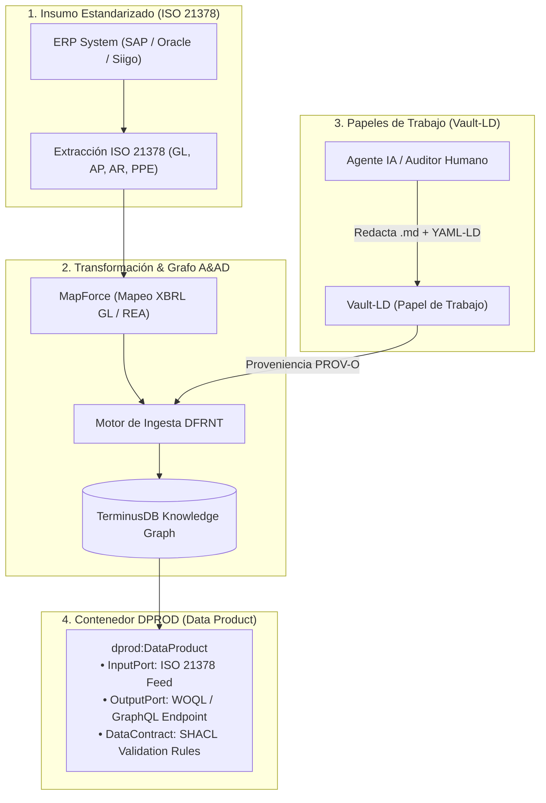

# Capítulo 14: La Evidencia Narrativa y la Malla de Datos — ISO 21378 (ADCS), Vault-LD y el Contenedor DPROD en A&AD

> *"El dato frío sin interpretación es mudo; el juicio del auditor sin anclaje semántico es una opinión vulnerable. La arquitectura A&AD une ambos mundos en un solo sustrato inmutable."*

---

## 1. El Abismo Histórico entre el Dato Frío y el Juicio Profesional

Durante décadas, la contabilidad y la auditoría han sufrido de un divorcio arquitectónico silencioso pero devastador:

1. **La Evidencia Dura (El Dato Frío):** Asientos contables, facturas electrónicas UBL, extractos bancarios e inventarios almacenados en las bases de datos relacionales del ERP (SAP, Oracle, Siigo).
2. **La Evidencia Narrativa (El Juicio del Auditor):** Explicaciones de variaciones, notas de ajuste, dictámenes de revisión, papeles de trabajo e inferencias analíticas redactadas por contadores y auditores.

En el paradigma tradicional, el dato frío vive en la base de datos transactional del ERP, mientras que la evidencia narrativa vive **totalmente aislada en archivos de Word, hojas de Excel o documentos PDF**. Cuando un auditor cuestiona un número seis meses después del cierre fiscal, debe emprender un rastreo arqueológico manual para averiguar qué papel de trabajo justificó ese asiento.

Con la irrupción de la **Inteligencia Artificial y los Agentes Autónomos**, este problema se agravó. Si un LLM analiza un estado financiero y emite un hallazgo en una ventana de chat, esa deducción se borra al cerrar la sesión. No hay proveniencia, no hay anclaje semántico y no hay auditabilidad legal.

El framework **Accounting & Audit by Design (A&AD)** resuelve esta brecha al integrar tres pilares internacionales: el estándar **ISO 21378 (ADCS)** para la extracción, **Vault-LD (Tony Seale)** para la narrativa agéntica y **DPROD** para la entrega federada en **TerminusDB vía DFRNT**.

---

## 2. ISO 21378 (ADCS): La Puerta de Entrada Universal al ERP

El primer paso para que A&AD funcione en cualquier organización es no depender de la estructura propietaria del ERP de turno. El estándar **ISO 21378: Audit Data Collection Standard (ADCS)** proporciona el catálogo unificado para extraer la información en 8 módulos de negocio estandarizados:

* `BAS` *(Base)*: Catálogo de cuentas, terceros, clientes y proveedores.
* `GL` *(General Ledger)*: Libro Mayor y detalle de comprobantes contables.
* `AR` *(Accounts Receivable)*: Módulo de cartera y cobros.
* `SAL` *(Sales)*: Módulo de ventas y facturación.
* `AP` *(Accounts Payable)*: Módulo de cuentas por pagar a proveedores.
* `PUR` *(Purchases)*: Órdenes de compra y recepciones de almacén.
* `INV` *(Inventory)*: Kardex, movimientos y valoración de inventario.
* `PPE` *(Property, Plant & Equipment)*: Activos fijos, depreciaciones y deterioros.

### La Transmutación al Sustrato A&AD

En el pipeline de A&AD, los datos provenientes de la extracción ISO 21378 (o de la captura primaria en XForms/BaseX) no se inyectan a ciegas. Pasan por el motor de mapeo **Altova MapForce** para transmutarse hacia la ontología económica **REA (ISO 15944-4)** y la estructura canónica **XBRL GL**, serializándose en **JSON-LD** con identificadores URI deterministas (`@id`).

$$\text{ERP (ISO 21378)} \xrightarrow{\text{MapForce}} \text{XBRL GL + REA} \xrightarrow{\text{JSON-LD}} \text{DFRNT Engine} \rightarrow \text{TerminusDB Graph}$$

---

## 3. Vault-LD: Amarrando los Papeles de Trabajo al Grafo de Conocimiento

Inspirado en los desarrollos de **Tony Seale** (*The Knowledge Graph Guys*), **Vault-LD** es la especificación que permite que la prosa (escrita por contadores humanos o redactada autónomamente por Agentes de IA) se convierta en **tripletas RDF deterministas** sin perder su legibilidad humana.

### Anatomía de un Papel de Trabajo A&AD en Vault-LD

Un papel de trabajo en A&AD se escribe en formato **Markdown**, pero su encabezado (*frontmatter*) contiene la semántica formal en **YAML-LD**:

```markdown
---
"@context":
  "@vocab": "http://dfrnt.com/schema/aad/audit#"
  rea: "http://iso.org/15944-4/rea#"
  xbrlgl: "http://www.xbrl.org/2006/gl#"
  prov: "http://www.w3.org/ns/prov#"
"@type": "AuditWorkpaper"
"@id": "urn:dfrnt:workpaper:2026-AP-0092"
prov:wasDerivedFrom:
  "@id": "urn:dfrnt:entry:2026-GL-88192"
auditorAgent: "urn:dfrnt:agent:ai-auditor-v4"
assertionType: "ValuationAndAllocation"
severity: "MaterialDiscrepancy"
---

# Papel de Trabajo: Verificación de Deterioro de Activo (NIC 36)

## 1. Hallazgo de Auditoría
El Agente de IA detectó una inconsistencia entre el valor contabilizado en el módulo `PPE` (ISO 21378) y la tasa de descuento aplicada según el contrato contractual registrado en REA.

## 2. Evidencia Probatoria
El asiento contable registrado bajo el URI `urn:dfrnt:entry:2026-GL-88192` presenta una desviación de $14,200 USD en la depreciación acumulada.
```

### El Fin de la Alucinación de la IA en Auditoría

Cuando un Agente IA ejecuta una revisión en A&AD:
1. Inspecciona el grafo en **TerminusDB** ejecutando consultas WOQL/GraphQL.
2. Identifica cualquier quiebre de la **Dualidad REA** o inconsistencia en **XBRL GL**.
3. Redacta automáticamente su papel de trabajo en formato **Vault-LD**.
4. **DFRNT** procesa el encabezado YAML-LD y lo inyecta **de regreso al Grafo de Conocimiento en TerminusDB**.

Gracias a la proveniencia **W3C PROV-O**, el papel de trabajo queda vinculado de forma permanente al asiento contable exacto. La memoria de la IA no vive en una ventana de chat efímera; vive en el mismo grafo inmutable que los estados financieros.

---

## 4. DPROD: La Malla de Datos y la Auditoría como Producto

Para que la contabilidad y la auditoría A&AD puedan consumirse sin fricción por entes reguladores (DIAN, IRS, SEC, Bancos Centrales) o firmas de auditoría externas, el sistema empaqueta el grafo de TerminusDB como un **Data Product** bajo la ontología **DPROD** (desarrollada por el *Enterprise Knowledge Graph Forum* de la OMG).



### Anatomía del Contenedor DPROD en A&AD:
* **`dprod:inputPort`:** Define los pipelines de ingesta (XBRL GL, UBL, ISO 21378, Vault-LD).
* **`dprod:outputPort`:** Expone los endpoints GraphQL y WOQL para consultas en tiempo real.
* **`dprod:dataContract`:** Incluye el conjunto de reglas **SHACL** que certifican que el balance cuadra a nivel de grafo, que la Dualidad REA se cumple y que no existen asientos huérfanos.

---

## 5. Auditoría No Financiera y Sostenibilidad (ESG) en A&AD: Más allá del Dinero

Una ventaja decisiva de la arquitectura A&AD es que la ontología **REA (ISO 15944-4)** y los grafos de conocimiento en **TerminusDB** no están restringidos a la contabilidad monetaria tradicional. Permiten la **Doble Materialidad** (*Double Materiality*), auditando tanto el impacto financiero como el impacto no financiero (Ambiental, Social y Gobernanza - ESG).

### A. La Dualidad Ecológica en el Grafo A&AD

En la contabilidad financiera, un evento REA vincula un incremento de recurso financiero con un decremento de mercancía (Dualidad Económica). En la contabilidad de sostenibilidad (ESRS / CSRD / GRI / ISSB S1 y S2), la dualidad se mantiene en el sustrato físico:

$$\text{Evento de Compra (Diésel)} \xrightarrow{\text{Dualidad Físico-Ambiental}} \text{Evento de Emisión } (CO_2eq \text{ Alcance 1})$$

* **Recursos No Financieros:** Gigajulios de energía, kilovatios-hora (kWh), toneladas métricas de $CO_2eq$, litros de agua reciclada, horas de capacitación en seguridad laboral.
* **Eventos No Financieros:** Telemetría de sensores IoT en plantas de producción, lecturas de caudalímetros, rutas de transporte logístico.

### B. Detección de *Greenwashing* y Auditoría Agéntica ESG con Vault-LD

Al convivir los módulos financieros (`AP` / `PUR` de ISO 21378) con los módulos ambientales (ESRS/GRI) en el **mismo Grafo de TerminusDB**, un Agente IA de auditoría puede ejecutar consultas WOQL cruzadas que detectan inconsistencias físicas versus financieras:

> *"Identificar todas las facturas de combustible registradas en Cuentas por Pagar (ISO 21378 AP) cuyo volumen energético no coincida físicamente con las toneladas de $CO_2$ reportadas en los módulos de emisión de la empresa."*

Si el agente identifica que se compraron $50,000 USD en combustible pero se declaró una fracción mínima de emisiones, redacta un papel de trabajo en **Vault-LD**:

```markdown
---
"@context":
  "@vocab": "http://dfrnt.com/schema/aad/esg#"
  gri: "http://resource.globalreporting.org/schema/"
  esrs: "http://efrag.org/schema/esrs#"
  prov: "http://www.w3.org/ns/prov#"
"@type": "ESGDiscrepancyWorkpaper"
"@id": "urn:dfrnt:esg-workpaper:2026-GHG-088"
prov:wasDerivedFrom:
  - "@id": "urn:dfrnt:entry:2026-AP-77102" # Factura de Diésel en ISO 21378
  - "@id": "urn:dfrnt:esg:scope1-fuel-q1" # Reporte de Emisiones ESRS E1
severity: "CriticalRisk"
assertionType: "GreenwashingRisk / PhysicalInconsistency"
---

# Papel de Trabajo ESG: Subreporte de Emisiones Alcance 1 (ESRS E1)

## 1. Hallazgo del Agente de IA
Se detectó una inconsistencia física entre el volumen de combustible facturado ($12,400 USD / 3,100 galones) y el reporte de emisiones Scope 1. 

## 2. Incoherencia Física
El combustible facturado equivale a $31.32\text{ tCO}_2\text{eq}$ según factores IPCC, pero la entidad solo declaró $3.10\text{ tCO}_2\text{eq}$ en su informe ESRS E1.
```

Ese papel de trabajo se inyecta de regreso al grafo vía **DFRNT**, garantizando que la auditoría no financiera posea la misma inmutabilidad y rigor matemático que los estados financieros.

---

## 6. El Nuevo Modelo de Contratación de Auditoría en la Era A&AD

Con esta arquitectura integrada, el servicio de auditoría se transforma radicalmente:

1. **Sin Solicitud de Archivos:** La empresa no le envía carpetas de Excel ni reportes PDF al auditor. Simplemente le otorga credenciales al puerto de salida (`dprod:outputPort`) de su **Grafo A&AD en TerminusDB**.
2. **Auditoría Continua 24/7:** Los Agentes de IA del auditor inspeccionan el 100% de la población de transacciones (financieras y ESG) en tiempo real, en lugar de realizar autopsias por muestreo meses después del cierre.
3. **Papeles de Trabajo Vivos:** Cada hallazgo queda registrado en Vault-LD dentro del mismo sustrato semántico, permitiendo que humanos y máquinas colaboren sobre la misma versión inmutable de la verdad.

---

## 7. Conclusión del Capítulo

Al combinar la extracción estandarizada de **ISO 21378**, la ontología económica **REA (ISO 15944-4)**, el rigor transaccional de **XBRL GL**, la narrativa agéntica de **Vault-LD**, el reporte no financiero de **ESRS/GRI** y la publicación federada de **DPROD**, el framework **A&AD (Accounting & Audit by Design)** eleva la contabilidad de una disciplina de registro reactivo a una **arquitectura de certeza matemática integral (Financiera + Ambiental + Social) en tiempo real**.
