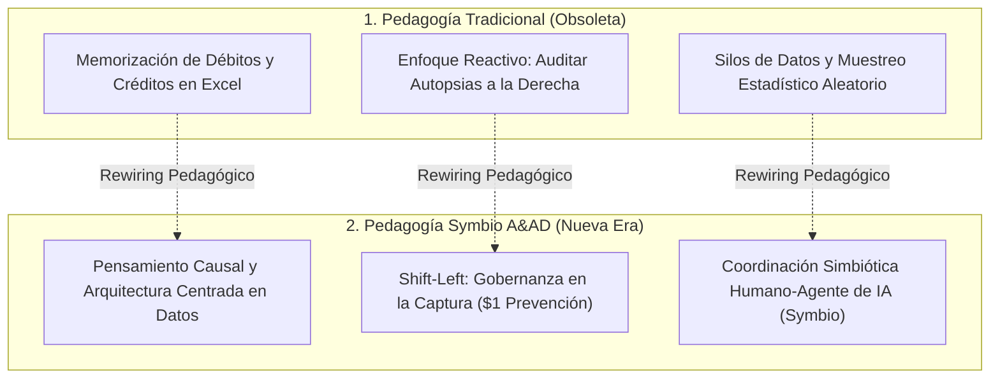
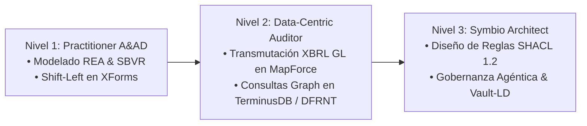

# Capítulo 15: La Metodología Pedagógica Symbio — Formando al Contador y Auditor de la Era Agéntica en el Framework A&AD

**Autor:** Richard Gasca (`co.auditoria@pm.me`)  
**Marco de Referencia:** David A. Wood, Ph.D. (*Brigham Young University - BYU* / AICPA & CIMA) & Tom Hood, CPA, CGMA, CITP.  
**Framework:** Accounting & Audit by Design (A&AD).

---

## 1. El Dilema Pedagógico: Por qué la Educación Contable Tradicional ha Colapsado

Durante más de medio siglo, las facultades de contabilidad y los programas de desarrollo profesional han enseñado la contabilidad bajo una premisa mecánica: memorizar la dinámica de débitos y créditos en planes de cuentas estáticos, llenar plantillas en Excel y realizar revisiones aleatorias de muestras de facturas meses después de ocurridos los hechos.

En la era de la inteligencia artificial generativa y los agentes autónomos, **esta pedagogía de la memorización mecánica es un callejón sin salida**. La máquina ejecuta cualquier registro o cálculo en microsegundos. El profesional que fue educado únicamente para ser un "procesador manual de transacciones" queda obsoleto.

Tal como lo demuestra el **Dr. David A. Wood (BYU / AICPA & CIMA)** en su investigación seminal *Rewiring Your Mind for AI*:

> *"La habilidad más importante en esta nueva era no es aprender a programar ni memorizar el comando de la última herramienta. Es cambiar cómo piensas. Lo que frena a los profesionales no es la tecnología, sino los supuestos obsoletos que traen del pasado."*

---

## 2. Los 4 Pilares Pedagógicos del Framework A&AD

Para capacitar a contadores, auditores, docentes y líderes financieros en el abordaje del paradigma **A&AD**, se establece la **Metodología Pedagógica Symbio**, estructurada en 4 pilares fundamentales:

### Pilar 1: Re-cableado de la Mentalidad (*Rewiring the Mindset*)
* **De Tenedor de Libros a Arquitecto de la Realidad Económica:** Los profesionales no aprenden a registrar "asientos sueltos"; aprenden a entender el origen legal del hecho económico en el **Momento Cero**.
* **El Principio del $1 Shift-Left:** Se enseña al profesional a evaluar el costo del error mediante la regla 1-10-100 de Charles Hoffman ($1 gastado en prevención en la fuente evita $100 de falla catastrófica en el reporte final).

### Pilar 2: Aprendizaje Basado en Holones y Contratos (*Contract-as-Holon PBL*)
* En lugar de iniciar enseñando la cuenta contable, los profesionales aprenden a modelar el contrato primario (Escritura Pública, Acuerdo Comercial) integrando la ontología **REA (ISO 15944-4)**, los modelos financieros **ACTUS** y el metamodelo **OMG SBVR**.
* El estudiante comprende que el **Libro Diario no es la fuente**, sino una **vista proyectada** derivada del acuerdo primario.

### Pilar 3: Coordinación Simbiótica Humano-Agente (*Pair-Auditing Symbio*)
* **Trabajo en Parejas Humano + Agente de IA:** El profesional aprende a colaborar interactivamente con agentes inteligentes.
* Mientras el agente analiza millones de tripletas en el Grafo de Conocimiento de **TerminusDB** y compila reglas **SHACL 1.2**, el profesional humano se enfoca en el juicio profesional de alto nivel, la ética y la estrategia de gobernanza.

### Pilar 4: Papeles de Trabajo Narrativos en Vault-LD
* El profesional aprende a redactar evidencia narrativa mediante **Vault-LD (Tony Seale)**: notas en Markdown donde la prosa cualitativa para humanos se entrelaza sin esfuerzo con encabezados **YAML-LD** estructurados para la máquina.

---

## 3. Matriz de Transformación del Perfil Profesional

| Dimensión Competencial | Perfil Contable / Auditor Tradicional | Perfil CyberCPA / A&AD Symbio |
| :--- | :--- | :--- |
| **Rol Principal** | Registro contable y revisión muestral a posteriori. | Gobernanza deóntica y arquitectura del Grafo de Conocimiento. |
| **Entorno de Trabajo** | Hojas de cálculo Excel, ERPs relacionales aislados. | DFRNT Engine, TerminusDB, Altova MapForce, Vault-LD. |
| **Gobernanza y Reglas** | Lectura manual de manuales de políticas y NIIF. | Compilación de Reglas SBVR a escudos computacionales SHACL 1.2. |
| **Interacción con la IA** | Temor al reemplazo o uso ingenuo de ChatGPT (RAG). | Coordinación simbiótica (Symbio) con Agentes de Auditoría Zero-Shot. |
| **Evidencia Probatoria** | Muestras en PDF y carpetas desconectadas. | Grafo inmutable de tripletas con linaje W3C PROV-O y bitemporalidad. |

---

## 4. El Plan de Carrera Pedagógico: Del Aula a la Empresa

El despliegue pedagógico del paradigma A&AD sigue 3 niveles progresivos de maestría:

---

## 5. Conclusión: Elevando la Profesión Contable y de Auditoría

La pedagogía **Symbio A&AD** no busca convertir a los contadores en programadores de código duro, ni a los auditores en científicos de datos. Busca formarlos como **Arquitectos de la Verdad Económica**. 

Al integrar la investigación del **Dr. David A. Wood**, el respaldo institucional de la **AICPA y CIMA**, y la solidez de la pila tecnológica **A&AD**, este capítulo establece la hoja de ruta clara para que docentes, universidades y firmas de auditoría lideren la transformación profesional más profunda del siglo XXI.
