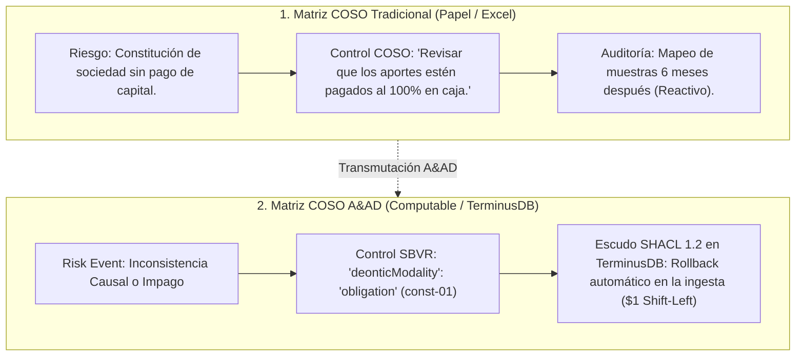

# La Transformación del Marco COSO al Paradigma Accounting & Audit by Design (A&AD)

**Autor:** Richard Gasca (`co.auditoria@pm.me`)  
**Marcos de Referencia:** COSO ERM (Internal Control - Integrated Framework) & OMG SBVR 1.5.  
**Ubicación:** `Documentacion/Libro/coso_matriz_riesgos_aad_sbvr.md`

---

## 1. De la Matriz COSO en Excel a los Escudos Computacionales A&AD

En el ejercicio tradicional de auditoría y gestión de riesgos, las matrices COSO viven como documentos estáticos en Excel o PDFs guardados en SharePoint. Los controles se expresan como recomendaciones en prosa que dependen del cumplimiento manual y de revisiones aleatorias por muestreo posterior.

En la arquitectura **Accounting & Audit by Design (A&AD)**, la matriz COSO se transforma en una **máquina de inmunización ejecutable en tiempo real**:



---

## 2. Correspondencia entre los 5 Componentes de COSO y el Stack A&AD

| Componente del Marco COSO | Implementación Tradicional en Empresas | Implementación Computacional en A&AD |
| :--- | :--- | :--- |
| **1. Entorno de Control (*Control Environment*)** | Políticas escritas en PDFs y valores corporativos declarativos. | **Gobernanza Deóntica SBVR (OMG):** Vocabulario estandarizado y reglas de negocio formales. |
| **2. Evaluación de Riesgos (*Risk Assessment*)** | Mapas de calor (Probabilidad vs Impacto) en Excel. | **Identificación de Fallas Causales en Grafos (REA / ISO 15944):** Detección de rupturas de Dualidad. |
| **3. Actividades de Control (*Control Activities*)** | Firmas manuales, segregación de funciones en ERPs relacionales. | **Escudos SHACL 1.2 en TerminusDB:** Reglas Poka-Yoke ejecutadas en la ingesta (Rollback si no cumple). |
| **4. Información y Comunicación (*Information & Comm.*)** | Reportes mensuales impresos y extractos desconectados. | **Grafo de Conocimiento Inmutable (DFRNT Engine):** Tripletas JSON-LD bitemporales con linaje W3C PROV-O. |
| **5. Monitoreo Continuo (*Monitoring Activities*)** | Revisoría fiscal y auditoría interna a posteriori por muestras. | **Agentes de IA Symbio (David A. Wood):** Monitoreo continuo algorítmico sin alucinaciones. |

---

## 3. Ejemplo Práctico de Transmutación de un Control COSO

### Expresión en Matriz COSO Tradicional:
* **Proceso:** Constitución de Sociedades y Apertura de Capital.
* **Objetivo de Control:** Asegurar la efectividad del aporte de capital al inicio de la empresa (NIC 24 / Código de Comercio).
* **Riesgo Identificado:** Registro de aportes mediante cuentas por cobrar o pagaré sin liquidez real en bancos.
* **Control Diseñado:** *"El contador debe verificar el extracto bancario antes de contabilizar el aporte."* (Vulnerable al error humano o a la omisión).

### Transmutación a A&AD (SBVR + SHACL + TerminusDB):

1. **Expresión SBVR (Lenguaje Natural Controlado):**
   ```json
   {
     "@type": "sbvr:BusinessRule",
     "@id": "urn:dfrnt:rule:sbvr:const-01",
     "ruleStatement": "Es obligatorio el pago del 100% de los aportes al momento de la constitucion.",
     "deonticModality": "obligation",
     "ruleCategory": "operating-behavioral"
   }
   ```

2. **Ejecución Algorítmica Poka-Yoke (SHACL 1.2 / TerminusDB):**
   Si la transacción entrante asigna la cuenta `130505` (Cuentas por Cobrar) en lugar de `110505` (Caja General), el control COSO no "recomienda", **imposibilita la transacción físicamente**. La transacción es rechazada en la puerta ($1 Shift-Left).

---

## 4. Conclusión para el Auditor y Administrador de Riesgos

Estar frente al mapa de riesgos y controles COSO bajo el paradigma A&AD significa entender que **la matriz de riesgos deja de ser una lista de auditoría pasiva para convertirse en el plano de construcción del sistema operativo inmutable de la empresa**. 

Cada control de tu matriz COSO se convierte en una **Regla Deóntica SBVR** que se compila como un **Escudo SHACL 1.2** sobre el Grafo de Conocimiento en **TerminusDB**.
