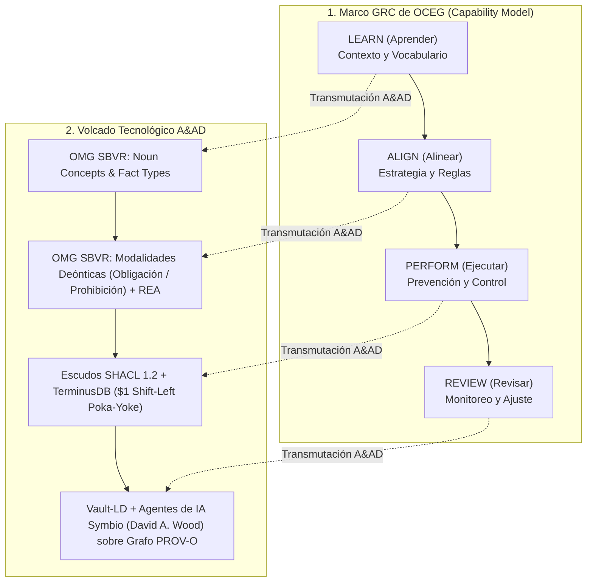

# El Modelo de Capacidad GRC de OCEG en la Arquitectura Accounting & Audit by Design (A&AD)

**Autor:** Richard Gasca (`co.auditoria@pm.me`)  
**Marcos de Referencia:** OCEG GRC Capability Model (Learn, Align, Perform, Review) & OMG SBVR 1.5.  
**Ubicación:** `Documentacion/Libro/oceg_grc_capability_model_aad_sbvr.md`

---

## 1. De la Teórica de GRC (OCEG) a la Inmunidad Algorítmica (A&AD)

El modelo de capacidad **GRC (Gobernanza, Riesgo y Cumplimiento) de OCEG** (*Open Compliance & Ethics Group*) ha sido el estándar de oro para estructurar cómo las organizaciones logran el **Rendimiento Principioso (*Principled Performance*)**: alcanzar objetivos mientras se gestiona la incertidumbre y se actúa con integridad.

Sin embargo, históricamente el modelo OCEG tropezaba con la barrera de la implementación tecnológica: dependía de cuestionarios, software de GRC desconectado del core transaccional y revisiones de auditoría posteriores.

En la arquitectura **Accounting & Audit by Design (A&AD)**, el modelo **GRC de OCEG queda 100% volcado e industrializado** como un motor de ejecución en tiempo real sobre Grafos de Conocimiento:

---

## 2. Correspondencia Técnica: OCEG GRC vs Stack A&AD

| Componente OCEG GRC | Propósito del Componente | Implementación en la Pila A&AD |
| :--- | :--- | :--- |
| **1. LEARN (Aprender)** | Comprender el contexto, los objetivos y el vocabulario de la organización. | **OMG SBVR (Business Vocabulary):** Definición formal de `NounConcepts` y `FactTypes`. |
| **2. ALIGN (Alinear)** | Alinear la gobernanza, los compromisos legales y los límites de riesgo. | **Gobernanza Deóntica SBVR + REA (ISO 15944-4):** Operadores deónticos (`obligation`, `prohibition`) y causalidad económica. |
| **3. PERFORM (Ejecutar)** | Promover el comportamiento deseado y prevenir el incumplimiento. | **Escudos SHACL 1.2 en TerminusDB:** Prevención en origen ($1 Shift-Left) con Rollback automático si viola el control. |
| **4. REVIEW (Revisar)** | Evaluar el desempeño del sistema y monitorear continuamente. | **Vault-LD + Agentes de IA Symbio (David A. Wood):** Monitoreo continuo algorítmico sobre el Grafo Bitemporal W3C PROV-O. |

---

## 3. La Verificación del "Principled Performance" en A&AD

Con este volcado:
1. **La Gobernanza (G):** Deja de ser un manual de políticas en PDF; se convierte en el **Vocabulario y Reglas SBVR** integradas en el JSON-LD.
2. **El Riesgo (R):** Deja de ser una suposición en un mapa de calor; se convierte en una **restricción SHACL 1.2** sobre la forma del subgrafo.
3. **El Cumplimiento (C):** Deja de ser una muestra de auditoría tardía; se convierte en la **condición matemática obligatoria para ingresar a la bóveda inmutable de TerminusDB**.
