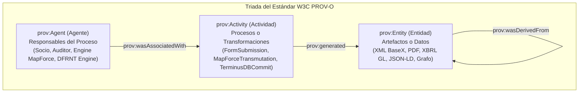
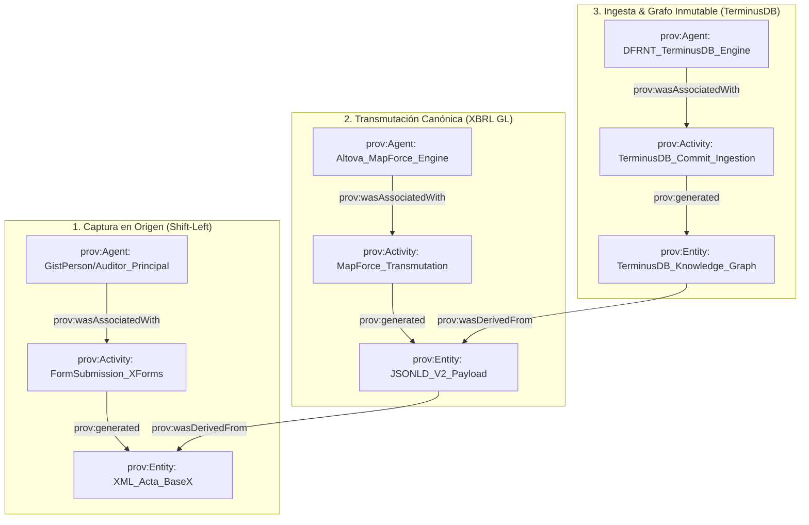

# El Modelo W3C PROV-O (Provenance) en la Arquitectura Accounting & Audit by Design (A&AD)

**Autor:** Richard Gasca (`co.auditoria@pm.me`)  
**Estándar Normativo:** W3C PROV-O (Provenance Ontology / `http://www.w3.org/ns/prov#`)  
**Ubicación:** `Documentacion/Libro/prov_o_provenance_linaje_aad.md`

---

## 1. ¿Qué es W3C PROV-O y por qué es Vital en Auditoría?

El estándar del W3C **PROV-O (Provenance Ontology)** define la estructura matemática para registrar el **linaje, la cadena de custodia y la procedencia ininterrumpida de los datos**.

En contabilidad y auditoría tradicional, cuando un número aparece en un reporte financiero, es casi imposible rastrear mecánicamente qué software lo transformó, qué usuario lo ingresó originalmente y de qué contrato proviene.

En el framework **Accounting & Audit by Design (A&AD)**, **PROV-O opera como el tejido transversal de trazabilidad**, conectando cada nodo del Grafo de Conocimiento con su origen legal indiscutible.

---

## 2. Los 3 Pilares Fundamentales de W3C PROV-O

PROV-O se estructura sobre una triada conceptual muy simple y poderosa:

---

## 3. ¿En qué lugar EXACTO entra Provenance dentro de tu Stack A&AD?

**PROV-O amarra las 3 capas del pipeline de extremo a extremo:**

---

## 4. Respuestas Forenses Inmediatas que PROV-O otorga al Auditor

Mediante la inclusión de las propiedades **W3C PROV-O** en tu JSON-LD V2 (`nexus`, `wasDerivedFrom`, `wasAttributedTo`), el auditor puede realizar consultas SPARQL/WOQL instantáneas:

1. **Prueba de Origen (`prov:wasDerivedFrom`):**  
   Demuestra que el asiento en el Libro Diario (`EntryDetail`) proviene del payload JSON-LD de MapForce, que a su vez se derivó del XML original guardado en BaseX desde el formulario XForms.
   $$\text{TerminusDB Graph} \xrightarrow{\text{wasDerivedFrom}} \text{JSON-LD V2} \xrightarrow{\text{wasDerivedFrom}} \text{XBRL GL} \xrightarrow{\text{wasDerivedFrom}} \text{XML BaseX (XForms)}$$

2. **Prueba de Responsabilidad (`prov:wasAttributedTo` / `prov:wasAssociatedWith`):**  
   Identifica qué agente humano (`GistPerson/Auditor_Principal`) o agente informático (`Engine/MapForce`) ejecutó cada transformación.

3. **Prueba de Integridad Temporal (`prov:startedAtTime` / `prov:endedAtTime`):**  
   Diferencia el tiempo en el que ocurrió el hecho en el mundo real (*Valid Time*) del tiempo en que el dato ingresó criptográficamente a la base de datos (*Transaction Time*), haciendo imposible la alteración retroactiva de la contabilidad.
