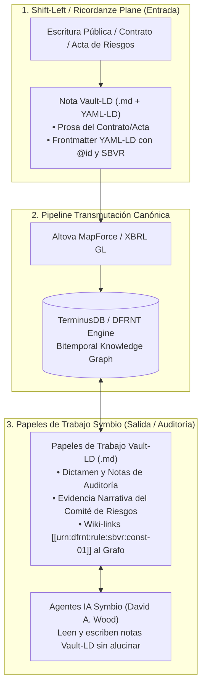

# Integración de Vault-LD en el Stack Accounting & Audit by Design (A&AD)

**Autor:** Richard Gasca (`co.auditoria@pm.me`)  
**Estándar / Formato:** Vault-LD (Tony Seale - *The Knowledge Graph Guys* / `https://vault-ld.org/`)  
**Ubicación:** `Documentacion/Libro/vault_ld_integracion_stack_aad.md`

---

## 1. ¿Qué es Vault-LD y por qué es una Pieza Clave en A&AD?

**Vault-LD** (creado por Tony Seale) es un formato abierto diseñado para convertir una bóveda de notas en **Markdown** en un **Grafo de Conocimiento RDF / JSON-LD** de forma transparente:

* **YAML-LD Frontmatter:** El encabezado del archivo Markdown contiene metadatos en JSON-LD/YAML-LD (`@context`, `@type`, `@id`, ontologías REA/SBVR).
* **Wiki-Links (`[[Concepto]]`):** Los enlaces entre notas de Markdown se convierten automáticamente en **aristas tipadas del Grafo de Conocimiento**.
* **Cuerpo de la Nota (Prosa Narrativa):** Permanece como texto en Lenguaje Natural legible simultáneamente por auditores humanos y modelos de lenguaje (LLMs / Agentes de IA).

---

## 2. ¿En qué lugar EXACTO entra Vault-LD dentro de tu Stack A&AD?

Vault-LD se ubica en **DOS PUNTOS ESTRATÉGICOS DE TU ARQUITECTURA**:



---

## 3. Las Dos Funciones Críticas de Vault-LD en A&AD

### A. En la Entrada: El Contrato Holón y el Acta del Comité de Riesgos (*Ricordanze Plane*)
* **El Problema:** Las conclusiones de un Acta del Comité de Riesgos o las cláusulas de una Escritura Pública son prosa narrativa explicativa. No son celdas numéricas frías en un ERP.
* **La Solución Vault-LD:** La conclusión del Comité se redacta como una nota `.md`. El cuerpo contiene el texto explicativo y el encabezado **YAML-LD** declara las relaciones semánticas (`@type`: `RiskCommitteeMinute`, `prov:wasDerivedFrom`: `SourceDocument/Notaria_25`, `sbvr:governedBy`: `urn:dfrnt:rule:sbvr:const-01`).

```markdown
---
@context: "https://dfrnt.io/context/v2.jsonld"
@type: "RiskCommitteeMinute"
@id: "urn:dfrnt:minute:risk-2026-08"
artifact_name: "Acta Comité de Riesgos Agosto 2026"
engaged_agents:
  - "GistPerson/Socio_A"
  - "GistPerson/Auditor_Principal"
isGovernedBy: "urn:dfrnt:rule:sbvr:const-01"
---

# Conclusiones del Comité de Riesgos

En la sesión del 10 de Agosto de 2026, el Comité verificó la constitución de la entidad...
```

---

### B. En la Salida: Papeles de Trabajo de Auditoría Symbio (*Working Papers*)
* **El Problema:** La auditoría requiere redactar memorandos, hallazgos y papeles de trabajo que los revisores humanos y los reguladores deban firmar y consultar.
* **La Solución Vault-LD:** El auditor humano y el **Agente de IA (Symbio)** trabajan juntos sobre notas Vault-LD. Un wiki-link dentro del memorando de auditoría (`[[urn:dfrnt:rule:sbvr:const-01]]` o `[[EntryHeader/Header_Genesis_1]]`) se convierte automáticamente en una **arista directa conectada al Grafo Bitemporal de TerminusDB**.

---

## 4. El Cuadro Completo de la Pila A&AD

$$\begin{matrix}
\text{\textbf{Capa / Función}} & \text{\textbf{Estándar / Herramienta Utilizada}} \\
\hline
\text{Captura & Evidencia Narrativa} & \mathbf{\text{Vault-LD (Tony Seale / Markdown + YAML-LD)}} \\
\text{Causalidad Económica} & \mathbf{\text{ISO 15944 (REA) + ACTUS Framework}} \\
\text{Gobernanza Deóntica} & \mathbf{\text{OMG SBVR 1.5 (Controlled Natural Language)}} \\
\text{Transporte Canónico} & \mathbf{\text{XBRL Global Ledger (XBRL GL SRCD)}} \\
\text{Serialización Semántica} & \mathbf{\text{W3C JSON-LD V2 Payload}} \\
\text{Inmunización Algorítmica} & \mathbf{\text{W3C SHACL 1.2 Constraint Shields}} \\
\text{Grafo Bitemporal} & \mathbf{\text{TerminusDB / DFRNT Engine}} \\
\text{Coordinación IA-Humano} & \mathbf{\text{Paradigma Symbio (David A. Wood - BYU / AICPA)}}
\end{matrix}$$
