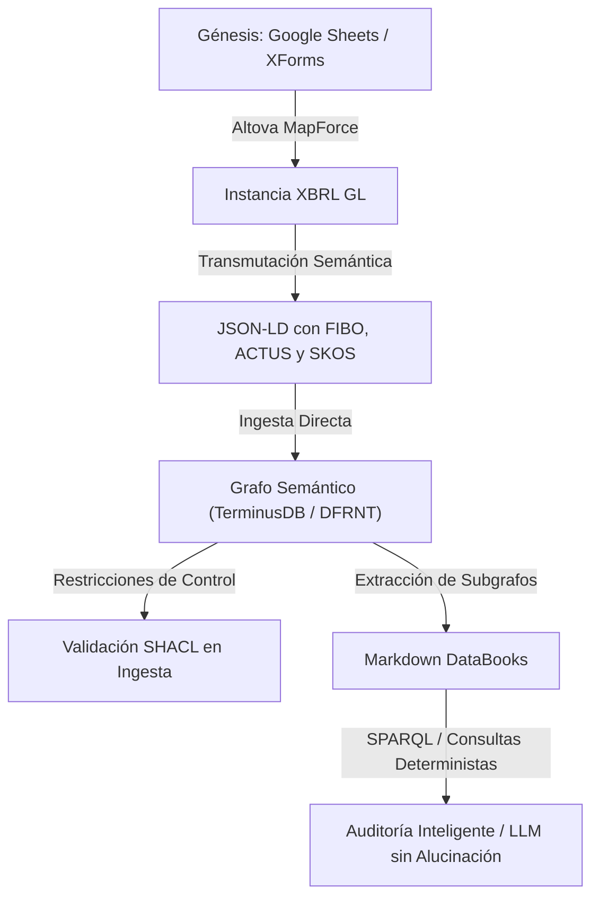

# Evaluación de Encuentro: Richard Gasca y Asesores de DFRNT

**Fecha de la Reunión:** 17 de Junio, 2026 - 10:00 AM  
**Participantes:** Richard Gasca, Manuela Gasca (Soporte/Traducción), Dean Ritz (DFRNT / Ex-Workiva), Andrew Deacon (DFRNT / Ex-Citibank Controller).

---

## 1. Resumen Ejecutivo y Validación Comercial

El encuentro con los asesores de DFRNT constituye una **validación externa de alto nivel** para el framework **Accounting and Audit by Design (A&AD)**. Andrew Deacon, con más de 25 años de trayectoria liderando el control financiero en Citibank en Europa, catalogó la arquitectura y el enfoque de Richard como **"El Santo Grial"** (*The Holy Grail*) de la contabilidad y el reporte corporativo.

### El Dolor Clave del Negocio Identificado
* **El fallo del ERP relacional:** Los ERP tradicionales no retienen los metadatos contextuales de los eventos económicos. En la balanza de comprobación (*trial balance*) solo queda un saldo agregado (ej. un portafolio de préstamos de $1,000 millones de dólares).
* **El abuso de Excel:** Para cumplir con los reportes regulatorios detallados (ej. desglose de préstamos por moneda, vencimiento, geografía), los equipos de finanzas se ven obligados a extraer datos crudos de sistemas auxiliares y procesarlos manualmente en hojas de cálculo. Esto genera un alto riesgo operativo, desincronización y una constante **deuda de conciliación**.
* **La Solución A&AD:** Capturar el dato enriquecido y estructurado semánticamente (financiero y no financiero) desde la génesis de la transacción (Momento 0), eliminando la necesidad de realizar conciliaciones manuales retrospectivas.

---

## 2. Alineación del Stack Técnico de A&AD con DFRNT

Durante la reunión se validó el flujo de transformación de datos propuesto por Richard, demostrando la viabilidad de utilizar estándares abiertos y semánticos frente a tecnologías propietarias:

### Hallazgos Técnicos Clave:
1. **La falta de una Ontología oficial para XBRL GL:** Ante la confirmación de Eric Cohen (co-creador de XBRL GL) de que no existe una ontología OWL/JSON-LD oficial para XBRL GL, el método de Richard de transmutar XBRL GL a JSON-LD usando MapForce y esquemas personalizados es la solución correcta y un gran aporte técnico.
2. **Uso de SHACL para Control Interno:** Dean Ritz destacó cómo el uso de SHACL (*Shapes Constraint Language*) en el grafo semántico traslada los manuales de políticas y controles directamente al ciclo de vida del dato (evitando que se inserten transacciones que violen límites de emisión de acciones o firmas autorizadas).
3. **El rol de la IA / LLM:** Se aclaró que la IA no se utiliza de manera probabilística para validar el dato (lo cual causaría alucinaciones), sino que lee los **DataBooks** autopropagados con JSON-LD y ejecuta consultas **SPARQL deterministas**, asegurando un nivel de confianza del 100%.

---

## 3. Topología de Integración con Sistemas Legados

Un punto de debate clave fue la relación de A&AD con los ERP tradicionales:
* **No reemplazo inmediato, sino coexistencia:** A&AD no pretende apagar el ERP de la empresa el día uno. Corre en paralelo.
* **Flujo bidireccional:** El grafo semántico recibe el contrato (Momento 0) y, mediante consultas estructuradas, puede **actualizar y mantener sincronizado el ERP legado** de manera automatizada.
* **Capacidad analítica superior:** Mientras que un ERP relacional no puede proyectar flujos bajo diferentes escenarios de contratos complejos, la integración de **ACTUS** en el grafo de DFRNT permite simular escenarios de flujos proyectados y ramificaciones (*branching*) en tiempo real.

---

## 4. Compromisos y Próximos Pasos Estratégicos

El equipo de DFRNT mostró un interés genuino en respaldar el lanzamiento del paper académico de Richard:

1. **Revisión del Borrador:** Dean Ritz y Andrew Deacon se comprometieron a realizar una revisión técnica y de redacción del borrador en inglés para pulir la terminología y la narrativa de cara a la conferencia de Rutgers.
2. **Autorización de Marca:** Dean autorizó explícitamente el uso de la marca y las referencias de **DFRNT** en el paper académico.
3. **Soporte Técnico en Julio:** Dean ofreció espacio de su equipo de producto en julio para ayudar a Richard a automatizar la extracción de JSON-LD directamente de la plataforma DFRNT sin tener que hacer "copiar y pegar" hacia MapForce.
4. **Adopción de XBRL GL:** DFRNT está evaluando la posibilidad de adoptar XBRL GL como estándar nativo de su plataforma para la preparación de datos financieros.
