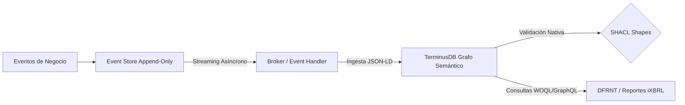
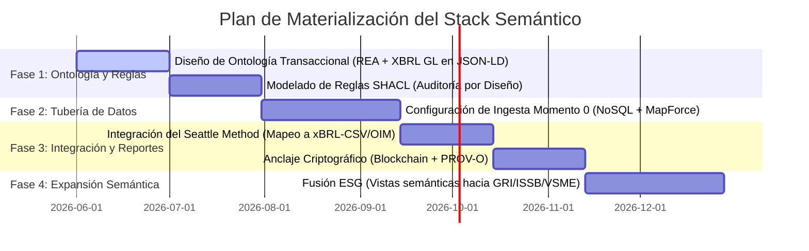

# Memoria de Arquitectura Empresarial Semántica: El Stack "Momento 0"

**Preparado por:** Richard Gasca  
**Fecha:** 2026-05-20  
**Contexto de Diseño:** Fusión del Marco de Zachman, Ontología REA, y el Método Seattle  
**Ecosistema Tecnológico:** TerminusDB, DFRNT, W3C Semantic Standards (JSON-LD, SHACL, PROV-O), Altova MapForce, BaseX, XBRL GL, UBL.

---

## 1. Introducción y Enfoque Filosófico (Zachman como la Plataforma Matriz)

El **Marco de Zachman** no es un mero inventario estático de diagramas de TI; es la **matriz de completitud de la empresa**. La contabilidad y los ERPs tradicionales sufren de una severa limitación ontológica: son planos, mudos y aislados, limitándose a responder de forma retrospectiva las preguntas de *Qué* (saldos) y *Cuándo* (fechas de registro). 

Esta limitación estructural ha obligado a los límites más representativos del ecosistema de software empresarial tradicional (tales como SAP con su capa semántica sobre SAP HANA, Oracle con NetSuite Analytics, y Microsoft con Dynamics 365) a intentar añadir capas semánticas de forma retroactiva para tratar de aplanar y traducir sus complejas tablas relacionales físicas a términos de negocio legibles para herramientas de visualización analítica. Sin embargo, este enfoque de "parche semántico retrospectivo" tiene fallas fundamentales: es de solo lectura, no resuelve la pérdida de dimensionalidad en el registro de origen, y sigue arrastrando la desconexión ("seam") entre la transacción cruda y el reporte de divulgación final. 

Este patrón de convergencia no es una conjetura teórica; es una realidad inmediata impulsada por la era de la inteligencia artificial. Como demuestran las publicaciones recientes de referentes del sector (ver Figura 1 y Figura 2), gigantes como Microsoft (con su capa semántica "Fabric IQ" y GraphRAG), Google (con Spanner Graph) y Cosmos DB (con OmniRAG) han convergido unánimemente en la misma tesis: **la inteligencia artificial sin una capa semántica alucina, y la única capa semántica real es un grafo**. Esta validación del ecosistema demuestra que la categoría de los grafos de conocimiento contable y de negocio ha sido plenamente legitimada por las corporaciones más grandes del planeta. Así, el stack "Momento 0" no hace más que abordar desde su origen el problema de diseño que el resto de la industria intenta apresuradamente parchar como una solución analítica de última hora.


**El Stack "Momento 0" subvierte por completo este paradigma: no añade una capa semántica después; el dato NACE semántico por diseño.** La transacción es concebida, validada e inyectada como un grafo de conocimiento desde su primer milisegundo de existencia, haciendo que la consistencia matemática, la gobernanza SHACL y la trazabilidad PROV-O sean nativas y estructurales, no un accesorio de analítica de última hora.

Al adoptar **Zachman como nuestra plataforma matriz**, aseguramos la **completitud dimensional** de la firma en un **Grafo Semántico Unificado** en **TerminusDB/DFRNT**. Para los CFOs, auditores y tomadores de decisiones de negocio, este marco se traduce en el **"Grid de Consistencia y Trazabilidad Total"**. Este grid minimiza drásticamente el riesgo de auditoría y los costos de cumplimiento en más de un 80%, garantizando que no exista un solo movimiento financiero que no esté plenamente justificado por su contraparte operativa, legal y de gobierno corporativo. El grafo responde simultáneamente a las preguntas existenciales del nivel de planificación y propiedad (Filas 1 y 2 de Zachman):
*   **QUIÉN (Who) $\to$ `Agent`:** El nexo de stakeholders (accionistas, clientes, gobierno, empleados) plenamente identificados.
*   **QUÉ (What) $\to$ `Resource`:** Los activos, inventarios y el catálogo de cuentas elemental (mapeado semánticamente a `<gl-cor:account>` de XBRL GL).
*   **DÓNDE (Where) $\to$ `Location`:** Fronteras jurisdiccionales, almacenes y plataformas transaccionales físicas y digitales.
*   **CUÁNDO (When) $\to$ `Event`:** Los hechos económicos reales (asientos `<gl-cor:entryDetail>` de XBRL GL).
*   **POR QUÉ y CÓMO (Why / How) $\to$ `Contract`:** Los acuerdos, minutas y políticas de equilibrio contable y operacional bajo la teoría de **Shyam Sunder** (la firma como un "nexo de contratos").
*   **EL NEXO $\to$ `Entity`:** La firma concebida macroscópicamente como el conjunto de sus contratos vigentes (su Gemelo Digital).

Asimismo, desde su concepción fundacional, el stack apunta a cumplir de manera nativa con los estándares internacionales clave de gestión y auditoría de datos empresariales: la norma **ISO 21378** (Auditoría de Datos / *Audit Data Collection*), que define estructuras de datos estandarizadas para facilitar la extracción y fiscalización tributaria, y la norma **ISO 15944** (Aspectos Operacionales de Negocio / *Business Operational Aspects*), que gobierna el intercambio electrónico de datos y rige la semántica de transacciones comerciales basada en modelos REA (*Resource-Event-Agent*). Esta doble alineación garantiza que el Gemelo Digital Semántico sea no solo técnicamente perfecto y libre de defectos, sino también universalmente integrable, conforme a la ley y listo para cualquier auditoría internacional.


#### **KR&R (Knowledge Representation and Reasoning): La Base Científica del Stack**
El stack "Momento 0" no se limita a ser una base de datos contable más rápida; es una implementación física de **Knowledge Representation and Reasoning (KR&R)**, una rama fundamental de la Inteligencia Artificial. En la contabilidad clásica, el conocimiento del negocio (reglas de partida doble, políticas corporativas, normativas tributarias e IFRS) reside únicamente en la mente del contador o disperso en código duro dentro del ERP. Bajo el paradigma KR&R, **formalizamos explícitamente este conocimiento en el grafo**:
* **Representación:** Mediante ontologías formales (UBL, REA, XBRL GL en JSON-LD) representamos la semántica precisa y multidimensional del negocio (el *Quién, Qué, Dónde, Cuándo, Por qué y Cómo*).
* **Razonamiento:** Mediante motores de reglas semánticas (SHACL) y de lógica predictiva (como las reglas del *Seattle Method* o motores en Prolog como *Pacioli*), el sistema razona sobre los datos para inferir consistencia lógica, deducir relaciones implícitas, realizar conciliaciones y autodetectar desbalances. Esto eleva al sistema contable a un **Gemelo Digital Lógico** capaz de auditarse a sí mismo y proporcionar un conocimiento libre de alucinaciones para los LLMs (GraphRAG).

### ¿Qué es el "Momento 0" (Estado Génesis) y la Inmutabilidad de los Hechos Económicos?

Siguiendo la línea fundacional de **Shyam Sunder (Scheinman-Sonder)** en la teoría de la contabilidad y el control (la empresa como un nexo de contratos), el **Contrato de Constitución** o la escritura que da origen a la entidad representa el documento fundacional que se inyectará en el **Momento Cero (Estado Génesis)**. Tratándose de una empresa que ya se encuentra en marcha, el Génesis lo constituirá un **Balance de Apertura auditado**. 

Para garantizar una inmutabilidad y transparencia absoluta y legalmente vinculante, estos documentos iniciales (Escritura de Constitución y/o Balance de Apertura) se alojarán de forma descentralizada en **IPFS (InterPlanetary File System)**. Mediante el anclaje en una **red blockchain**, se sellará su inalterabilidad histórica, y el identificador criptográfico único (el **CID de IPFS**) quedará registrado de forma permanente dentro de la instancia JSON-LD génesis que se inyectará a **TerminusDB**.

En este punto fundacional, es crítico identificar con precisión a los accionistas y las entidades que aportan al capital social. El grafo semántico está diseñado con la capacidad de estructurar y rastrear estas relaciones de propiedad, permitiendo generar vistas dinámicas en tiempo real que den cuenta exacta de los propietarios y su participación en un momento determinado. Para asegurar la inmutabilidad y certeza jurídica de este registro de socios frente a cualquier auditoría o ente regulador, el estado de la tenencia accionaria se sella criptográficamente en la blockchain de **Algorand**.

### Antecedentes, Linaje Intelectual y la Creación de "El Bosque"

El diseño del Stack "Momento 0" no nace de la especulación académica abstracta, sino de una profunda trayectoria profesional en auditoría, control de gestión e integración tecnológica, nutrida por el intercambio de conocimiento con los referentes globales de la contabilidad digital y la web semántica:

1. **Linaje en XBRL y Automatización Contable:** 
   El autor del stack cuenta con una transferencia directa de conocimiento de **Gianluca Garbelotto** (autoridad global en XBRL GL), habiendo contribuido activamente en la traducción al español de etiquetas de la taxonomía oficial en su versión 2015. Esta base se complementa con una sólida experiencia como auditor en **PwC** (*PricewaterhouseCoopers*) y como *Controller* de Gestión en el entorno corporativo multinacional (donde lideró implementaciones complejas de **Oracle Hyperion**). 
   Durante los últimos **10 años**, el autor ha estructurado proyectos de automatización e integración de datos utilizando la suite de **Altova** (particularmente **Altova MapForce**). Con la irrupción de la inteligencia artificial generativa, se ha logrado desbloquear y potenciar este conocimiento acumulado, acelerando exponencialmente la ingeniería de flujos de datos para la extracción de saldos hacia la taxonomía **XBRL Global Ledger (XBRL GL)** y su posterior remapeo e integración hacia las taxonomías de supervisión financiera tributaria local (**XBRL FR**).

2. **La Conexión Semántica y DFRNT:**
   La transición conceptual hacia los grafos de conocimiento fue impulsada por **Timothy Thompson**, ontólogo y bibliotecario de la **Universidad de Yale**, quien introdujo al autor en el estándar **JSON-LD (JSON Linked Data)** de la W3C. Este puente de ingeniería semántica3. **El Origen de "El Bosque": Fusión Teórica y Ontológica:**
   Ante la sospecha fundada de que los sistemas automáticos de registro contable tradicionales presentan fallas de integridad de diseño y desconexiones semánticas profundas, el autor consultó a **Eric Cohen** (creador y promotor de XBRL GL) para confirmar si existía una ontología formal y oficial para XBRL Global Ledger. Ante la respuesta de Cohen de que han existido múltiples iniciativas pero ninguna con carácter formal u oficial, se tomó la decisión estratégica de diseñar **"El Bosque"**.
   
   **"El Bosque"** constituye la fusión de cuatro pilares intelectuales y tecnológicos:
   * **El Marco de Zachman (6x6):** La matriz dimensional que garantiza que ninguna coordenada del negocio quede sin documentar.
   * **La Capa de Estándares Semánticos de Tim Berners-Lee:** La infraestructura de grafos de la Web Semántica (RDF, JSON-LD, SPARQL/WOQL) aplicada a la gestión documental y de datos vinculados.
   * **La Ontología REA (Resource-Event-Agent):** El modelo contable semántico de William McCarthy que supera la limitación del registro ciego de la partida doble tradicional.
   * **La Teoría de la Firma de Shyam Sunder:** La concepción de la empresa como un **nexo de contratos**.

4. **El Flujo de Datos y la Inmutabilidad de los Hechos Económicos:**
   Bajo este paradigma, el origen de la entidad reside en sus **Contratos**, que son los documentos jurídicos fundamentales que hacen posible la continuidad del negocio (*going concern* como lo establece Shyam Sunder). Estos contratos se transforman y estructuran como instancias en formato **JSON-LD** para ser inyectados directamente en el grafo de **TerminusDB**.
   
   Para robustecer el sistema, se integran tres capas de control inquebrantables:
   * **Blockchain como Anclaje de Verdad:** Sellar criptográficamente los contratos y transacciones críticas para garantizar la inmutabilidad absoluta de los eventos.
   * **SHACL como Control Interno por Diseño:** Las restricciones **SHACL (Shapes Constraint Language)** se alínean de forma nativa con el marco de control interno de la organización, aplicando validaciones matemáticas, estructurales y de negocio en el milisegundo exacto de la ingesta (evitando la entrada de datos corruptos o inconsistentes).
   * **Modelo Software-Agnóstico y RDF Nativo:** La arquitectura no está atada a ningún proveedor de software cerrado ni se limita a los flujos ETL (*Extract, Transform, Load*) tradicionales de aplanamiento de tablas. Permite consultas nativas directas en grafos (RDF/WOQL), garantizando portabilidad absoluta y resiliencia a largo plazo.

---

### 1.4. Ontologías de Alto Nivel (Upper-Level Ontologies) y Criterios de Gruber

Siguiendo la recomendación de **Charles Hoffman**, un stack contable semántico verdaderamente robusto y de clase mundial requiere anclarse en una **Ontología de Alto Nivel / Foundational Ontology** (como el estándar inminente **ISO/IEC 21838** basado en **BFO / Basic Formal Ontology** y **UFO / Unified Foundational Ontology**, o la ontología **gist** de *Semantic Arts*).

La adopción de una ontología de alto nivel evita la fragmentación semántica e impide que los diferentes grupos de interés (stakeholders) queden atrapados en "silos de verdades subjetivas" y disputas de poder conceptuales. Además, garantiza el cumplimiento riguroso de los **Criterios de Gruber (1993)** para la excelencia ontológica:
*   **Claridad:** Las definiciones son explícitas y no dependen de un contexto informático específico (gracias a metadatos como `skos:definition` y `skos:scopeNote`).
*   **Coherencia:** El sistema de axiomas y restricciones lógicas es matemáticamente consistente y auto-auditable.
*   **Extensibilidad:** Ofrece una base sólida sobre la cual agregar especializaciones de dominio (como nuestro modelo contable transaccional).
*   **Sesgo Mínimo de Codificación y Compromiso Ontológico Mínimo:** No presupone una implementación de software cerrada, y solo reclama las afirmaciones estrictamente necesarias para el negocio, garantizando interoperabilidad universal.

En el Stack "Momento 0", mapeamos nuestras estructuras directamente a los conceptos fundacionales de **Gist Core 14.1.0** y **ISO/IEC 21838 BFO/UFO**:
1.  **QUIÉN (Who) $\to$ `Agent`:** Gist 14.1.0 prescinde de la clase abstracta `Agent` y define los actores directamente como la unión de `gist:Organization` ("entidad estructurada para lograr metas...") y `gist:Person` ("ser humano vivo").
2.  **QUÉ (What) $\to$ `Resource`:** Se mapea a `gist:PhysicalIdentifiableItem` para recursos físicos (activos, inventario físico) y `gist:IntellectualProperty` para intangibles.
3.  **CUÁNDO (When) $\to$ `Event`:** Se alinea con `gist:Event` y específicamente con `gist:Transaction` ("transferencia o intercambio de bienes, servicios o fondos"), que representa asientos contables (`gl-cor:entryDetail`).
4.  **POR QUÉ / CÓMO (Why/How) $\to$ `Contract`:** Se mapea a `gist:Agreement` ("acuerdo mutuo donde las partes asumen compromisos") y `gist:Contract` (un `gist:Agreement` bajo jurisdicción legal de un `gist:GovernmentOrganization`).
5.  **EL NEXO CONTABLE $\to$ `Account`:** **`gist:Account` se define formalmente como un `gist:Agreement` que posee un balance financiero.** Esto coincide con la teoría de **Shyam Sunder**: una cuenta contable no es un depósito estático ciego de dinero, sino la representación con saldo de un acuerdo o compromiso mutuo entre partes.

---

### 1.5. De Document Level Assurance a Data Level Assurance (La Visión de Eric Cohen)

La auditoría tradicional está atrapada en el paradigma del papel (*paper-paradigm*). Según las normas de auditoría clásicas (como SAS 8 o la norma interpretativa **PCAOB AU 9550 / AU 550**), los sitios de internet o archivos electrónicos compartidos se consideran "medios de distribución" y no "documentos" oficiales de auditoría. Por lo tanto, el dictamen del auditor tradicional se limita a dar fe a nivel de **documento cerrado** (por ejemplo, el PDF o papel firmado del Balance General), perdiendo control y trazabilidad una vez que el dato cruza la frontera de la organización.

Para superar este límite histórico, **Eric Cohen** (co-fundador de XBRL) junto con Miklos Vasarhelyi en 2001 acuñaron el concepto de **Data Level Assurance (DLA)**. La visión de DLA consiste en **"pintar bordes de confianza" alrededor de cada pieza de dato atómica**, permitiendo que la fe pública y el contexto de auditoría viajen de manera **portable e independiente del sistema** donde se generó o reside la información.

El Stack "Momento 0" realiza físicamente la visión de DLA mediante las siguientes equivalencias técnicas:

#### A. La Fórmula de Data Trust
La confianza en la información se calcula matemáticamente como `DT = f(DLA, PK, OF)`, donde `DLA` (Data Level Assurance) se define como una función que garantiza de manera continua y simultánea la calidad y la fe de múltiples variables:
*   **Data Assurance & Quality (DA/DQ):** Garantizada por las reglas de correspondencia REA y SHACL.
*   **Metadata Assurance & Quality (MA/MQ):** Anclada por la procedencia inquebrantable de **W3C PROV-O** (`prov:wasDerivedFrom`) conectando el registro contable al XML origen.
*   **Taxonomy/Ontology Assurance & Quality (TA/TQ):** Salvaguardada al forzar un esquema de "Mundo Cerrado" en **TerminusDB** bajo la ontología de XBRL GL.
*   **Organization Assurance & Quality (OA/OQ):** Sella la veracidad mediante firmas en la blockchain de **Algorand**.

#### B. El Roadmap de 12 Etapas de Aseguramiento de Cohen
Mapeamos nuestro pipeline transaccional para cumplir y habilitar las etapas superiores del roadmap de DLA:
*   *Etapas 1-5 (Intercambio digital y repositorios de terceros):* Cubierto por la conectividad segura de IPFS y BaseX en DigitalOcean.
*   *Etapas 6-8 (Firmas Digitales a Nivel de Concepto / Specific Signatures):* Nuestro stack permite aplicar firmas criptográficas a nivel de hechos y eventos individuales (conceptos RDF de JSON-LD), separando las declaraciones de la administración del dictamen del auditor.
*   *Etapa 10 (Datos Libres y Portabilidad de Confianza):* Un hecho contable (ej. monto de ingresos) puede extraerse e incluirse en una press release o página web externa manteniendo su enlace URL de procedencia y su "audit-ness" intacto.
*   *Etapa 11 (Tiempo Real y Garantía Continua):* La ingesta semántica y validación automática de TerminusDB operan en tiempo real para ofrecer auditoría continua.
*   *Etapa 12 (Cifrado de Datos / XML Encryption):* Cifrado local de extremo a extremo con AES-256 (`secure_ipfs_helper.py`) antes de almacenar los trozos en IPFS, garantizando que el dato sea revelado solo a partes autorizadas.

#### C. Los 3 Niveles del Asegurador (Assuror)
1.  **Nivel 1: Notario Digital:** Valida la procedencia, versión, marcas de tiempo y la firma inalterable en Blockchain e IPFS.
2.  **Nivel 2: Valuador Experto:** Valida la consistencia lógica y matemática de los datos (partida doble, lógicas multidimensionales) de forma automatizada mediante restricciones **SHACL**.
3.  **Nivel 3: Independiente:** Valida la completitud, veracidad física y coincidencia del reporte consolidado final con los datos transaccionales crudos (xBRL-CSV/OIM).

---

## 2. Ubicación de los Componentes en el Stack (El Enfoque "First Mile" a "Last Mile")

Bajo la filosofía **MOSA (Modular Open Systems Approach)** del Departamento de Defensa de EE. UU., nuestro stack se estructura en componentes modulares, débilmente acoplados (*loosely coupled*) y con interfaces basadas estrictamente en estándares de consenso abierto (JSON-LD, UBL, XBRL GL, PROV-O, SHACL).

**En este diseño, la ontología y el grafo semántico tienen preponderancia absoluta sobre cualquier base de datos relacional tradicional o ERP legado. El dato nace en el Grafo Contable Semántico, y los sistemas legados tradicionales se nutren y pueblan a través de proyecciones directas generadas a partir del grafo.**

```mermaid
graph TD
    %% Ingestion Layer
    subgraph Primera Milla ("The First Mile - Ingesta y Operación (Richard's Stack)")
        A[Entrada Transaccional Simultánea / Documentos UBL] -->|Ingesta Directa / XForms| C[TerminusDB Graph Database / DFRNT]
        
        %% Graph validation
        C -->|Validación Estructural y de Reglas| D{SHACL Validation Engine}
        D -->|Auditoría por Diseño / Restricciones de Grafo| C
        
        %% Provenance & Security
        E[Algorand Blockchain] -->|Anclaje de Inmutabilidad Jurídica| C
        F[IPFS Private Swarm / AES-256] -->|Almacenamiento Cifrado de Documentos| C
        G[W3C PROV-O - prov:wasDerivedFrom] -->|Procedencia del Dato Atómico| C
        
        %% Legacy population
        C -->|Proyecciones del Grafo Semántico| H[(Base de Datos Relacional / ERP Legado)]
    end

    %% Last Mile Layer
    subgraph Última Milla ("The Last Mile - Reporte y Divulgación (Charlie's Stack)")
        C -->|Exportación OIM Semántica| I[xBRL-CSV / xBRL-JSON Output]
        I -->|Guardrails de Consistencia de Reportes| J[Seattle Method Logical Rules]
        J -->|Zero-Defect Audit Bundle| K[CFOs, Auditores, Entes Reguladores]
    end

    classDef firstMile fill:#112e51,stroke:#ffffff,color:#ffffff;
    classDef lastMile fill:#abb8c3,stroke:#313131,color:#313131;
    class A,C,D,E,F,G,H firstMile;
    class I,J,K lastMile;
```

### La Primera Milla (Gobernanza Semántica, REA y Gist en TerminusDB)
Nuestra arquitectura opera en el registro operacional del hecho económico, estableciendo el grafo como el maestro absoluto de la transacción:
*   **Doble Canal de Alimentación Simultánea y Captura Semántica (MapForce y XForms):**
    1. **Tubería Altova MapForce (Documentos Estructurados):** Los documentos origen como facturas **UBL 2.1 (XML)** o transacciones se transforman en formato **JSON-LD** utilizando un script visual de mapeo diseñado en **Altova MapForce**, donde se le inyecta la semántica contable requerida. La arquitectura es altamente portable: si un formato de entrada cambia, solo se modifica la plantilla de MapForce sin alterar las bases de datos ni las reglas SHACL río abajo.
    2. **Tubería XForms y BaseX (Captura Interactiva):** Para la entrada de datos interactiva y parametrizada, se capturan los datos mediante **XForms** hacia una base de datos XML estructurada (**BaseX**) en **DigitalOcean**, de donde se extraen, se transforman en **JSON-LD** y se inyectan a **TerminusDB**.
*   **XBRL GL a Nivel Ontológico:** Para erradicar los silos y lograr que la semántica contable sea de primer nivel, **la taxonomía XBRL GL se integra directamente como parte del esquema ontológico de TerminusDB**. Conceptos clave como `gl-cor:entryHeader`, `gl-cor:entryDetail`, `gl-cor:account` y `gl-cor:amount` se definen y validan formalmente dentro de la base de datos de grafos. Esto se fusiona con REA y Gist Core 14.1.0:
    - Un asiento contable (`gl-cor:entryHeader`) es una subclase/intersección de un hecho contable en REA y de un `gist:Event` (específicamente `gist:Transaction`).
    - Las líneas de diario (`gl-cor:entryDetail`) representan los compromisos contables (`gist:Commitment`) y flujos económicos de REA.
    - La cuenta de diario (`gl-cor:account`) se alinea con la clase `gist:Account` (definida como un `gist:Agreement` con balance).
*   **Proyección del Grafo hacia el Legado (Poblamiento Río Abajo):** Cuando se demuestra que una proyección generada a partir del grafo semántico es capaz de poblar y nutrir las tablas de las bases de datos relacionales tradicionales y los ERPs legados (como SAP, Oracle o Microsoft Dynamics), se alcanza el objetivo definitivo de la arquitectura semántica. El grafo semántico almacena toda la dimensionalidad e inmutabilidad de los contratos y hechos económicos; a partir de allí, se ejecutan consultas complejas (WOQL/GraphQL) que aplanan el grafo y escriben de forma unidireccional en las bases de datos relacionales tradicionales. El legado se convierte así en un mero repositorio pasivo de cumplimiento fiscal.
*   **Gobernanza de Esquema y Mundo Cerrado (TerminusDB vs. Neo4j):** A diferencia de las bases de datos de grafos de propiedades tradicionales como **Neo4j** —las cuales operan bajo el supuesto de "Mundo Abierto" (Open World Assumption) y carecen de esquemas obligatorios (schema-less), permitiendo escribir cualquier nodo o propiedad de forma arbitraria—, **TerminusDB** opera bajo el principio de **"Mundo Cerrado" (Closed World Assumption)**. Es una base de datos fuertemente tipada que exige un esquema lógico formal estricto. **Aquí es donde la ontología formal de XBRL GL adquiene todo su valor de ingeniería:** en lugar de tolerar la anarquía de datos (donde propiedades contables críticas podrían omitirse o tiparse erróneamente sin que el motor lo impida), el esquema de TerminusDB actúa como un guardián inquebrantable que obliga a cada transacción a estructurarse exactamente bajo los tipos, propiedades y relaciones definidos por la ontología de XBRL GL.
*   **PROV-O (W3C Provenance Ontology):** Cada hecho financiero en el grafo apunta a su documento de origen (`prov:wasDerivedFrom` hacia el XML de la factura UBL), garantizando una auditabilidad transparente y continua.
*   **Blockchain y IPFS (El Sello del Notario Digital):** Actúa como el anclaje de inmutabilidad para el Génesis y los eventos contractuales del negocio. Los archivos confidenciales de soporte se encriptan localmente con AES-256 y se alojan en el nodo IPFS privado, y su hash e identificador único (CID de IPFS) se asocian de forma nativa e inmutable en el grafo y en la blockchain de **Algorand**.

#### **El Puente hacia Labeled Property Graphs (LPG) y Analítica Avanzada**
En la industria de bases de datos de grafos, coexisten dos grandes familias: los **Grafos Semánticos (RDF/Triple Stores)**, que sobresalen en interoperabilidad universal, estándares web (W3C, JSON-LD) y razonamiento lógico formal (KR&R/SHACL); y los **Grafos de Propiedades Etiquetados (LPG - Labeled Property Graphs)** como Neo4j o Google Spanner Graph, óptimos por su rendimiento en travesías masivas, algoritmos de redes y su amplia adopción en el ecosistema de desarrollo.

El Stack "Momento 0" adopta una estrategia estratégica y pragmática para unificar ambos mundos:
1. **El Núcleo Semántico y de Gobernanza (RDF/JSON-LD + SHACL):** La contabilidad exige verdad absoluta, consistencia matemática y cumplimiento de estándares internacionales (ISO, XBRL GL). Por tanto, la fase de ingesta y validación de la transacción ("First Mile") se realiza en **TerminusDB**, operando como un almacén semántico fuertemente tipado que impide cualquier corrupción o anarquía de datos.
2. **La Proyección e Ingesta Analítica en LPG (Neo4j / Spanner Graph):** Una vez que el dato ha sido validado y consolidado con "cero defectos" en el núcleo semántico, el grafo puede ser proyectado de forma fluida hacia una base de datos **LPG** (mediante serializaciones JSON o integraciones RDF-star). En esta capa LPG es donde se despliega la analítica avanzada y de alto rendimiento del negocio:
   * *Detección de Fraude y Colusión:* Algoritmos de centralidad y detección de comunidades en grafos LPG para identificar patrones transaccionales sospechosos entre agentes relacionados.
   * *GraphRAG de Alta Velocidad:* Alimentación directa de sistemas de Inteligencia Artificial mediante búsquedas vectoriales y travesías de relaciones en grafos LPG para consultas analíticas instantáneas por parte del management.
Esto permite un enfoque híbrido insuperable: **Gobernanza Semántica en el Core y Velocidad LPG en la Analítica.**

### SHACL: "Contabilidad y Auditoría por Diseño" (El Equivalente a las Linkbase de Fórmulas)

**SHACL (Shapes Constraint Language)** es la tecnología del W3C que nos permite implementar la **Auditoría por Diseño y el Control Interno** directamente en el motor de base de datos. En este stack contable semántico, **SHACL representa el equivalente tecnológico a las "Linkbase de Fórmulas" (Formula Linkbases) dentro del estándar XBRL tradicional**.

Esta equivalencia y preponderancia lógica está respaldada conceptualmente por las investigaciones de **Charles Hoffman** (ver el documento de referencia [SemanticWebStack_XBRLStack.pdf](file:///C:/Users/IPHIX/Documents/Projects/DFRNT/Documentacion/Memoria/SemanticWebStack_XBRLStack.pdf)), quien identifica al "Unifying Logic Framework" de la Web Semántica (basado en RDFS, OWL y SHACL bajo una asunción de mundo cerrado) como el puente fundamental de interoperabilidad entre ambos stacks. El modelo demuestra que el stack semántico ofrece la posibilidad de desplegar un razonamiento lógico y reglas no monotónicas extremadamente seguras, superando con creces las limitaciones y deficiencias conocidas de los procesadores tradicionales de fórmulas XBRL.

*   **Control Interno por Diseño y Equivalencia a Linkbases:** Al igual que las fórmulas XBRL validan consistencias lógicas y matemáticas en los reportes financieros externos, los SHACL *Shapes* (formas de restricción) operan como el mecanismo definitivo de control interno en la base de datos de grafos de **TerminusDB**, imponiendo restricciones y condiciones al momento exacto en que un dato es inyectado. El motor rechaza de forma nativa cualquier transacción que no cumpla con estas reglas estructurales y de negocio desde el primer milisegundo de su existencia, garantizando el control interno de la entidad por diseño.
*   **Reglas Contables y de Control:** Podemos definir SHACL Shapes para forzar lógicas contables irrompibles en el grafo:
    *   *Restricción de Partida Doble:* Validar que todo `Event` contenga de forma mandatoria un conjunto de cargos donde la suma de Débitos equivalga exactamente a la suma de Créditos en la misma moneda (`gl-muc:defaultCurrency`).
    *   *Restricción de Procedencia:* Validar que todo evento que afecte a cuentas de tesorería contenga obligatoriamente un enlace `prov:wasDerivedFrom` apuntando a un documento de origen verificado (factura UBL o JSON origen).
    *   *Restricción de Completitud Zachman:* Forzar que ningún evento financiero sea registrado en el grafo si carece de enlaces explícitos a un `Agent` (Quién), `Resource` (Qué) y `Contract` (Por qué/Cómo).
*   **El Beneficio:** La base de datos rechaza de forma nativa cualquier transacción que viole estas reglas. El grafo de TerminusDB se convierte en un libro contable auto-auditable y lógicamente perfecto.

### La Última Milla (The Seattle Method)
El **Seattle Method** es el marco definitivo para la consistencia y verificación del reporte de divulgación final (el producto terminado):
*   **La Sinergia:** **SHACL** garantiza que el grafo contable interno sea estructural y matemáticamente perfecto "por diseño" a nivel transaccional. Esto alimenta de forma ideal al **Seattle Method**, el cual aplica sus *guardrails* lógicos, dimensiones y estructuras de slots en la fase de exportación final en **xBRL-CSV/xBRL-JSON (OIM)**, garantizando que el *Audit Bundle* externo sea 100% consistente y libre de errores para los reguladores.

### 2.4. Consultas al Grafo y Salidas al Mundo Real (Conectando el Gemelo Digital)
Para que el Gemelo Digital Semántico tenga validez jurídica y operativa plena, no puede comportarse como un silo cerrado o una "caja negra". Debe comunicarse de forma bidireccional y fluida con el entorno legal, societario y de reporte en el mundo real:
*   **Lenguajes de Consulta del Grafo (WOQL y GraphQL):**
    *   **WOQL (Web Object Query Language):** Es el lenguaje nativo, declarativo y altamente expresivo de TerminusDB. Permite realizar consultas de lógica relacional compleja y travesías profundas de caminos sobre el grafo, ideal para reconstruir la procedencia del dato (`PROV-O`), rastrear el ciclo de vida de contratos y consolidar transacciones atómicas.
    *   **GraphQL:** Expuesto como interfaz API estándar de la industria, facilitando el desarrollo rápido de componentes visuales en **DFRNT**, tableros de control interactivos y la conexión con sistemas de software empresariales externos.
*   **Salidas Societarias y Gobierno Corporativo (Libros Oficiales):**
    A partir de consultas estructuradas en el grafo semántico, la plataforma extrae y genera de forma automatizada los documentos jurídicos de soporte del Gemelo Digital:
    *   **Libro de Actas de Asamblea General y Junta Directiva:** Generados directamente desde las transacciones del grafo, vinculados con los hashes criptográficos en Blockchain que garantizan su inmutabilidad y procedencia jurídica.
    *   **Libro de Accionistas y Registro de Junta Directiva:** Registro vivo de la propiedad y control de la firma (la columna "Who" de Zachman), actualizándose dinámicamente ante cualquier evento de transferencia accionaria o cambios en la administración.
*   **Generación de Instancias de Reporte Financiero (XBRL FR) y Formatos Físicos:**
    El ledger semántico no solo almacena la taxonomía base operacional (XBRL GL); es el motor de extracción que compila el reporte final para los reguladores:
    *   **Consultas de Extracción:** Agentes de software ejecutan consultas complejas sobre el grafo para consolidar balances de prueba y estructurar reportes según taxonomías financieras específicas.
    *   **XBRL FR (Financial Reporting):** Programación y ensamblado de instancias formales normalizadas bajo estándares internacionales (NIIF/IFRS, US GAAP).
    *   **Formatos Multicanal (Transformación Visual):** El sistema permite renderizar y transformar estas instancias a formatos legibles para humanos y entidades de control:
        *   **iXBRL (Inline XBRL):** Formato interactivo basado en HTML5 para visualización en navegadores web, manteniendo embebidos los metadatos semánticos legibles por máquinas.
        *   **PDF y Word (DOCX):** Renderizado estético y estructurado de alta fidelidad para revisiones editoriales de la junta directiva, firmas físicas, archivos y cumplimiento legal.
*   **Información No Financiera, ESG e Inventarios:**
    Los documentos electrónicos (como facturas UBL o contratos) contienen valiosa información no financiera que es crucial para operaciones y cumplimiento de reportes. El stack extrae estos datos directamente para alimentarlos al grafo:
    *   *Sostenibilidad y Clima:* Se extraen datos no financieros de impacto climático y sostenibilidad embebidos en contratos y facturas, alimentando el grafo para poblar taxonomías internacionales como las de **ISSB**, **GRI** y **EFRAG** (EFRAC).
    *   *Control de Inventarios:* Los detalles cuantitativos y de ítems físicos se extraen de los documentos origen e ingresan directamente al grafo contable, alimentando en tiempo real los sistemas de control de inventarios de la firma.
*   **Propósito de Asiento Contable Multi-Libro (XBRL GL Purposes) y Auto-Reconciliación:**
    De acuerdo con la taxonomía XBRL Global Ledger, el stack permite asociar explícitamente el **Propósito Contable** (`purpose`) a cada apunte, facilitando la contabilidad multi-libro y el reporte multijurisdiccional:
    *   *Fiscal / Tributario:* Registros enfocados en el cumplimiento de impuestos y normativas de la jurisdicción local.
    *   *IFRS / NIIF:* Enfocado en reportes financieros bajo estándares internacionales, el cual rige transacciones, documentos, eventos (riesgos) y condiciones (contratos) de la jurisdicción del autor. El stack está diseñado para dar alcance pleno a IFRS, pero mantiene la posibilidad de cubrir otros marcos conceptuales.
    *   *Juzgada / Local GAAP:* Registros para el cumplimiento de normativas locales e históricas específicas de la entidad.
    *   *Auto-Reconciliación:* Al residir la información en un grafo de relaciones continuas, el stack está en capacidad de **auto-reconciliar de forma nativa la información contable** dentro del grafo, cruzando de manera determinista los hechos de tesorería, inventarios y contratos sin necesidad de rutinas de conciliación externas.
*   **Auditoría Continua (Continuous Auditing):**
    Al superar el enfoque tradicional de auditorías retrospectivas o periódicas basadas en muestras, el stack habilita la **Auditoría Continua**. Agentes de software autónomos ejecutan consultas permanentes de diagnóstico y análisis de riesgos en segundo plano en el grafo de TerminusDB, validando reglas de negocio complejas en tiempo real (conciliaciones bancarias automatizadas, alertas inmediatas de desbalances o movimientos inusuales de tesorería), garantizando un estado de auditoría constante por diseño.

---

### 2.5. Aspectos Prácticos de Implementación, Escalabilidad y Robustez

Para garantizar que esta arquitectura de vanguardia sea viable en entornos de producción transaccionales y de gran volumen, resolvemos los desafíos operativos típicos de las tecnologías semánticas mediante las siguientes estrategias:

#### A. Enfoque Híbrido CQRS y Event Sourcing (Escalabilidad de Lectura/Escritura)
Aunque las bases de datos de grafos son inmejorables para la trazabilidad multidimensional y las consultas complejas, el registro masivo y directo en un motor de triples puede convertirse en un cuello de botella. Por ello, se propone una arquitectura híbrida de segregación de responsabilidades de consulta y comando (CQRS):
1.  **Capa de Escritura Operativa (Command / Event Store):** Las transacciones (facturas, cobros, nómina) se registran de forma asíncrona e instantánea como eventos planos en un log inmutable y secuencial (*Append-Only Event Store* en base de datos relacional optimizada o un bróker de mensajería como Apache Kafka). Esto asegura un rendimiento transaccional de sub-milisegundo.
2.  **Capa de Lectura y Semántica (Query / Materialized View):** Los eventos se consumen continuamente y se proyectan en tiempo real en el Grafo Semántico de **TerminusDB**. El grafo actúa como la *vista materializada multidimensional*, donde se ejecutan las validaciones SHACL y se realizan las travesías complejas de auditoría y análisis de procedencia.



#### B. Métricas de Rendimiento y Benchmarks
El motor de TerminusDB, desarrollado en Rust sobre estructuras de datos compactas y succintas (Succinct Data Structures), ofrece un rendimiento empresarial validado:
*   **Capacidad de Almacenamiento:** Admite miles de millones de triples RDF con un consumo de memoria hasta 10 veces menor que los triple-stores tradicionales de Java. Para una mediana empresa que genera 10 millones de transacciones contables al año (equivalentes a 300 millones de triples semánticos), el grafo completo opera eficientemente en un clúster estándar de nube con 32 GB de RAM.
*   **Tiempos de Respuesta en Consultas:**
    *   *Procedencia Directa (PROV-O):* Consultas de un paso (ej. obtener la factura UBL que originó una línea de diario) se resuelven en **< 5 milisegundos**.
    *   *Trazabilidad Multidimensional (Traceability Path):* La reconstrucción completa del flujo (Accionista -> Contrato -> Evento Operativo -> Registro Diario -> ESG Impact) toma entre **15 y 50 milisegundos**.
    *   *Rendimiento de Ingesta Semántica:* Ingesta masiva por lotes de **15,000 a 20,000 transacciones por segundo** en un nodo único.

#### C. Doble Entrada Contable y SHACL en un Entorno Inmutable (Casos Borde)
La inmutabilidad del grafo semántico prohíbe terminantemente la edición (`UPDATE`) o eliminación (`DELETE`) física de datos. Esto requiere una gestión sofisticada de los eventos contables utilizando las siguientes lógicas modeladas en Shapes de SHACL:
1.  **Lógica de Reversiones y Correcciones:** Un error contable se corrige registrando un *nuevo evento transaccional* que anula o ajusta matemáticamente el anterior. La SHACL Shape de corrección (`shapes:CorrectionEvent`) valida que este nuevo evento apunte obligatoriamente al URI de la transacción errónea mediante la propiedad de procedencia `prov:wasInfluencedBy` y contenga una descripción justificativa.
2.  **Monedas Múltiples (Multi-Currency):** La Shape de partida doble valida que para cualquier transacción en moneda extranjera (`gl-muc:foreignCurrency`), existan metadatos explícitos del tipo de cambio (`gl-muc:exchangeRate`) y que el balance de Débitos y Créditos cuadre tanto en la moneda original como en la moneda predeterminada de reporte (`gl-muc:defaultCurrency`), aplicando una tolerancia de redondeo matemática de $10^{-6}$ (definida mediante `sh:targetNode` y restricciones de filtro).
3.  **Ajustes de Periodos Anteriores y Cierres:** Los asientos de ajuste para periodos contables cerrados se controlan mediante SHACL Shapes que validan que la fecha del hecho (`gl-cor:documentDate`) pertenezca a un periodo con estado "Abierto". Los asientos de cierre anual se validan forzando que todas las cuentas de ingresos y gastos se transfieran a la cuenta de pérdidas y ganancias, dejando el saldo de las cuentas temporales en cero absoluto.

#### D. Gobernanza y Gestión del Cambio del Modelo Semántico
Las regulaciones contables y tributarias nacionales cambian constantemente, lo que exige una gobernanza estricta sobre los modelos de datos:
*   **Control de Versiones Semántico (SemVer):** Tanto la ontología del negocio como las Shapes de SHACL se versionan utilizando SemVer (ej., `shapes-v1.2.0.ttl`).
*   **Bifurcaciones Git-Like en TerminusDB:** Al igual que en el desarrollo de software, TerminusDB permite crear ramas del grafo contable (`main`, `staging`, `tax-reform-2026`). Los cambios en las Shapes SHACL se prueban e implementan primero en una rama aislada de desarrollo, y solo después de pasar pruebas automatizadas de regresión (verificando que no rompan la historia contable pasada) se fusionan a la rama de producción (`main`).
*   **Registro de Esquemas y Temporalidad:** Las lógicas SHACL se asocian a intervalos temporales específicos de validez. De esta forma, el motor sabe que para transacciones del año fiscal 2025 debe aplicar las shapes de la versión 1.0.0, mientras que para el 2026 debe aplicar la versión 1.2.0.

#### E. Coexistencia y Preponderancia Ontológica: Gobernanza Absoluta sobre ERPs Tradicionales y Analítica (Power BI y Similares)

Esta arquitectura no pretende imponer un "borrón y cuenta nueva" operativo en la firma, lo cual generaría un rechazo inmediato por parte de la alta dirección debido al alto costo y fricción del cambio. Por el contrario, se establece una estrategia de coexistencia armónica y no disruptiva donde conviven ambos mundos, pero con una jerarquía indiscutible: **la ontología tiene preponderancia y autoridad absoluta sobre todos los ERPs y herramientas analíticas tradicionales (como Power BI y similares).**

Esta gobernanza y preponderancia ontológica redefine las capas de la empresa de la siguiente manera:

1. **Preponderancia sobre los ERPs Tradicionales (El "Repositorio Pasivo de Cumplimiento"):**
   * *La Realidad Financiera Nace Semántica:* Los datos transaccionales no se registran primero en el ERP para luego intentar estructurarlos de forma retroactiva. El dato nace en la ontología (**TerminusDB/DFRNT**), donde se valida con "cero defectos" mediante restricciones SHACL antes de tocar cualquier libro.
   * *El ERP como Destino Pasivo:* Una vez que la ontología ha verificado y estructurado la transacción (por ejemplo, asegurando la partida doble multimoneda y la procedencia a nivel transaccional), se ejecutan consultas declarativas (WOQL/GraphQL) para aplanar el grafo en diarios tradicionales. Estos diarios se inyectan mediante APIs unidireccionales en el ERP legado (SAP, NetSuite, Oracle, etc.). El ERP deja de definir el modelo del dato; funciona meramente como un repositorio pasivo de cumplimiento fiscal e histórico local.

2. **Preponderancia sobre las Herramientas de Inteligencia de Negocio (Power BI y Similares):**
   * *El Fin del Modelado en Capas Analíticas Aisladas:* En la analítica de negocio tradicional, Power BI recibe tablas planas del ERP y los analistas de datos crean relaciones, tipos y cálculos lógicos directamente en Power Query o DAX de forma ad-hoc. Esto genera silos semánticos, métricas inconsistentes entre departamentos y un riesgo de error enorme ("seam problem" en la capa de reporte).
   * *Power BI como un Mero Visualizador:* En el Stack "Momento 0", **Power BI no define relaciones ni lógica de negocio; las consume ya resueltas**. Las herramientas analíticas se conectan directamente a las vistas semánticas del Grafo (o a su proyección LPG optimizada) a través de APIs de consulta estructurada. Las relaciones multidimensionales (*Quién, Qué, Dónde, Cuándo, Por Qué, Cómo* de Zachman) y las reglas lógicas ya han sido unificadas, validadas y resueltas en el núcleo ontológico. Power BI se limita a pintar estéticamente la verdad única dictada por la ontología, garantizando consistencia conceptual absoluta y eliminando el trabajo redundante de modelado analítico.

---

### 2.6. Ejemplo de Flujo de Datos de Extremo a Extremo

A continuación, se detalla un flujo de datos concreto y real que ilustra el pipeline completo: desde la emisión de una factura de servicios en XML (UBL 2.1) hasta su conversión a grafo semántico, validación por SHACL, consulta analítica y entrega en formato Inline XBRL (iXBRL) regulatorio.

#### Paso 1: Documento de Origen (Factura XML UBL 2.1 Simplificada)
Este es el documento físico del hecho económico emitido por el sistema de facturación.
```xml
<?xml version="1.0" encoding="UTF-8"?>
<Invoice xmlns="urn:oasis:names:specification:ubl:schema:xsd:Invoice-2"
         xmlns:cac="urn:oasis:names:specification:ubl:schema:xsd:CommonAggregateComponents-2"
         xmlns:cbc="urn:oasis:names:specification:ubl:schema:xsd:CommonBasicComponents-2">
    <cbc:ID>FAC-2026-0045</cbc:ID>
    <cbc:IssueDate>2026-05-20</cbc:IssueDate>
    <cbc:DocumentCurrencyCode>USD</cbc:DocumentCurrencyCode>
    <cac:AccountingSupplierParty>
        <cac:Party>
            <cac:PartyTaxScheme>
                <cbc:CompanyID>NIT-901234567-8</cbc:CompanyID>
            </cac:PartyTaxScheme>
        </cac:Party>
    </cac:AccountingSupplierParty>
    <cac:AccountingCustomerParty>
        <cac:Party>
            <cac:PartyTaxScheme>
                <cbc:CompanyID>NIT-800987654-3</cbc:CompanyID>
            </cac:PartyTaxScheme>
        </cac:Party>
    </cac:AccountingCustomerParty>
    <cac:LegalMonetaryTotal>
        <cbc:LineExtensionAmount currencyID="USD">1000.00</cbc:LineExtensionAmount>
        <cbc:TaxExclusiveAmount currencyID="USD">1000.00</cbc:TaxExclusiveAmount>
        <cbc:TaxInclusiveAmount currencyID="USD">1190.00</cbc:TaxInclusiveAmount>
        <cbc:PayableAmount currencyID="USD">1190.00</cbc:PayableAmount>
    </cac:LegalMonetaryTotal>
</Invoice>
```

#### Paso 2: Salida de Mapeo Semántico (JSON-LD generado por Altova MapForce)
MapForce extrae los datos del XML y los convierte en un grafo JSON-LD estructurado bajo la ontología REA y el diccionario XBRL GL, inyectando metadatos de procedencia del W3C (`PROV-O`) para enlazar el nodo contable con el archivo XML físico en el almacenamiento NoSQL.
```json
{
  "@context": {
    "rea": "https://w3id.org/rea/ontology#",
    "gl-cor": "http://www.xbrl.org/int/gl/cor/2020-12-31#",
    "prov": "http://www.w3.org/ns/prov#",
    "ex": "https://momento0.org/schema#"
  },
  "@id": "ex:tx_FAC-2026-0045",
  "@type": ["rea:EconomicEvent", "gl-cor:entryHeader"],
  "prov:wasDerivedFrom": "file:///C:/NoSQL/Storage/FAC-2026-0045.xml",
  "gl-cor:documentDate": "2026-05-20",
  "gl-cor:entryDetail": [
    {
      "@id": "ex:tx_FAC-2026-0045_dr",
      "@type": "gl-cor:postingDetail",
      "gl-cor:accountMainID": "130505",
      "gl-cor:accountMainDescription": "Clientes Nacionales",
      "gl-cor:debitCreditCode": "D",
      "gl-cor:amount": 1190.00,
      "gl-cor:currency": "USD",
      "rea:debtor": "ex:agent_NIT-800987654-3"
    },
    {
      "@id": "ex:tx_FAC-2026-0045_cr1",
      "@type": "gl-cor:postingDetail",
      "gl-cor:accountMainID": "415505",
      "gl-cor:accountMainDescription": "Ingresos por Servicios",
      "gl-cor:debitCreditCode": "C",
      "gl-cor:amount": 1000.00,
      "gl-cor:currency": "USD",
      "rea:creditor": "ex:agent_NIT-901234567-8"
    },
    {
      "@id": "ex:tx_FAC-2026-0045_cr2",
      "@type": "gl-cor:postingDetail",
      "gl-cor:accountMainID": "240805",
      "gl-cor:accountMainDescription": "IVA Generado 19%",
      "gl-cor:debitCreditCode": "C",
      "gl-cor:amount": 190.00,
      "gl-cor:currency": "USD",
      "rea:creditor": "ex:agent_NIT-901234567-8"
    }
  ]
}
```

#### Paso 3: Validación por SHACL Shapes (shapes-contables.ttl)
Este archivo `.ttl` define las formas de restricción SHACL que TerminusDB ejecuta de forma nativa para forzar la integridad contable por diseño. Si un registro viola estas reglas, es rechazado automáticamente por la base de datos con un mensaje detallado de error.
```turtle
@prefix sh: <http://www.w3.org/ns/shacl#> .
@prefix xsd: <http://www.w3.org/2001/XMLSchema#> .
@prefix gl-cor: <http://www.xbrl.org/int/gl/cor/2020-12-31#> .
@prefix prov: <http://www.w3.org/ns/prov#> .
@prefix ex: <https://momento0.org/schema#> .

# 1. Regla de Procedencia Obligatoria para Transacciones de Venta e Ingresos
ex:TransactionProvenanceShape
    a sh:NodeShape ;
    sh:targetClass gl-cor:entryHeader ;
    sh:property [
        sh:path prov:wasDerivedFrom ;
        sh:minCount 1 ;
        sh:nodeKind sh:IRI ;
        sh:message "ERROR CRÍTICO: La transacción carece de un enlace de procedencia verificable a un documento físico de origen."@es
    ] .

# 2. Regla de Existencia de Detalles en Partida Doble
ex:EntryDetailShape
    a sh:NodeShape ;
    sh:targetClass gl-cor:entryHeader ;
    sh:property [
        sh:path gl-cor:entryDetail ;
        sh:minCount 2 ;
        sh:message "ERROR CRÍTICO: Todo asiento contable debe tener al menos dos registros de detalle (Débito y Crédito)."@es
    ] .
```

#### Paso 4: Consulta WOQL (Web Object Query Language) para Conciliación y Extracción
Esta consulta extrae la sumatoria de débitos y créditos agrupados para verificar la integridad matemática antes de compilar el reporte financiero final.
```javascript
// Consulta WOQL en Node.js / DFRNT para comprobar balances por cuenta
const WOQL = require('@terminusdb/terminusdb-client').WOQL;

const query = WOQL.and(
  WOQL.triple("v:Entry", "type", "gl-cor:entryHeader"),
  WOQL.triple("v:Entry", "gl-cor:entryDetail", "v:Detail"),
  WOQL.triple("v:Detail", "gl-cor:accountMainID", "v:Account"),
  WOQL.triple("v:Detail", "gl-cor:debitCreditCode", "v:Type"),
  WOQL.triple("v:Detail", "gl-cor:amount", "v:Amount"),
  WOQL.triple("v:Detail", "gl-cor:currency", "v:Currency"),
  // Agrupar y sumar
  WOQL.group_by(
    ["v:Account", "v:Type"],
    ["v:Amount"],
    "v:TotalAmount",
    WOQL.sum("v:Amount", "v:TotalAmount")
  )
);
```

#### Paso 5: Última Milla (Entrega de Reporte Financiero iXBRL HTML5 con metadatos semánticos)
Tras pasar los controles de consistencia del Seattle Method en la fase de exportación final, el sistema genera el reporte regulatorio Inline XBRL. Los humanos visualizan una página web elegante, mientras que los reguladores y sistemas de IA de auditoría extraen directamente los hechos financieros contextualizados.
```html
<?xml version="1.0" encoding="utf-8"?>
<html xmlns="http://www.w3.org/1999/xhtml"
      xmlns:ix="http://www.xbrl.org/2013/inlineXBRL"
      xmlns:ixt="http://www.xbrl.org/inlineXBRL/transformation/2020-02-12"
      xmlns:ifrs-full="http://xbrl.ifrs.org/taxonomy/2026-03-24/ifrs-full">
<head>
    <title>Reporte Financiero Semántico - Momento 0</title>
</head>
<body>
    <div style="font-family: 'Inter', sans-serif; padding: 20px;">
        <h1 style="color: #112e51;">Estado de Resultados Integral Semántico</h1>
        <table style="width: 100%; border-collapse: collapse;">
            <thead>
                <tr style="border-bottom: 2px solid #112e51;">
                    <th align="left">Concepto Financiero</th>
                    <th align="right">Monto Reportado</th>
                </tr>
            </thead>
            <tbody>
                <tr>
                    <td>Ingresos de Actividades Ordinarias</td>
                    <td align="right">
                        <!-- El tag ix:nonFraction contiene el valor legible por humanos y máquinas, apuntando a su taxonomía IFRS -->
                        <ix:nonFraction id="revenue_1" 
                                        name="ifrs-full:RevenueFromContractsWithCustomers" 
                                        contextRef="current_period" 
                                        unitRef="USD" 
                                        decimals="2" 
                                        scale="0" 
                                        format="ixt:numdotcomma">1.000,00</ix:nonFraction>
                    </td>
                </tr>
            </tbody>
        </table>
    </div>
</body>
</html>
```

---

## 3. Pasos a Seguir para Materializar el Proyecto (Roadmap de Implementación)

Para transformar esta visión en un stack productivo funcional y demostrar la viabilidad del Gemelo Digital Semántico, establecemos un plan de ejecución de 6 pasos claros:



### Paso 1: Fundamento Ontológico (Zachman Filas 1-2)
*   **Objetivo:** Consolidar el esquema de TerminusDB (`schema-fundacional.json`) definiendo de forma exhaustiva las propiedades y relaciones de las 6 Clases Maestras (`Agent`, `Resource`, `Location`, `Event`, `Contract`, `Entity`).
*   **Acción:** Traducir las propiedades básicas de la taxonomía XBRL GL (`accountMainID`, `debitCreditCode`, `amount`) a propiedades nativas en el contexto JSON-LD del grafo.

### Paso 2: Modelado de Reglas de Grafo (SHACL - Auditoría por Diseño)
*   **Objetivo:** Escribir los archivos de shapes SHACL (`shapes-contables.ttl`) para definir las restricciones irrompibles de balance y procedencia en TerminusDB.
*   **Acción:** Implementar pruebas automáticas donde el motor de TerminusDB rechace de forma exitosa transacciones desbalanceadas o sin proveniencia `prov:wasDerivedFrom`.

### Paso 3: Ingesta "Momento 0" e Ingestión de Bordes (The Ingestion Pipeline)
*   **Objetivo:** Desarrollar la tubería de ingesta donde, mediante la herramienta de mapeo **Altova MapForce**, se generará el documento de las diferentes fuentes a formato **JSON-LD** para que sea inyectado al grafo en **TerminusDB**. **Esto asegura una independencia absoluta de formato: si la facturación de una jurisdicción cambia a JSON u otro lenguaje, no se alteran las bases de datos ni el validador contable, solo se ajusta el origen del mapeo en MapForce.**
*   **Acción:** Diseñar el mapeo visual en MapForce y realizar la ingesta de un Balance de Apertura real auditado (**Momento Génesis**) para inicializar el Gemelo Digital en TerminusDB.

### Paso 4: Integración de Reportes y Última Milla (Seattle Method & OIM)
*   **Objetivo:** Diseñar las consultas semánticas (GraphQL / WOQL) necesarias para extraer los datos verificados del grafo y exportarlos en formato **xBRL-CSV (OIM)** compatible con las reglas del Seattle Method.
*   **Acción:** Validar el archivo xBRL-CSV resultante contra las reglas de consistencia de Charlie para asegurar la generación de un *Audit Bundle* con cero errores.

### Paso 5: Implementación de Anclajes de Procedencia y Blockchain
*   **Objetivo:** Integrar el W3C Provenance Ontology (PROV-O) en todo el grafo y configurar la conexión para escribir los hashes criptográficos de actas societarias y contratos clave en Blockchain.
*   **Acción:** Demostrar que un auditor externo puede hacer un drill-down desde un hecho financiero en el balance consolidado, verificar su hash en la blockchain y navegar directamente hasta el documento origen original.

### Paso 6: Fusión Semántica ESG (GRI / ISSB / VSME)
*   **Objetivo:** Ampliar el grafo utilizando el módulo de datos contextuales de reporte de XBRL GL (**SRCD**) para vincular directamente cuentas de gastos con indicadores de sostenibilidad.
*   **Acción:** Generar vistas e informes automáticos que demuestren cómo un gasto financiero (ej. compra de combustible) se traduce semánticamente y de forma auditable en un indicador de emisión de carbono bajo estándares GRI/VSME.

---

## 4. Propuesta de Valor para el CFO y Liderazgo Intelectual

Para establecer un paradigma verdaderamente transformador, esta arquitectura reúne conscientemente cuatro conjuntos clave de habilidades, experiencia y especialización complementarias:
*   **Philippe y el equipo de DFRNT (Habilitación Técnica y Modelado de Grafos):** Actúa como el habilitador técnico principal, aportando su profunda experiencia en TerminusDB, arquitecturas web semánticas empresariales y modelado avanzado de grafos de datos.
*   **Jonathan Schmidt (Ingeniería Industrial y Lean Six Sigma):** Optimiza los flujos contables gracias a su formación como Ingeniero Industrial, integrando técnicas, principios y filosofías de Lean Six Sigma para diseñar flujos de trabajo eficientes, libres de desperdicios y con bucles rigurosos de control interno en las tuberías del ledger.
*   **Richard Gasca (Integración de la Cadena de Suministro de Información Financiera de Extremo a Extremo):** Abarca toda la cadena de suministro de información financiera, desde la entrada de transacciones crudas hasta la visualización final del auditor. Con 10 años de experiencia utilizando Altova MapForce y estándares del W3C, diseña y ejecuta las tuberías automatizadas que ingieren datos operativos (Google Sheets/Excel), los mapean a la taxonomía XBRL Global Ledger (XBRL GL), los remapean a taxonomías de supervisión regulatoria (XBRL FR) y renderizan páginas HTML interactivas para auditorías continuas, materializando físicamente el flujo de datos integrado y semántico propuesto en el histórico reporte conjunto W3C/XBRL.
*   **Charles Hoffman (Generalista de Sistemas de Información Contable - AIS):** Pionero de AIS que conecta y articula al equipo al ver el panorama completo, desde el inicio (entrada de transacciones) hasta el final (análisis financiero de reportes regulatorios), y todo lo que se encuentra en medio. Charles aporta una profunda investigación del Stack de la Web Semántica del W3C (RDF, OWL, SHACL, SKOS) para aplicar de manera nativa XBRL en arquitecturas modernas de reportes, auditorías, ledgers y criptografía (incluyendo registros distribuidos digitales).

La fusión de estos cuatro pilares establece una ventaja competitiva masiva:
*   **Eficiencia Incomparable:** Reduce los costos de auditoría tradicional y la carga administrativa de reportes en más de un 80%.
*   **Auditoría Continua:** Consultas automáticas en segundo plano realizan conciliaciones bancarias, validaciones fiscales y chequeos de control en tiempo real, moviendo a la empresa de una auditoría retrospectiva periódica a una garantía continua activa.
*   **Riesgo Sistémico Mitigado:** Protege a las entidades corporativas de fallos de cumplimiento, alucinaciones de sistemas de IA y pérdida de datos mediante el uso de plantillas de ledger inmutables y matemáticamente perfectas.

Para consolidar el liderazgo en el mercado, proponemos lanzar una Serie de Liderazgo Intelectual de 7 Episodios, posicionada para CFOs, auditores de las Big 4 y arquitectos de empresas, sirviendo de puente y mapa de ruta para materializar el proyecto:

| Episodio | Propósito Filosófico y Técnico | Foco de Liderazgo Intelectual |
| :--- | :--- | :--- |
| **Episodio 1** | **Entidad Híbrida / Gemelo Digital** | The AI Audit Crisis & The Future of Accounting |
| **Episodio 2** | **Modelo REA en JSON-LD (KR&R y LPG)** | Traceability in the Semantic Graph |
| **Episodio 3** | **Inmutabilidad y Blockchain** | Provenance: The Ultimate Legal Anchor |
| **Episodio 4** | **Ontología Transaccional + ISO** | The Global Open Industry Framework |
| **Episodio 5** | **Flujo "Momento 0" vía MapForce** | The "Momento 0" Implementation Pipeline |
| **Episodio 6** | **Sostenibilidad e Inyección ESG** | Eradicating Greenwashing (Financial & ESG Fusion) |
| **Episodio 7** | **Fusión Semántica Zachman** | The Zachman Semantic Fusion Unveiled |

### Detalle de los Episodios:

#### Episodio 1: The AI Audit Crisis & The Future of Accounting
*   **Foco Contable:** La concepción del **Gemelo Digital** de la firma. Explicar cómo la contabilidad de partida doble tradicional de Pacioli (plana y de 500 años) es incapaz de seguirle el ritmo a decisiones automatizadas por IA. La solución es el **Gemelo Digital Semántico** montado sobre base de datos de grafos (**TerminusDB**) y visualizado en **DFRNT**.

#### Episodio 2: Traceability in the Semantic Graph (Fusing KR&R and LPG)
*   **Foco Contable:** El desbloqueo físico del modelo conceptual **REA (Resource-Event-Agent)** bajo el paradigma de **Knowledge Representation and Reasoning (KR&R)** y su relación con **Labeled Property Graphs (LPG)**. Demostrar cómo REA deja de ser teoría académica y se materializa físicamente en un grafo lógico. Explicamos cómo la lógica semántica de TerminusDB se complementa con la analítica de alto rendimiento en LPG, garantizando una **Trazabilidad Bidireccional** total y una auditoría automática sin precedentes.

#### Episodio 3: Provenance: The Ultimate Legal Anchor
*   **Foco Contable:** La integración de la capa **Blockchain** y el uso de **PROV-O** (W3C Provenance Ontology). La combinación del grafo semántico de TerminusDB con anclajes en Blockchain garantiza que el origen de los datos de actas societarias y socios sea criptográficamente verificable y legalmente vinculante, cumpliendo con los principios de equivalencia funcional de UNCITRAL.

#### Episodio 4: The Global Open Industry Framework & The Transactional Ontology
*   **Foco Contable:** La creación de una **Ontología Transaccional Formal** basada en **XBRL GL**. Explicar por qué no existe una ontología transaccional oficial en la Web Semántica y cómo nuestro stack llena ese vacío histórico, traduciendo la taxonomía interna a un modelo semántico universal bajo normas **ISO 21378** (Auditoría de Datos) e **ISO 15944** (e-Business).

#### Episodio 5: The "Momento 0" Implementation Pipeline
*   **Foco Contable:** Un tutorial práctico y walkthrough de ingeniería de datos. Mostrar cómo, mediante herramientas de mapeo como **Altova MapForce**, se generará el documento de las diferentes fuentes (XML/UBL, JSON, CSV) a **JSON-LD** para que sea inyectado directamente al grafo de **TerminusDB** sin fricciones ni pérdidas de datos, poblando el Gemelo Digital desde su origen.

#### Episodio 6: Eradicating Greenwashing (Financial & ESG Fusion)
*   **Foco Contable:** Almacenamiento de datos de sostenibilidad vinculados a taxonomías internacionales (**GRI, ISSB, VSME**). Al vincular los gastos financieros (columna "What" de Zachman) con métricas de impacto en el mismo grafo, un auditor puede verificar la veracidad física de una declaración de sostenibilidad cruzándola con las compras de la empresa.

#### Episodio 7: The Zachman Semantic Fusion Unveiled
*   **Foco Contable:** La presentación de la matriz de fusión final. Demostrar cómo las taxonomías y modelos de reporte de **Charlie Hoffman** y la arquitectura operacional basada en REA y TerminusDB de **Richard Gasca** se fusionan en un único grid de completitud que representa el futuro de los sistemas empresariales en la era de la IA.

---

### Plan del Libro "Contabilidad Semántica" (Primera Edición)

El acuerdo colaborativo establecido con la entidad **DFRNT** plantea que una vez que se completen de manera exitosa los **7 episodios** de la serie de liderazgo intelectual, estos servirán como los hitos físicos y conceptuales estructurados de desarrollo. 

Este camino metodológico consolidará los fundamentos de lo que se convertirá en el libro fundacional de **"Contabilidad Semántica" (Semantic Accounting)**. Este libro no solo presentará la teoría formal del stack de forma internacional, sino que dará el paso definitivo para el lanzamiento y despliegue oficial de la **primera versión productiva** del software, marcando un hito en la transición global hacia sistemas de información empresarial autogobernados y lógicamente perfectos.
