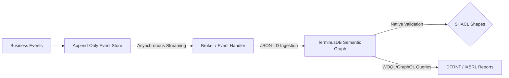
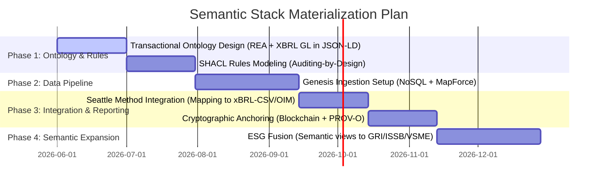

# Technical & Strategic Brief: The "Momento 0" Semantic Architecture

**Prepared for:** Charles Hoffman, CPA, Jonathan Schmidt, & the DFRNT Team  
**Prepared by:** Richard Gasca  
**Framework Matrix:** The Zachman Semantic Fusion  
**Technological Ecosystem:** TerminusDB, DFRNT, W3C Semantic Standards (JSON-LD, SHACL, PROV-O), Altova MapForce, BaseX, XBRL GL, UBL.

---

## 1. Philosophical Grounding & Executive Summary: Zachman as the Matrix Platform

The **Zachman Framework** is not a static inventory of IT blueprints; it is the **matrix of enterprise completeness**. Traditional ERPs and accounting systems suffer from severe ontological limitations: they are flat, silent, and isolated, answering only *What* (balances) and *When* (posting dates) in retrospect.

This structural limitation has forced the most representative leaders of the traditional enterprise software ecosystem (such as SAP with its semantic layer over SAP HANA, Oracle with NetSuite Analytics, and Microsoft with Dynamics 365) to retroactively patch a semantic layer onto their architectures in an attempt to translate and map complex relational tables to human-readable business terms for analytical tools and BI reporting. However, this retroactive, bolted-on semantic approach suffers from fundamental flaws: it is read-only, does not prevent transactional data corruption at the source, and continues to suffer from the "seam problem" between operational transactions and final disclosure reporting.

This pattern of convergence is not a theoretical conjecture; it is an immediate market reality driven by the era of artificial intelligence. As demonstrated by recent industry publications (see Figure 1 and Figure 2), global giants like Microsoft (with its "Fabric IQ" semantic layer and GraphRAG), Google (with Spanner Graph), and Cosmos DB (with OmniRAG) have unanimously converged on the same thesis: **AI without a semantic layer hallucinates, and the only viable semantic layer is a graph**. This ecosystem validation demonstrates that the enterprise knowledge graph category has been fully legitimized by the largest software corporations on earth, proving that the "Momento 0" stack natively addresses at its core the fundamental design flaw that the rest of the industry is scrambling to patch retroactively.


**The "Momento 0" Stack completely subverts this paradigm: instead of adding a semantic layer as an afterthought, the data is born semantic by design.** The transaction is conceived, validated, and registered as a knowledge graph from its very first millisecond of existence. Consequently, multidimensional consistency, SHACL governance, and PROV-O provenance are native and structural foundation elements, not an analytical patch of last resort.

By adopting **Zachman as our matrix platform**, we ensure **dimensional completeness** of the firm within a **Unified Semantic Graph** in **TerminusDB/DFRNT**. For CFOs, auditors, and executive decision-makers, this translates directly to the **"Total Consistency and Traceability Grid"**. This grid slashes audit risks and compliance costs by **over 80%**, guaranteeing that no financial movement exists without its operational, legal, and governance counterpart. The semantic graph simultaneously answers the existential questions of the planning and owner perspectives (Rows 1 and 2 of the Zachman Framework):
*   **WHO (Who) $\to$ `Agent`:** The nexus of fully identified stakeholders (shareholders, customers, regulators, employees).
*   **WHAT (What) $\to$ `Resource`:** Assets, inventory, and the chart of accounts semantically mapped to the `<gl-cor:account>` definitions of XBRL GL.
*   **WHERE (Where) $\to$ `Location`:** Jurisdictional boundaries, warehouses, and transactional nodes.
*   **WHEN (When) $\to$ `Event`:** Real-world economic occurrences represented as ledger entries (`<gl-cor:entryDetail>`).
*   **WHY & HOW (Why / How) $\to$ `Contract`:** The governance policies, agreements, and double-entry rules modeled after Shyam Sunder’s theory of the firm as a "nexus of contracts."
*   **THE NEXUS $\to$ `Entity`:** The firm itself, conceived as the sum of its active contracts (its Semantic Digital Twin).

Furthermore, from its foundational design, the stack natively targets compliance with key international standards for business and financial data management: **ISO 21378** (Audit Data Collection), which defines standardized data structures to facilitate tax extraction and regulatory audit collection, and **ISO 15944** (Information Technology - Business Operational Aspects), which governs electronic data interchange and enforces a rigorous commercial transaction semantics based on the REA (*Resource-Event-Agent*) framework. This double alignment ensures that the Semantic Digital Twin is not only technically seamless and logically consistent but also universally interoperable, legally compliant, and fully prepared for global audit scrutiny.


#### **KR&R (Knowledge Representation and Reasoning): The Scientific Foundation of the Stack**
The "Momento 0" stack is not merely a faster transactional database; it is a physical implementation of **Knowledge Representation and Reasoning (KR&R)**, a foundational branch of Artificial Intelligence. In traditional accounting, enterprise domain knowledge (double-entry rules, corporate policies, tax regulations, and IFRS standards) exists only within the accountant's head or scattered across hard-coded legacy ERP systems. Under the KR&R paradigm, we **explicitly represent and reason over this knowledge within the graph**:
* **Representation:** Through formal ontologies (UBL, REA, XBRL GL represented in JSON-LD), we capture the exact, multi-dimensional semantics of the business (the *Who, What, Where, When, Why, and How*).
* **Reasoning:** Using semantic validation engines (SHACL) and logical rulesets (such as the *Seattle Method* or Prolog-based reasoning engines like *Pacioli*), the system programmatically reasons over transactional data to infer logical consistency, deduce implicit relationships, execute automated reconciliations, and self-detect anomalies. This upgrades the accounting ledger into a **Logical Digital Twin** capable of self-auditing and serving as a zero-hallucination knowledge base for LLMs (GraphRAG).

### What is "Momento 0" (The Genesis State) and the Immutability of Economic Facts?

Following the foundational work of **Shyam Sunder** in the theory of accounting and control (the firm as a "nexus of contracts"), the **Articles of Incorporation** or the deed that gives rise to the entity represents the foundational contract that will be injected at **Moment Zero (The Genesis State)**. In the case of an ongoing concern, this Genesis State will be defined by an **audited Opening Balance**.

To guarantee absolute, legally binding immutability and transparency, these initial documents (Articles of Incorporation and/or audited Opening Balance) will be hosted in a decentralized manner on **IPFS (InterPlanetary File System)**. Through anchoring on a **blockchain network**, their historical unalterability will be guaranteed, and the unique cryptographic identifier (the **IPFS CID**) will remain permanently registered within the genesis JSON-LD instance injected into **TerminusDB**.

At this foundational stage, it is critical to identify with precision the shareholders or entities that make up the capital of the organization, so that the semantic graph is capable of generating dynamic views in real time representing the owners of the entity at any given moment. To seal the immutability and legal certainty of this shareholder registry against any audit or regulatory inquiry, the state of share ownership is cryptographically sealed on the **Algorand** blockchain.

### Background, Intellectual Lineage, and the Creation of "El Bosque" (The Forest)

The design of the "Momento 0" Stack does not stem from abstract academic speculation. Instead, it is the product of a rich professional career in auditing, management control, and technology integration, deeply enriched by knowledge transfers from global pioneers in digital accounting and the semantic web:

1. **XBRL and Accounting Automation Lineage:** 
   The stack's author received a direct transfer of knowledge from **Gianluca Garbelotto** (a global authority on XBRL GL), having actively contributed to the Spanish translation of the official XBRL GL taxonomy tags in the 2015 release. This foundation is complemented by rigorous hands-on experience as an auditor at **PwC** (*PricewaterhouseCoopers*) and as a Management Controller in a multinational corporate environment (where he spearheaded complex implementations of **Oracle Hyperion**). 
   For the last **10 years**, the author has built and optimized data automation and integration systems using the **Altova Suite** (particularly **Altova MapForce**). With the advent of generative AI, this accumulated domain knowledge has been unlocked and supercharged, enabling the rapid engineering of high-efficiency data pipelines that extract ledger balances into **XBRL Global Ledger (XBRL GL)** formats and dynamically remap them to local supervisory taxonomy frameworks (**XBRL FR**).

2. **The Semantic Connection and DFRNT:**
   The conceptual leap toward knowledge graphs was catalyzed by **Timothy Thompson**, an ontologist and metadata librarian at **Yale University**, who introduced the author to W3C's **JSON-LD (JSON Linked Data)** standard. This semantic engineering bridge facilitated the author's connection and subsequent collaboration with **Philip** and the team behind the **DFRNT** platform, establishing the physical layers of our active semantic ledger on **TerminusDB**.

3. **The Genesis of "El Bosque" (The Forest): A Theoretical and Ontological Fusion:**
   Driven by a well-founded suspicion that traditional automated accounting registries suffer from fundamental design flaws and profound semantic disconnections, the author consulted **Eric Cohen** (co-founder and primary champion of XBRL GL) to determine whether a formal, official W3C ontology existed for XBRL Global Ledger. Upon learning from Cohen that while multiple initiatives had been attempted, none held formal or official status, the author made the strategic decision to design and engineer **"El Bosque" (The Forest)**.
   
   **"El Bosque"** represents the absolute integration of four core intellectual and technological pillars:
   * **The Zachman Framework (6x6):** The structural completeness matrix ensuring that no corporate coordinate is left unmapped.
   * **Tim Berners-Lee’s Semantic Standards Layer:** Using the W3C Semantic Web architecture (RDF, JSON-LD, SPARQL/WOQL) for advanced document and linked data management.
   * **The REA (Resource-Event-Agent) Ontology:** William McCarthy's semantic accounting framework that overcomes the blind registry limitations of traditional double-entry ledgers.
   * **Shyam Sunder’s Theory of the Firm:** The Yale Professor's economic paradigm conceiving the enterprise as a **nexus of contracts**.

4. **Data Flows and Event Immutability:**
   Under this paradigm, the legal and operational origin of the enterprise lies in its **Contracts**—the foundational legal documents that justify the continuity of the business as a *going concern* (as established by Shyam Sunder). These documents are transformed and structured as active **JSON-LD** instances and ingested directly into the **TerminusDB** graph.
   
   To guarantee absolute system integrity, we implement three robust control layers:
   * **Blockchain as the Anchor of Truth:** Cryptographically sealing contracts and critical events to guarantee absolute legal immutability of corporate actions.
   * **SHACL for Internal Control by Design:** Enforcing **SHACL (Shapes Constraint Language)** constraints directly at the database ingestion level. This aligns seamlessly with corporate internal control frameworks, executing mathematical, structural, and business validation at the exact millisecond of ingestion (ensuring no corrupt or unbalanced data ever enters the ledger).
   * **Software-Agnostic and Native RDF:** The architecture remains completely independent of closed software vendors and is not constrained by traditional, flat **ETL** (Extract, Transform, Load) pipelines. It enables native semantic graph queries (RDF/WOQL), securing total portability and long-term resilience.

---

### 1.4. Upper-Level Ontologies and Gruber's Criteria

Following **Charles Hoffman's** recommendation, a truly robust, enterprise-grade semantic accounting stack must anchor its structure to an **Upper-Level Ontology / Foundational Ontology** (such as the upcoming **ISO/IEC 21838** standard based on **BFO / Basic Formal Ontology** and **UFO / Unified Foundational Ontology**, or Semantic Arts' **gist** ontology).

Adopting an upper-level ontology prevents semantic fragmentation and ensures that different stakeholders are not trapped in "silos of subjective truths." Furthermore, it guarantees strict alignment with **Gruber’s Criteria (1993)** for ontology design:
*   **Clarity:** Definitions are explicit and context-independent (enforced by using metadata annotations like `skos:definition` and `skos:scopeNote`).
*   **Coherence:** Logical constraints and axioms are mathematically consistent and self-auditable.
*   **Extendibility:** Providing a foundational baseline that can be easily specialized for domain-specific applications.
*   **Minimal Encoding Bias & Minimal Ontological Commitment:** Avoiding proprietary software lock-in and stating only the absolute minimum required assertions, securing open and universal interoperability.

In the "Momento 0" Stack, we map our core architecture directly to the foundational classes of **Gist Core 14.1.0** and **ISO/IEC 21838 BFO/UFO**:
1.  **WHO $\to$ `Agent`:** Gist 14.1.0 does not define an abstract `Agent` class; instead, it uses the union of `gist:Organization` ("structured entity formed to achieve goals...") and `gist:Person` ("human being alive").
2.  **WHAT $\to$ `Resource`:** Mapped to `gist:PhysicalIdentifiableItem` for physical assets (such as inventory and equipment) and `gist:IntellectualProperty` for intangible concepts.
3.  **WHEN $\to$ `Event`:** Aligned with `gist:Event` and specifically `gist:Transaction` ("transfer of goods, services, or funds"), representing ledger entries (`gl-cor:entryDetail`).
4.  **WHY & HOW $\to$ `Contract`:** Mapped to `gist:Agreement` ("mutually understood arrangement where parties make commitments") and `gist:Contract` (a `gist:Agreement` under the jurisdiction of a `gist:GovernmentOrganization`).
5.  **THE LEDGER NEXUS $\to$ `Account`:** **`gist:Account` is formally defined as a `gist:Agreement` having a balance.** This mirrors **Shyam Sunder's** economic theory: an accounting ledger account is not a blind passive repository of balances, but the financial representation of a mutual agreement/commitment between parties.

---

### 1.5. From Document Level Assurance to Data Level Assurance (Eric Cohen's Vision)

Traditional auditing is constrained by a paper-centric mindset. Under legacy auditing standards (such as SAS 8 or the interim interpretation **PCAOB AU 9550 / AU 550**), web sites and electronic data sets are considered "distribution media" and not official audit documents. Thus, the auditor's opinion is bound to a **closed document** (like a signed PDF report), losing all control, context, and "audit-ness" once the data leaves the company's firewall.

To solve this, **Eric Cohen** (co-founder of XBRL), along with Miklos Vasarhelyi in 2001, proposed the paradigm of **Data Level Assurance (DLA)**. The core philosophy of DLA is to **"paint boundaries of trust" around individual atomic data points**, allowing the public trust and audit context to travel **portably and independently** of the systems that generated or store the information.

The "Momento 0" Stack physically implements Eric Cohen's DLA vision through the following technological mechanisms:

#### A. The Data Trust Formula
Data trust is programmatically calculated as a function of `DT = f(DLA, PK, OF)`, where `DLA` (Data Level Assurance) guarantees quality and assurance across multiple dimensions:
*   **Data Assurance & Quality (DA/DQ):** Enforced by REA relational mappings and SHACL constraints.
*   **Metadata Assurance & Quality (MA/MQ):** Anchored by W3C PROV-O provenance links (`prov:wasDerivedFrom`) connecting each ledger entry back to its raw XML invoice.
*   **Taxonomy/Ontology Assurance & Quality (TA/TQ):** Protected by a closed-world schema in TerminusDB running the XBRL GL transactional ontology.
*   **Organization Assurance & Quality (OA/OQ):** Verified by cryptographically signing records on the **Algorand** blockchain.

#### B. The 12-Stage Crypto-Assurance Roadmap
Our transaction pipeline is mapped to achieve the highest stages of Eric Cohen's DLA roadmap:
*   *Stages 1-5 (Digital files, PDF rendering, T3P repositories, and XLinks):* Handled by our secure IPFS storage and BaseX cloud environments.
*   *Stages 6-8 (Digital Signatures at Concept Level / Specific Signatures):* Enabling cryptographic signing of individual RDF data concepts, separating management assertions from audit opinions.
*   *Stage 10 (Free Data carrying "Audit-ness"):* Allowing specific financial facts (e.g. quarterly revenue) to be pulled into external web sites or press releases while retaining their URL links back to the source and audit evidence.
*   *Stage 11 (Real-Time and Continuous Assurance):* Automated TerminusDB/DFRNT queries executing background risk and balance validations continuously.
*   *Stage 12 (Data Encryption / XML Encryption):* Client-side AES-256 encryption (`secure_ipfs_helper.py`) of data chunks before they are stored in the private IPFS swarm, securing selective privacy.

#### C. Three Levels of Assuror
1.  **Level 1: Digital Notary:** Validates source authenticity, file integrity, timestamping, and authorization via Blockchain and IPFS.
2.  **Level 2: Expert Appraiser:** Programmatically validates logical and mathematical consistency (double-entry ledger rules, REA patterns) via W3C **SHACL** shapes.
3.  **Level 3: 3rd Party Independent:** Evaluates completeness and accuracy, ensuring the final reporting pack (xBRL-CSV/OIM) matches underlying transactional graph data.

---

## 2. Architectural Blueprint: The "First Mile" to "Last Mile" Approach

Our stack decouples storage, business logic, and semantic querying into a modular pipeline, ensuring that localized regulatory formats do not pollute the core database structure.

**In this design, the ontology and the semantic graph have absolute structural and logical preponderance over legacy databases and relational ERPs. The transactional data is born inside the Semantic Graph Core (TerminusDB), and legacy relational systems are populated downstream by projecting the graph.**

```mermaid
graph TD
    %% Ingestion Layer
    subgraph FirstMile ("The First Mile - Ingest & Operations (Richard's Stack)")
        A[Simultaneous Transactional Ingestion / UBL Docs] -->|Direct Ingestion / XForms| C[TerminusDB Graph Database / DFRNT]
        
        %% Graph validation
        C -->|Structural & Rule Validation| D{SHACL Validation Engine}
        D -->|Auditing-by-Design Constraints| C
        
        %% Provenance & Security
        E[Algorand Blockchain] -->|Legal Immutability Anchor| C
        F[IPFS Private Swarm / AES-256] -->|Encrypted Document Storage| C
        G[W3C PROV-O - prov:wasDerivedFrom] -->|Atomic Data Provenance| C
        
        %% Legacy population
        C -->|Semantic Graph Projections| H[(Relational DB / Legacy ERP)]
    end

    %% Last Mile Layer
    subgraph LastMile ("The Last Mile - Disclosure & Reporting (Charlie's Stack)")
        C -->|OIM Semantic Export| I[xBRL-CSV / xBRL-JSON Output]
        I -->|Report Consistency Guardrails| J[Seattle Method Logical Rules]
        J -->|Zero-Defect Audit Bundle| K[CFOs, Auditors, Regulators]
    end

    classDef firstMile fill:#112e51,stroke:#ffffff,color:#ffffff;
    classDef lastMile fill:#abb8c3,stroke:#313131,color:#313131;
    class A,C,D,E,F,G,H firstMile;
    class I,J,K lastMile;
```

### Phase 1: Ingestion & Operations (Semantic Governance, REA, and Gist in TerminusDB)
Our architecture operates directly at the operational transaction level, establishing the graph as the master record:
*   **Dual Ingestion Channel & Semantic Capture (MapForce & XForms):**
    1. **Altova MapForce Pipeline (Structured Documents):** UBL 2.1 XML invoices or ledger entries are translated directly into **JSON-LD** using visual mapping schemas. The design is format-agnostic: if a local jurisdiction changes formatting requirements, only the source mapping schema is adjusted in MapForce, leaving downstream graph schemas and SHACL validators untouched.
    2. **W3C XForms and BaseX Pipeline (Interactive Capture):** Manual entries are captured via **XForms** into a **BaseX** XML database on a **DigitalOcean** server, from which they are transformed into JSON-LD and written to **TerminusDB**.
*   **Ontological XBRL GL Integration:** Rather than treating XBRL GL as a legacy export format, **the XBRL GL taxonomy is integrated directly into the TerminusDB schema as native classes**. Classes such as `gl-cor:entryHeader`, `gl-cor:entryDetail`, and `gl-cor:account` exist as first-class citizens in the graph, fused with REA and Gist Core 14.1.0:
    - Ledger headers (`gl-cor:entryHeader`) are modeled as subclasses of `gist:Event` (specifically `gist:Transaction`).
    - Ledger lines (`gl-cor:entryDetail`) map to REA economic events and `gist:Commitment` objects.
    - Chart of accounts (`gl-cor:account`) map to `gist:Account` (defined in Gist as a `gist:Agreement` with a financial balance).
*   **Graph-to-Legacy Projection Pipeline (Active Write-Back):** The ultimate milestone of the semantic architecture is reached when we project the semantic graph to populate and update legacy systems downstream. The semantic graph acts as the transactional master, storing all multi-dimensional relationships (Who, What, Where, When, Why, How). We execute WOQL/GraphQL queries on TerminusDB to flatten and project the graph, pushing it as relational journals into the legacy ERP (such as SAP or NetSuite). The legacy ERP becomes a passive compliance ledger.
*   **Strong Schema Enforcement & Closed-World Assumption (TerminusDB vs. Neo4j):** Unlike traditional property graph databases such as **Neo4j**, which operate under an "Open World Assumption" (OWA) and are inherently schema-less or schema-optional, **TerminusDB** operates strictly under a **"Closed World Assumption" (CWA)**. It is a strongly typed database requiring a formal, explicit schema. **This is precisely where the formal ontology of XBRL GL fulfills its critical engineering mission:** instead of permitting transactional data anarchy (where essential ledger properties could be omitted or mis-typed without system rejection), TerminusDB's schema acts as an unyielding gatekeeper, forcing every operational transaction to strictly align with the exact types, properties, and relationships defined by the formal XBRL GL dictionary.
*   **Provenance Linkage:** Using **W3C PROV-O** (`prov:wasDerivedFrom`), every reporting node retains an unbreakable semantic link back to its raw original source document (the "Genesis" evidence), offering unparalleled observability for both human auditors and AI agents.
*   **Blockchain & IPFS (The Digital Notary Anchor):** Handled by our secure IPFS storage and Algorand blockchain environments, locking contracts and critical transactions for absolute legal validation.

### Phase 2: Bridging Labeled Property Graphs (LPG) and Semantic Graph Architectures
In the graph database ecosystem, two dominant paradigms coexist: **Semantic Web Graphs (RDF/Triple Stores)**, which excel at global interoperability, web standards (W3C, JSON-LD), and formal logical reasoning (KR&R/SHACL); and **Labeled Property Graphs (LPG)**, such as Neo4j or Google Spanner Graph, which are optimized for high-performance traversals, network analysis algorithms, and widespread developer adoption. The "Momento 0" stack strategically bridges these two paradigms:
1. *The Semantic & Governance Core (RDF/JSON-LD + SHACL):* Ingestion and transactional validation ("First Mile") live inside **TerminusDB/DFRNT**, serving as a strongly typed semantic ledger that structurally rejects data corruption or schema anarchy.
2. *Analytical Projections to LPG (Neo4j / Spanner Graph):* Once transactional data is validated with "zero defects" in the semantic core, the graph can be seamlessly projected into an **LPG** model (using JSON projections or RDF-star semantics). In this LPG layer, we deploy advanced analytical operations such as *Fraud Detection & Network Analytics* (running centrality, page rank, and community detection algorithms on the LPG to uncover complex relational patterns between related agents) and *High-Speed GraphRAG* (powering AI agents and LLMs by combining vector databases with fast LPG traversals to provide instant, contextual business intelligence for LLMs). This delivers an unbeatable hybrid: **Semantic Governance at the Core, LPG Performance in Analytics.**

### Phase 3: Downstream Legacy Integration (The Passive Compliance Vault)
*   **Unidirectional Egress Synchronization:** The system queries the graph (using WOQL/GraphQL) to flatten the complex multi-dimensional network on-demand, generating standardized flat-file journals (CSV/JSON) that are pushed downstream to feed legacy ERPs or local tax ledgers. The semantic graph remains the Single Source of Truth (SSOT) where the data actively lives, while legacy systems act merely as passive compliance repositories ("passive compliance vaults").

### 2.4. Graph Querying and Real-World Outputs (Bridging the Digital Twin to the Physical World)
To ensure that the Semantic Digital Twin has full legal, operational, and institutional validity, it cannot behave as a closed silo or a "black box." It must seamlessly connect and output to the real-world business, legal, and regulatory ecosystem:
*   **Graph Query Languages (WOQL & GraphQL):**
    *   **WOQL (Web Object Query Language):** TerminusDB’s native, declarative, and highly expressive query language. WOQL enables complex relational logic and deep path traversal across the graph, perfect for reconstructing transaction history, verifying provenance chains (`PROV-O`), and audit tracking.
    *   **GraphQL:** Used as a developer-friendly API layer, facilitating seamless integration with **DFRNT** visualization tools, front-end dashboards, and external enterprise software platforms.
*   **Corporate Governance & Legal Records (Official Books):**
    Using structured WOQL/GraphQL queries, the system dynamically extracts and generates legally binding corporate records:
    *   **Corporate Minutes (General Assembly & Board of Directors):** Auto-generated directly from graph nodes, linked to immutable cryptographic hashes on the Blockchain to guarantee legal provenance and authenticity.
    *   **Shareholders Registry & Board Registries:** A real-time ledger of corporate ownership (Zachman's "Who" column) that updates dynamically with every equity transfer event or change in corporate administration.
*   **XBRL FR (Financial Reporting) Generation & Multi-Format Rendering:**
    The semantic ledger is the engine that compiles complex financial reporting from transactional details:
    *   **Extraction Queries:** Software agents query the TerminusDB graph to aggregate trial balances and map them to targeted financial taxonomies (IFRS, US GAAP).
    *   **XBRL FR Instances:** Programmatic assembly of standardized XBRL Financial Reporting instances.
    *   **Physical & Interactive Formats:** Automated transformation of these semantic models into human-readable files:
        *   **iXBRL (Inline XBRL):** Embedding standard XBRL tags directly into elegant HTML5 files, allowing human-readable browser viewing while retaining machine-readable metadata.
        *   **PDF & Word (DOCX):** High-fidelity rendering for printing, regulatory archive filing, and editorial reviews by board directors.
*   **Continuous Auditing:**
    Transitioning from periodic sample-based audits to real-time assurance. Automated background agents constantly query the graph using WOQL/GraphQL, performing continuous diagnostic runs, bank reconciliations, and control validations, raising instant flags upon any anomaly detection.
*   **Non-Financial Information, ESG, and Inventories:**
    Electronic documents (such as UBL invoices or contracts) contain valuable non-financial information crucial for business operations and compliance. The stack extracts this data directly to enrich the graph:
    *   *Sustainability and Climate:* Non-financial climate impact and sustainability data embedded in contracts and invoices are extracted to populate the graph, supporting international disclosure taxonomies such as **ISSB**, **GRI**, and **EFRAG** (EFRAC).
    *   *Inventory Control:* Quantitative physical item details are extracted from source documents and written directly into the ledger graph, feeding the firm's inventory management systems in real time.
*   **Multi-Book Posting Purposes (XBRL GL Purposes) and Self-Reconciliation:**
    In accordance with the XBRL Global Ledger taxonomy, the stack enables associating a specific **Accounting Purpose** (`purpose`) to every ledger entry, facilitating multi-book accounting and cross-border reporting:
    *   *Tax / Fiscal:* Records targeted at local tax compliance and regulatory filings.
    *   *IFRS:* Focuses on international financial reporting standards, representing transactions, documents, events (risgos/risks), and conditions (contracts) in the author's jurisdiction. The stack is designed to fully support IFRS while retaining the capability to cover other conceptual frameworks.
    *   *Local GAAP / Juzgada:* Historical ledger records complying with local judicial or corporate-specific accounting principles.
    *   *Self-Reconciliation:* Because the financial information lives in a continuous graph of relationships, the stack is capable of **natively self-reconciling accounting information** directly within the graph. It deterministically reconciles cash entries, inventory physical flows, and contract events without requiring external, post-facto reconciliation tools.

---

### 2.5. Practical Implementation Aspects, Scalability, and Robustness

To ensure this cutting-edge semantic architecture is highly viable in high-volume, enterprise-grade production environments, we address typical semantic database limitations through the following operational strategies:

#### A. Hybrid CQRS and Event Sourcing Approach (Read/Write Scalability)
While graph databases excel at multi-dimensional queries and deep provenance path traversals, real-time bulk writing directly into a triple store can become a bottleneck. Therefore, we utilize a hybrid Command-Query Responsibility Segregation (CQRS) setup:
1.  **Transactional Write Path (Command / Event Store):** Daily business transactions (invoices, treasury, payroll) are written asynchronously and instantaneously as flat events in an append-only, high-performance transactional log (an *Append-Only Event Store* using a relational backend or a message broker like Apache Kafka). This guarantees sub-millisecond operational write throughput.
2.  **Semantic Read Path (Query / Materialized View):** The stream of events is asynchronously consumed and projected in real-time into the **TerminusDB** Semantic Graph. The graph serves as the *materialized multi-dimensional view* where SHACL shapes validate the ledger structure and auditors execute complex provenance queries.



#### B. Performance Metrics and Benchmarks
The TerminusDB engine, written in Rust using highly optimized Succinct Data Structures, delivers enterprise-grade performance:
*   **Storage Capacity:** Efficiently handles billions of RDF triples with a memory footprint up to 10x smaller than traditional Java-based triple stores. For an enterprise generating 10 million transactions annually (~300 million semantic triples), the entire graph runs comfortably on a standard cloud cluster with 32 GB of RAM.
*   **Query Response Times:**
    *   *Direct Provenance (PROV-O):* Single-step queries (e.g., retrieving the raw XML invoice of a specific journal line) resolve in **< 5 milliseconds**.
    *   *Traceability Paths:* Deep multi-hop graph traversals (Shareholder -> Contract -> Event -> Journal Line -> ESG Impact) resolve in **15 to 50 milliseconds**.
    *   *Semantic Ingestion Throughput:* Bulk batch ingestion of **15,000 to 20,000 transactions per second** on a single node.

#### C. Double-Entry and SHACL Constraints under Strict Immutability (Edge Cases)
The immutability of the semantic graph strictly prohibits physical editing (`UPDATE`) or deletion (`DELETE`) of historical entries. This requires handling accounting edge cases through logical flows governed by SHACL shapes:
1.  **Reversals and Historical Corrections:** Errors are corrected by posting a *new offsetting transactional event*. The correction SHACL shape (`shapes:CorrectionEvent`) validates that the correcting entry contains a `prov:wasInfluencedBy` link pointing to the unique URI of the erroneous transaction, along with a mandatory justification property.
2.  **Multi-Currency Transactions:** The double-entry shape verifies that foreign currency entries (`gl-muc:foreignCurrency`) contain explicit exchange rate metadata (`gl-muc:exchangeRate`) and that debits and credits balance in both the transaction currency and the default reporting currency (`gl-muc:defaultCurrency`), allowing for a rounding tolerance of $10^{-6}$ using numeric filter constraints.
3.  **Adjustments and Closing Entries:** As adjustments to closed periods are forbidden, SHACL shapes validate that the transaction date (`gl-cor:documentDate`) falls within a period marked as "Open". Annual closing entries are validated by ensuring that all temporary expense and revenue balances are cleared to zero and transferred to the retained earnings account.

#### D. Governance and Semantic Schema Management
Tax laws and reporting regulations shift constantly, requiring strict governance over active SHACL shapes:
*   **Semantic Versioning (SemVer):** Business ontologies and SHACL files are strictly versioned (e.g., `shapes-v1.2.0.ttl`).
*   **Git-like Branching in TerminusDB:** Schema changes are developed and tested on isolated branches (`main`, `staging`, `tax-reform-2026`). Regression testing ensures new constraints do not invalidate historical transactions before they are merged into the production branch (`main`).
*   **Schema Validity Intervals:** SHACL constraints are bound to specific validity timeframes. The engine automatically applies the 2025 shapes version to 2025 entries, and the 2026 shapes version to 2026 entries.

#### E. Coexistence and Ontological Preponderance: Governance over Legacy ERPs and Analytical Tools (Power BI & Similar)

This architecture does not propose a disruptive "clean slate" (*borrón y cuenta nueva*) replacement of legacy systems, which would trigger immediate C-suite pushback due to migration costs and friction. Instead, it establishes a strategic, non-disruptive coexistence model between both worlds, governed by a strict and non-negotiable hierarchy: **the ontology holds absolute structural and logical preponderance over both traditional ERPs and downstream analytical tools (such as Power BI and similar platforms).**

This structural preponderance redefines the legacy components of the enterprise stack:

1. **Preponderance over Legacy ERPs (The "Passive Compliance Vault"):**
   * *Financial Reality Born Semantic:* Transactions are not entered into the ERP first to be retroactively structured as an afterthought. Instead, data is born inside the ontological core (**TerminusDB/DFRNT**), where SHACL constraints validate it with "zero defects" at the transactional level.
   * *ERPs as Passive Destinations:* Once the ontology verifies the transaction (enforcing multi-currency balance, REA contracts, and PROV-O document links), the system queries the graph to generate flat-file journals. These validated journals are pushed downstream via unidirectional APIs into the legacy ERP (SAP, NetSuite, Oracle, etc.). The ERP no longer controls the data model; it serves strictly as a passive ledger for local regulatory compliance and historical filing.

2. **Preponderance over Downstream Analytics and BI Tools (Power BI & Similar):**
   * *Eradicating Isolated Analytical Semantic Layers:* Traditionally, BI platforms like Power BI extract raw tables from relational databases, and data analysts build ad-hoc entity relationships, custom metrics, and logic inside Power Query or DAX. This leads to fragmented, brittle semantic layers across different departments, resulting in conflicting business metrics and significant error rates.
   * *Power BI as a Pure Visualization Layer:* Under the "Momento 0" stack, **Power BI does not define business logic or relationships; it merely visualizes them**. BI tools connect directly to the semantic graph’s pre-validated views (or its optimized LPG analytical projections) through standard query APIs. Every dimension of the Zachman Framework (*Who, What, Where, When, Why, How*) and all accounting policies are governed and resolved *at the ontological level*. Power BI acts strictly as a high-fidelity window to the single, unbreakable truth defined by the ontology, ensuring absolute logical consistency across all dashboards and eliminating redundant data modeling.

---

### 2.6. End-to-End Data Flow Example

Below is a concrete, end-to-end data pipeline walkthrough illustrating how a raw XML UBL 2.1 invoice is converted, audited, queried, and reported.

#### Step 1: Input Document (UBL 2.1 XML Invoice Snippet)
The physical transaction file generated by the invoicing system:
```xml
<?xml version="1.0" encoding="UTF-8"?>
<Invoice xmlns="urn:oasis:names:specification:ubl:schema:xsd:Invoice-2"
         xmlns:cac="urn:oasis:names:specification:ubl:schema:xsd:CommonAggregateComponents-2"
         xmlns:cbc="urn:oasis:names:specification:ubl:schema:xsd:CommonBasicComponents-2">
    <cbc:ID>FAC-2026-0045</cbc:ID>
    <cbc:IssueDate>2026-05-20</cbc:IssueDate>
    <cbc:DocumentCurrencyCode>USD</cbc:DocumentCurrencyCode>
    <cac:AccountingSupplierParty>
        <cac:Party>
            <cac:PartyTaxScheme>
                <cbc:CompanyID>NIT-901234567-8</cbc:CompanyID>
            </cac:PartyTaxScheme>
        </cac:Party>
    </cac:AccountingSupplierParty>
    <cac:AccountingCustomerParty>
        <cac:Party>
            <cac:PartyTaxScheme>
                <cbc:CompanyID>NIT-800987654-3</cbc:CompanyID>
            </cac:PartyTaxScheme>
        </cac:Party>
    </cac:AccountingCustomerParty>
    <cac:LegalMonetaryTotal>
        <cbc:LineExtensionAmount currencyID="USD">1000.00</cbc:LineExtensionAmount>
        <cbc:TaxExclusiveAmount currencyID="USD">1000.00</cbc:TaxExclusiveAmount>
        <cbc:TaxInclusiveAmount currencyID="USD">1190.00</cbc:TaxInclusiveAmount>
        <cbc:PayableAmount currencyID="USD">1190.00</cbc:PayableAmount>
    </cac:LegalMonetaryTotal>
</Invoice>
```

#### Step 2: Semantic Translation Output (JSON-LD generated by Altova MapForce)
MapForce maps the XML payload to a standardized JSON-LD graph structure based on the REA ontology and XBRL GL, embedding W3C **PROV-O** metadata for absolute traceability:
```json
{
  "@context": {
    "rea": "https://w3id.org/rea/ontology#",
    "gl-cor": "http://www.xbrl.org/int/gl/cor/2020-12-31#",
    "prov": "http://www.w3.org/ns/prov#",
    "ex": "https://momento0.org/schema#"
  },
  "@id": "ex:tx_FAC-2026-0045",
  "@type": ["rea:EconomicEvent", "gl-cor:entryHeader"],
  "prov:wasDerivedFrom": "file:///C:/NoSQL/Storage/FAC-2026-0045.xml",
  "gl-cor:documentDate": "2026-05-20",
  "gl-cor:entryDetail": [
    {
      "@id": "ex:tx_FAC-2026-0045_dr",
      "@type": "gl-cor:postingDetail",
      "gl-cor:accountMainID": "130505",
      "gl-cor:accountMainDescription": "National Customers",
      "gl-cor:debitCreditCode": "D",
      "gl-cor:amount": 1190.00,
      "gl-cor:currency": "USD",
      "rea:debtor": "ex:agent_NIT-800987654-3"
    },
    {
      "@id": "ex:tx_FAC-2026-0045_cr1",
      "@type": "gl-cor:postingDetail",
      "gl-cor:accountMainID": "415505",
      "gl-cor:accountMainDescription": "Service Revenue",
      "gl-cor:debitCreditCode": "C",
      "gl-cor:amount": 1000.00,
      "gl-cor:currency": "USD",
      "rea:creditor": "ex:agent_NIT-901234567-8"
    },
    {
      "@id": "ex:tx_FAC-2026-0045_cr2",
      "@type": "gl-cor:postingDetail",
      "gl-cor:accountMainID": "240805",
      "gl-cor:accountMainDescription": "VAT Payable 19%",
      "gl-cor:debitCreditCode": "C",
      "gl-cor:amount": 190.00,
      "gl-cor:currency": "USD",
      "rea:creditor": "ex:agent_NIT-901234567-8"
    }
  ]
}
```

#### Step 3: Semantic Engine Rules (SHACL Shapes in Turtle Format - shapes-contables.ttl)
Constraints evaluated natively upon ingestion inside TerminusDB:
```turtle
@prefix sh: <http://www.w3.org/ns/shacl#> .
@prefix xsd: <http://www.w3.org/2001/XMLSchema#> .
@prefix gl-cor: <http://www.xbrl.org/int/gl/cor/2020-12-31#> .
@prefix prov: <http://www.w3.org/ns/prov#> .
@prefix ex: <https://momento0.org/schema#> .

# 1. Provenance Constraint for Header Entries
ex:TransactionProvenanceShape
    a sh:NodeShape ;
    sh:targetClass gl-cor:entryHeader ;
    sh:property [
        sh:path prov:wasDerivedFrom ;
        sh:minCount 1 ;
        sh:nodeKind sh:IRI ;
        sh:message "CRITICAL ERROR: Transaction entry header is missing a verifiable provenance link to raw source documents."@en
    ] .

# 2. Minimum Dual Account Entry Line Details Requirement
ex:EntryDetailShape
    a sh:NodeShape ;
    sh:targetClass gl-cor:entryHeader ;
    sh:property [
        sh:path gl-cor:entryDetail ;
        sh:minCount 2 ;
        sh:message "CRITICAL ERROR: A journal entry must consist of at least two balanced details (Debit & Credit)."@en
    ] .
```

#### Step 4: WOQL Extraction Query
Aggregates ledger transactions into trial balance sets:
```javascript
// WOQL query in Node.js / DFRNT to reconcile balances by account
const WOQL = require('@terminusdb/terminusdb-client').WOQL;

const query = WOQL.and(
  WOQL.triple("v:Entry", "type", "gl-cor:entryHeader"),
  WOQL.triple("v:Entry", "gl-cor:entryDetail", "v:Detail"),
  WOQL.triple("v:Detail", "gl-cor:accountMainID", "v:Account"),
  WOQL.triple("v:Detail", "gl-cor:debitCreditCode", "v:Type"),
  WOQL.triple("v:Detail", "gl-cor:amount", "v:Amount"),
  WOQL.triple("v:Detail", "gl-cor:currency", "v:Currency"),
  // Group and sum
  WOQL.group_by(
    ["v:Account", "v:Type"],
    ["v:Amount"],
    "v:TotalAmount",
    WOQL.sum("v:Amount", "v:TotalAmount")
  )
);
```

#### Step 5: Last Mile Output (Regulatory Inline XBRL HTML5 Page)
The resulting compliant presentation rendered directly from graph extractions:
```html
<?xml version="1.0" encoding="utf-8"?>
<html xmlns="http://www.w3.org/1999/xhtml"
      xmlns:ix="http://www.xbrl.org/2013/inlineXBRL"
      xmlns:ixt="http://www.xbrl.org/inlineXBRL/transformation/2020-02-12"
      xmlns:ifrs-full="http://xbrl.ifrs.org/taxonomy/2026-03-24/ifrs-full">
<head>
    <title>Semantic Financial Report - Momento 0</title>
</head>
<body>
    <div style="font-family: 'Inter', sans-serif; padding: 20px;">
        <h1 style="color: #112e51;">Statement of Comprehensive Income</h1>
        <table style="width: 100%; border-collapse: collapse;">
            <thead>
                <tr style="border-bottom: 2px solid #112e51;">
                    <th align="left">Financial Concept</th>
                    <th align="right">Amount</th>
                </tr>
            </thead>
            <tbody>
                <tr>
                    <td>Revenue from Contracts with Customers</td>
                    <td align="right">
                        <!-- The ix:nonFraction tag encapsulates standard IFRS taxonomy references with human-readable numbers -->
                        <ix:nonFraction id="revenue_1" 
                                        name="ifrs-full:RevenueFromContractsWithCustomers" 
                                        contextRef="current_period" 
                                        unitRef="USD" 
                                        decimals="2" 
                                        scale="0" 
                                        format="ixt:numdotcomma">1,000.00</ix:nonFraction>
                    </td>
                </tr>
            </tbody>
        </table>
    </div>
</body>
</html>
```

---

## 3. SHACL: Enabling "Auditing and Accounting by Design"

**SHACL (Shapes Constraint Language)** is the W3C standard that enables us to implement **Auditing by Design** natively inside the database engine, before reports are ever compiled. 

**SHACL (Shapes Constraint Language) represents the technological equivalent of "Formula Linkbases" (Linkbases de Fórmulas) within the traditional XBRL standard.** Much like XBRL formulas validate logical and mathematical consistency in external financial reporting, W3C SHACL Shapes serve as the definitive internal control mechanism within the TerminusDB graph database, enforcing rules and conditions at the exact millisecond a transaction is injected. 

This equivalence and logical superiority is conceptually anchored in **Charles Hoffman's** research on the convergence of technology layers (see the reference document [SemanticWebStack_XBRLStack.pdf](file:///C:/Users/IPHIX/Documents/Projects/DFRNT/Documentacion/Memoria/SemanticWebStack_XBRLStack.pdf)). Hoffman identifies the "Unifying Logic Framework" of the Semantic Web Stack (utilizing RDFS, OWL, and SHACL under a strict Closed World Assumption) as the ultimate interoperability target between the W3C and XBRL stacks. This architectural integration enables sophisticated and safe logical reasoning that goes far beyond the capabilities and known deficiencies of legacy XBRL Formula processors, upgrading the ledger to a self-validating system. 

Rather than validating financial reports *post-facto*, SHACL shapes define structural and logical constraints that TerminusDB enforces in real-time upon data ingestion:
1.  **Double-Entry Constraints:** Enforcing that every financial `Event` contains a set of balanced ledger details where total debits equal total credits under the default reporting currency (`gl-muc:defaultCurrency`).
2.  **Provenance Integrity:** Requiring that any event impacting cash or treasury accounts must possess a valid `prov:wasDerivedFrom` relation pointing to a verified source document (UBL invoice or JSON transaction).
3.  **Zachman Dimensional Completeness:** Restricting any entry from being written to the database if it lacks relations to its corresponding Zachman coordinates: `Agent` (Who), `Resource` (What), and `Contract` (Why/How).

Transactions violating these constraints are natively rejected by the graph database, ensuring that the ledger represents an structurally perfect, self-auditing book of record.

---

## 4. Road Ahead to Materialize the Project (Implementation Roadmap)

To transform this vision into a functional production stack and demonstrate the feasibility of the Semantic Digital Twin, we establish a clear 6-step execution plan:



### Step 1: Ontological Foundation (Zachman Rows 1-2)
*   **Objective:** Consolidate the TerminusDB schema (`schema-fundacional.json`) by exhaustively defining the properties and relationships of the 6 Master Classes (`Agent`, `Resource`, `Location`, `Event`, `Contract`, `Entity`).
*   **Action:** Translate basic properties of the XBRL GL taxonomy (`accountMainID`, `debitCreditCode`, `amount`) into native properties within the graph's JSON-LD context.

### Step 2: Graph Rules Modeling (SHACL - Auditing by Design)
*   **Objective:** Write the SHACL shapes files (`shapes-contables.ttl`) to define unbreakable balance and provenance constraints inside TerminusDB.
*   **Action:** Implement automated tests where the TerminusDB engine successfully rejects unbalanced transactions or entries lacking `prov:wasDerivedFrom` provenance references.

### Step 3: Ingestion of "Momento 0" and Ingestion Pipelines
*   **Objective:** Develop the ingestion pipeline where, using **Altova MapForce** as the mapping engine, documents from various sources will be translated into **JSON-LD** and injected directly into the **TerminusDB** graph. **This guarantees format independence: if a jurisdiction changes invoicing to JSON or any other language, core schemas and validators remain untouched; only the source mapping in MapForce is updated.**
*   **Action:** Design the visual mapping in MapForce and execute the ingestion of a real, audited Opening Balance (**Genesis State**) to initialize the Semantic Digital Twin in TerminusDB.

### Step 4: Reports Integration and the Last Mile (Seattle Method & OIM)
*   **Objective:** Design the semantic queries (GraphQL / WOQL) needed to extract validated data from the graph and export it in **xBRL-CSV (OIM)** format, fully complying with the Seattle Method's rules.
*   **Action:** Validate the exported xBRL-CSV file against Charlie's consistency guardrails to ensure a zero-defect *Audit Bundle*.

### Step 5: Provenance and Blockchain Anchoring Implementation
*   **Objective:** Embed the W3C Provenance Ontology (PROV-O) across the entire graph and configure the ledger connector to write cryptographic hashes of key contracts and shareholder registries onto the Blockchain.
*   **Action:** Demonstrate that an external auditor can drill down from a consolidated financial item, verify its hash on the blockchain, and navigate directly back to the original source invoice.

### Step 6: ESG Semantic Fusion (GRI / ISSB / VSME)
*   **Objective:** Expand the graph by leveraging the XBRL GL Summary Reporting Contextual Data (**SRCD**) module to directly link financial expense accounts with sustainability indicators.
*   **Action:** Generate automated views and reports demonstrating how a financial transaction (e.g., fuel purchase) is semantically and auditably mapped into a carbon emission indicator under GRI/VSME standards.

---

## 5. CFO Value Proposition & Thought Leadership

To establish a truly transformative paradigm, this architecture consciously pulls together four key sets of complementary skills, experience, and domain expertise:
*   **Philippe & the DFRNT Team (Technical Enablement & Graph Modeling):** Serving as the core technical enabler, leveraging extensive experience with TerminusDB, enterprise semantic web architectures, and advanced data graph modeling.
*   **Jonathan Schmidt (Industrial Engineering & Lean Six Sigma):** Optimizing accounting flows with his training as an Industrial Engineer, integrating Lean Six Sigma techniques, principles, and philosophies to design waste-free, high-efficiency ledger pipelines with rigorous internal control loops.
*   **Richard Gasca (End-to-End Financial Information Supply Chain Integration):** Spanning the entire financial information supply chain—from raw transaction entry to final auditor visualization. Utilizing 10 years of experience with Altova MapForce and W3C standards, he designs and executes the automated pipelines that ingest operational data (Google Sheets/Excel), map it into XBRL Global Ledger (XBRL GL), remap it to supervisory taxonomies (XBRL FR), and render interactive HTML for continuous auditing, physically realizing the W3C/XBRL International integrated data flow.
*   **Charles Hoffman (Accounting Information Systems Generalist):** An AIS pioneer who bridges the team by seeing the big picture from start (transaction entry) to finish (financial analysis of regulatory reports), leveraging deep research into the W3C Semantic Web Stack (RDF, OWL, SHACL, SKOS) to natively apply XBRL within modern reporting, auditing, ledger architectures, and cryptography (including digital distributed ledgers).

Fusing these four pillars establishes a massive competitive advantage:
*   **Unmatched Efficiency:** Reduces traditional auditing and administrative reporting overhead by more than 80%.
*   **Continuous Auditing:** Automated background queries perform bank reconciliations, tax checks, and control validations in real-time, moving the company from periodic retro-auditing to active continuous assurance.
*   **Mitigated Systemic Risk:** Protects corporate entities against compliance failures, AI-system hallucinations, and data loss by utilizing immutable, mathematically perfect ledger shapes.

To establish market leadership, we propose launching a 7-Part Thought Leadership Series, positioned for CFOs, Big 4 Auditors, and Enterprise Architects:

### Episode 1: The AI Audit Crisis & The Future of Accounting
*   **Core Idea:** Why Pacioli's 500-year-old double-entry model fails in the AI era. Relational databases and ERP silos obscure automated algorithmic decisions. We present the **Semantic Digital Twin** of the firm using **TerminusDB** and **DFRNT** as the only viable mechanism for real-time observability.

### Episode 2: Traceability in the Semantic Graph (Fusing KR&R and LPG)
*   **Core Idea:** The physical realization of the **REA (Resource-Event-Agent)** conceptual model under the **Knowledge Representation and Reasoning (KR&R)** paradigm and its bridge to **Labeled Property Graphs (LPG)**. Showing how REA transitions from academic theory to a functional physical ledger. We explain how TerminusDB's semantic schema governance integrates with LPG high-performance analytical queries to achieve total **Bidirectional Traceability** and automated, zero-defect auditing.

### Episode 3: Provenance: The Ultimate Legal Anchor
*   **Core Idea:** Accounting as a provenance-preserving system. Fusing the W3C PROV-O ontology with cryptographic ledger anchors (**Blockchain**) for corporate minutes, assembly acts, and partner registries. This fulfills UNCITRAL's functional equivalence principles for absolute legal auditability.

### Episode 4: The Global Open Industry Framework & The Transactional Ontology
*   **Core Idea:** Addressing the transactional ontology vacuum in the semantic web (as noted by Eric Cohen). We detail how translating **XBRL GL** and **ISO 21378** (Audit Data Collection Standards) into a unified JSON-LD schema fills this industrial gap, utilizing standardized definitions without reinventing the wheel.

### Episode 5: The "Momento 0" Ingestion Pipeline
*   **Core Idea:** A hands-on engineering walkthrough. Explaining how, through mapping tools like **Altova MapForce**, documents from different sources (XML/UBL, JSON, CSV) are generated into **JSON-LD** to be injected directly into the **TerminusDB** graph, creating the "genesis" node of the firm's history.

### Episode 6: Eradicating Greenwashing (Financial & ESG Fusion)
*   **Core Idea:** Unifying financial and non-financial (sustainability) data products. By leveraging XBRL GL's **SRCD** module, we link financial expenses (the "What") directly to carbon or impact metrics (GRI, ISSB, VSME) in the same graph, allowing auditors to verify physical climate statements against audited financial realities.

### Episode 7: The Zachman Semantic Fusion Unveiled
*   **Core Idea:** The culmination of our integration. Presenting the finalized Zachman matrix where Charlie Hoffman’s disclosure/regulatory guardrails (Last Mile) and Richard Gasca’s REA ledger architecture (First Mile) fuse into a complete, AI-ready Enterprise System.

---

### The "Semantic Accounting" Book Plan (First Edition)

The collaborative agreement established with **DFRNT** states that once the **7 episodes** of the thought leadership series are successfully completed, they will serve as the physical and conceptual development milestones. 

This methodological path will consolidate the foundations of what will become the pioneering book **"Semantic Accounting"** (1st Edition). This book will not only present the formal theory of the stack to an international audience, but will also mark the definitive step for the official release and deployment of the **first productive version** of the software, representing a landmark transition toward self-governing, logically perfect corporate information systems.
