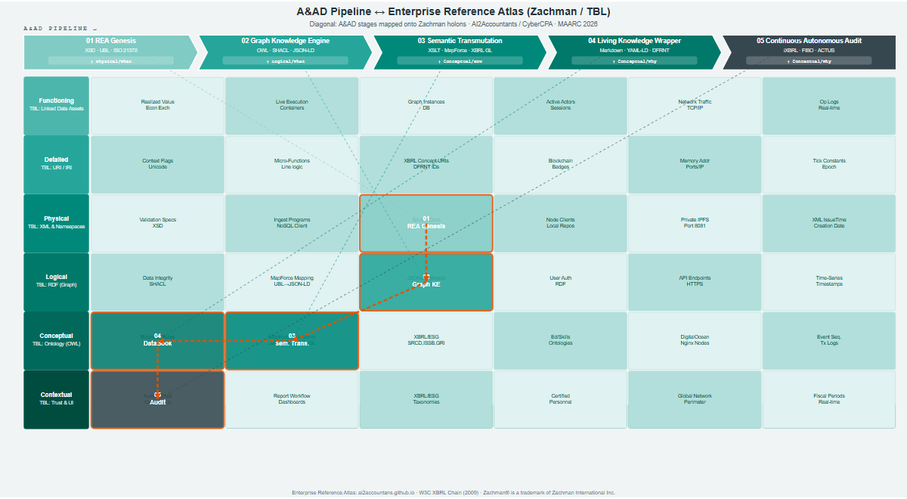

# The End of Reactive Control: Algorithmic Certainty through Accounting and Audit by Design (A&AD)

**Abstract**

Current frameworks of corporate governance and internal control are based on an unsustainable operational assumption: that accounting errors and discrepancies are inevitable. For decades, companies have depended on isolated databases and retrospective relational ledgers that treat data desynchronization, failures in financial reporting, and fraudulent activities as acceptable transactional frictions. Under this traditional paradigm, auditors and financial teams operate primarily as forensic investigators, relying on post-facto statistical sampling, long after capital has been allocated and risks have materialized. The resulting reconciliation debt drains corporate resources, reduces strategic flexibility, and clouds the visibility of boards of directors.

To resolve these inefficiencies, this article introduces the Accounting and Audit by Design (A&AD) framework. The A&AD model replaces retroactive verification with real-time deterministic assurance. By extending the shift-left paradigm to organizational control, A&AD enforces regulatory compliance and fiscal constraints directly at the moment of economic origin: the initial contract or business event. By representing transactions as autonomous and immutable holons within semantic knowledge graphs, leveraging W3C standards such as JSON-LD and SHACL, internal control ceases to be a manual human intervention to become an intrinsic topological property of the data architecture itself. This approach systematically eliminates subsequent reconciliations, validates regulatory compliance at the exact point of data ingestion, and enables continuous auditing over the entirety of business events. Consequently, this model shifts the paradigm from simple data processing toward a rule-driven architecture, where system trust is designed directly into the data lifecycle, instead of being verified retrospectively.

---

## 1. Introduction & The Reconciliation Debt

Since the historical codification of double-entry bookkeeping, the core architecture of corporate accounting has retained a fundamentally retrospective nature. Although the digitization of paper-based systems into relational Enterprise Resource Planning (ERP) databases modernized the recording medium, it did not resolve a critical structural deficiency: financial records remain static, flat logs of economic transactions that are completely detached from their underlying legal contracts and operational triggers. This disconnect—the "operational-regulatory seam"—constitutes a systemic vulnerability in modern business architectures, which organizations attempt to mitigate using constant, resource-heavy reconciliation protocols.

In the current era of rapid technological change, where corporations are deploying agentic Artificial Intelligence (AI) and autonomous software agents to execute core business processes, this reconciliation debt transforms from an administrative burden into a severe structural threat. Autonomous AI agents are now capable of independently executing supply chain agreements, purchasing resources, and finalizing contracts. Relational databases, however, lack the semantic expressiveness and multi-dimensional lineage tracking needed to audit these decentralized decisions. When an autonomous system initiates a transaction, current ERPs register the ledger adjustment but discard the complex decision-making context. This leaves oversight bodies and human auditors with opaque, "black-box" accounting outputs.

Cultivating trust within these AI-augmented corporate environments requires a complete shift in methodology: replacing retrospective statistical validation with absolute, deterministic correctness. Relying on statistical sampling for corporate governance is equivalent to structured guesswork—a compromise that no modern board of directors should accept.

This paper addresses this issue by proposing a "Moment 0" Semantic Digital Twin developed through Design Science Research (DSR). We argue that by shifting validation "left"—validating data integrity at the exact moment of transaction genesis—we can systematically prevent reconciliation discrepancies. Our proposed architecture integrates the Resource-Event-Agent (REA) framework with Semantic Web standards, decoupling the semantic meaning of economic events (using JSON-LD and XBRL GL) from specific software applications.

In addition, we introduce the use of hybrid "DataBooks" to serve as a standardized transport mechanism. By embedding structured Simple Knowledge Organization System (SKOS) taxonomies (W3C, 2009b) directly within the native training or system prompts of Large Language Models (LLMs), these DataBooks enable immediate, zero-shot auditing of business events by both human managers and autonomous oversight agents. The rest of this article outlines our theoretical foundations, describes the system architecture of the A&AD Semantic Twin, and demonstrates an automated, real-time audit of an initial equity distribution.

---

## 2. Related Work & Theoretical Framework

The theoretical foundation of the A&AD architecture lies at the intersection of semantic web technologies, ontological accounting frameworks, and the audit capabilities of modern generative artificial intelligence. This integration aims to heal the historic division that separates operational business logic from financial ledger records.

### 2.1. The REA Paradigm and Graph-Based Digital Twins
The conceptual origins of this events-based paradigm trace back to George H. Sorter (1969), who proposed an "events approach" to accounting theory. Sorter argued that accounting systems should record and compile detailed data of individual economic events, allowing users to generate customized reports from this raw information rather than relying solely on traditional aggregated financial summaries. McCarthy (1982) subsequently formalized this theory into the Resource-Event-Agent (REA) accounting framework, which argues that accounting records must reflect the economic substance of transactions rather than just their accounting artifacts. The REA model focuses on the fundamental nature of economic events: the participants (Agents), the values traded (Resources), and the transactions themselves (Events). Subsequent researchers (e.g., Fischer-Pauzenberger & Schwaiger, 2017) have formalized REA into a rigorous ontology (OntoREA) using foundational frameworks like the Unified Foundational Ontology (UFO). Furthermore, OntoREA has been extended to model dynamic hedge portfolios for financial derivatives (Fischer-Pauzenberger & Schwaiger, 2018). While these developments demonstrate REA's capability in representing complex financial instruments using custom ontologies, our A&AD framework approaches the representation of legal entities and financial agreements by directly integrating industry-standard ontologies, such as the Financial Industry Business Ontology (FIBO) (EDMC, 2020) and the Algorithmic Contract Types Unified Standards (ACTUS) (ACTUS Financial Research Foundation, 2018), within the transactional graph. Regardless of the specific ontological approach, deploying these designs in a practical, scaleable environment requires transitioning away from traditional relational database engines toward Semantic Knowledge Graphs. Graph databases are uniquely suited to preserving complex, multi-dimensional connections without the constraints of rigid schemas.

### 2.2. Model-Driven Systems, XBRL GL, and Supply Chain Integration
The boundary between business operations and external reporting is directly addressed by Hoffman's "Model-Driven Enterprise Architecture." Hoffman argues for replacing disjointed, proprietary data silos with unified, standardized reporting pipelines. The Extensible Business Reporting Language Global Ledger (XBRL GL) plays a vital role in this design. While XBRL FR (Financial Reporting) is designed for end-of-period aggregations, XBRL GL captures and standardizes low-level transactional details. Implementing XBRL GL as a core data format allows companies to establish platform-independent interoperability. This ensures that audit trail data travels from operational genesis (Moment 0) to regulatory endpoints without loss of semantic meaning.

This integration expands upon the foundational vision of the W3C (2009) regarding the convergence of XBRL and the Semantic Web. By extending the transactional capabilities of XBRL Global Ledger (XBRL GL) to encompass the broader lifecycle of the supply chain (from event triggering to final invoice), A&AD addresses the systemic gap between raw business events and their ledger representations. To govern this multi-dimensional flow, the framework incorporates the Zachman Enterprise Architecture Framework, utilizing its structured rows and columns to map operational actions directly onto the technical layers of the semantic stack.

### 2.3. Explainable AI, SKOS Structuring, and DataBooks
As machine learning models are tasked with financial auditing, mitigating the risk of artificial intelligence "hallucinations" becomes paramount. Cagle introduces "DataBooks" as a bridging format: hybrid Markdown files containing embedded, machine-readable JSON-LD payloads. DataBooks effectively connect narrative texts (such as legal agreements) with structured machine data (semantic graphs).

Furthermore, embedding Simple Knowledge Organization System (SKOS) taxonomies directly into LLM architectures represents a major advance for "Explainable AI." As Cagle notes, standard ontologies perform significantly better when integrated directly into the LLM compilation phase. Instead of loading complex, multi-volume regulatory rules (e.g., IFRS or US GAAP) into an LLM's temporary context window—which is computationally inefficient and increases error rates—the AI auditor can leverage the model's pre-existing knowledge of standardized SKOS structures. The individual DataBook only needs to supply the specific, localized concepts relevant to the transaction. This combination allows AI auditing agents to evaluate complex graphs with high precision, bound by clear ontological boundaries, thereby facilitating continuous, independent monitoring.

---

## 3. Artifact Design: The A&AD Semantic Digital Twin

Consistent with Design Science Research principles, our primary contribution is the design and implementation of a Semantic Digital Twin. This artifact is built to span the operational-regulatory gap by creating a continuous, verifiable data pipeline from inception to reporting. The architecture comprises a conceptual blueprint and three distinct physical layers: the Conceptual Navigational Matrix, the Operational Graph Engine, the Semantic Transmutation Layer, and the Living Knowledge Wrapper.

### 3.1. The Conceptual Blueprint: The A&AD Navigational Matrix
Before detailing the physical implementation, the A&AD framework establishes a conceptual blueprint represented by the A&AD Reference Atlas. This artifact fuses the Zachman Framework columns (Why, How, What, Who, Where, When) with the W3C Semantic Web stack. The resulting matrix acts as a navigational map, mapping business motivations and operational events to graph assets and cryptographic validations. This interactive schema, deployed at https://ai2accountans.github.io/AAbD/, coordinates the engineering layers and ensures that any data asset preserves its operational and regulatory meaning as it traverses the stack.

### 3.2. The Operational Graph Engine (TerminusDB & DFRNT)
At the bottom of the system stack, relational database engines are replaced by TerminusDB, a native RDF/OWL graph database. This graph layout enables the enterprise to represent the core dimensions of the Zachman Framework (specifically Agents, Resources, Events, and Locations) as interconnected nodes and relationships instead of dispersed tables. To query and manage this operational graph, our design employs the DFRNT semantic data platform. Through QOWL (GraphQL over OWL), monitoring agents can retrieve targeted transactional sub-graphs. This query process focuses on the exact moment of transaction genesis—the "Moment 0"—collecting not only currency figures, but the complete operational lineage of all participating agents and assets.

### 3.3. The Semantic Transmutation Layer (Altova XMLSpy & MapForce)
Raw JSON data retrieved from the operational database frequently uses internal company terminology and lacks the standardized regulatory terminology required for audit verification. To address this difference without hardcoding translation rules, the architecture integrates the Altova product suite to handle semantic transmutation. First, Altova XMLSpy serves as the schema design workspace, used to define the JSON-LD schemas and enforce W3C SHACL (Shapes Constraint Language) constraints. This guarantees that the core ontology is logically valid prior to data processing.

Following schema validation, Altova MapForce serves as a format-neutral data mapper. It parses the raw JSON payload and applies the W3C and XBRL GL ontologies designed in XMLSpy. This automated mapping transforms the internal operational logs into a standardized JSON-LD graph instance. This layered architecture ensures that double-entry balance and structural compliance are verified before the data is exposed for external review. This configuration is empirically validated by historical industry precedents, such as the Maryland Association of CPAs (MACPA) case study, which proved the viability of using Altova's design suite (XMLSpy and MapForce) to translate heterogeneous ledger databases into standardized XBRL GL structures (Altova, 2010).

### 3.4. The Living Knowledge Wrapper (DataBooks)
The final phase of the A&AD data pipeline handles the interaction between human users and automated systems. The structured JSON-LD output is packaged into a "DataBook"—a hybrid Markdown document. The DataBook combines a human-readable narrative (such as a corporate charter or partnership agreement) with hidden, machine-readable JSON-LD data segments. This document serves as a self-contained, unchangeable "holon." Human supervisors can review the business context in plain text, while autonomous AI agents can parse the embedded graph data using pre-trained SKOS taxonomies. This decoupled design provides high certainty without requiring the AI to process raw, unstructured language, completing the "Shift-Left" audit process.

---

## 4. Demonstration: The Genesis Moment Case Study

To validate the A&AD framework, a practical Proof of Concept (PoC) was executed modeling the "Moment 0" of a corporate entity: the formal incorporation deed and the initial assignment of capital by the founding partners.

### 4.1. Extraction of Genesis Event Data
The initial equity allocation was recorded in the TerminusDB graph database. Using the DFRNT environment, we ran a GraphQL-over-OWL (QOWL) query to filter and extract all records linked to the corporate equity registry (such as Account `311505`). The query retrieved specific variables, including line-item identifiers, transaction amounts, investing agent IDs, and the corresponding ownership units. The resulting raw JSON file represented the initial ledger entry but lacked external ontological classification.

### 4.2. Data Transmutation and Alignment
This raw JSON output was loaded into Altova MapForce. We created a visual data mapping structure to align the internal ledger structure with the XBRL GL taxonomy. During this process, local fields were mapped to standardized semantic elements, including `gl-cor:amount`, `gl-cor:measurableQuantity`, and `gl-cor:accountMainID`. Altova MapForce processed the input to generate a standardized JSON-LD graph instance of the transaction, successfully translating internal nomenclature into the universal XBRL GL taxonomy.

### 4.3. Automated Verification and Auditing
The mapped JSON-LD payload was embedded directly into a Markdown DataBook document, establishing a dual-purpose record combining a human-readable corporate charter with the underlying transactional graph.

To test automated verification, this DataBook was parsed within a Python environment (Google Colab). An automated audit script built with the `rdflib` library performed the following steps automatically:
1. Scanned the Markdown document, separated the natural language text, and isolated the embedded JSON-LD graph blocks.
2. Loaded these blocks into an active, in-memory Resource Description Framework (RDF) graph.
3. Ran a deterministic SPARQL query across the graph to calculate the sum of the initial capital contributions.

The program successfully computed the exact total capital amount, demonstrating that an autonomous script—without direct connection to the originating operational database—could read a narrative text file, extract its semantic data layer, and mathematically verify the financial ledger state with high certainty.

---

## 5. Conclusion

A reliance on retrospective reconciliation processes is an outdated habit of the relational database age. As shown by the Accounting and Audit by Design (A&AD) model, moving verification procedures "left" to the moment of data creation is both conceptually sound and technically achievable. By integrating the REA ontology, TerminusDB knowledge graphs, and hybrid DataBooks, organizations can package economic activities into self-contained, self-verifying semantic records.

This system provides the absolute correctness required to oversee both human transactions and the choices of autonomous AI agents. Our future work will focus on extending this proof of concept to handle ongoing operational transactions and deploying real-time SHACL validation guards at the database level, laying the groundwork for automated, model-driven corporate governance.

---

## References

* **ACTUS Financial Research Foundation**. (2018). *Algorithmic Contract Types Unified Standards (ACTUS)*. Retrieved from https://www.actusfrf.org/.
* **Altova**. (2010). *Case Study: Maryland Association of CPAs (MACPA) Integrates Accounting Systems with XBRL GL and Altova MapForce*. Retrieved from https://www.altova.com/documents/macpa_casestudy.pdf.
* **EDMC**. (2020). *Financial Industry Business Ontology (FIBO)*. Enterprise Data Management Council. Retrieved from https://spec.edmcouncil.org/fibo/.
* **Fischer-Pauzenberger, C., & Schwaiger, W. S.** (2017). OntoREA: A foundational ontology-based formalization of the REA accounting model. *Journal of Information Systems*, 31(3), 43–69.
* **Fischer-Pauzenberger, C., & Schwaiger, W. S.** (2018). OntoREA© Accounting and Finance Model: Hedge Portfolio Representation of Derivatives. In *IFIP Working Conference on The Practice of Enterprise Modeling* (pp. 372-382). Springer, Cham. https://doi.org/10.1007/978-3-030-02302-7_24
* **Hoffman, C.** (2020). *Model-Driven Enterprise Architecture and Digital Financial Reporting*. Technical Whitepaper.
* **McCarthy, W. E.** (1982). The REA accounting model: A generalized framework for accounting systems in a shared data environment. *The Accounting Review*, 57(3), 554–578.
* **Sorter, G. H.** (1969). An "events" approach to basic accounting theory. *The Accounting Review*, 44(1), 12–19.
* **W3C**. (2009a). *XBRL and the Semantic Web*. W3C Interest Group Report. Retrieved from https://www.w3.org/2009/03/xbrl/old-report.html.
* **W3C**. (2009b). *SKOS Simple Knowledge Organization System Reference*. W3C Recommendation. Retrieved from https://www.w3.org/TR/skos-reference/.
