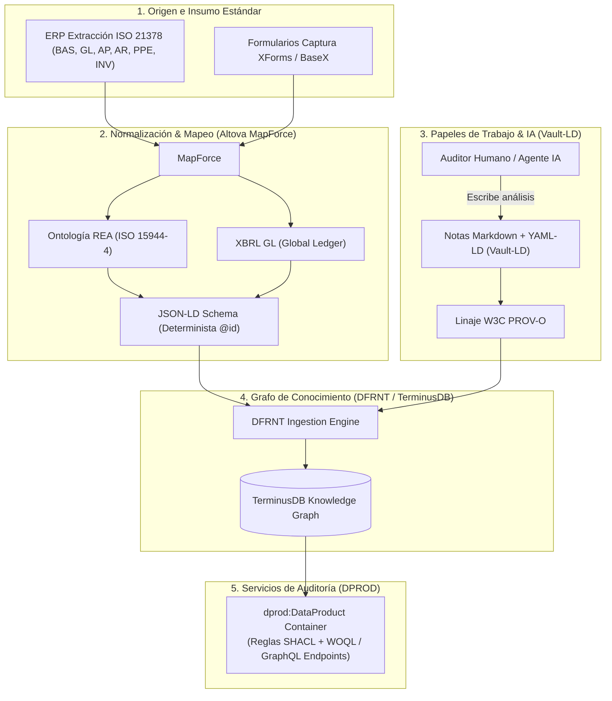

# Síntesis Master: Integración de ISO 21378 (ADCS), XBRL GL, Vault-LD y DPROD en la Arquitectura DFRNT

## 1. Resumen Ejecutivo
Este documento sintetiza la visión integrada de **Contabilidad y Auditoría Semántica Continuas**, demostrando cómo se unen los estándares contables mundiales con las tecnologías de Web Semántica, Grafos de Conocimiento y Agentes de IA.

Responde al porqué **Charles Hoffman ("Charlie")** considera prioritaria la metodología de **Tony Seale** (creador de **Vault-LD** y presidente del grupo de trabajo de **DPROD** en la OMG/EKGF) y cómo esta se acopla al pipeline contable configurado en **DFRNT**.

---

## 2. Los Componentes del Stack y sus Roles

```
[ INSUMO ERP / CAPTURA ]         [ RIGOR SEMÁNTICO Y MAPEADO ]       [ GRAFO Y PAPELES DE TRABAJO ]
 ISO 21378 (ADCS 8 Módulos)  ──>  MapForce ──> XBRL GL / REA  ──>   DFRNT + TerminusDB Graph
 XForms + BaseX XML                 (JSON-LD Schema)                   ↑
                                                                       │ (YAML-LD)
                                                                 Vault-LD (.md)
                                                             [ Papeles de Trabajo IA/Humano ]
```

### A. ISO 21378: Audit Data Collection Standard (ADCS)
* **Definición**: Estándar internacional (ISO, 2019) para la extracción unificada de datos de auditoría desde cualquier ERP (SAP, Oracle, Siigo, QuickBooks).
* **Los 8 Módulos Estándar**:
  1. `BAS` (Base / Catálogos y Terceros)
  2. `GL` (General Ledger / Libro Mayor y Auxiliares)
  3. `AR` (Accounts Receivable / Cuentas por Cobrar)
  4. `SAL` (Sales / Ventas y Facturación)
  5. `AP` (Accounts Payable / Cuentas por Pagar)
  6. `PUR` (Purchases / Compras)
  7. `INV` (Inventory / Inventarios)
  8. `PPE` (Property, Plant & Equipment / Propiedad, Planta y Equipo)

### B. Mapeo y Normalización (XBRL GL + REA ISO 15944-4)
* **Función**: Traducir los extractos estandarizados ISO 21378 o entradas XForms/BaseX hacia la ontología económica **REA** (Resource-Event-Agent) y el formato canónico **XBRL GL** mediante **Altova MapForce**.
* **Resultado**: Un esquema **JSON-LD** con identificadores URI `@id` deterministas listos para ingesta.

### C. Vault-LD (Tony Seale): Los Papeles de Trabajo del Auditor
* **En Palabras Humanas**: 
  * Los datos fríos (XML, XBRL GL, ISO 21378) son la evidencia transaccional (*"qué pasó"*).
  * Los **papeles de trabajo** del auditor son el análisis, juicio, notas y justificaciones (*"por qué es válido o qué anomalía existe"*).
* **Mecanismo de Vault-LD**:
  * Permite redactar papeles de trabajo en **Markdown** (legibles para humanos y LLMs).
  * Utiliza **YAML-LD** en el *frontmatter* para conectar la nota con el `@id` exacto de la transacción contable en el grafo.
  * Transforma el texto narrativo en **tripletas RDF nativas**.
* **Impacto en Agentes de IA**: Cuando un Agente IA de auditoría analiza la contabilidad, escribe su papel de trabajo en Vault-LD con proveniencia **W3C PROV-O**, garantizando una memoria inmutable, auditable y persistente en **TerminusDB**.

### D. DPROD (Data Product Ontology)
* **Función**: Empaquetar la base de datos de TerminusDB como un **Producto de Datos (Data Product)** interoperable.
* **Componentes**: Define los puertos de datos (`dprod:inputPort` / `dprod:outputPort`), los contratos de datos (*Data Contracts*) y la validación de reglas de calidad mediante **SHACL**.

---

## 3. Redefinición de la Contratación de Servicios de Auditoría

| Dimensión | Auditoría Tradicional | Auditoría Semántica Continua (ISO 21378 + Vault-LD + DFRNT) |
| :--- | :--- | :--- |
| **Acceso a Datos** | Muestreo manual (10-15%) vía reportes Excel/PDF solicitados al contador. | Conexión de puerto a puerto vía Data Mesh (**DPROD**) al 100% de los datos ISO 21378. |
| **Frecuencia** | Ex-post (meses después del cierre fiscal). | **Continua en tiempo real (24/7)** mediante Agentes de IA. |
| **Papeles de Trabajo** | Archivos Word/PDF/Excel desconectados de la base de datos. | Notas **Vault-LD (.md con YAML-LD)** integradas como tripletas RDF en el Grafo TerminusDB. |
| **Entregable del Auditor** | Dictamen estático en PDF. | Commit certificado en la rama de auditoría del Grafo TerminusDB vía **DFRNT**. |

---

## 4. Diagrama de la Arquitectura Integrada Completa



---

## 5. Extensión a la Auditoría No Financiera y Sostenibilidad (ESG / CSRD)

La arquitectura de **A&AD** y **DFRNT** no se limita a datos financieros monetarios. Gracias a la ontología **REA (ISO 15944-4)**, abarca la **Doble Materialidad** (*Double Materiality*):

* **Eventos No Financieros & Telemetría IoT:** Mediciones de energía (kWh), consumo de agua, combustible y emisiones métricas ($CO_2eq$).
* **Taxonomías ESG:** Integración de estándares como **ESRS (EU CSRD)**, **GRI** e **ISSB (IFRS S1/S2)** en esquemas JSON-LD.
* **Detección de *Greenwashing* en Grafo:** El Agente de IA cruza el módulo Cuentas por Pagar (`ISO 21378 AP`) con las declaraciones ambientales en TerminusDB. Si detecta compras masivas de combustible sin declaración de emisiones Alcance 1 equivalente, emite un papel de trabajo en **Vault-LD**.

---

## 6. Conclusión y Valor Estratégico

Para el equipo de **DFRNT** y para presentar a **Charles Hoffman**:

1. **ISO 21378** estandariza la entrada de datos desde cualquier sistema contable del mundo.
2. **REA + XBRL GL / ESRS** le aportan la verdad teórica, la dualidad económico-ecológica y la estructura regulatoria.
3. **Vault-LD** aporta la **memoria del auditor y de la IA** unificada en el mismo grafo.
4. **DPROD + TerminusDB** convierten el sistema en un **servicio de auditoría continua integral (Financiera + ESG) en tiempo real**.
