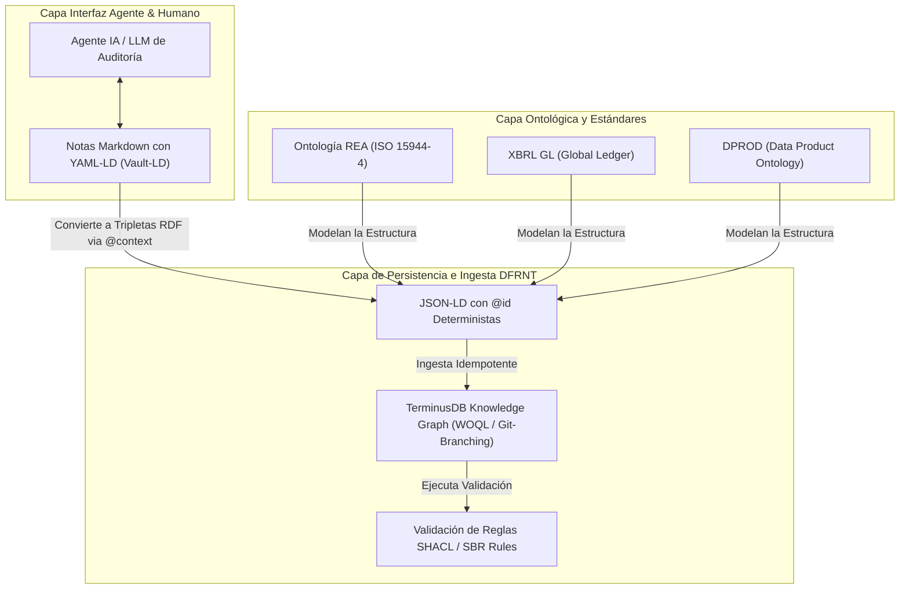

# Tony Seale: Vault-LD, DPROD y su Convergencia con el Stack de Charles Hoffman (DFRNT)

## 1. Visión General e Identidad
**Tony Seale** (conocido en la industria como *"The Knowledge Graph Guy"*) es el fundador de **The Knowledge Graph Guys** y ex-presidente del grupo de trabajo de **DPROD** (Data Product Ontology) en el *Enterprise Knowledge Graph Forum* / *Object Management Group (OMG)*.

Su trabajo representa la vanguardia en la intersección entre **Grafos de Conocimiento (Knowledge Graphs), Arquitecturas de Agentes de IA y Tecnologías de la Web Semántica (RDF/JSON-LD)**.

Charles Hoffman ("Charli"), creador del estándar XBRL y visionario de la Contabilidad Semántica, ha puesto máxima atención en el trabajo de Tony Seale porque proporciona **la pieza que faltaba para conectar el razonamiento de los Agentes de IA con la precisión matemática y regulatoria del modelo contable**.

---

## 2. Los Dos Pilares Clave de Tony Seale

### A. Vault-LD (`https://vault-ld.org/`)
**Vault-LD** es una especificación abierta diseñada para convertir "Vaults" (bóvedas de notas o archivos en Markdown) en **Linked Data** (Datos Enlazados semánticos).

* **El Problema que Resuelve**: La memoria de los Agentes de IA actuales suele limitarse a *embeddings* vectoriales desestructurados (RAG tradicional) o hilos de texto plano, lo que produce "alucinaciones", falta de determinismo y nula auditabilidad.
* **La Solución Vault-LD**:
  * Utiliza **YAML-LD** en el *frontmatter* de los archivos Markdown.
  * Conecta los metadatos y relaciones de cada nota con un documento `@context` global de JSON-LD.
  * Transforma cada archivo Markdown en un conjunto de **tripletas RDF deterministas** (`Sujeto - Predicado - Objeto`).
  * Mantiene el cuerpo de la nota en prosa legible por humanos (y LLMs), mientras el *frontmatter* proporciona semántica formal interpretable por máquinas, SPARQL y validadores SHACL.

### B. DPROD (Data Product Ontology)
**DPROD** es la especificación ontológica estándar para definir **Productos de Datos (Data Products)** dentro de arquitecturas de Data Mesh y Grafos de Conocimiento Empresariales.

* **Función**: Proporciona un vocabulario OWL/RDF uniforme (basado en W3C DCAT) para describir metadatos de productos de datos, puertos de entrada/salida, contratos de datos (*Data Contracts*), políticas de gobernanza y linaje.
* **Relevancia**: Permite tratar cualquier conjunto de datos (ej. un libro mayor, un set de hechos XBRL GL o un expediente de auditoría) como un componente semántico autónomo, gobernado y consultable.

---

## 3. Por qué Charles Hoffman ("Charli") Exige Dominar a Tony Seale

El modelo de **Charles Hoffman** busca la **Contabilidad Autónoma y Semántica (Semantic Accounting)** basada en:
1. **REA Ontology (ISO 15944-4)**: Recursos, Eventos y Agentes.
2. **XBRL GL (Global Ledger)**: Normalización de los asientos y comprobantes de contabilidad.
3. **Lógica Contable Determinista**: Validación de reglas de balance, partida doble e integridad estructural.

### El Enlace Crucial (Seale + Hoffman):

| Dimensión | Enfoque de Charles Hoffman | Enfoque de Tony Seale (Vault-LD / DPROD) | Sinergia en DFRNT |
| :--- | :--- | :--- | :--- |
| **Representación de Datos** | Ontología REA / XBRL GL / Taxonomías Finanzas | YAML-LD, JSON-LD, RDF Triples, DPROD | Los hechos contables se convierten en Data Products con tripleta semántica. |
| **Memoria de Agentes IA** | Reglas de Negocio Contables / Invariantes | Vault-LD (Linked Data en Markdown) | El Agente de Auditoría guarda hallazgos como Grafos Linked Data auditables. |
| **Validación y Calidad** | Razonamiento Lógico / Patrones de Reporte | SHACL / OWL / W3C PROV-O | Verificación automatizada de consistencia contable en cada commit del grafo. |
| **Persistencia y Grafo** | Libros Mayores Descentralizados / AAD | Grafos de Conocimiento Escalables (TerminusDB) | Grafos de conocimiento auditables con versionado tipo Git via DFRNT. |

---

## 4. Arquitectura Integrada del Stack

---

## 5. Plan de Dominio Táctico para el Equipo DFRNT

Para dominar la metodología de Tony Seale e integrarla con los requerimientos de Charli:

1. **Estructuración de Memorias en Vault-LD**:
   * Implementar `YAML-LD` en los documentos del proyecto (p. ej. guiones, evidencias de auditoría, expedientes).
   * Definir un `@context` JSON-LD uniforme mapeado a REA (`http://iso.org/15944-4/rea#`), XBRL GL y DPROD.
2. **Modelado de Productos de Datos Contables con DPROD**:
   * Tratar cada balance, auxiliar de cuentas o ledger de eventos contables como un `dprod:DataProduct`.
   * Asignar puertos de entrada (`dprod:inputPort`) para facturas UBL/XBRL GL y puertos de salida (`dprod:outputPort`) para estados financieros validados.
3. **Integración con DFRNT y TerminusDB**:
   * Usar identificadores `@id` deterministas (basados en hashes de eventos contables).
   * Aprovechar el versionado tipo Git de TerminusDB para registrar el linaje completo del conocimiento acumulado por los agentes (utilizando la ontología W3C PROV-O).
