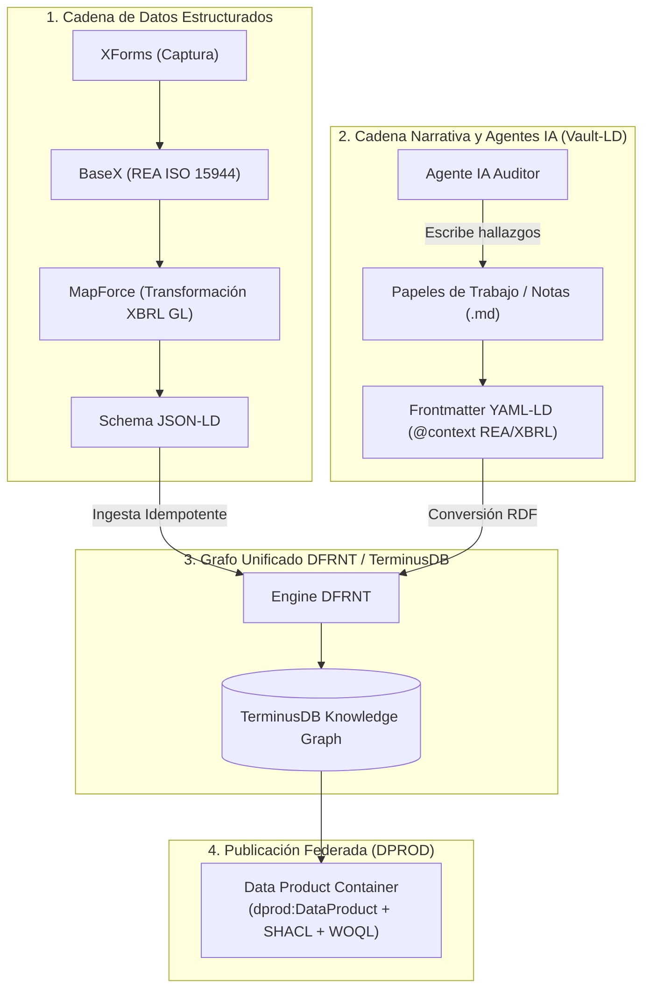

# Guía Operativa: Materialización de la Visión de Charles Hoffman mediante Vault-LD, DPROD y el Stack DFRNT

## 1. Propósito y Contexto
Este documento operacionaliza la integración de las especificaciones de **Tony Seale** (**Vault-LD** y **DPROD**) sobre el stack existente de Contabilidad y Auditoría Semántica.

Su objetivo principal es servir de **demostración técnica para Charles Hoffman ("Charlie")**, probando cómo su visión de *Semantic Accounting*, *SBR (Standard Business Reporting)* y la ontología *REA (ISO 15944-4)* alcanza su estado pleno de **auditoría autónoma y memoria de agentes de IA** mediante el uso de **Vault-LD**.

---

## 2. Definición del Stack Existente vs. La Contribución de Vault-LD

### A. La Cadena Estructurada Actual
Tu pipeline de datos estructurados procesa los hechos económicos con máximo rigor técnico:

1. **Captura Operativa**: Formularios `XForms` conectados a la base de datos XML `BaseX`.
2. **Ontología Base**: Modelado REA (Resource-Event-Agent) según la norma **ISO 15944-4**.
3. **Mapeo Regulatorio**: Transformación mediante **Altova MapForce** hacia el estándar **XBRL GL** (Global Ledger).
4. **Generación Semántica**: Expresión del esquema en **JSON-LD** con identificadores URI `@id` deterministas.
5. **Ingesta y Persistencia**: Carga vía **DFRNT** hacia el grafo de conocimiento **TerminusDB** (con versionado tipo Git, WOQL y GraphQL).

---

### B. El Eslabón Perdido que Resuelve Vault-LD (Tony Seale)

Aunque el pipeline estructurado es impecable, la contabilidad y auditoría real requieren **evidencia narrativa** (papeles de trabajo, explicaciones de contadores, dictámenes de auditoría y deducciones de Agentes de IA).

**Vault-LD** resuelve la brecha entre la **prosa legible por humanos/LLMs** y el **grafo RDF estricto**:

```
[ Evidencia Estructurada (XML / XBRL GL) ] \
                                           ==> [ Grafo Único TerminusDB via DFRNT ]
[ Evidencia Narrativa (Markdown + Vault-LD) ] /
```

---

## 3. Diagrama de la Arquitectura Integrada



---

## 4. Los 3 Pilares de la Demostración para Charles Hoffman

### Pilar 1: Unificación de Evidencia Dura (XBRL GL) y Evidencia Narrativa (Vault-LD)
* **Demostración**: Mostrar cómo un asiento contable originado en XForms y mapeado a XBRL GL (`urn:dfrnt:entry:2026-0001`) se enlaza en el mismo grafo con la nota explicativa escrita por el auditor en Markdown.
* **Formato del Papel de Trabajo Vault-LD (`audit_note_001.md`)**:

```markdown
---
"@context":
  "@vocab": "http://dfrnt.com/schema/audit#"
  rea: "http://iso.org/15944-4/rea#"
  xbrlgl: "http://www.xbrl.org/2006/gl#"
  prov: "http://www.w3.org/ns/prov#"
"@type": "AuditFinding"
"@id": "urn:dfrnt:finding:2026-8902"
prov:wasDerivedFrom:
  "@id": "urn:dfrnt:entry:2026-0001"
severity: "High"
validatedRule: "REA-Duality-Check-Pass"
---

# Hallazgo de Auditoría: Confirmación de Transferencia

Se ha verificado la dualidad del hecho económico según ISO 15944-4. El recurso 'Efectivo' fue incrementado conforme al contrato NIIF 15 especificado.
```

---

### Pilar 2: Memoria Persistente y Auditable para Agentes de IA
* **El Problema que Charli reconoce**: Los agentes LLM "olvidan" sus razonamientos o responden en hilos de chat no auditables.
* **La Solución operativizada**: 
  1. El Agente consulta TerminusDB vía WOQL/GraphQL.
  2. Detecta una anomalía en un evento REA.
  3. Genera un papel de trabajo en Markdown con encabezado **YAML-LD**.
  4. DFRNT inyecta ese documento de regreso a TerminusDB con linaje **W3C PROV-O**.

---

### Pilar 3: Encapsulamiento de la Contabilidad como "Data Product" (DPROD)
* En lugar de entregar reportes estáticos, se entrega un **Contenedor DPROD**:
  * `dprod:inputPort`: Ingesta automática de XForms / XBRL GL / Vault-LD.
  * `dprod:outputPort`: Consultas WOQL / GraphQL para la junta directiva o entes reguladores.
  * `dprod:dataContract`: Reglas SHACL de la Taxonomía SBR/XBRL que garantizan que el balance cuadra a nivel de grafo.

---

## 5. Hoja de Ruta de Operativización

Cuando el pipeline en DFRNT alcance el nivel de producción, ejecutar los siguientes 4 pasos:

| Paso | Acción Técnica | Entregable |
| :--- | :--- | :--- |
| **Paso 1** | Definir el `@context` JSON-LD unificado mapeando REA + XBRL GL + PROV-O. | `dfrnt_unified_context.jsonld` |
| **Paso 2** | Configurar el parser de Vault-LD (YAML-LD a RDF) dentro de las rutinas de ingesta de DFRNT. | Módulo de ingesta `.md` |
| **Paso 3** | Crear plantillas de Markdown para papeles de trabajo y memorias de Agentes IA. | `templates/audit_workpaper_template.md` |
| **Paso 4** | Empaquetar el grafo de TerminusDB con el esquema DPROD para demostración final a Charlie. | `dprod_financial_ledger_spec.jsonld` |

---

## 6. Conclusión para la Presentación a Charlie

> *"Charlie: Tu visión de la contabilidad semántica basada en REA y XBRL GL ya no es solo una especificación de datos estructurados. Con **Vault-LD de Tony Seale**, hemos logrado que la prosa de los auditores y el razonamiento de los Agentes de IA se conviertan en tripletas RDF nativas dentro del mismo Grafo de Conocimiento en TerminusDB. La contabilidad y su auditoría ahora forman una sola malla inmutable y viva."*
